# 🔄 Release Workflow Diagrams

> **Note**: These Mermaid diagrams render automatically on GitHub

## Complete Release Flow

```mermaid
flowchart TD
    Start([Developer Creates Tag v0.1.3]) --> Trigger[GitHub Actions: release.yml]
    
    Trigger --> Generate[Generate Release Notes<br/>• From commits<br/>• From PRs<br/>• Contributors]
    
    Generate --> Build[Build All Platforms]
    
    Build --> BuildWin[Windows Build<br/>4m 21s]
    Build --> BuildMac[macOS Build<br/>5m 04s]
    Build --> BuildLinux[Linux Build<br/>4m 39s]
    
    BuildWin --> Upload[Upload Assets]
    BuildMac --> Upload
    BuildLinux --> Upload
    
    Upload --> Draft[Create DRAFT Release]
    
    Draft --> Review{Maintainer<br/>Reviews}
    
    Review -->|Edit Notes| EditNotes[Edit Release Notes]
    EditNotes --> Review
    
    Review -->|Ready| Publish[Trigger: publish-release.yml]
    
    Publish --> Validate{Validate<br/>• Release exists?<br/>• Is draft?<br/>• Has assets?<br/>• Typed PUBLISH?}
    
    Validate -->|Valid| Approval{Environment<br/>Protection?}
    Validate -->|Invalid| Error1[❌ Validation Failed]
    
    Approval -->|Yes| WaitApproval[⏳ Wait for Manual Approval]
    Approval -->|No| DoPublish[Publish Release]
    
    WaitApproval -->|Approved| DoPublish
    WaitApproval -->|Rejected| Error2[❌ Rejected]
    
    DoPublish --> AddMetadata[Add Publish Metadata<br/>• Who published<br/>• When<br/>• Workflow link]
    
    AddMetadata --> Done([✅ Release Published!<br/>Users can download])
    
    style Start fill:#e1f5e1
    style Done fill:#e1f5e1
    style Draft fill:#fff3cd
    style WaitApproval fill:#fff3cd
    style Error1 fill:#f8d7da
    style Error2 fill:#f8d7da
    style DoPublish fill:#d1ecf1
```



## Approval Flow Detail

```mermaid
sequenceDiagram
    participant Dev as Developer
    participant GH as GitHub Actions
    participant Env as Environment<br/>production-release
    participant Rev as Reviewer
    participant Users as End Users
    
    Dev->>GH: Trigger publish-release.yml<br/>version=0.1.3, confirm=PUBLISH
    
    GH->>GH: Validate Input
    
    GH->>Env: Request Deployment Approval
    
    Env->>Rev: 📧 Notify Reviewers
    
    Note over Rev: Reviewer sees:<br/>• Version to publish<br/>• Release notes<br/>• Asset list
    
    Rev->>Env: Click "Approve"
    
    Env->>GH: ✅ Approval Granted
    
    GH->>GH: Publish Release<br/>• Set draft=false<br/>• Add metadata
    
    GH->>Users: 🎉 Release Available
    
    GH->>Dev: ✅ Workflow Complete
```



## State Transitions


## Decision Tree

```mermaid
flowchart TD
    Start([Start Release Process]) --> Q1{How to<br/>create release?}
    
    Q1 -->|Push Tag| AutoTag[git push origin branch v0.1.3]
    Q1 -->|Manual| ManualDispatch[Run workflow manually]
    
    AutoTag --> AutoBuild[Auto-build triggered]
    ManualDispatch --> AutoBuild
    
    AutoBuild --> DraftCreated[Draft Release Created]
    
    DraftCreated --> Q2{Review OK?}
    
    Q2 -->|No| EditDraft[Edit Draft Release]
    EditDraft --> Q2
    
    Q2 -->|Yes| Q3{Publish now?}
    
    Q3 -->|No| WaitLater[Wait for later<br/>Draft remains]
    WaitLater --> ReturnLater[Return when ready]
    ReturnLater --> Q3
    
    Q3 -->|Yes| Q4{Environment<br/>protection<br/>configured?}
    
    Q4 -->|No| DirectPublish[Direct Publish<br/>No approval needed]
    Q4 -->|Yes| NeedApproval[Trigger publish workflow]
    
    NeedApproval --> WaitApproval[⏳ Wait for Approval]
    
    WaitApproval --> Q5{Approved?}
    
    Q5 -->|Yes| PublishSuccess[✅ Publish Release]
    Q5 -->|No| Rejected[❌ Rejected]
    
    DirectPublish --> PublishSuccess
    PublishSuccess --> Done([Release Live!])
    
    style Start fill:#e1f5e1
    style Done fill:#e1f5e1
    style PublishSuccess fill:#d1ecf1
    style Rejected fill:#f8d7da
    style WaitApproval fill:#fff3cd
```



## Error Handling Flow


## Multi-User Collaboration

```mermaid
sequenceDiagram
    participant DevA as Developer A
    participant DevB as Developer B
    participant GH as GitHub Actions
    participant Maint as Maintainer
    participant Users as End Users
    
    DevA->>DevA: Write code & commit
    DevA->>GH: Push tag v0.1.3
    
    activate GH
    Note over GH: Build all platforms<br/>Generate release notes
    GH->>GH: Create Draft Release
    deactivate GH
    
    GH-->>DevA: ✅ Draft Created
    GH-->>DevB: 📧 Notification
    GH-->>Maint: 📧 Notification
    
    Maint->>GH: Review Draft
    Maint->>GH: Edit release notes
    
    DevB->>Maint: "Ready to publish?"
    Maint->>DevB: "Yes, looks good!"
    
    Maint->>GH: Trigger publish workflow
    
    activate GH
    GH->>Maint: Request Approval
    deactivate GH
    
    Maint->>GH: ✅ Approve Deployment
    
    activate GH
    GH->>GH: Publish Release
    deactivate GH
    
    GH-->>Users: 🎉 New Release Available!
    GH-->>DevA: ✅ Published
    GH-->>DevB: ✅ Published
    GH-->>Maint: ✅ Published
```



## Build Pipeline


## Environment Protection Setup

```mermaid
flowchart TD
    Start([Setup Manual Approval]) --> Settings[Go to Repository Settings]
    
    Settings --> Env[Navigate to Environments]
    
    Env --> Create[Click 'New environment']
    
    Create --> Name[Name: production-release]
    
    Name --> Config[Configure environment]
    
    Config --> Rules[Set Protection Rules]
    
    Rules --> Rev[✅ Enable Required reviewers]
    
    Rev --> AddRev[Add reviewer emails/usernames]
    
    AddRev --> Optional{Additional<br/>settings?}
    
    Optional -->|Yes| Timer[⏱️ Set wait timer<br/>optional]
    Optional -->|Yes| Branch[🌿 Select branches<br/>optional]
    Optional -->|No| Save
    
    Timer --> Save[Save protection rules]
    Branch --> Save
    
    Save --> Test[Test the setup]
    
    Test --> TriggerPub[Trigger publish workflow]
    
    TriggerPub --> SeeApproval{See approval<br/>step?}
    
    SeeApproval -->|Yes| Success([✅ Setup Complete!])
    SeeApproval -->|No| Debug[Check environment name<br/>matches workflow]
    
    Debug --> Test
    
    style Start fill:#e1f5e1
    style Success fill:#e1f5e1
    style Rev fill:#d1ecf1
    style Debug fill:#fff3cd
```



## Release Types Workflow


## Integration Architecture


## Quick Command Reference

### Create Release
```bash
npm version patch && git push origin $(git branch --show-current) v$(node -p "require('./package.json').version")
```

### Review Draft
```bash
gh release view v0.1.3
```

### Publish
```bash
gh workflow run publish-release.yml -f version=0.1.3 -f confirm=PUBLISH
```

### Monitor
```bash
gh run watch $(gh run list --workflow=release.yml --limit 1 --json databaseId --jq '.[0].databaseId')
```

## Troubleshooting Diagram

```mermaid
flowchart TD
    Issue([Something Wrong?]) --> What{What's the issue?}
    
    What -->|Build failed| BuildFail[Check build logs<br/>gh run view run-id --log]
    What -->|Publish failed| PublishFail[Check validation<br/>errors in workflow]
    What -->|No approval| NoApproval[Check environment<br/>protection setup]
    What -->|Wrong notes| WrongNotes[Edit draft before<br/>publishing]
    
    BuildFail --> CheckDeps{Dependencies<br/>installed?}
    CheckDeps -->|No| InstallDeps[Run: npm ci]
    CheckDeps -->|Yes| CheckBuild{Angular<br/>build OK?}
    
    CheckBuild -->|No| FixBuild[Fix build errors<br/>Run: npm run build:native]
    CheckBuild -->|Yes| RerunBuild[Re-run failed jobs<br/>gh run rerun run-id --failed]
    
    PublishFail --> CheckVersion{Correct<br/>version?}
    CheckVersion -->|No| FixVersion[Use correct version<br/>from gh release list]
    CheckVersion -->|Yes| CheckConfirm{Typed<br/>PUBLISH?}
    
    CheckConfirm -->|No| FixConfirm[Type exactly: PUBLISH]
    CheckConfirm -->|Yes| CheckDraft{Is it<br/>draft?}
    
    CheckDraft -->|No| AlreadyPublished[❌ Already published<br/>Create new version]
    CheckDraft -->|Yes| ContactSupport[Check workflow logs<br/>Contact support if needed]
    
    NoApproval --> EnvExists{Environment<br/>exists?}
    EnvExists -->|No| CreateEnv[Create production-release<br/>environment]
    EnvExists -->|Yes| AddReviewers[Add yourself as<br/>required reviewer]
    
    WrongNotes --> EditOnGH[Edit release on<br/>GitHub UI]
    EditOnGH --> PublishEdited[Publish the edited<br/>version]
    
    InstallDeps --> Success([✅ Fixed])
    FixBuild --> Success
    RerunBuild --> Success
    FixVersion --> Success
    FixConfirm --> Success
    CreateEnv --> Success
    AddReviewers --> Success
    PublishEdited --> Success
    
    style Issue fill:#fff3cd
    style Success fill:#e1f5e1
    style AlreadyPublished fill:#f8d7da
```



---

## Legend

```mermaid
flowchart LR
    Success[✅ Success State] 
    Warning[⏳ Waiting State]
    Error[❌ Error State]
    Action[Action Step]
    Decision{Decision Point}
    
    style Success fill:#e1f5e1
    style Warning fill:#fff3cd
    style Error fill:#f8d7da
    style Action fill:#d1ecf1
```



## Related Documentation

- 📖 **[Full Process Guide](RELEASE_PROCESS.md)** - Detailed documentation
- ⚡ **[Quick Reference](RELEASE_QUICK_REFERENCE.md)** - Common commands
- 📊 **[Automation Summary](../AUTOMATION_SUMMARY.md)** - Implementation overview

---

**Mermaid Diagram Version:** 2.0  
**Last Updated:** October 13, 2025  
**Note:** All diagrams render automatically on GitHub
