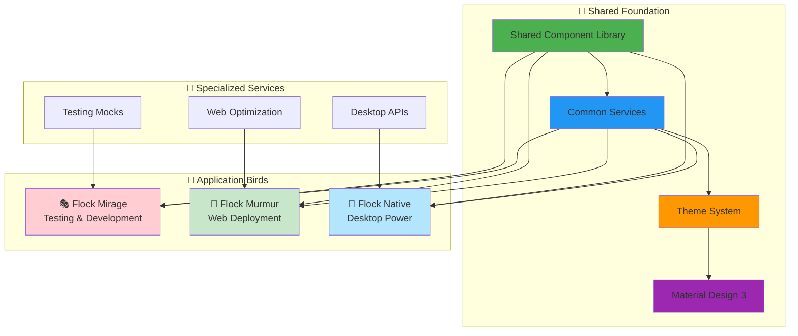
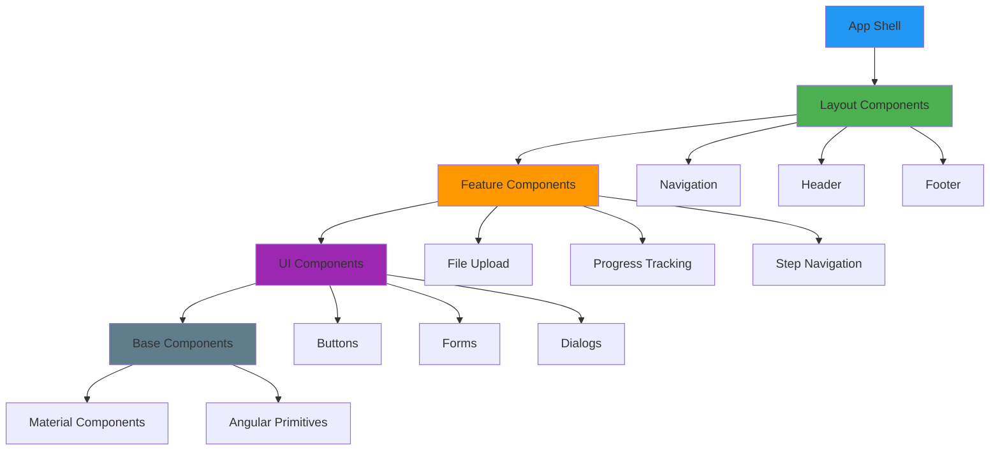
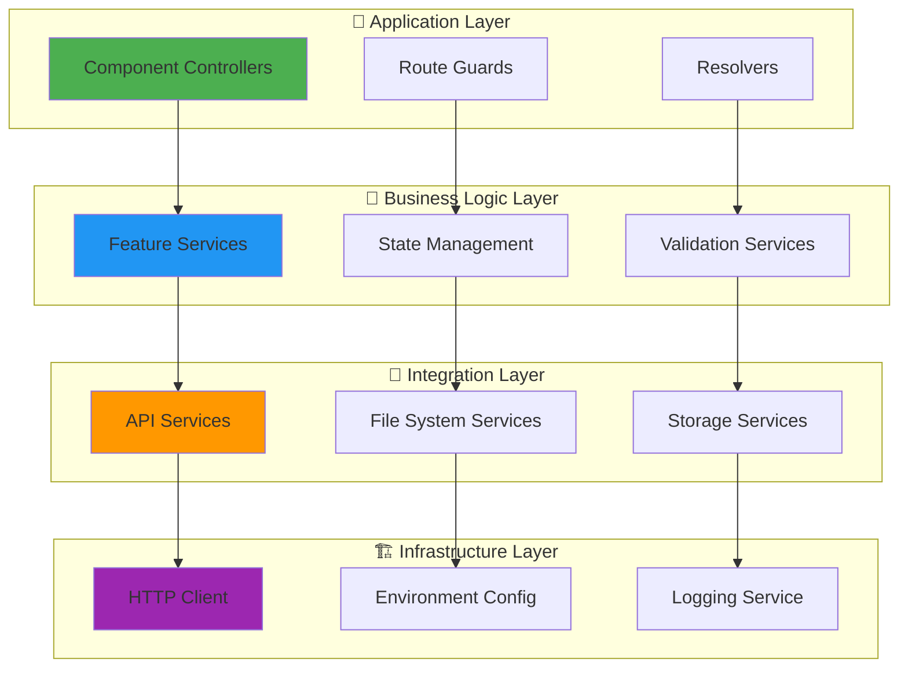
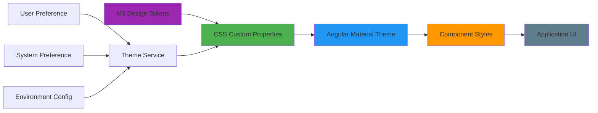
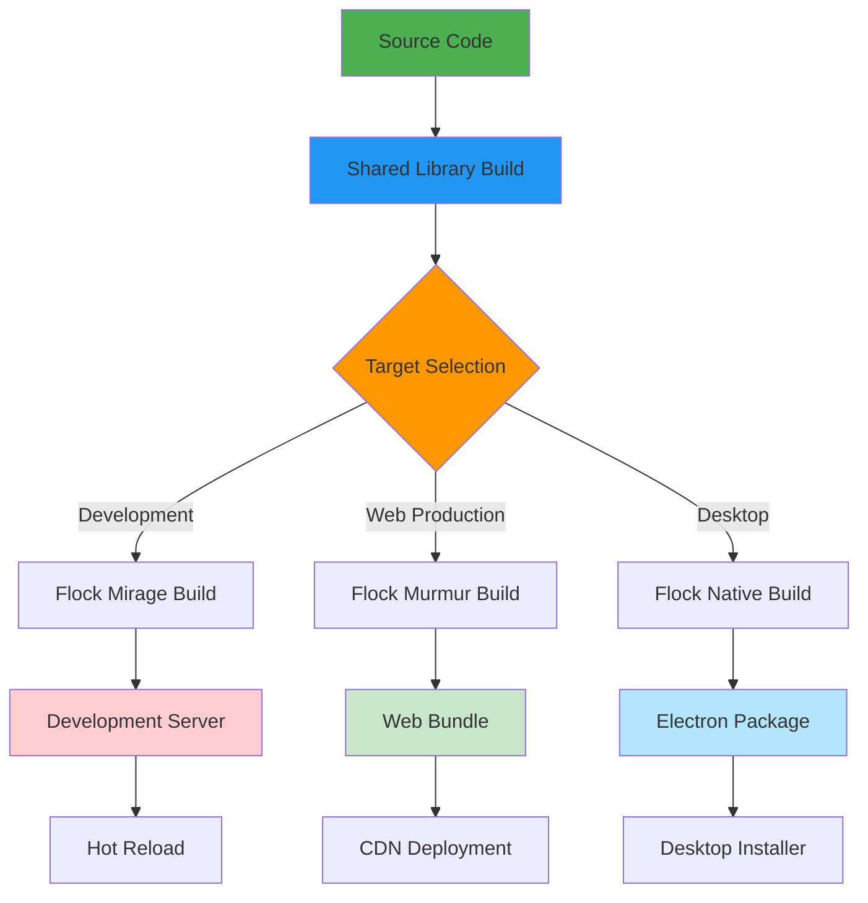
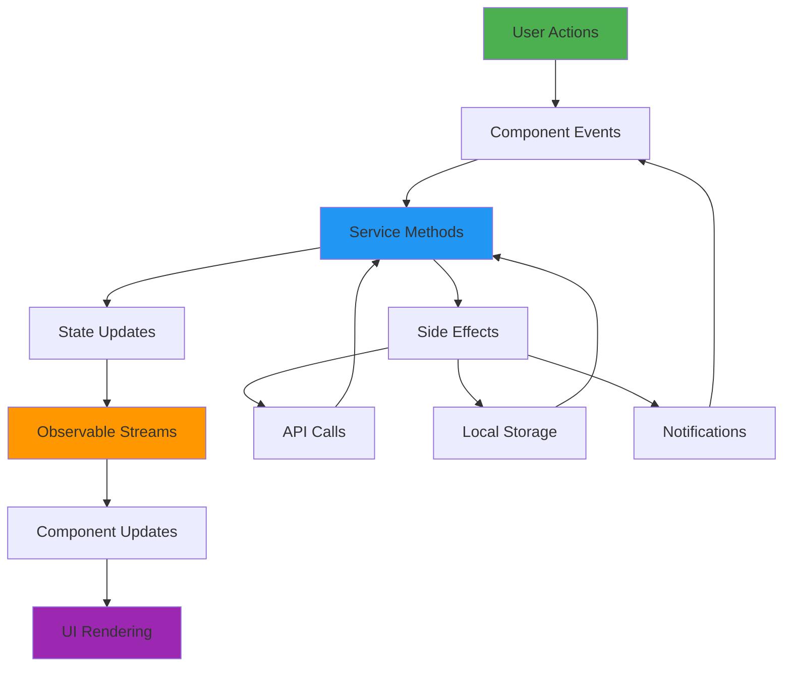
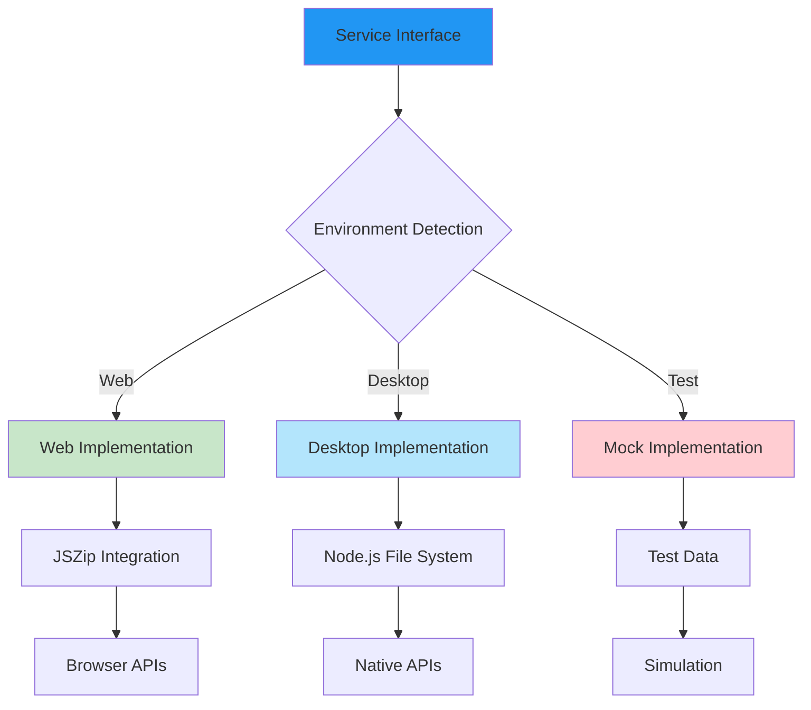
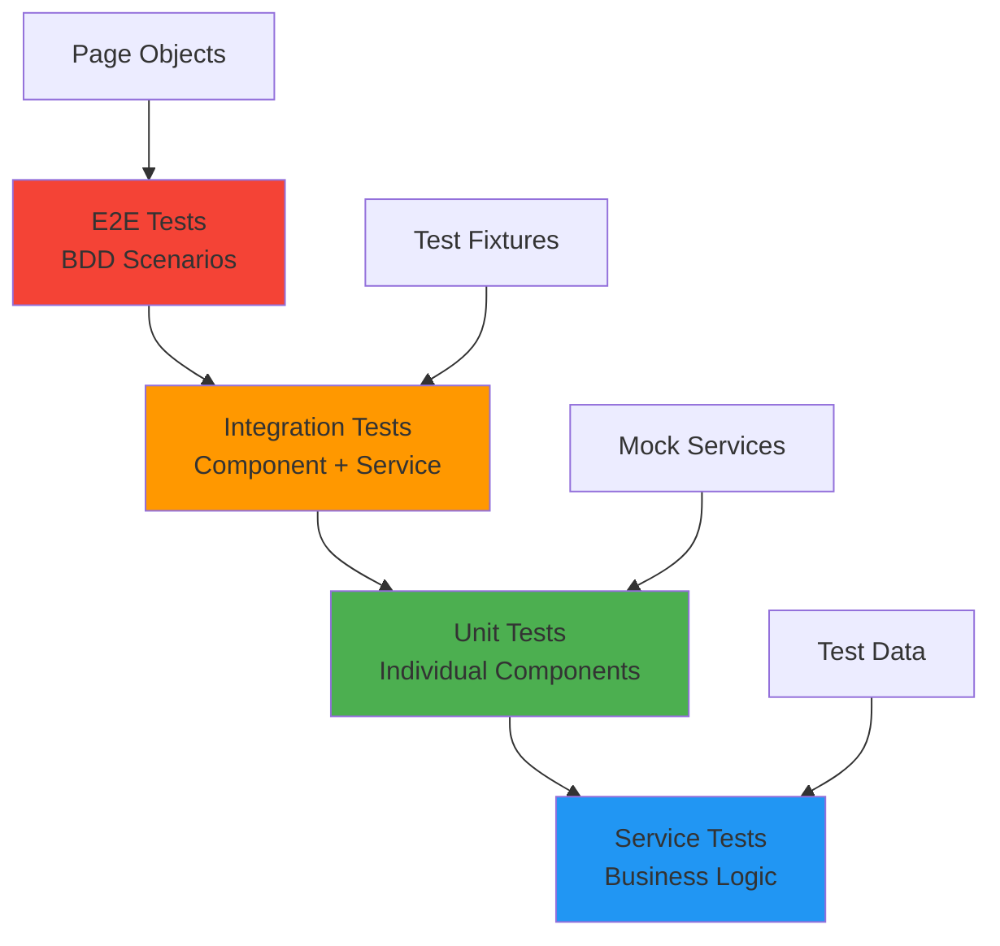
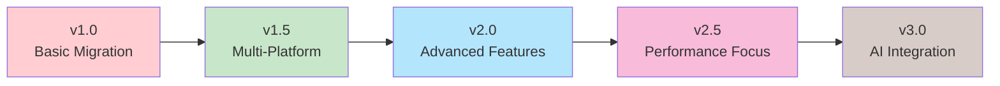

# 🏗️ Architecture - The Bird's Eye View of Our Flock's Nest

> *"Great architecture is like a well-organized flock - each bird knows its role, flies in formation, yet can adapt independently when needed. Our Angular applications soar together while maintaining their unique identities."*

## 🌟 **Architectural Philosophy**

The Flock architecture is built on the principle of **"Unity in Diversity"** - a shared foundation that enables different applications to flourish while maintaining consistency and reusability.

### **Core Principles**

- **🧬 Shared DNA**: Common components and services inherited by all applications
- **🎭 Adaptive Behavior**: Environment-aware services that adapt to each platform
- **🎨 Unified Design Language**: Consistent Material Design 3 theming across all variants
- **⚡ Performance First**: Optimized for speed and efficiency on each target platform
- **🔄 Scalable Growth**: Architecture that evolves with requirements

## 🦜 **The Flock Ecosystem**



## 🏠 **Monorepo Structure**

Our flock lives in a carefully organized monorepo that promotes code sharing while maintaining clear boundaries:

```
flock/
├── 📁 projects/                    # All Angular applications and libraries
│   ├── 🎭 flock-mirage/           # Development & testing application
│   │   ├── src/app/               # Application-specific code
│   │   ├── src/environments/      # Environment configurations
│   │   └── public/                # Static assets
│   │
│   ├── 🌊 flock-murmur/           # Web deployment application
│   │   ├── src/app/               # Web-optimized implementation
│   │   ├── src/environments/      # Web-specific environments
│   │   └── public/                # Web assets
│   │
│   ├── 🦅 flock-native/           # Desktop native application
│   │   ├── src/app/               # Desktop-specific features
│   │   ├── src/environments/      # Native environments
│   │   └── public/                # Desktop assets
│   │
│   └── 🧩 shared/                 # Shared component library
│       ├── src/lib/components/    # Reusable UI components
│       ├── src/lib/services/      # Common business logic
│       ├── src/lib/models/        # Shared data models
│       ├── src/lib/utils/         # Utility functions
│       └── src/lib/styles/        # Shared styling system
│
├── 📁 features/                    # E2E test specifications (Gherkin)
├── 📁 docs/                       # Documentation source files
├── 📁 scripts/                    # Build and utility scripts
└── 📄 angular.json                # Angular workspace configuration
```

## 🧩 **Shared Component Architecture**

### **Component Hierarchy**



### **Component Types**

#### **🏗️ Layout Components**
- **App Shell**: Main application container with routing
- **Navigation**: Responsive navigation with theme support
- **Header/Footer**: Consistent branding and actions

#### **🎯 Feature Components** 
- **File Upload**: Drag-and-drop file handling with progress
- **Step Navigation**: Wizard-style workflow guidance
- **Progress Tracking**: Real-time upload and processing status

#### **🎨 UI Components**
- **Theme Toggle**: Light/dark mode switching
- **Custom Buttons**: Material Design 3 styled actions
- **Form Controls**: Enhanced input components with validation

#### **🔧 Base Components**
- **Material Wrappers**: Customized Angular Material components
- **Utility Components**: Loading states, error handling, etc.

## 🔧 **Service Architecture**

### **Service Layer Design**



### **Service Categories**

#### **📋 Core Services**
- **ConfigService**: Application configuration and feature flags
- **ThemeService**: Theme management and preference storage
- **LoggingService**: Structured logging with different levels

#### **📁 File Management Services**
- **FileProcessorService**: File parsing and validation
- **UploadService**: File upload with progress tracking
- **StorageService**: Local storage and caching

#### **🔐 Security Services**
- **AuthenticationService**: User authentication and token management
- **ValidationService**: Data validation and sanitization
- **PermissionService**: Role-based access control

#### **🌐 Integration Services**
- **BlueSkyService**: Social media platform integration
- **AnalyticsService**: Usage tracking and metrics
- **NotificationService**: User notifications and feedback

## 🎨 **Theming Architecture**

### **Material Design 3 Integration**



### **Theme Structure**
```scss
// Base theme tokens
:root {
  --flock-primary: #2196f3;
  --flock-secondary: #4caf50;
  --flock-surface: #ffffff;
  --flock-on-surface: #212121;
  
  // Semantic tokens
  --flock-success: #4caf50;
  --flock-warning: #ff9800;
  --flock-error: #f44336;
}

// Dark theme overrides
[data-theme="dark"] {
  --flock-surface: #121212;
  --flock-on-surface: #ffffff;
}
```

## 🚀 **Build and Deployment Architecture**

### **Multi-Target Build Strategy**



### **Build Configurations**

#### **🎭 Mirage (Development)**
```json
{
  "optimization": false,
  "sourceMap": true,
  "extractCss": false,
  "namedChunks": true,
  "vendorChunk": true
}
```

#### **🌊 Murmur (Web)**
```json
{
  "optimization": true,
  "outputHashing": "all",
  "extractCss": true,
  "budgets": [{"type": "initial", "maximumWarning": "500kb"}]
}
```

#### **🦅 Native (Desktop)**
```json
{
  "optimization": true,
  "commonChunk": false,
  "vendorChunk": false,
  "runtimeChunk": false
}
```

## 📊 **State Management Architecture**

### **State Flow Design**



### **State Management Patterns**

#### **🔄 Reactive Services**
```typescript
@Injectable({ providedIn: 'root' })
export class UploadService {
  private uploadState$ = new BehaviorSubject<UploadState>({
    files: [],
    progress: 0,
    status: 'idle'
  });

  readonly state$ = this.uploadState$.asObservable();
  
  updateProgress(progress: number) {
    this.uploadState$.next({
      ...this.uploadState$.value,
      progress
    });
  }
}
```

#### **📡 Signal-Based State**
```typescript
@Injectable({ providedIn: 'root' })
export class ThemeService {
  private themeSignal = signal<Theme>('light');
  
  readonly theme = this.themeSignal.asReadonly();
  
  setTheme(theme: Theme) {
    this.themeSignal.set(theme);
    this.applyTheme(theme);
  }
}
```

## 🔌 **Integration Patterns**

### **Environment-Aware Services**



### **Dependency Injection Strategy**
```typescript
// Service interface
export abstract class FileSystemService {
  abstract readFile(path: string): Observable<string>;
  abstract writeFile(path: string, content: string): Observable<void>;
}

// Web implementation
@Injectable({ providedIn: 'root' })
export class WebFileSystemService extends FileSystemService {
  readFile(path: string): Observable<string> {
    // Use File API and JSZip
  }
}

// Desktop implementation  
@Injectable({ providedIn: 'root' })
export class DesktopFileSystemService extends FileSystemService {
  readFile(path: string): Observable<string> {
    // Use Node.js fs module
  }
}

// Provider configuration
const FILE_SYSTEM_PROVIDERS = [
  {
    provide: FileSystemService,
    useClass: environment.platform === 'web' 
      ? WebFileSystemService 
      : DesktopFileSystemService
  }
];
```

## 🧪 **Testing Architecture**

### **Testing Pyramid**



### **BDD Integration**
```typescript
// Feature specification
describe('Feature: File Upload Flow', () => {
  describe('Scenario: User uploads valid file', () => {
    it('Given user has file, When uploads, Then shows progress', async () => {
      // Given
      const mockFile = createMockFile('test.json');
      
      // When  
      await uploadService.uploadFile(mockFile);
      
      // Then
      expect(uploadService.progress).toBeGreaterThan(0);
    });
  });
});
```

## 📈 **Performance Architecture**

### **Optimization Strategies**

#### **🚀 Lazy Loading**
```typescript
const routes: Routes = [
  {
    path: 'upload',
    loadChildren: () => import('./upload/upload.module').then(m => m.UploadModule)
  },
  {
    path: 'progress', 
    loadComponent: () => import('./progress/progress.component').then(c => c.ProgressComponent)
  }
];
```

#### **⚡ Change Detection Optimization**
```typescript
@Component({
  changeDetection: ChangeDetectionStrategy.OnPush,
  template: `
    <div class="upload-progress">
      {{ progress$ | async }}
    </div>
  `
})
export class ProgressComponent {
  progress$ = this.uploadService.progress$;
}
```

#### **🎯 Bundle Optimization**
- Tree shaking for unused code elimination
- Code splitting by route and feature
- Lazy loading of non-critical components
- Service worker for caching strategies

## 🔄 **Migration and Evolution Strategy**

### **Architecture Evolution**


### **Backward Compatibility Strategy**
- Semantic versioning for all public APIs
- Deprecation notices with migration guides
- Gradual feature rollout with feature flags
- Comprehensive migration tooling

## 📚 **Architecture Guidelines**

### **Design Principles**

1. **🎯 Single Responsibility**: Each component/service has one clear purpose
2. **🔄 Open/Closed**: Open for extension, closed for modification  
3. **🔌 Dependency Inversion**: Depend on abstractions, not concretions
4. **📏 Interface Segregation**: Many specific interfaces over one general
5. **🧩 Composition Over Inheritance**: Favor composition for flexibility

### **Code Organization Rules**

```typescript
// ✅ Good: Clear feature organization
src/
├── lib/
│   ├── upload/
│   │   ├── components/
│   │   ├── services/
│   │   └── models/
│   ├── progress/
│   └── shared/

// ❌ Avoid: Mixed concerns
src/
├── lib/
│   ├── components/
│   ├── services/
│   └── everything-mixed/
```

---

## 🚀 **What Makes Our Architecture Special**

### **🎭 Multi-Target Excellence**
Each application variant is optimized for its specific use case while sharing 90% of the codebase.

### **🧬 Evolutionary Design**  
The architecture grows and adapts with requirements while maintaining backward compatibility.

### **⚡ Performance-First**
Every architectural decision is evaluated for its impact on performance and user experience.

### **🔧 Developer Experience**
Rich tooling, clear patterns, and comprehensive documentation make development productive and enjoyable.

> 💡 **Architecture Philosophy**: *"Good architecture is like a well-trained flock - it looks effortless, but every bird knows exactly where it belongs and how to adapt when the winds change."*

---

**Next Steps**: Explore the individual components of our architecture:
- [🧩 Shared Components](/architecture/shared/)
- [🎭 Flock Mirage Details](/architecture/flock-mirage/)  
- [🌊 Flock Murmur Details](/architecture/flock-murmur/)
- [🦅 Flock Native Details](/architecture/flock-native/)