# 🚀 Flock Development - Getting Your Wings and Taking Flight

> *"Every bird starts as an egg. This guide will help you hatch into a full-fledged Flock developer and soar with our migration flock!"*

## 🚀 **Development Setup**

### **Prerequisites**
- **Node.js 18+** - The fuel for our migration engine
- **Angular CLI 20.1.5+** - Our flight instructor
- **Git** - For version control and collaboration
- **Modern Browser** - For testing web components

### **Installation**
```bash
# Land in our repository
git clone <repository-url>
cd flock

# Gather provisions
npm install
```

## 🦜 **Choose Your Bird**

### **Development Options**

```mermaid
graph TB
    subgraph "Development Birds"
        A[🦤 Flock Mirage<br/>Development & Testing]
        B[🌊 Flock Murmur<br/>Web Development]
        C[🦅 Flock Native<br/>Desktop Development]
    end
    
    subgraph "Use Cases"
        D[🧪 Testing Components]
        E[🌐 Web Development]
        F[💻 Desktop Development]
        G[🔧 Architecture Validation]
    end
    
    A --> D
    A --> G
    B --> E
    C --> F
    
    style A fill:#ffcdd2
    style B fill:#c8e6c9
    style C fill:#4caf50
```



### **🎭 Flock Mirage (Recommended for Development)**
Perfect for component development, testing, and architectural validation:

```bash
# Start the mirage bird (default development server)
ng serve

# Or explicitly
ng serve flock-mirage

# With specific configuration
ng serve flock-mirage --configuration=development --port=4200
```

**Best for:**
- 🧪 Component development and testing
- 🔧 Service integration testing
- 📱 Responsive design validation
- 🎨 Theme and styling development

### **🌊 Flock Murmur (Web Deployment)**
Optimized for web browser deployment with JSZip integration:

```bash
# Start the murmuration bird
ng serve flock-murmur

# Production build
ng build flock-murmur --configuration=production
```

**Best for:**
- 🌐 Web deployment testing
- 📦 Bundle size optimization
- 🔄 Progressive web app features
- 🚀 Performance optimization

### **🦅 Flock Native (Desktop Development)**
Full desktop power with Electron and Node.js file system access:

```bash
# Start the native bird
ng serve flock-native

# Build for desktop
ng build flock-native --configuration=production
```

**Best for:**
- 💻 Desktop application development
- 📁 File system integration
- 🔧 Native system APIs
- ⚡ Performance-critical operations

## 🏗️ **Project Architecture**

### **Monorepo Structure**
```
flock/
├── 📁 projects/
│   ├── 🎭 flock-mirage/          # Development & testing bird
│   ├── 🌊 flock-murmur/          # Web deployment bird
│   ├── 🦅 flock-native/          # Desktop native bird
│   └── 🧩 shared/                # Shared component library
├── 📁 features/                  # E2E test features
├── 📁 docs/                      # Documentation
└── 📄 angular.json               # Angular workspace config
```

### **Shared Library Integration**
All birds inherit from the shared library:

```bash
# Build the shared library first
ng build --project=shared

# Then build/serve any bird
ng serve flock-mirage
```

## 🛠️ **Development Workflow**

### **Daily Development Commands**

```bash
# 1. Start your development bird
ng serve flock-mirage

# 2. Run tests in watch mode
ng test --watch

# 3. Run linting
ng lint

# 4. Build for production testing
ng build --configuration=production
```

### **Component Development**

```bash
# Generate new component in shared library
ng generate component component-name --project=shared

# Generate component in specific bird
ng generate component component-name --project=flock-mirage

# Generate with specific options
ng generate component components/upload-step --project=shared --standalone
```

### **Service Development**

```bash
# Generate service in shared library
ng generate service services/service-name --project=shared

# Generate with specific options
ng generate service core/config --project=shared --skip-tests
```

### **Testing Workflow**

```bash
# Run unit tests
ng test

# Run E2E tests
ng e2e

# Run E2E tests with specific configuration
npm run test:e2e:headless

# Generate test coverage
ng test --code-coverage
```

## 🎨 **Theming and Styling**

### **Material Design 3 Integration**
Our flock uses a unified M3 Material Design system:

```typescript
// Theme configuration in shared library
@import '@angular/material/theming';
@import 'shared/src/lib/styles/flock-theme';

// Apply flock theme
@include flock-theme($flock-primary, $flock-accent, $flock-warn);
```

### **Component Styling**
```scss
// Component styles inherit from flock theme
.flock-component {
  background-color: var(--flock-surface);
  color: var(--flock-on-surface);
  border-radius: var(--flock-border-radius);
}
```

## 🔧 **Code Generation Patterns**

### **Angular CLI Standards**
Always use Angular CLI for consistent code generation:

```bash
# Components with proper naming
ng generate component features/migration/upload-step --project=shared

# Services with dependency injection
ng generate service core/config --project=shared

# Guards with functional pattern
ng generate guard core/auth --project=shared

# Resolvers for data loading
ng generate resolver core/archive --project=shared
```

### **File Naming Conventions**
- **Components**: `upload-step.component.ts`
- **Services**: `config.service.ts`
- **Guards**: `auth.guard.ts`
- **Resolvers**: `archive.resolver.ts`
- **Interfaces**: `migration-config.interface.ts`
- **Types**: `step.types.ts`

## 🧪 **Testing Strategy**

### **Unit Testing**
```bash
# Run all unit tests
ng test

# Run tests for specific project
ng test shared
ng test flock-mirage

# Generate coverage report
ng test --code-coverage --watch=false
```

### **E2E Testing**
```bash
# Run E2E tests
npm run test:e2e

# Run headless E2E tests
npm run test:e2e:headless

# Run sharded tests (like CI)
./run-sharded-tests.sh --serve-allure
```

### **BDD Testing Approach**
Our flock follows BDD methodology with structured test naming:

```typescript
describe('Feature: User Authentication', () => {
  describe('Scenario: Valid login attempt', () => {
    it('Given valid credentials, When user submits, Then login succeeds', () => {
      // BDD-style test implementation
    });
  });
});
```

## 🔄 **Git Workflow**

### **Branch Strategy**
```bash
# Create feature branch
git checkout -b feature/migration-enhancement

# Create component branch
git checkout -b component/upload-progress

# Create bugfix branch
git checkout -b bugfix/auth-validation
```

### **Commit Conventions**
```bash
# Feature commits
git commit -m "feat: add file upload progress tracking"

# Bug fix commits  
git commit -m "fix: resolve authentication token expiry"

# Documentation commits
git commit -m "docs: update development setup guide"

# Test commits
git commit -m "test: add BDD scenarios for upload flow"
```

## 📦 **Build and Deployment**

### **Development Builds**
```bash
# Build all birds
ng build

# Build specific bird
ng build flock-mirage

# Build with development configuration
ng build flock-mirage --configuration=development
```

### **Production Builds**
```bash
# Production build with optimization
ng build flock-mirage --configuration=production

# Analyze bundle size
ng build flock-mirage --stats-json
npx webpack-bundle-analyzer dist/flock-mirage/stats.json
```

### **Local Deployment Testing**
```bash
# Serve production build locally
npx http-server dist/flock-mirage -p 8080

# Test with different configurations
ng serve --configuration=staging --port=4300
```

## 🐛 **Debugging and Troubleshooting**

### **Common Issues**

#### **Shared Library Build Errors**
```bash
# Always build shared library first
ng build --project=shared

# Clear Angular cache if needed
ng cache clean
```

#### **Port Conflicts**
```bash
# Use different ports for different birds
ng serve flock-mirage --port=4200
ng serve flock-murmur --port=4201
ng serve flock-native --port=4202
```

#### **Dependencies Issues**
```bash
# Clean install
rm -rf node_modules package-lock.json
npm install

# Verify Angular CLI version
ng version
```

### **Debug Tools**

#### **Angular DevTools**
- Install Angular DevTools browser extension
- Use component inspector for debugging
- Profile performance with change detection

#### **VS Code Configuration**
```json
{
  "configurations": [
    {
      "type": "chrome",
      "request": "launch",
      "name": "Debug Flock Mirage",
      "url": "http://localhost:4200",
      "webRoot": "${workspaceFolder}"
    }
  ]
}
```

## ⚡ **Performance Optimization**

### **Development Performance**
```bash
# Use development configuration for faster builds
ng serve --configuration=development

# Enable hot module replacement
ng serve --hmr

# Disable source maps for faster builds
ng serve --source-map=false
```

### **Bundle Analysis**
```bash
# Generate bundle statistics
ng build --stats-json

# Analyze bundles
npx webpack-bundle-analyzer dist/*/stats.json

# Check bundle sizes
ls -la dist/*/
```

## 🔍 **Code Quality**

### **Linting**
```bash
# Lint all projects
ng lint

# Lint specific project
ng lint shared
ng lint flock-mirage

# Fix auto-fixable issues
ng lint --fix
```

### **Formatting**
```bash
# Format with Prettier
npx prettier --write "**/*.{ts,html,scss,json}"

# Check formatting
npx prettier --check "**/*.{ts,html,scss,json}"
```

### **Type Checking**
```bash
# Strict type checking
ng build --strict

# TypeScript compilation check
npx tsc --noEmit
```

## 🚀 **Advanced Development**

### **Custom Webpack Configuration**
```bash
# Add custom webpack config
ng add @angular-builders/custom-webpack

# Use custom builder in angular.json
"builder": "@angular-builders/custom-webpack:browser"
```

### **Environment Configuration**
```typescript
// Environment-specific settings
export const environment = {
  production: false,
  apiUrl: 'http://localhost:3000',
  enableDebug: true,
  bird: 'mirage'
};
```

### **Feature Flags**
```typescript
// Feature flag service
@Injectable({ providedIn: 'root' })
export class FeatureFlagService {
  isFeatureEnabled(flag: string): boolean {
    return environment.features?.[flag] ?? false;
  }
}
```

## 📚 **Resources and References**

### **Official Documentation**
- [Angular Documentation](https://angular.dev)
- [Angular CLI Documentation](https://angular.dev/tools/cli)
- [Material Design 3](https://m3.material.io/)

### **Flock-Specific Resources**
- [Architecture Guide](/architecture/)
- [Testing Methodology](/testing/)
- [Styling Guide](/styling/)
- [Component Library](/architecture/shared/components/)

### **Development Tools**
- [Angular DevTools](https://angular.dev/tools/devtools)
- [VS Code Angular Extension Pack](https://marketplace.visualstudio.com/items?itemName=Angular.ng-template)
- [Chrome DevTools](https://developers.google.com/web/tools/chrome-devtools)

---

## 🎯 **Next Steps**

1. **🔧 Set up your development environment** using the installation steps above
2. **🦜 Choose your bird** based on your development needs
3. **🧪 Run the test suite** to ensure everything is working
4. **📖 Read the architecture guide** to understand the codebase structure
5. **🎨 Explore the styling system** to understand our design patterns
6. **🚀 Start building** your first component or feature!

> 💡 **Pro Tip**: Start with the Mirage bird for development - it's optimized for the best developer experience with hot reloading, comprehensive debugging tools, and full component library access.

Happy coding, and welcome to the flock! 🦅