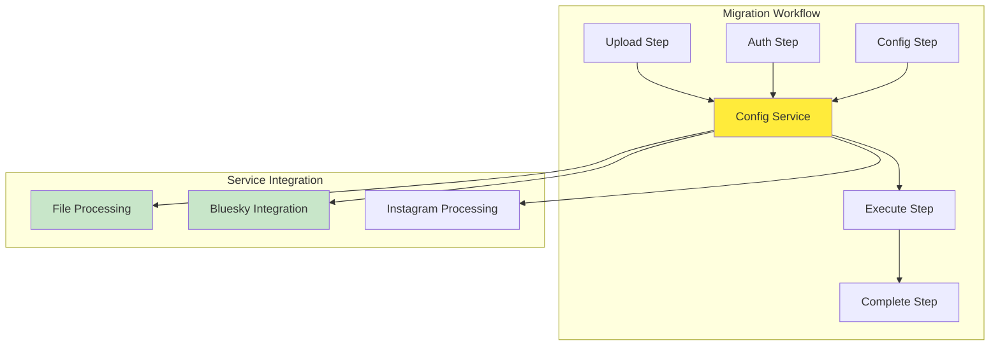

# 🦅 Flock Architecture - The Bird's Eye View

> *"From high above, our flock soars in perfect formation. Each bird has its own flight pattern, but we all share the same nest of components and services."*

## 🏗️ **Architecture Overview**

Our flock follows a **Config-First Architecture** where configuration drives everything, just like how a bird's nest provides the foundation for all its eggs. Each app variant has its own personality while sharing the same core components and services.

### **The Three Birds in Our Flock**

| Bird | Purpose | Environment | Special Powers |
|------|---------|-------------|----------------|
| **🦤 Flock Mirage** | Development & Testing | Browser simulation | Creates mock data, perfect for testing |
| **🦅 Flock Native** | Desktop power | Electron + Node.js | Full file system access, offline processing |
| **🌊 Flock Murmur** | Web deployment | Browser + JSZip | Cloud-ready, accessible anywhere |

## 🥚 **Config-First Architecture (The Golden Egg)**

Like a dodo bird carefully arranging its eggs, our configuration service is the central hub that everything depends on:



## 🏠 **Shared Components (The Common Nest)**

All birds share these core components:
- **File Upload** - How birds carry their migration data
- **Step Navigation** - Flight path guidance through the migration
- **Progress Tracking** - Migration journey monitoring
- **Theme Toggle** - Day/night mode for our flock

## 🔧 **Service Architecture (The Bird's Tools)**

Our services are like specialized tools that each bird can use:

- **ConfigService** - The central nest where all configuration lives
- **FileProcessingService** - Adapts to each bird's environment (JSZip vs Native)
- **BlueskyService** - Handles authentication and API calls
- **InstagramService** - Processes Instagram export data
- **ProgressService** - Tracks migration progress in real-time

## 🛤️ **Migration Workflow (The Flight Path)**

```
Upload → Auth → Config → Execute → Complete
  ↓        ↓       ↓        ↓        ↓
File    Creds   Settings  Migration Results
```

Each step validates its data before allowing the next step, ensuring our migration journey is safe and complete.

## 🎯 **Key Principles**

1. **Configuration Drives Everything** - The migratory flight plan
2. **Environment-Aware Services** - Each bird gets the tools it needs
3. **Shared Components** - Common nest elements for consistency
4. **Progressive Validation** - Each step builds on the previous
5. **Real Service Integration** - No fake data in production

## 📚 **Detailed Architecture Documentation**

For deep dives into specific areas, explore our detailed architecture docs:

### **🦤 Flock Mirage (The Dodo Bird's Wisdom)**
- **[Overview](architecture/flock-mirage/OVERVIEW.md)** - Architecture and purpose
- **[Components](architecture/flock-mirage/COMPONENTS.md)** - Component structure and patterns
- **[Services](architecture/flock-mirage/SERVICES.md)** - Service implementations and mocks

### **🦅 Flock Native (The Eagle's Vision)**
- **[Overview](architecture/flock-native/OVERVIEW.md)** - Desktop architecture and Electron integration
<!-- - **[Components](architecture/flock-native/COMPONENTS.md)** - Native component patterns
- **[Services](architecture/flock-native/SERVICES.md)** - Native service implementations
- **[Electron](architecture/flock-native/ELECTRON.md)** - Electron IPC and integration details -->

### **🌊 Flock Murmur (The Murmuration Bird's Dance)**
- **[Overview](architecture/flock-murmur/OVERVIEW.md)** - Web architecture and browser integration
<!-- - **[Components](architecture/flock-murmur/COMPONENTS.md)** - Web component patterns
- **[Services](architecture/flock-murmur/SERVICES.md)** - Web service implementations -->

### **🧩 Shared Library (The Flock's Common Nest)**
- **[Overview](architecture/shared/OVERVIEW.md)** - Shared library architecture and purpose
- **[Developer Guide](architecture/shared/DEVELOPER_GUIDE.md)** - Comprehensive guide for developers
- **[Components](architecture/shared/COMPONENTS.md)** - Shared component patterns and interfaces
- **[Services](architecture/shared/SERVICES.md)** - Service interfaces and shared implementations
- **[Theming](architecture/shared/THEMING.md)** - Material Design system and theme architecture
- **[Routing](architecture/shared/ROUTING.md)** - Routing patterns and navigation architecture

## 🚀 **Why This Architecture?**

- **🔄 Reusable** - Components work across all three birds
- **🔧 Maintainable** - Clear separation of concerns
- **📱 Responsive** - Adapts to each bird's environment
- **🧪 Testable** - Easy to test individual components
- **🚀 Scalable** - Easy to add new birds to the flock

## 🎨 **Bird Theme Integration**

- **🦤 Dodo Bird Wisdom** - Architecture principles and nest structure
- **🦅 Eagle Vision** - High-level overviews and flight paths
- **🌊 Murmuration Patterns** - How components work together
- **🦃 Turkey Durability** - Robust, tested patterns

---

*"The dodo bird may be extinct, but its wisdom lives on in our architecture - build strong foundations, and many birds will find a home."*
