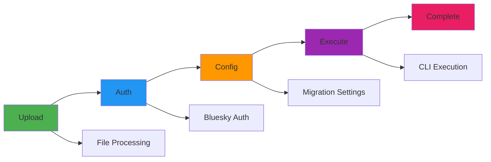

# Bluesky Migration Application - Architecture Overview

## 📚 **Documentation Structure**

This architecture documentation has been organized into focused, digestible documents for better navigation and maintenance:

### **🏗️ Core Architecture**
- **[ARCHITECTURE_OVERVIEW.md](ARCHITECTURE_OVERVIEW.md)** ← **You are here**
- **[CORE_ARCHITECTURE.md](CORE_ARCHITECTURE.md)** - Core principles, workflow, and data flow
- **[COMPONENT_ARCHITECTURE.md](COMPONENT_ARCHITECTURE.md)** - Components, services, and state management
- **[MULTI_APP_ARCHITECTURE.md](MULTI_APP_ARCHITECTURE.md)** - MVP, Web, and Desktop variants

### **🔧 Implementation & Integration**
- **[ROUTING_ARCHITECTURE.md](ROUTING_ARCHITECTURE.md)** - Route flow, guards, and navigation strategy
- **[DATA_MODELS.md](DATA_MODELS.md)** - Data models, interfaces, and CLI integration mapping
- **[MIGRATION_TOOLS_ARCHITECTURE.md](MIGRATION_TOOLS_ARCHITECTURE.md)** - CLI tool architecture and processing strategies
- **[STYLING_ARCHITECTURE.md](STYLING_ARCHITECTURE.md)** - Material Design 3 theming and component styling
- **[SERVICE_ARCHITECTURE.md](SERVICE_ARCHITECTURE.md)** - Service layer, interfaces, and implementations
- **[ELECTRON_INTEGRATION.md](ELECTRON_INTEGRATION.md)** - Electron-specific architecture and IPC
- **[CLI_INTEGRATION.md](CLI_INTEGRATION.md)** - CLI tool integration and bridge services
- **[TESTING_ARCHITECTURE.md](TESTING_ARCHITECTURE.md)** - Testing strategy and BDD methodology

### **📋 Technical Guides**
- **[BUILD_DEPLOYMENT.md](BUILD_DEPLOYMENT.md)** - Build configurations and deployment strategies
- **[PERFORMANCE_OPTIMIZATION.md](PERFORMANCE_OPTIMIZATION.md)** - Performance considerations and optimizations
- **[SECURITY_ARCHITECTURE.md](SECURITY_ARCHITECTURE.md)** - Security layers and authentication flows

---

## 🎯 **Architecture Summary**

The Bluesky Migration Application implements a **Route-Based Guided Form** architecture that guides users through the migration process in a structured, step-by-step manner. This approach ensures users can't skip critical steps and provides clear feedback throughout the migration journey.

### **Key Architectural Principles**

1. **Config-First Architecture** - Configuration drives everything, forms collect config, services depend on config
2. **Route-Based Guided Workflow** - Sequential data collection with validation at each step
3. **Service-Oriented Architecture** - Services wrap migration tool extensions with progress hooks
4. **Multi-App Architecture** - Three variants: MVP (simulation), Web (browser), Desktop (Electron)
5. **Environment-Aware Service Selection** - Automatic selection of appropriate implementations

### **App Variants**

| Variant | Purpose | File Processing | CLI Integration | Use Cases |
|---------|---------|-----------------|-----------------|-----------|
| **MVP** | Development & Testing | Mock data generation | None (simulation) | Development, testing, demos |
| **Web** | Browser-based | JSZip + File API | CLI bridge services | Web deployment, cloud processing |
| **Desktop** | Native desktop | Native Node.js + IPC | Direct CLI integration | Desktop users, offline processing |

### **Core Workflow**

### **Service Architecture**

- **ConfigService**: Central configuration hub mirroring CLI's AppConfig
- **FileProcessingService**: Environment-aware file processing (JSZip vs Native)
- **BlueskyService**: Authentication and API integration
- **InstagramService**: Instagram data processing and validation
- **ProgressService**: Real-time migration progress tracking
- **MigrationOrchestratorService**: CLI tool orchestration

### **Component Strategy**

- **Shared Components**: Layout, validation, progress tracking
- **Swappable Parts**: File selection components for each variant
- **Route-Based**: Each step is an independent component
- **Service Integration**: Components work with any service implementation

---

## 🚀 **Quick Start**

### **For Developers**
1. Read **[CORE_ARCHITECTURE.md](CORE_ARCHITECTURE.md)** for understanding the basic principles
2. Review **[ROUTING_ARCHITECTURE.md](ROUTING_ARCHITECTURE.md)** for route flow and guards
3. Examine **[DATA_MODELS.md](DATA_MODELS.md)** for data interfaces and CLI integration
4. Check **[STYLING_ARCHITECTURE.md](STYLING_ARCHITECTURE.md)** for M3 theming and component styling
5. Review **[COMPONENT_ARCHITECTURE.md](COMPONENT_ARCHITECTURE.md)** for component design patterns
6. Examine **[SERVICE_ARCHITECTURE.md](SERVICE_ARCHITECTURE.md)** for service implementation details

### **For Architects**
1. Start with **[MULTI_APP_ARCHITECTURE.md](MULTI_APP_ARCHITECTURE.md)** for the big picture
2. Review **[ELECTRON_INTEGRATION.md](ELECTRON_INTEGRATION.md)** for desktop architecture
3. Examine **[BUILD_DEPLOYMENT.md](BUILD_DEPLOYMENT.md)** for implementation strategy

### **For DevOps**
1. Focus on **[BUILD_DEPLOYMENT.md](BUILD_DEPLOYMENT.md)** for build configurations
2. Review **[PERFORMANCE_OPTIMIZATION.md](PERFORMANCE_OPTIMIZATION.md)** for optimization strategies
3. Check **[TESTING_ARCHITECTURE.md](TESTING_ARCHITECTURE.md)** for CI/CD integration
