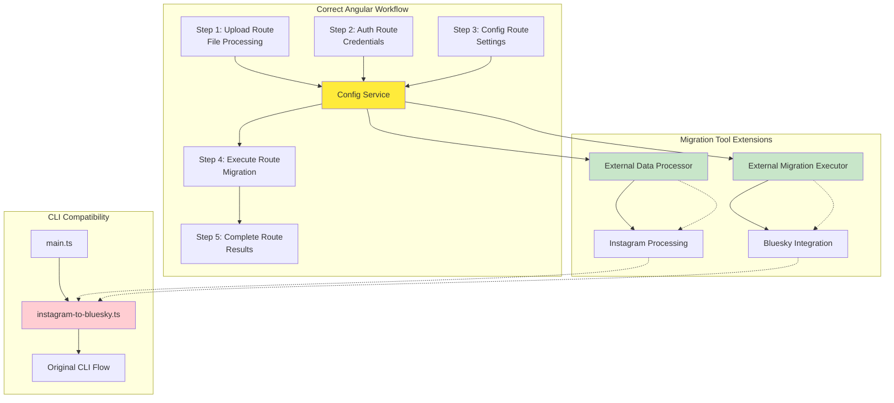
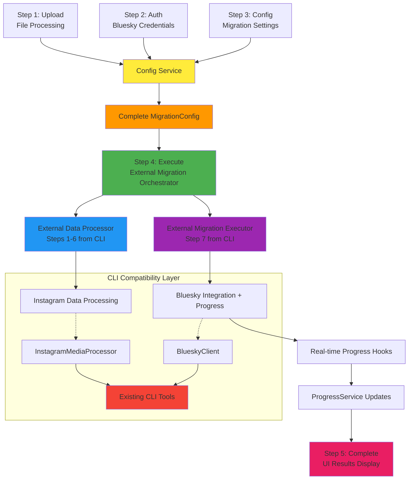
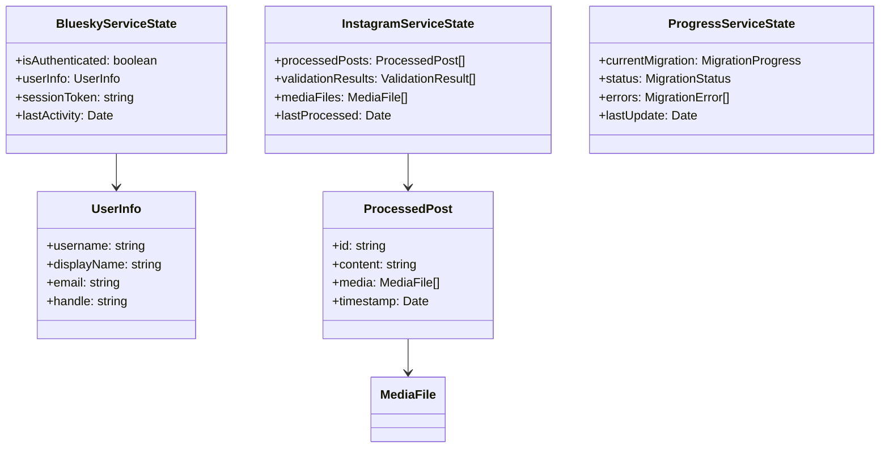
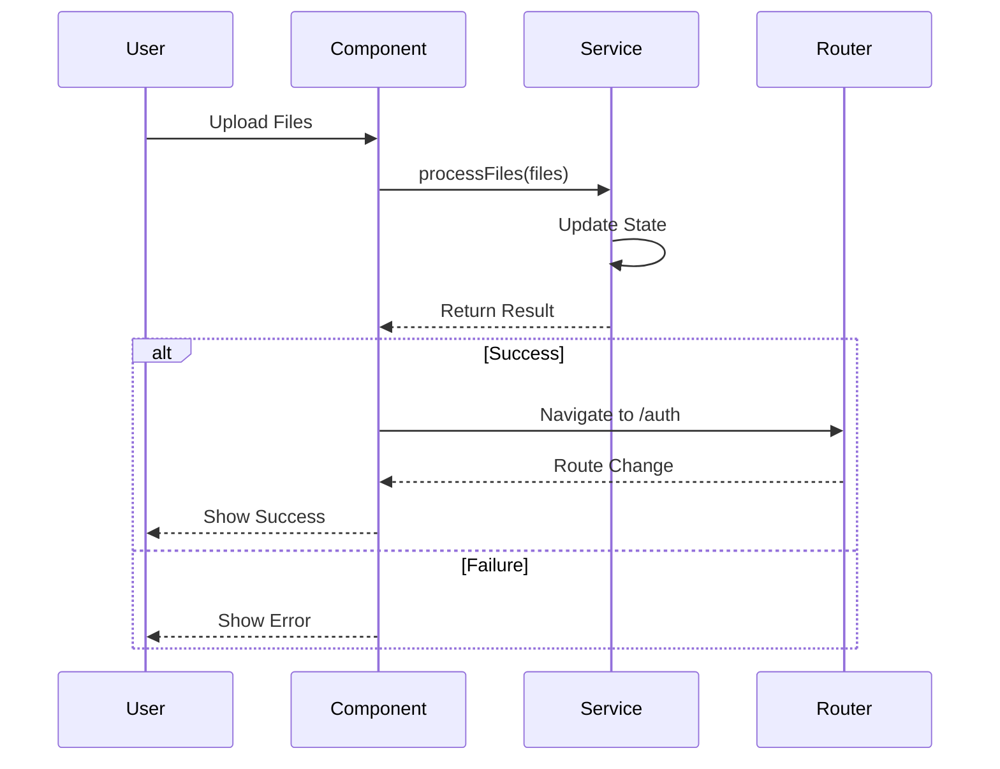

# Core Architecture - Bluesky Migration Application

## 📚 **Navigation**
- **[← Back to Overview](ARCHITECTURE_OVERVIEW.md)**
- **[Component Architecture →](COMPONENT_ARCHITECTURE.md)**
- **[Multi-App Architecture →](MULTI_APP_ARCHITECTURE.md)**

---

## 🎯 **Core Architecture Principles**

The Bluesky Migration Application implements a **Route-Based Guided Form** architecture that guides users through the migration process in a structured, step-by-step manner. This approach ensures users can't skip critical steps and provides clear feedback throughout the migration journey, while maintaining independent state management for each step.

### **1. Config-First Architecture**
- **Configuration Drives Everything**: Migration config (mirroring CLI's `config.ts`) is the single source of truth
- **Form-Based Configuration**: Angular components collect config through forms, not environment variables
- **Service Dependency Chain**: All services depend on config service for their operations
- **CLI Pattern Alignment**: Angular services mirror the CLI's configuration and execution patterns

### **2. Route-Based Guided Workflow**
- **Sequential Data Collection**: Each route collects specific configuration data
- **Service State Integration**: Each step feeds into the central configuration
- **Validation at Each Step**: Configuration validated progressively through the workflow
- **Extension Integration**: Final execution uses migration tool extensions with collected config

### **3. Service-Oriented Architecture with Migration Tool Integration**
- **Config Service**: Central service mirroring CLI's `AppConfig` for Angular context
- **Extension Services**: Services that wrap migration tool extensions with progress hooks
- **File Processing**: Browser-compatible file extraction and processing with Sentry integration
- **Real Service Implementations**: `BlueskyServiceImpl`, `ProgressServiceImpl`, `InstagramServiceImpl` using CLI extensions
- **MVP/Real Service Swapping**: Environment-based service selection via `app.config.ts`
- **CLI Bridge Service**: Dedicated service for managing CLI extension integration and lifecycle
- **Distributed State**: Each service manages domain-specific state while feeding config service

---

## 🔄 **Config-First Workflow Architecture**



### **Step 1: Content Upload & File Processing (/upload)**
```
File Upload → Browser Extraction → Archive Path → Config Service
```

**Purpose**: Upload Instagram export data and extract for processing
**Config Contribution**: Provides `archiveFolder` path to Config Service
**Key Features**:
- Browser-compatible file extraction (ZIP support)
- Temporary archive path generation for migration tools
- File validation and structure verification
- Archive path registration with Config Service

**Service Integration**:
- `InstagramService`: Thin wrapper that validates file structure and delegates processing
- `FileProcessingService`: Dedicated service for ZIP extraction and browser file handling
- `ConfigService`: Stores archive folder path for migration execution

### **Step 2: Bluesky Authentication & Credential Collection (/auth)**
```
Credentials Form → Connection Test → Config Service
```

**Purpose**: Collect and validate Bluesky credentials
**Config Contribution**: Provides `blueskyUsername` and `blueskyPassword` to Config Service
**Key Features**:
- Secure credential collection
- Real Bluesky API connection testing
- Credential validation before storage
- Conditional execution (only if not in simulate mode)

**Service Integration**:
- `BlueskyService`: Handles authentication testing
- `ConfigService`: Stores credentials for migration execution

### **Step 3: Migration Configuration & Settings (/config)**
```
Migration Settings Form → Config Validation → Ready for Execution
```

**Purpose**: Collect migration parameters and finalize configuration
**Config Contribution**: Completes the full `MigrationConfig` object
**Key Features**:
- Date range filtering (minDate, maxDate)
- Test mode selection (testVideoMode, testImageMode, etc.)
- Simulation mode toggle
- Final configuration validation

**Service Integration**:
- `ConfigService`: Receives all remaining configuration parameters
- Validates complete configuration mirrors CLI's `AppConfig.validate()`

### **Step 4: Migration Execution (/execute)**
```
Config Service → External Migration Executor → Real-time Progress → UI Updates
```

**Purpose**: Execute migration using collected configuration
**Config Usage**: Uses complete `MigrationConfig` from Config Service
**Key Features**:
- Mirrors CLI's `main()` function exactly (steps 1-7)
- External Data Processor (steps 1-6 from CLI)
- External Migration Executor (step 7 from CLI)
- Real-time progress hooks integrated with ProgressService

**Service Integration**:
- `ConfigService`: Provides complete configuration
- `ExternalMigrationOrchestrator`: Executes migration with config
- `ProgressService`: Receives real-time progress updates

### **Step 5: Completion & Summary (/complete)**
```
Migration Results → Statistics Calculation → User Feedback
```

**Purpose**: Display migration results and provide completion summary
**Key Features**:
- Results from actual migration execution
- Success/failure statistics
- Created post URLs and verification
- Option to start new migration

**Service Integration**:
- `ProgressService`: Provides final migration results
- `ConfigService`: Reset for potential new migration

---

## 📊 **Config-First Data Flow Architecture**



### **Config-First Data Flow Details**

1. **Configuration Collection**: Each step feeds data into central Config Service
2. **Config Service**: Mirrors CLI's `AppConfig` structure and validation
3. **Migration Orchestration**: Uses complete config to execute migration extensions
4. **CLI Tool Integration**: Extensions use existing CLI tools with external configuration
5. **Progress Tracking**: Real-time hooks provide UI updates during migration
6. **Results**: Final migration statistics and created post URLs

---

## 🏗️ **Environment-Based Service Selection**

The application supports seamless switching between MVP (simulation) and real (CLI-integrated) service implementations:

```typescript
// webui/src/app/app.config.ts - Service Selection Logic
const USE_REAL_SERVICES = environment.useRealServices;

export const appConfig: ApplicationConfig = {
  providers: [
    {
      provide: BLUESKY_SERVICE,
      useClass: USE_REAL_SERVICES ? BlueskyServiceImpl : BlueskyServiceMVP
    },
    {
      provide: INSTAGRAM_SERVICE,
      useClass: USE_REAL_SERVICES ? InstagramServiceImpl : InstagramServiceMVP
    },
    {
      provide: PROGRESS_SERVICE,
      useClass: USE_REAL_SERVICES ? ProgressServiceImpl : ProgressServiceMVP
    },
    {
      provide: MIGRATION_ORCHESTRATOR,
      useClass: USE_REAL_SERVICES ? MigrationOrchestratorService : MigrationOrchestratorMvpService
    }
  ]
};
```

### **Service Implementation Strategy**

**MVP Services (Development & Testing)**:
- `BlueskyServiceMVP`: Simulated Bluesky operations for development
- `InstagramServiceMVP`: Mock Instagram data processing
- `ProgressServiceMVP`: Simulated progress updates
- `MigrationOrchestratorMvpService`: End-to-end simulation

**Real Services (Production & Integration)**:
- `BlueskyServiceImpl`: Real Bluesky API via CLI extensions
- `InstagramServiceImpl`: Actual Instagram processing with CLI tools
- `ProgressServiceImpl`: Real-time CLI progress integration
- `MigrationOrchestratorService`: Full CLI tool orchestration

**Benefits**:
- **Component Isolation**: Frontend components work with both implementations
- **Development Speed**: MVP services enable rapid UI development
- **Testing Flexibility**: BDD tests can run against both implementations
- **Production Ready**: Real services provide actual migration functionality
- **Environment Control**: Simple toggle in environment configuration

---

## 🔐 **State Management Strategy**

### **Benefits of Distributed State Management**

**Eliminating MigrationStateService** provides several key advantages:

1. **Simplified Architecture**: No centralized state synchronization complexity
2. **Better Performance**: No unnecessary state updates across components
3. **Easier Testing**: Each service can be tested independently
4. **Reduced Coupling**: Components only depend on services they actually use
5. **Clearer Data Flow**: State changes are localized to their domain
6. **Easier Debugging**: State issues are isolated to specific services

### **Distributed Service State Structure**



```typescript
// Each service manages its own state independently
interface BlueskyServiceState {
  isAuthenticated: boolean;
  userInfo: UserInfo;
  sessionToken: string;
  lastActivity: Date;
}

interface InstagramServiceState {
  processedPosts: ProcessedPost[];
  validationResults: ValidationResult[];
  mediaFiles: MediaFile[];
  lastProcessed: Date;
}

interface ProgressServiceState {
  currentMigration: MigrationProgress;
  status: MigrationStatus;
  errors: MigrationError[];
  lastUpdate: Date;
}
```

### **Data Persistence Strategy**
- **Local Storage**: User preferences and settings
- **Session Storage**: Temporary data during migration
- **IndexedDB**: Large content files and media
- **Service State**: Each service persists its own state independently

### **State Synchronization**
- No centralized state synchronization required
- Each service manages its own state updates
- Components subscribe directly to service state changes
- State recovery handled by individual services

---

## 🔄 **Component-Service Interaction Pattern**



```typescript
// Each component directly interacts with required services
class ContentUploadComponent {
  constructor(
    private instagramService: InstagramService,
    private router: Router
  ) {}

  async onSubmit(): Promise<void> {
    // Direct service interaction
    const result = await this.instagramService.processFiles(this.files);
    
    // Service manages its own state
    if (result.success) {
      // Navigate to next step when ready
      this.router.navigate(['/auth']);
    }
  }
}
```

---

## 🎯 **Key Benefits of This Architecture**

### **1. Maintainability**
- **Clear Separation**: Each service has a single responsibility
- **Independent Testing**: Services can be tested in isolation
- **Easy Debugging**: State issues are localized to specific services

### **2. Scalability**
- **Service Addition**: New services can be added without affecting existing ones
- **Component Reuse**: Components work with any service implementation
- **Variant Support**: Easy to add new app variants (MVP, Web, Desktop)

### **3. Performance**
- **No Unnecessary Updates**: Components only update when their services change
- **Lazy Loading**: Services can be loaded on demand
- **Efficient State**: No centralized state synchronization overhead

### **4. Flexibility**
- **Environment Switching**: Easy to switch between MVP and real implementations
- **Service Swapping**: Services can be swapped at build time or runtime
- **Testing Support**: MVP services enable fast development and testing

---

## 🔗 **Related Documentation**

- **[Component Architecture](COMPONENT_ARCHITECTURE.md)** - Detailed component design and relationships
- **[Service Architecture](SERVICE_ARCHITECTURE.md)** - Service layer implementation details
- **[Multi-App Architecture](MULTI_APP_ARCHITECTURE.md)** - App variant architecture
- **[Testing Architecture](TESTING_ARCHITECTURE.md)** - Testing strategy and BDD methodology

---

*This core architecture provides the foundation for the entire Bluesky Migration Application, ensuring maintainability, scalability, and flexibility while maintaining clear separation of concerns.*
