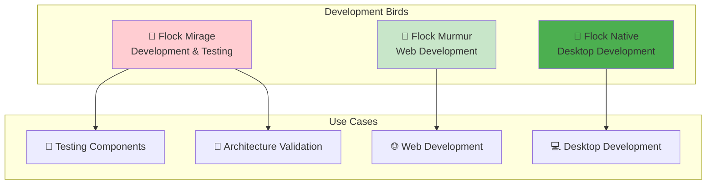
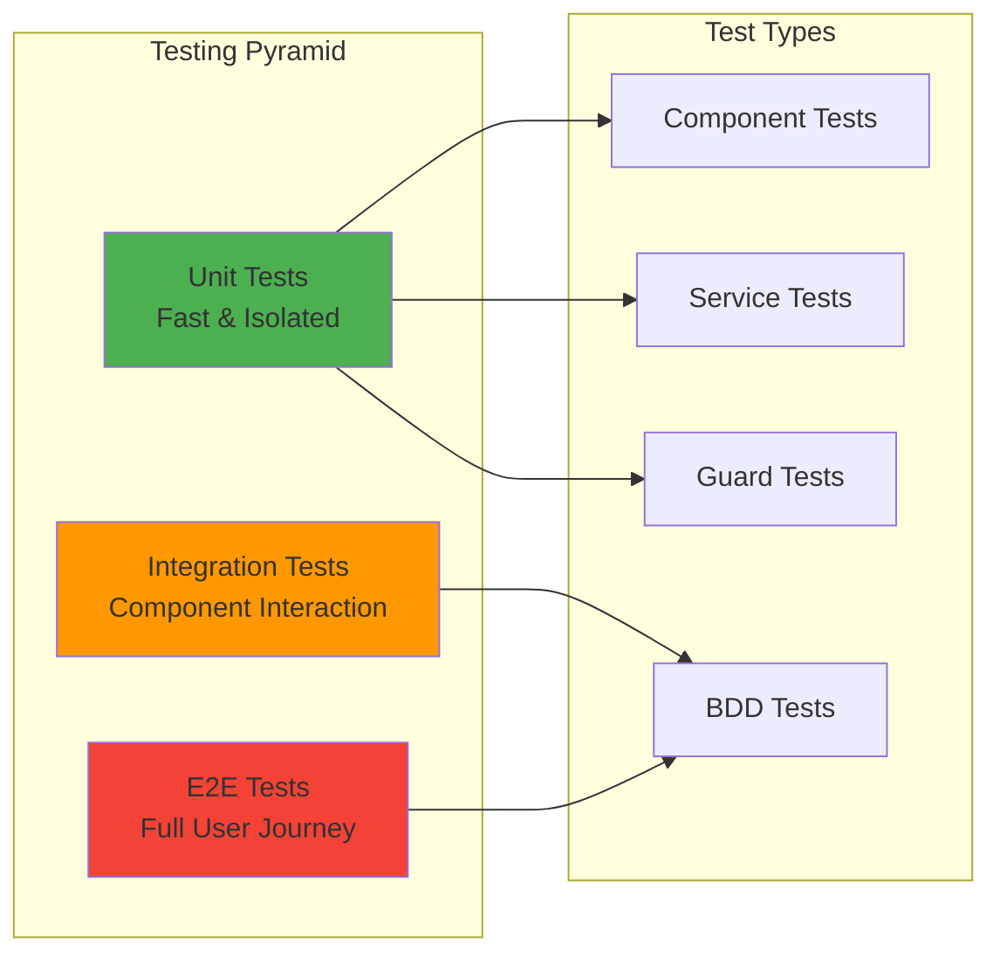
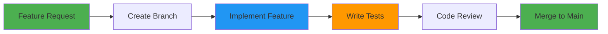
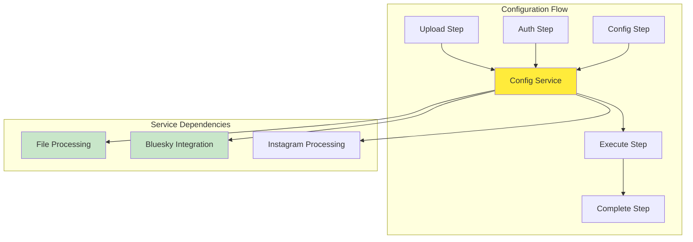
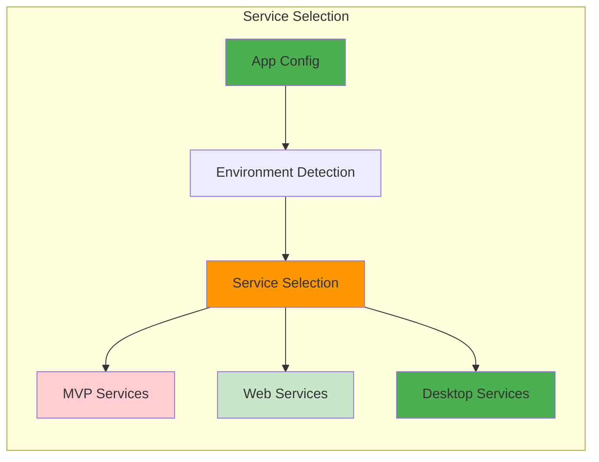

# 🚀 Flock Development - Getting Your Wings and Taking Flight

> *"Every bird starts as an egg. This guide will help you hatch into a full-fledged Flock developer and soar with our migration flock!"*

## 🚀 **Development Setup**

### **Prerequisites**
- **Node.js 18+** - The fuel for our migration engine
- **Angular CLI 20.1.5+** - Our flight instructor
- **Git** - For version control and collaboration
- **Modern Browser** - For testing web components

### **Installation**
```bash
# Land in our repository
git clone <repository-url>
cd flock

# Gather provisions
npm install
```

## 🦜 **Choose Your Bird**

### **Development Options**


### **Starting Your Bird**
```bash
# Start with the mirage bird (default - great for testing)
ng serve

# Or choose your preferred bird:
ng serve flock-murmur     # 🌊 Web murmuration
ng serve flock-native     # 🦅 Desktop native
ng serve flock-mirage     # 🦤 Demo mirage
```

## 🏗️ **Project Structure**

### **Flock Organization**
```
flock/
├── 📁 projects/
│   ├── 🦤 flock-mirage/          # The mirage bird - creates illusions for testing
│   │   ├── src/app/              # Simulates real migration without leaving the nest
│   │   ├── public/               # Feathers and static assets
│   │   └── tsconfig files        # TypeScript configuration
│   │
│   ├── 🌊 flock-murmur/          # The murmuration bird - dances through the web
│   │   ├── src/app/              # Graceful browser-based migration
│   │   ├── public/               # Web-ready feathers
│   │   └── tsconfig files        # TypeScript configuration
│   │
│   ├── 🦅 flock-native/          # The native bird - soars on desktop winds
│   │   ├── src/app/              # Native desktop migration with full power
│   │   ├── public/               # Desktop feathers
│   │   └── tsconfig files        # TypeScript configuration
│   │
│   ├── 🔧 services/              # The flock's shared wisdom
│   │   ├── src/lib/services/     # Services that adapt to each bird's environment
│   │   │   ├── desktop/          # Native bird's specialized services
│   │   │   ├── mvp/              # Mirage bird's simulation services
│   │   │   └── web/              # Murmuration bird's web services
│   │   └── public-api.ts         # How services spread their wings
│   │
│   └── 🧩 shared/                # The flock's common nest
│       ├── src/lib/components/   # Components all birds share
│       │   ├── file-upload/      # How birds carry their migration data
│       │   ├── step-navigation/  # Flight path guidance
│       │   ├── upload-progress/  # Migration journey tracking
│       │   └── theme-toggle/     # Day/night mode for our flock
│       └── public-api.ts         # Component exports
│
├── 📄 angular.json               # The flock's flight plan
├── 📦 package.json               # The flock's provisions
└── 📖 README.md                  # This field guide
```

## 🔧 **Code Generation (Angular CLI First)**

### **Generate Components**
```bash
# Create new components, services, etc.
ng generate component component-name
ng generate service service-name
ng generate guard guard-name

# Generate in specific bird's nest:
ng generate component component-name --project=flock-mirage
```

### **Generate with Options**
```bash
# Generate with specific options
ng generate component shared/step-header --standalone
ng generate service core/progress --skip-tests
```

### **Add Packages**
```bash
ng add @angular/material
ng add @angular/pwa
```

## 🚀 **Building Your Flock**

### **Development Builds**
```bash
# Build all birds at once
ng build

# Or build specific birds:
ng build flock-murmur     # Web variant
ng build flock-native     # Desktop variant
ng build flock-mirage     # Demo variant
```

### **Production Builds**
```bash
# Build with production configuration
ng build --configuration=production

# Build specific bird for production
ng build flock-murmur --configuration=production
```

### **Multiple Configurations**
```bash
# Development configuration
ng build --configuration=development

# Staging configuration
ng build --configuration=staging

# Production configuration
ng build --configuration=production
```

## 🧪 **Testing During Development**

### **Unit Tests**
```bash
# Test all birds
ng test

# Test specific birds:
ng test flock-mirage      # Test the mirage
ng test flock-murmur      # Test the murmuration
ng test flock-native      # Test the native
```

### **End-to-End Tests**
```bash
# Full migration journey tests
ng e2e

# Test specific migration paths:
ng e2e flock-mirage
ng e2e flock-murmur
ng e2e flock-native
```

### **Testing Strategy**


## 🔧 **Development Tools**

### **Flock Management**
```bash
# See all birds in the flock
ng config projects

# Add a new bird to the flock
ng generate application new-bird-name

# Build with specific configurations
ng build --configuration=production
ng build --configuration=development
```

### **Code Quality**
```bash
# Lint your code
ng lint

# Format your code
ng format

# Check for security vulnerabilities
npm audit
```

### **Development Server**
```bash
# Start development server
ng serve

# Start with specific configuration
ng serve --configuration=development

# Start with live reload
ng serve --watch

# Start with specific port
ng serve --port 4201
```

## 🎯 **Development Workflow**

### **Feature Development**


### **Component Development**
1. **Plan Component** - Define purpose and interface
2. **Generate Structure** - Use Angular CLI for scaffolding
3. **Implement Logic** - Add business logic and state management
4. **Add Styling** - Apply Material Design and responsive layout
5. **Write Tests** - Unit tests and integration tests
6. **Document** - Update architecture documentation

### **Service Development**
1. **Define Interface** - Create service contract
2. **Implement Logic** - Add business logic and data handling
3. **Add Error Handling** - Graceful failure and recovery
4. **Write Tests** - Mock dependencies and test scenarios
5. **Integrate** - Connect with components and other services

## 🎨 **Best Practices**

### **Component Development**
- **Standalone Components** - Use `standalone: true` by default
- **Functional Guards** - Implement functional route guards
- **Dependency Injection** - Use `inject()` function when possible
- **State Management** - Prefer signals over RxJS for simple state

### **Service Development**
- **Reactive Forms** - Use `@angular/forms` reactive forms exclusively
- **Mock Dependencies** - Mock external dependencies in tests
- **Environment Awareness** - Implement environment-aware service selection
- **Config-First** - Follow the config-first architecture pattern

### **Testing Strategy**
- **BDD Tests** - Write BDD-style tests for user scenarios
- **Unit Tests** - Write unit tests for individual methods
- **Real Components** - Use real Angular components in tests
- **Mock External** - Mock only external dependencies

## 🚀 **Architecture Integration**

### **Config-First Pattern**


### **Environment-Aware Services**


## 🔄 **Troubleshooting**

### **Common Issues**
1. **Build Failures** - Check Angular version compatibility
2. **Test Failures** - Ensure all dependencies are installed
3. **Runtime Errors** - Check browser console for detailed errors
4. **Performance Issues** - Use Angular DevTools for profiling

### **Getting Help**
- **Architecture Guide** - Check our [Architecture Documentation](ARCHITECTURE.md)
- **Testing Guide** - Review our [Testing Documentation](TESTING.md)
- **Angular CLI** - Check the [Angular CLI Documentation](https://angular.dev/tools/cli)
- **Community** - Ask questions in our development community

## 🚀 **Future Development**

### **Planned Features**
- **New Bird Variants** - Additional app configurations
- **Enhanced Testing** - More comprehensive test coverage
- **Performance Tools** - Better performance monitoring
- **Developer Experience** - Improved development tools

### **Contribution Guidelines**
1. **Follow Patterns** - Use established architectural patterns
2. **Write Tests** - Include tests for all new features
3. **Update Documentation** - Keep architecture docs current
4. **Code Review** - Participate in peer code reviews

---

*"Remember: every expert was once a beginner. Take your time, ask questions, and soon you'll be soaring with the best of them! The flock is stronger when we all fly together."*
