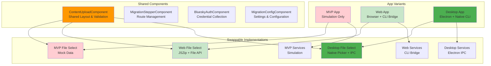

# Multi-App Architecture - MVP, Web, and Desktop Variants

## 📚 **Navigation**
- **[← Back to Overview](ARCHITECTURE_OVERVIEW.md)**
- **[Core Architecture →](CORE_ARCHITECTURE.md)**
- **[Service Architecture →](SERVICE_ARCHITECTURE.md)**

---

## 🎯 **Overview**

The application will be restructured into three distinct variants, each targeting different use cases while sharing common components and interfaces:

1. **MVP App (Demo)**: Simulation-only for development and testing
2. **Web App (Implementation)**: Browser-based with JSZip and CLI bridge
3. **Desktop App (Electron)**: Native desktop with Electron IPC and CLI integration

---

## 🏗️ **Architecture Pattern: Variant-Based Service Selection**



---

## 🔑 **Key Architectural Principles**

### **1. Component Abstraction with Swappable Parts**
Components are designed with abstract interfaces that can accept different implementations:

```typescript
// Abstract file selection interface
interface FileSelectionStrategy {
  selectFiles(): Promise<File[]>;
  validateFiles(files: File[]): Promise<ValidationResult>;
  getFileSize(file: File): string;
}

// Shared component that accepts any strategy
@Component({
  selector: 'app-content-upload',
  template: `
    <div class="upload-container">
      <!-- Shared layout and validation -->
      <ng-container [ngSwitch]="fileSelectionStrategy.type">
        <app-mvp-file-select *ngSwitchCase="'mvp'" />
        <app-web-file-select *ngSwitchCase="'web'" />
        <app-desktop-file-select *ngSwitchCase="'desktop'" />
      </ng-container>
    </div>
  `
})
export class ContentUploadComponent {
  @Input() fileSelectionStrategy: FileSelectionStrategy;
  
  // Shared validation and processing logic
  async onSubmit(): Promise<void> {
    const files = await this.fileSelectionStrategy.selectFiles();
    const validation = await this.fileSelectionStrategy.validateFiles(files);
    // ... shared processing logic
  }
}
```

### **2. Service Token Pattern for Implementation Swapping**
Each service has three implementations accessible via dependency injection tokens:

```typescript
// Service tokens for different implementations
export const FILE_PROCESSING_SERVICE = new InjectionToken<FileProcessingService>('FileProcessingService');
export const BLUESKY_SERVICE = new InjectionToken<BlueskyService>('BlueskyService');
export const INSTAGRAM_SERVICE = new InjectionToken<InstagramService>('InstagramService');

// App-specific service providers
export const appConfig: ApplicationConfig = {
  providers: [
    // MVP App (Simulation)
    {
      provide: FILE_PROCESSING_SERVICE,
      useClass: MvpFileProcessingService
    },
    
    // Web App (Browser + CLI Bridge)
    {
      provide: FILE_PROCESSING_SERVICE,
      useClass: WebFileProcessingService
    },
    
    // Desktop App (Electron + Native CLI)
    {
      provide: FILE_PROCESSING_SERVICE,
      useClass: DesktopFileProcessingService
    }
  ]
};
```

### **3. Shared Component Architecture**
Components are designed to work with any service implementation:

```typescript
// Shared component that works with any service
@Component({
  selector: 'app-file-upload',
  template: `
    <div class="file-upload">
      <!-- Shared UI elements -->
      <div class="upload-area" (click)="triggerFileSelection()">
        <mat-icon>cloud_upload</mat-icon>
        <p>Click to select files or drag and drop</p>
      </div>
      
      <!-- Shared validation display -->
      <div class="validation-results" *ngIf="validationErrors.length">
        <div class="error" *ngFor="let error of validationErrors">
          {{ error }}
        </div>
      </div>
      
      <!-- Shared progress display -->
      <div class="progress" *ngIf="isProcessing">
        <mat-progress-bar [value]="progressPercentage"></mat-progress-bar>
        <p>{{ progressMessage }}</p>
      </div>
    </div>
  `
})
export class FileUploadComponent {
  @Input() fileProcessingService: FileProcessingService;
  
  // Shared logic that works with any implementation
  async onFileSelected(files: File[]): Promise<void> {
    try {
      this.isProcessing = true;
      const result = await this.fileProcessingService.processFiles(files);
      
      if (result.success) {
        this.onSuccess.emit(result);
      } else {
        this.validationErrors = result.errors;
      }
    } finally {
      this.isProcessing = false;
    }
  }
}
```

---

## 📱 **App Variant Specifications**

### **1. MVP App (Demo/Development)**
**Purpose**: Development, testing, and demonstration without external dependencies

**Characteristics**:
- **File Processing**: Mock data generation, no actual file handling
- **Services**: Simulation-only implementations
- **CLI Integration**: None (pure simulation)
- **Use Cases**: Development, testing, demos, CI/CD

**Implementation**:
```typescript
// MVP File Processing Service
@Injectable()
export class MvpFileProcessingService implements FileProcessingService {
  async processFiles(files: File[]): Promise<FileProcessingResult> {
    // Generate mock validation results
    return {
      success: true,
      extractedPath: '/mock/extracted/path',
      fileCount: files.length,
      validationResults: this.generateMockValidation()
    };
  }
  
  private generateMockValidation(): ValidationResult[] {
    return [
      { type: 'info', message: 'Mock Instagram export detected' },
      { type: 'success', message: 'Posts: 150, Reels: 25, Stories: 300' }
    ];
  }
}
```

### **2. Web App (Browser Implementation)**
**Purpose**: Browser-based migration with CLI bridge integration

**Characteristics**:
- **File Processing**: JSZip for browser-based extraction
- **Services**: CLI bridge services for external tool integration
- **CLI Integration**: HTTP/WebSocket bridge to external CLI tools
- **Use Cases**: Web deployment, cloud-based processing, cross-platform access

**Implementation**:
```typescript
// Web File Processing Service
@Injectable()
export class WebFileProcessingService implements FileProcessingService {
  constructor(private cliBridgeService: CliBridgeService) {}
  
  async processFiles(files: File[]): Promise<FileProcessingResult> {
    // Use JSZip for browser extraction
    const extractedData = await this.extractWithJSZip(files[0]);
    
    // Validate through CLI bridge
    const validation = await this.cliBridgeService.validateArchive(extractedData);
    
    return {
      success: validation.isValid,
      extractedPath: extractedData.path,
      fileCount: extractedData.fileCount,
      validationResults: validation.results
    };
  }
}
```

### **3. Desktop App (Electron Implementation)**
**Purpose**: Native desktop application with direct CLI integration

**Characteristics**:
- **File Processing**: Native Node.js operations via Electron IPC
- **Services**: Direct Electron IPC integration with CLI tools
- **CLI Integration**: Direct process spawning and IPC communication
- **Use Cases**: Desktop users, offline processing, large file handling

**Implementation**:
```typescript
// Desktop File Processing Service
@Injectable()
export class DesktopFileProcessingService implements FileProcessingService {
  constructor(private electronService: ElectronService) {}
  
  async processFiles(files: File[]): Promise<FileProcessingResult> {
    // Use Electron IPC for native file operations
    const archivePath = await this.electronService.selectArchive();
    const extractedPath = await this.electronService.extractArchive(archivePath);
    
    // Direct CLI integration
    const validation = await this.electronService.validateWithCLI(extractedPath);
    
    return {
      success: validation.isValid,
      extractedPath: extractedPath,
      fileCount: validation.fileCount,
      validationResults: validation.results
    };
  }
}
```

---

## 🎨 **File Selection Component Strategy**

### **Shared Layout Component**
```typescript
@Component({
  selector: 'app-file-upload-layout',
  template: `
    <div class="file-upload-container">
      <!-- Shared header -->
      <div class="upload-header">
        <h2>Upload Instagram Export</h2>
        <p>Select your Instagram export archive to begin migration</p>
      </div>
      
      <!-- Swappable file selection strategy -->
      <ng-container [ngSwitch]="fileSelectionType">
        <app-mvp-file-select *ngSwitchCase="'mvp'" />
        <app-web-file-select *ngSwitchCase="'web'" />
        <app-desktop-file-select *ngSwitchCase="'desktop'" />
      </ng-container>
      
      <!-- Shared validation and progress -->
      <app-upload-validation [validation]="validation" />
      <app-upload-progress [progress]="progress" />
      
      <!-- Shared action buttons -->
      <div class="upload-actions">
        <button mat-raised-button color="primary" 
                [disabled]="!canProceed"
                (click)="onSubmit()">
          Continue to Authentication
        </button>
      </div>
    </div>
  `
})
export class FileUploadLayoutComponent {
  @Input() fileSelectionType: 'mvp' | 'web' | 'desktop';
  @Input() validation: ValidationResult[];
  @Input() progress: UploadProgress;
  @Input() canProceed: boolean;
  
  @Output() onSubmit = new EventEmitter<void>();
}
```

### **Swappable File Selection Components**

**MVP File Select**:
```typescript
@Component({
  selector: 'app-mvp-file-select',
  template: `
    <div class="mvp-file-select">
      <div class="mock-upload-area" (click)="generateMockData()">
        <mat-icon>mock_icon</mat-icon>
        <p>Click to generate mock Instagram export data</p>
        <small>Development mode - no actual files required</small>
      </div>
    </div>
  `
})
export class MvpFileSelectComponent {
  @Output() filesSelected = new EventEmitter<File[]>();
  
  generateMockData(): void {
    const mockFiles = this.createMockFiles();
    this.filesSelected.emit(mockFiles);
  }
}
```

**Web File Select**:
```typescript
@Component({
  selector: 'app-web-file-select',
  template: `
    <div class="web-file-select">
      <div class="drag-drop-area" 
           (dragover)="onDragOver($event)"
           (drop)="onDrop($event)"
           (click)="fileInput.click()">
        <mat-icon>cloud_upload</mat-icon>
        <p>Drag and drop Instagram export or click to browse</p>
        <input #fileInput type="file" 
               accept=".zip,.json"
               (change)="onFileSelected($event)"
               style="display: none;">
      </div>
    </div>
  `
})
export class WebFileSelectComponent {
  @Output() filesSelected = new EventEmitter<File[]>();
  
  onFileSelected(event: Event): void {
    const files = (event.target as HTMLInputElement).files;
    if (files) {
      this.filesSelected.emit(Array.from(files));
    }
  }
}
```

**Desktop File Select**:
```typescript
@Component({
  selector: 'app-desktop-file-select',
  template: `
    <div class="desktop-file-select">
      <div class="native-upload-area" (click)="openNativeFilePicker()">
        <mat-icon>folder_open</mat-icon>
        <p>Click to open native file picker</p>
        <small>Native file selection for better performance</small>
      </div>
      
      <!-- Native file info display -->
      <div class="file-info" *ngIf="selectedFilePath">
        <mat-icon>description</mat-icon>
        <span>{{ getFileName(selectedFilePath) }}</span>
        <span class="file-size">{{ getFileSize(selectedFilePath) }}</span>
      </div>
    </div>
  `
})
export class DesktopFileSelectComponent {
  @Output() filesSelected = new EventEmitter<string[]>();
  
  async openNativeFilePicker(): Promise<void> {
    try {
      const filePath = await (window as any).electronAPI.selectInstagramArchive();
      if (filePath) {
        this.selectedFilePath = filePath;
        this.filesSelected.emit([filePath]);
      }
    } catch (error) {
      console.error('Native file picker failed:', error);
    }
  }
}
```

---

## ⚙️ **Service Implementation Strategy**

### **Service Interface Contracts**
All services implement the same interfaces regardless of variant:

```typescript
// Common service interfaces
interface FileProcessingService {
  processFiles(files: File[] | string[]): Promise<FileProcessingResult>;
  validateArchive(path: string): Promise<ValidationResult>;
  extractArchive(archivePath: string): Promise<ExtractionResult>;
}

interface BlueskyService {
  authenticate(credentials: Credentials): Promise<AuthResult>;
  createPost(post: PostData): Promise<PostResult>;
  testConnection(): Promise<ConnectionResult>;
}

interface InstagramService {
  processInstagramData(path: string): Promise<ProcessingResult>;
  validateExportStructure(path: string): Promise<ValidationResult>;
}
```

### **App-Specific Service Factories**
```typescript
// Service factory for app variants
@Injectable()
export class ServiceFactory {
  static createFileProcessingService(appType: AppType): FileProcessingService {
    switch (appType) {
      case 'mvp':
        return new MvpFileProcessingService();
      case 'web':
        return new WebFileProcessingService();
      case 'desktop':
        return new DesktopFileProcessingService();
      default:
        throw new Error(`Unknown app type: ${appType}`);
    }
  }
  
  static createBlueskyService(appType: AppType): BlueskyService {
    switch (appType) {
      case 'mvp':
        return new MvpBlueskyService();
      case 'web':
        return new WebBlueskyService();
      case 'desktop':
        return new DesktopBlueskyService();
      default:
        throw new Error(`Unknown app type: ${appType}`);
    }
  }
}
```

---

## ⚙️ **Configuration and Build Strategy**

### **Environment-Based App Selection**
```typescript
// Environment configuration
export const environment = {
  production: false,
  appType: 'desktop' as AppType, // 'mvp' | 'web' | 'desktop'
  apiUrl: 'http://localhost:3000',
  electronMode: true
};

// App configuration based on type
export const appConfig = {
  providers: [
    {
      provide: APP_TYPE,
      useValue: environment.appType
    },
    {
      provide: FILE_PROCESSING_SERVICE,
      useFactory: () => ServiceFactory.createFileProcessingService(environment.appType)
    },
    {
      provide: BLUESKY_SERVICE,
      useFactory: () => ServiceFactory.createBlueskyService(environment.appType)
    }
  ]
};
```

### **Build Configuration**
```json
// package.json scripts for different variants
{
  "scripts": {
    "build:mvp": "ng build --configuration=mvp",
    "build:web": "ng build --configuration=web", 
    "build:desktop": "ng build --configuration=desktop && npm run electron-build",
    "build:all": "npm run build:mvp && npm run build:web && npm run build:desktop"
  }
}
```

---

## ✅ **Benefits of This Architecture**

### **1. Clear Separation of Concerns**
- **MVP**: Pure simulation for development
- **Web**: Browser-based with CLI bridge
- **Desktop**: Native Electron with direct CLI integration

### **2. Shared Component Reuse**
- Common UI components work across all variants
- Validation logic is shared and consistent
- Progress tracking works the same way

### **3. Flexible Implementation Swapping**
- Services can be swapped at build time
- No runtime environment detection needed
- Clear dependency injection patterns

### **4. Maintainable Codebase**
- Each variant has its own service implementations
- Shared interfaces ensure consistency
- Easy to add new variants in the future

### **5. Testing Strategy**
- MVP variant for fast unit testing
- Web variant for integration testing
- Desktop variant for E2E testing

---

## 🗺️ **Migration Path from Current Implementation**

### **Phase 1: Interface Standardization**
1. Define common service interfaces
2. Extract shared component logic
3. Create abstract base classes

### **Phase 2: Service Implementation Separation**
1. Create MVP service implementations
2. Refactor current services to Web variant
3. Create Desktop service implementations

### **Phase 3: Component Abstraction**
1. Create shared layout components
2. Implement swappable file selection
3. Update routing and navigation

### **Phase 4: Build Configuration**
1. Set up variant-specific builds
2. Configure environment-based selection
3. Test all variants independently

---

## 🔮 **Future Considerations**

### **1. Additional Variants**
- **Mobile App**: React Native or Capacitor
- **PWA**: Progressive Web App with offline support
- **CLI**: Command-line interface for automation

### **2. Advanced Features**
- **Hybrid Mode**: Mix of web and desktop features
- **Plugin System**: Extensible service implementations
- **Custom Variants**: User-defined service combinations

### **3. Performance Optimization**
- **Lazy Loading**: Load variant-specific code on demand
- **Tree Shaking**: Remove unused variant code
- **Bundle Splitting**: Separate bundles for each variant

---

## 🔗 **Related Documentation**

- **[Core Architecture](CORE_ARCHITECTURE.md)** - Fundamental principles and workflow
- **[Service Architecture](SERVICE_ARCHITECTURE.md)** - Service layer implementation details
- **[Component Architecture](COMPONENT_ARCHITECTURE.md)** - Component design and relationships
- **[Electron Integration](ELECTRON_INTEGRATION.md)** - Desktop-specific architecture

---

*This multi-app architecture provides a clean, scalable foundation for maintaining multiple app variants while maximizing code reuse and minimizing coupling between implementations.*
