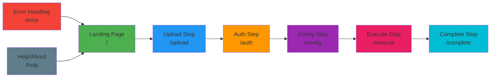
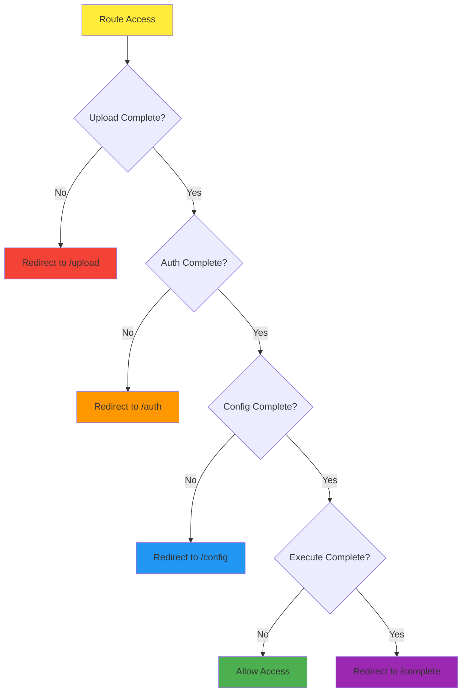

# Routing Architecture - Bluesky Migration Application

## 📚 **Navigation**
- **[← Back to Overview](ARCHITECTURE_OVERVIEW.md)**
- **[Core Architecture →](CORE_ARCHITECTURE.md)**
- **[Component Architecture →](COMPONENT_ARCHITECTURE.md)**

---

## 🎯 **Routing Architecture Overview**

The Bluesky Migration Application implements a **Route-Based Guided Workflow** with strict prerequisites and guards to ensure users complete each step in the correct order. This prevents skipping critical steps and ensures data integrity throughout the migration process.

### Step Layout and Route-Driven Navigation

We use a dedicated Step Layout component (`shared-step-layout`) that nests all step routes under a single layout outlet. The Step Layout renders the visual stepper (`shared-step-navigation`) and consumes route `data` to drive navigation controls:

- `data.prev`: Previous route path or `null`
- `data.next`: Next route path or `null`
- `data.description`: Human-readable description for step navigation tiles

Example:

```ts
{
  path: '',
  loadComponent: () => import('shared').then(m => m.StepLayoutComponent),
  children: [
    { path: 'upload',  loadComponent: () => import('shared').then(m => m.UploadStepComponent),  title: 'Upload Instagram Export',  data: { prev: null,        next: '/auth',    description: 'Upload your Instagram export ZIP file to begin migration' } },
    { path: 'auth',    loadComponent: () => import('shared').then(m => m.AuthStepComponent),    title: 'Bluesky Authentication', data: { prev: '/upload',   next: '/config',  description: 'Connect your Bluesky account with credentials' } },
    { path: 'config',  loadComponent: () => import('shared').then(m => m.ConfigStepComponent),  title: 'Migration Settings',      data: { prev: '/auth',    next: '/execute', description: 'Configure migration options and preferences' } },
    { path: 'execute', loadComponent: () => import('shared').then(m => m.ExecuteStepComponent), title: 'Execute Migration',       data: { prev: '/config',  next: '/complete',description: 'Run the migration process with your settings' } },
    { path: 'complete',loadComponent: () => import('shared').then(m => m.CompleteStepComponent),title: 'Migration Complete',      data: { prev: '/execute', next: null,       description: 'Review results and download migration report' } }
  ]
}
```

The `shared-step-navigation` reads the configured child routes to build the step list and determines current/completed/disabled states from the active URL. The Step Layout renders global Previous/Next actions based on the active child route's `data.prev`/`data.next`. A separate NavigationService is no longer required.

### Step Layout and Route-Driven Navigation

We use a dedicated Step Layout component (`shared-step-layout`) that nests all step routes under a single layout outlet. The Step Layout renders the visual stepper (`shared-step-navigation`) and consumes route `data` to drive navigation controls:

- `data.prev`: Previous route path or `null`
- `data.next`: Next route path or `null`
- `data.description`: Human-readable description for step navigation tiles

Example:

```ts
{
  path: '',
  loadComponent: () => import('shared').then(m => m.StepLayoutComponent),
  children: [
    { path: 'upload',  loadComponent: () => import('shared').then(m => m.UploadStepComponent),  title: 'Upload Instagram Export',  data: { prev: null,        next: '/auth',    description: 'Upload your Instagram export ZIP file to begin migration' } },
    { path: 'auth',    loadComponent: () => import('shared').then(m => m.AuthStepComponent),    title: 'Bluesky Authentication', data: { prev: '/upload',   next: '/config',  description: 'Connect your Bluesky account with credentials' } },
    { path: 'config',  loadComponent: () => import('shared').then(m => m.ConfigStepComponent),  title: 'Migration Settings',      data: { prev: '/auth',    next: '/execute', description: 'Configure migration options and preferences' } },
    { path: 'execute', loadComponent: () => import('shared').then(m => m.ExecuteStepComponent), title: 'Execute Migration',       data: { prev: '/config',  next: '/complete',description: 'Run the migration process with your settings' } },
    { path: 'complete',loadComponent: () => import('shared').then(m => m.CompleteStepComponent),title: 'Migration Complete',      data: { prev: '/execute', next: null,       description: 'Review results and download migration report' } }
  ]
}
```

The `shared-step-navigation` reads the configured child routes to build the step list and determines current/completed/disabled states from the active URL. The Step Layout renders global Previous/Next actions based on the active child route's `data.prev`/`data.next`. A separate NavigationService is no longer required.

### **Route Flow Structure**



---

## 🛣️ **Route Definitions & Prerequisites**

### **1. Landing Page (`/`)**
**Purpose**: Application entry point and overview
**Prerequisites**: None
**Access**: Public (no authentication required)
**Guards**: None

**Features**:
- Application overview and purpose
- Start migration button
- Help and documentation links
- App variant information (MVP/Web/Desktop)

**Navigation**:
- **Next**: `/upload` (Start migration)
- **Alternative**: `/help` (Documentation)

---

### **2. Upload Step (`/upload`)**
**Purpose**: Instagram export file upload and processing
**Prerequisites**: None (first step in workflow)
**Access**: Public (no authentication required)
**Guards**: None

**Required Data**:
- Instagram export ZIP file
- File validation and structure verification
- Archive extraction and processing

**Config Contribution**:
```typescript
interface UploadStepConfig {
  archiveFolder: string;        // Path to extracted archive
  fileSize: number;             // Total file size in bytes
  fileCount: number;            // Number of files processed
  validationResults: ValidationResult[];
  processingStatus: 'pending' | 'processing' | 'completed' | 'error';
}
```

**Navigation**:
- **Previous**: `/` (Landing page)
- **Next**: `/auth` (when files processed successfully)
- **Error**: `/error` (if file processing fails)

**Validation Rules**:
- File must be valid ZIP format
- Must contain Instagram export structure
- File size within acceptable limits
- Archive must extract successfully

---

### **3. Auth Step (`/auth`)**
**Purpose**: Bluesky authentication and credential collection
**Prerequisites**: 
- ✅ Files uploaded and processed (`/upload` completed)
- ✅ Valid archive folder in Config Service
**Access**: Requires upload completion
**Guards**: `UploadCompletionGuard`

**Required Data**:
- Bluesky username/handle
- Bluesky password/app password
- Connection test validation

**Config Contribution**:
```typescript
interface AuthStepConfig {
  blueskyUsername: string;      // Bluesky username/handle
  blueskyPassword: string;      // Bluesky password/app password
  isAuthenticated: boolean;     // Connection test result
  sessionToken?: string;        // Valid session token
  userInfo?: UserInfo;          // Authenticated user details
}
```

**Navigation**:
- **Previous**: `/upload` (Back to file upload)
- **Next**: `/config` (when authentication successful)
- **Error**: `/error` (if authentication fails)

**Validation Rules**:
- Username must be valid Bluesky handle format
- Password must not be empty
- Must successfully connect to Bluesky API
- Session must be valid and active

---

### **4. Config Step (`/config`)**
**Purpose**: Migration configuration and settings
**Prerequisites**:
- ✅ Files uploaded and processed (`/upload` completed)
- ✅ Bluesky authentication successful (`/auth` completed)
- ✅ Valid session token available
**Access**: Requires both upload and auth completion
**Guards**: `UploadCompletionGuard` + `AuthCompletionGuard`

**Required Data**:
- Date range filtering (minDate, maxDate)
- Test mode settings
- Simulation mode toggle
- Migration preferences

**Config Contribution**:
```typescript
interface ConfigStepConfig {
  minDate: Date;                // Start date for migration
  maxDate: Date;                // End date for migration
  testVideoMode: boolean;       // Test video processing
  testImageMode: boolean;       // Test image processing
  simulateMode: boolean;        // Simulation mode toggle
  batchSize: number;            // Posts per batch
  retryAttempts: number;        // Retry attempts on failure
}
```

**Navigation**:
- **Previous**: `/auth` (Back to authentication)
- **Next**: `/execute` (when configuration complete)
- **Error**: `/error` (if configuration validation fails)

**Validation Rules**:
- Date range must be valid (minDate < maxDate)
- Date range must not exceed archive data range
- At least one media mode must be enabled
- Batch size must be within acceptable limits

---

### **5. Execute Step (`/execute`)**
**Purpose**: Migration execution with real-time progress
**Prerequisites**:
- ✅ Files uploaded and processed (`/upload` completed)
- ✅ Bluesky authentication successful (`/auth` completed)
- ✅ Configuration complete (`/config` completed)
- ✅ Complete MigrationConfig available
**Access**: Requires all previous steps completion
**Guards**: `UploadCompletionGuard` + `AuthCompletionGuard` + `ConfigCompletionGuard`

**Required Data**:
- Complete MigrationConfig from all previous steps
- Real-time progress updates
- Error handling and recovery

**Config Usage**:
```typescript
interface CompleteMigrationConfig {
  // Upload Step
  archiveFolder: string;
  fileSize: number;
  fileCount: number;
  
  // Auth Step
  blueskyUsername: string;
  blueskyPassword: string;
  sessionToken: string;
  userInfo: UserInfo;
  
  // Config Step
  minDate: Date;
  maxDate: Date;
  testVideoMode: boolean;
  testImageMode: boolean;
  simulateMode: boolean;
  batchSize: number;
  retryAttempts: number;
}
```

**Navigation**:
- **Previous**: `/config` (Back to configuration)
- **Next**: `/complete` (when migration completes)
- **Error**: `/error` (if migration fails)

**Execution Flow**:
1. Validate complete configuration
2. Initialize migration tools
3. Execute External Data Processor (steps 1-6)
4. Execute External Migration Executor (step 7)
5. Provide real-time progress updates
6. Handle completion or errors

---

### **6. Complete Step (`/complete`)**
**Purpose**: Migration results and completion summary
**Prerequisites**:
- ✅ Migration execution completed (`/execute` completed)
- ✅ Results available from Progress Service
**Access**: Requires successful migration execution
**Guards**: `MigrationCompletionGuard`

**Displayed Data**:
- Migration statistics and results
- Created post URLs and verification
- Error summary (if any)
- Success/failure counts

**Navigation**:
- **Previous**: `/execute` (Back to execution)
- **Next**: `/` (Start new migration)
- **Alternative**: `/help` (Documentation)

**Features**:
- Migration summary and statistics
- Download results option
- Start new migration option
- Help and support links

---

### **7. Error Handling (`/error`)**
**Purpose**: Error display and recovery options
**Prerequisites**: Error occurred in any step
**Access**: Public (error recovery)
**Guards**: None

**Features**:
- Error details and context
- Recovery suggestions
- Return to previous step option
- Start over option
- Help and support links

**Navigation**:
- **Previous**: Return to step where error occurred
- **Next**: `/` (Start over)
- **Alternative**: `/help` (Documentation)

---

### **8. Help/About (`/help`)**
**Purpose**: Documentation and support
**Prerequisites**: None
**Access**: Public
**Guards**: None

**Features**:
- Application documentation
- Migration guide
- Troubleshooting
- Support information

**Navigation**:
- **Previous**: Return to previous page
- **Next**: `/` (Landing page)

---

## 🛡️ **Route Guards Architecture**

### **Guard Hierarchy & Dependencies**



### **Guard Implementation Strategy**

**Note**: Guards and resolvers are implemented as functions (not classes) in modern Angular, using the `inject()` function for dependency injection. This follows Angular's functional approach and provides better tree-shaking and performance.

#### **1. uploadCompletionGuard**
```typescript
// src/app/core/guards/upload-completion.guard.ts
import { inject } from '@angular/core';
import { CanActivateFn, Router } from '@angular/router';
import { ConfigService } from '../services/config.service';

export const uploadCompletionGuard: CanActivateFn = () => {
  const configService = inject(ConfigService);
  const router = inject(Router);
  
  const hasUploadData = configService.hasUploadData();
  
  if (!hasUploadData) {
    return router.createUrlTree(['/upload']);
  }
  
  return true;
};
```

#### **2. authCompletionGuard**
```typescript
// src/app/core/guards/auth-completion.guard.ts
import { inject } from '@angular/core';
import { CanActivateFn, Router } from '@angular/router';
import { ConfigService } from '../services/config.service';

export const authCompletionGuard: CanActivateFn = () => {
  const configService = inject(ConfigService);
  const router = inject(Router);
  
  const hasUploadData = configService.hasUploadData();
  const hasAuthData = configService.hasAuthData();
  
  if (!hasUploadData) {
    return router.createUrlTree(['/upload']);
  }
  
  if (!hasAuthData) {
    return router.createUrlTree(['/auth']);
  }
  
  return true;
};
```

#### **3. configCompletionGuard**
```typescript
// src/app/core/guards/config-completion.guard.ts
import { inject } from '@angular/core';
import { CanActivateFn, Router } from '@angular/router';
import { ConfigService } from '../services/config.service';

export const configCompletionGuard: CanActivateFn = () => {
  const configService = inject(ConfigService);
  const router = inject(Router);
  
  const hasUploadData = configService.hasUploadData();
  const hasAuthData = configService.hasAuthData();
  const hasConfigData = configService.hasConfigData();
  
  if (!hasUploadData) {
    return router.createUrlTree(['/upload']);
  }
  
  if (!hasAuthData) {
    return router.createUrlTree(['/auth']);
  }
  
  if (!hasConfigData) {
    return router.createUrlTree(['/config']);
  }
  
  return true;
};
```

#### **4. migrationCompletionGuard**
```typescript
// src/app/core/guards/migration-completion.guard.ts
import { inject } from '@angular/core';
import { CanActivateFn, Router } from '@angular/router';
import { ProgressService } from '../services/progress.service';

export const migrationCompletionGuard: CanActivateFn = () => {
  const progressService = inject(ProgressService);
  const router = inject(Router);
  
  const hasCompletedMigration = progressService.hasCompletedMigration();
  
  if (!hasCompletedMigration) {
    return router.createUrlTree(['/execute']);
  }
  
  return true;
};
```

---

## 🗂️ **Route Configuration Structure**

### **App Routes Configuration**

```typescript
// app.routes.ts
export const routes: Routes = [
  {
    path: '',
    component: LandingPageComponent,
    title: 'Bluesky Migration - Home'
  },
  {
    path: 'upload',
    component: UploadStepComponent,
    title: 'Upload Instagram Export',
    canActivate: []
  },
  {
    path: 'auth',
    component: AuthStepComponent,
    title: 'Bluesky Authentication',
    canActivate: [uploadCompletionGuard]
  },
  {
    path: 'config',
    component: ConfigStepComponent,
    title: 'Migration Configuration',
    canActivate: [uploadCompletionGuard, authCompletionGuard]
  },
  {
    path: 'execute',
    component: ExecuteStepComponent,
    title: 'Execute Migration',
    canActivate: [uploadCompletionGuard, authCompletionGuard, configCompletionGuard]
  },
  {
    path: 'complete',
    component: CompleteStepComponent,
    title: 'Migration Complete',
    canActivate: [migrationCompletionGuard]
  },
  {
    path: 'error',
    component: ErrorComponent,
    title: 'Error'
  },
  {
    path: 'help',
    component: HelpComponent,
    title: 'Help & Documentation'
  },
  {
    path: '**',
    redirectTo: '/'
  }
];
```

### **Route Data & Resolvers**

#### **Config Resolver**
```typescript
// src/app/core/resolvers/config.resolver.ts
import { inject } from '@angular/core';
import { ResolveFn } from '@angular/router';
import { ConfigService } from '../services/config.service';
import { MigrationConfig } from '../interfaces/migration-config.interface';

export const configResolver: ResolveFn<MigrationConfig> = () => {
  const configService = inject(ConfigService);
  return configService.getCompleteConfig();
};
```

#### **Progress Resolver**
```typescript
// src/app/core/resolvers/progress.resolver.ts
import { inject } from '@angular/core';
import { ResolveFn } from '@angular/router';
import { ProgressService } from '../services/progress.service';
import { MigrationProgress } from '../interfaces/migration-progress.interface';

export const progressResolver: ResolveFn<MigrationProgress> = () => {
  const progressService = inject(ProgressService);
  return progressService.getCurrentProgress();
};
```

---

## 🔄 **Navigation & State Management**

### **Navigation Service**

```typescript
@Injectable({
  providedIn: 'root'
})
export class NavigationService {
  constructor(
    private router: Router,
    private configService: ConfigService
  ) {}

  // Navigate to next step if prerequisites met
  navigateToNextStep(currentStep: string): void {
    const nextStep = this.getNextStep(currentStep);
    
    if (this.canNavigateToStep(nextStep)) {
      this.router.navigate([nextStep]);
    }
  }

  // Navigate to previous step
  navigateToPreviousStep(currentStep: string): void {
    const previousStep = this.getPreviousStep(currentStep);
    this.router.navigate([previousStep]);
  }

  // Check if user can navigate to specific step
  canNavigateToStep(step: string): boolean {
    switch (step) {
      case 'upload':
        return true;
      case 'auth':
        return this.configService.hasUploadData();
      case 'config':
        return this.configService.hasUploadData() && this.configService.hasAuthData();
      case 'execute':
        return this.configService.hasCompleteConfig();
      case 'complete':
        return this.configService.hasMigrationResults();
      default:
        return false;
    }
  }

  private getNextStep(currentStep: string): string {
    const stepOrder = ['upload', 'auth', 'config', 'execute', 'complete'];
    const currentIndex = stepOrder.indexOf(currentStep);
    return stepOrder[currentIndex + 1] || 'complete';
  }

  private getPreviousStep(currentStep: string): string {
    const stepOrder = ['upload', 'auth', 'config', 'execute', 'complete'];
    const currentIndex = stepOrder.indexOf(currentStep);
    return stepOrder[currentIndex - 1] || 'upload';
  }
}
```

### **Step Validation Service**

```typescript
@Injectable({
  providedIn: 'root'
})
export class StepValidationService {
  constructor(private configService: ConfigService) {}

  // Validate current step completion
  validateStepCompletion(step: string): ValidationResult {
    switch (step) {
      case 'upload':
        return this.validateUploadStep();
      case 'auth':
        return this.validateAuthStep();
      case 'config':
        return this.validateConfigStep();
      case 'execute':
        return this.validateExecuteStep();
      case 'complete':
        return this.validateCompleteStep();
      default:
        return { isValid: false, errors: ['Unknown step'] };
    }
  }

  private validateUploadStep(): ValidationResult {
    const hasUploadData = this.configService.hasUploadData();
    const hasValidArchive = this.configService.hasValidArchive();
    
    if (!hasUploadData) {
      return { isValid: false, errors: ['No files uploaded'] };
    }
    
    if (!hasValidArchive) {
      return { isValid: false, errors: ['Invalid archive structure'] };
    }
    
    return { isValid: true, errors: [] };
  }

  private validateAuthStep(): ValidationResult {
    const hasUploadData = this.configService.hasUploadData();
    const hasAuthData = this.configService.hasAuthData();
    const isAuthenticated = this.configService.isAuthenticated();
    
    if (!hasUploadData) {
      return { isValid: false, errors: ['Upload step not completed'] };
    }
    
    if (!hasAuthData) {
      return { isValid: false, errors: ['Authentication not completed'] };
    }
    
    if (!isAuthenticated) {
      return { isValid: false, errors: ['Authentication failed'] };
    }
    
    return { isValid: true, errors: [] };
  }

  private validateConfigStep(): ValidationResult {
    const hasUploadData = this.configService.hasUploadData();
    const hasAuthData = this.configService.hasAuthData();
    const hasConfigData = this.configService.hasConfigData();
    
    if (!hasUploadData) {
      return { isValid: false, errors: ['Upload step not completed'] };
    }
    
    if (!hasAuthData) {
      return { isValid: false, errors: ['Authentication not completed'] };
    }
    
    if (!hasConfigData) {
      return { isValid: false, errors: ['Configuration not completed'] };
    }
    
    return { isValid: true, errors: [] };
  }

  private validateExecuteStep(): ValidationResult {
    const hasCompleteConfig = this.configService.hasCompleteConfig();
    
    if (!hasCompleteConfig) {
      return { isValid: false, errors: ['Configuration incomplete'] };
    }
    
    return { isValid: true, errors: [] };
  }

  private validateCompleteStep(): ValidationResult {
    const hasMigrationResults = this.configService.hasMigrationResults();
    
    if (!hasMigrationResults) {
      return { isValid: false, errors: ['No migration results available'] };
    }
    
    return { isValid: true, errors: [] };
  }
}
```

---

## 🎨 **Component Integration Strategy**

### **Step Component Base Class**

```typescript
export abstract class BaseStepComponent {
  @Input() stepName: string = '';
  
  protected abstract canProceed(): boolean;
  protected abstract canGoBack(): boolean;
  protected abstract getStepData(): any;
  
  protected proceedToNext(): void {
    if (this.canProceed()) {
      this.navigationService.navigateToNextStep(this.stepName);
    }
  }
  
  protected goBack(): void {
    if (this.canGoBack()) {
      this.navigationService.navigateToPreviousStep(this.stepName);
    }
  }
  
  protected validateStep(): ValidationResult {
    return this.stepValidationService.validateStepCompletion(this.stepName);
  }
}
```

### **Step Header Component**

```typescript
@Component({
  selector: 'app-step-header',
  template: `
    <div class="step-header">
      <div class="step-indicator">
        <div *ngFor="let step of steps; let i = index" 
             class="step-item"
             [class.active]="step.path === currentStep"
             [class.completed]="step.completed">
          <span class="step-number">{{ i + 1 }}</span>
          <span class="step-title">{{ step.title }}</span>
        </div>
      </div>
    </div>
  `
})
export class StepHeaderComponent {
  @Input() currentStep: string = '';
  
  steps = [
    { path: 'upload', title: 'Upload', completed: false },
    { path: 'auth', title: 'Authenticate', completed: false },
    { path: 'config', title: 'Configure', completed: false },
    { path: 'execute', title: 'Execute', completed: false },
    { path: 'complete', title: 'Complete', completed: false }
  ];
  
  ngOnInit() {
    this.updateStepCompletion();
  }
  
  private updateStepCompletion() {
    // Update completion status based on Config Service state
  }
}
```

---

## 🔗 **Related Documentation**

- **[Core Architecture](CORE_ARCHITECTURE.md)** - Core principles and workflow
- **[Component Architecture](COMPONENT_ARCHITECTURE.md)** - Component design and relationships
- **[Service Architecture](SERVICE_ARCHITECTURE.md)** - Service layer implementation
- **[Testing Architecture](TESTING_ARCHITECTURE.md)** - Testing strategy and BDD methodology

---

## 📋 **Implementation Checklist**

### **Phase 1: Core Routing Structure**
- [ ] Define route configuration
- [ ] Implement base guards
- [ ] Create navigation service
- [ ] Set up step validation service

### **Phase 2: Step Components**
- [ ] Create base step component
- [ ] Implement step header component
- [ ] Build individual step components
- [ ] Add step navigation controls

### **Phase 3: Integration & Testing**
- [ ] Integrate with Config Service
- [ ] Add route guards to components
- [ ] Implement BDD tests for routing
- [ ] Test navigation flows

### **Phase 4: Enhancement**
- [ ] Add route resolvers
- [ ] Implement deep linking
- [ ] Add route animations
- [ ] Optimize navigation performance

---

*This routing architecture provides a solid foundation for the guided workflow, ensuring users complete each step in the correct order while maintaining flexibility for navigation and error recovery.*