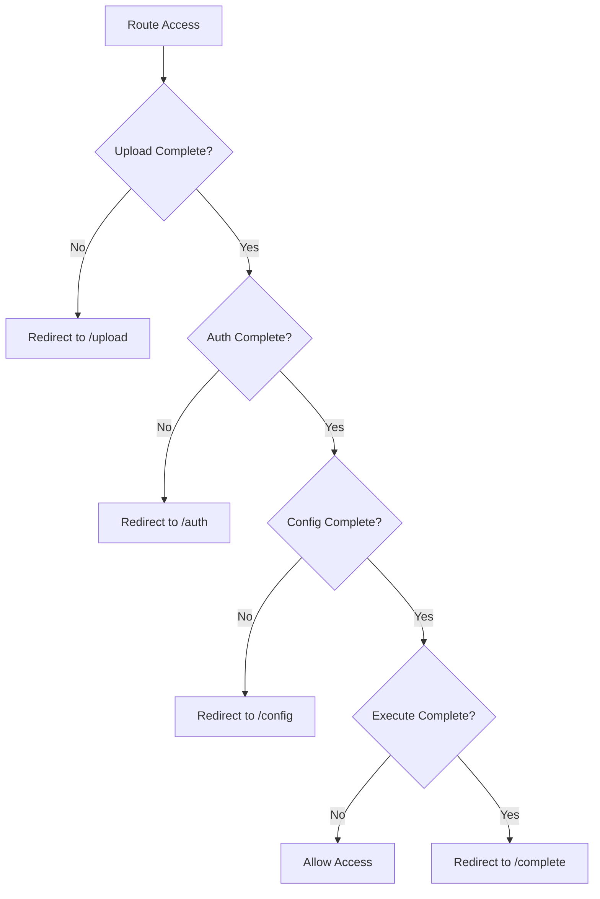

# Routing Architecture Summary - Bluesky Migration Application

## 📚 **Quick Navigation**
- **[Architecture Overview](ARCHITECTURE_OVERVIEW.md)** - Main architecture guide
- **[Routing Architecture](ROUTING_ARCHITECTURE.md)** - Detailed routing design
- **[Implementation Plan](ROUTING_IMPLEMENTATION_PLAN.md)** - Step-by-step implementation

---

## 🎯 **What We've Planned**

### **Route Flow & Prerequisites**
```
Landing (/) → Upload (/upload) → Auth (/auth) → Config (/config) → Execute (/execute) → Complete (/complete)
     ↓              ↓              ↓              ↓              ↓              ↓
   No Reqs      No Reqs      Upload Done    Auth Done     All Done     Migration Done
```

### **Route Guards & Access Control**
- **`/upload`** - No guards (entry point)
- **`/auth`** - `uploadCompletionGuard` (requires files uploaded)
- **`/config`** - `uploadCompletionGuard` + `authCompletionGuard` (requires auth)
- **`/execute`** - All previous guards (requires complete config)
- **`/complete`** - `migrationCompletionGuard` (requires migration results)

---

## 🏗️ **Architecture Components**

### **1. Route Guards (4 guards)**
- **`uploadCompletionGuard`** - Checks if files are uploaded and processed
- **`authCompletionGuard`** - Checks if Bluesky authentication is complete
- **`configCompletionGuard`** - Checks if migration configuration is complete
- **`migrationCompletionGuard`** - Checks if migration execution is complete

### **2. Step Layout & Validation**
- **`shared-step-layout`** - Central layout providing stepper UI and Prev/Next via route data
- **`StepValidationService`** - Validates step completion requirements (future)

### **3. Base Components (2 components)**
- **`BaseStepComponent`** - Abstract base class for all step components
- **`StepHeaderComponent`** - Visual step indicator and progress tracker

### **4. Route Configuration**
- **8 main routes** with proper guards and titles
- **Error handling** routes for recovery
- **Help/documentation** routes for user support

---

## 🔄 **Data Flow Architecture**

### **Config-First Data Collection**
```
Upload Step → Config Service (archiveFolder, fileSize, fileCount)
    ↓
Auth Step → Config Service (blueskyUsername, blueskyPassword, sessionToken)
    ↓
Config Step → Config Service (minDate, maxDate, testModes, batchSize)
    ↓
Execute Step → Uses Complete MigrationConfig from Config Service
    ↓
Complete Step → Displays results from Progress Service
```

### **Service State Management**
- **`ConfigService`** - Central configuration hub (mirrors CLI's AppConfig)
- **`ProgressService`** - Migration execution progress and results
- **Each service** manages its own domain-specific state
- **No centralized state synchronization** - distributed state management

---

## 🛡️ **Guard Logic & Dependencies**

### **Guard Hierarchy**


### **Guard Dependencies**
- **`authCompletionGuard`** depends on `uploadCompletionGuard`
- **`configCompletionGuard`** depends on both upload and auth guards
- **`migrationCompletionGuard`** depends on progress service state

---

## 🎨 **Component Design Patterns**

### **BaseStepComponent Pattern**
```typescript
export abstract class BaseStepComponent {
  protected abstract canProceed(): boolean;
  protected abstract canGoBack(): boolean;
  protected abstract getStepData(): any;
  
  protected proceedToNext(): void { /* Navigation logic */ }
  protected goBack(): void { /* Back navigation logic */ }
  protected validateStep(): ValidationResult { /* Step validation */ }
}
```

### **Step Component Structure**
```typescript
@Component({...})
export class UploadStepComponent extends BaseStepComponent {
  protected canProceed(): boolean {
    return this.hasValidFiles() && this.filesProcessed();
  }
  
  protected canGoBack(): boolean {
    return true; // Can always go back to landing
  }
  
  protected getStepData(): UploadStepConfig {
    return { archiveFolder: this.archivePath, ... };
  }
}
```

---

## 📁 **File Structure Plan**

### **Core Services & Guards**
```
src/app/core/
├── guards/
│   ├── upload-completion.guard.ts
│   ├── auth-completion.guard.ts
│   ├── config-completion.guard.ts
│   ├── migration-completion.guard.ts
│   └── index.ts
└── services/
    ├── navigation.service.ts
    ├── step-validation.service.ts
    └── index.ts
```

### **Shared Components**
```
src/app/shared/components/
├── base-step/
│   ├── base-step.component.ts
│   ├── base-step.component.html
│   └── base-step.component.scss
├── step-header/
│   ├── step-header.component.ts
│   ├── step-header.component.html
│   └── step-header.component.scss
└── index.ts
```

### **Step Components**
```
src/app/features/migration/steps/
├── upload-step/
├── auth-step/
├── config-step/
├── execute-step/
├── complete-step/
└── index.ts
```

---

## 🚀 **Implementation Phases**

### **Phase 1: Core Foundation (Week 1)**
- [ ] Create core services directory structure
- [ ] Implement `NavigationService` and `StepValidationService`
- [ ] Create route guards with basic logic
- [ ] Set up route configuration

### **Phase 2: Base Components (Week 2)**
- [ ] Implement `BaseStepComponent` abstract class
- [ ] Create `StepHeaderComponent` with step indicators
- [ ] Set up shared component module exports
- [ ] Add navigation controls and validation

### **Phase 3: Step Components (Week 3)**
- [ ] Create individual step component directories
- [ ] Extend `BaseStepComponent` for each step
- [ ] Implement step-specific logic and forms
- [ ] Add step navigation and validation

### **Phase 4: Testing & Integration (Week 4)**
- [ ] Write BDD tests for routing flows
- [ ] Test guard behavior and navigation
- [ ] Integrate with existing services
- [ ] Performance testing and optimization

---

## 🧪 **Testing Strategy**

### **BDD Test Categories**
1. **Route Access Control** - Test guard behavior
2. **Navigation Flows** - Test step-to-step navigation
3. **Step Validation** - Test step completion requirements
4. **Error Scenarios** - Test error handling and recovery

### **Test Examples**
```typescript
describe('Feature: Migration Workflow Navigation', () => {
  describe('Scenario: User completes upload step', () => {
    it('Given user has uploaded files, When navigating to auth, Then access is granted', () => {
      // BDD implementation
    });
  });
  
  describe('Scenario: User skips upload step', () => {
    it('Given user has not uploaded files, When navigating to auth, Then redirect to upload', () => {
      // BDD implementation
    });
  });
});
```

---

## 🔗 **Integration Points**

### **With Existing Services**
- **`ConfigService`** - For step completion validation
- **`ProgressService`** - For migration completion status
- **`BlueskyService`** - For authentication state
- **`InstagramService`** - For file processing status

### **With App Configuration**
- **Environment-based service selection** (MVP vs Real)
- **Service provider configuration** in `app.config.ts`
- **Route guard registration** in route configuration

---

## 📋 **Key Benefits**

### **1. User Experience**
- **Guided workflow** prevents skipping critical steps
- **Clear progress indication** shows current position
- **Error recovery** provides helpful guidance
- **Consistent navigation** across all steps

### **2. Developer Experience**
- **Reusable base components** reduce duplication
- **Clear separation of concerns** in guards and services
- **Easy testing** with isolated components
- **Maintainable architecture** with clear dependencies

### **3. System Reliability**
- **Data integrity** ensured by step prerequisites
- **State validation** at each navigation point
- **Error handling** with recovery options
- **Consistent behavior** across app variants

---

## 🎯 **Next Steps**

### **Immediate Actions**
1. **Review the routing architecture** to ensure it meets requirements
2. **Validate the guard logic** against business rules
3. **Confirm component design patterns** align with team standards
4. **Plan implementation timeline** based on team capacity

### **Before Implementation**
1. **Set up project structure** for core services and guards
2. **Create interfaces** for validation and navigation
3. **Plan testing strategy** for BDD testing
4. **Coordinate with existing services** for integration

---

## 🔗 **Related Documentation**

- **[Routing Architecture](ROUTING_ARCHITECTURE.md)** - Complete routing design and implementation details
- **[Implementation Plan](ROUTING_IMPLEMENTATION_PLAN.md)** - Step-by-step implementation guide
- **[Core Architecture](CORE_ARCHITECTURE.md)** - Core principles and workflow design
- **[Component Architecture](COMPONENT_ARCHITECTURE.md)** - Component design patterns and relationships

---

*This routing architecture provides a solid foundation for the guided workflow, ensuring users complete each step in the correct order while maintaining flexibility for navigation and error recovery. The implementation plan provides a clear roadmap for building this system efficiently.*
