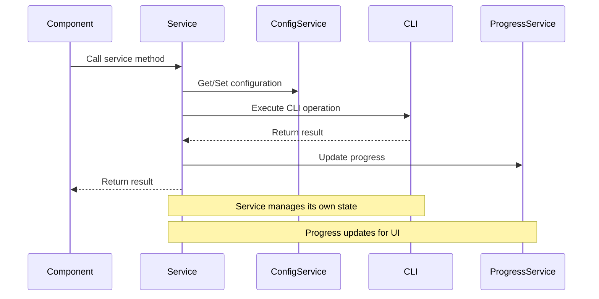
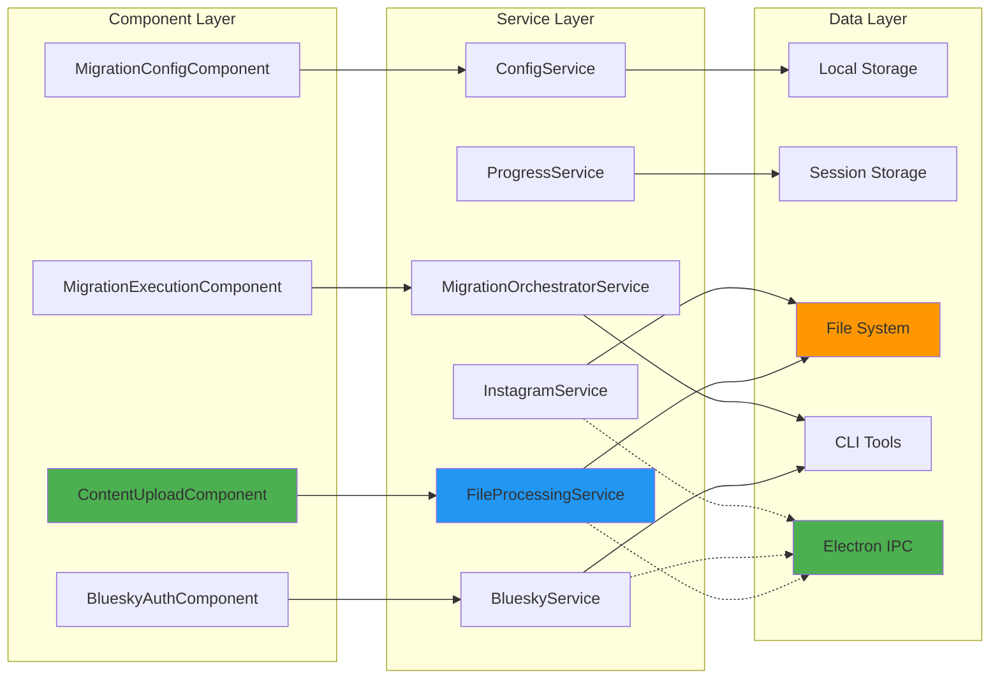

# Service Architecture - Bluesky Migration Application

## 📚 **Navigation**
- **[← Back to Overview](ARCHITECTURE_OVERVIEW.md)**
- **[Core Architecture →](CORE_ARCHITECTURE.md)**
- **[Multi-App Architecture →](MULTI_APP_ARCHITECTURE.md)**

---

## 🎯 **Service Layer Overview**

The service layer provides the business logic and data management for the Bluesky Migration Application. Services are designed with clear interfaces and multiple implementations to support different app variants (MVP, Web, Desktop).

---

## 🏗️ **Service Architecture Pattern**

### **Service Interface Contracts**
All services implement the same interfaces regardless of variant:

```mermaid
classDiagram
    class FileProcessingService {
        <<interface>>
        +processFiles(files: File[] | string[]): Promise~FileProcessingResult~
        +validateArchive(path: string): Promise~ValidationResult~
        +extractArchive(archivePath: string): Promise~ExtractionResult~
        +getFileStats(path: string): Promise~FileStats~
    }
    
    class BlueskyService {
        <<interface>>
        +authenticate(credentials: Credentials): Promise~AuthResult~
        +createPost(post: PostData): Promise~PostResult~
        +testConnection(): Promise~ConnectionResult~
        +getAccountInfo(): Promise~AccountInfo~
    }
    
    class InstagramService {
        <<interface>>
        +processInstagramData(path: string): Promise~ProcessingResult~
        +validateExportStructure(path: string): Promise~ValidationResult~
        +extractMediaFiles(path: string): Promise~MediaFile[]~
    }
    
    class ProgressService {
        <<interface>>
        +startMigration(config: MigrationConfig): void
        +updateProgress(progress: ProgressUpdate): void
        +getCurrentStatus(): MigrationStatus
        +getMigrationHistory(): MigrationHistory[]
    }
    
    class ConfigService {
        <<interface>>
        +setArchiveFolder(path: string): void
        +setBlueskyCredentials(credentials: Credentials): void
        +setMigrationSettings(settings: MigrationSettings): void
        +getCompleteConfig(): MigrationConfig
        +validateConfig(): ValidationResult
    }
    
    class MigrationOrchestratorService {
        <<interface>>
        +executeMigration(config: MigrationConfig): Promise~MigrationResult~
        +getCapabilities(): MigrationCapabilities
        +validateRequirements(): RequirementValidation
    }
```



### **Service Implementation Hierarchy**

```mermaid
graph TB
    subgraph "Service Interfaces (Contracts)"
        A[FileProcessingService]
        B[BlueskyService]
        C[InstagramService]
        D[ProgressService]
        E[ConfigService]
        F[MigrationOrchestratorService]
    end
    
    subgraph "MVP Implementations (Simulation)"
        G[MvpFileProcessingService]
        H[MvpBlueskyService]
        I[MvpInstagramService]
        J[MvpProgressService]
        K[MvpConfigService]
        L[MvpMigrationOrchestratorService]
    end
    
    subgraph "Web Implementations (CLI Bridge)"
        M[WebFileProcessingService]
        N[WebBlueskyService]
        O[WebInstagramService]
        P[WebProgressService]
        Q[WebConfigService]
        R[WebMigrationOrchestratorService]
    end
    
    subgraph "Desktop Implementations (Electron IPC)"
        S[DesktopFileProcessingService]
        T[DesktopBlueskyService]
        U[DesktopInstagramService]
        V[DesktopProgressService]
        W[DesktopConfigService]
        X[DesktopMigrationOrchestratorService]
    end
    
    A --> G
    A --> M
    A --> S
    
    B --> H
    B --> N
    B --> T
    
    C --> I
    C --> O
    C --> U
    
    D --> J
    D --> P
    D --> V
    
    E --> K
    E --> Q
    E --> W
    
    F --> L
    F --> R
    F --> X
    
    style A fill:#ff9800
    style G fill:#ffcdd2
    style M fill:#c8e6c9
    style S fill:#4caf50
```


---

## 🔧 **Core Service Implementations**

### **1. ConfigService (Central Configuration Hub)**
**Purpose**: Mirrors CLI's `AppConfig` structure for Angular context

**Key Responsibilities**:
- Collect configuration from all steps
- Validate configuration like CLI's `config.validate()`
- Single source of truth for migration configuration
- Provide complete `MigrationConfig` object to migration orchestrator

**Implementation**:
```typescript
@Injectable({
  providedIn: 'root'
})
export class ConfigService {
  private config: Partial<MigrationConfig> = {};
  
  setArchiveFolder(path: string): void {
    this.config.archiveFolder = path;
  }
  
  setBlueskyCredentials(credentials: Credentials): void {
    this.config.blueskyUsername = credentials.username;
    this.config.blueskyPassword = credentials.password;
  }
  
  setMigrationSettings(settings: MigrationSettings): void {
    this.config = { ...this.config, ...settings };
  }
  
  getCompleteConfig(): MigrationConfig {
    return this.config as MigrationConfig;
  }
  
  validateConfig(): ValidationResult {
    // Mirror CLI's AppConfig.validate() logic
    const errors: string[] = [];
    
    if (!this.config.archiveFolder) {
      errors.push('Archive folder is required');
    }
    
    if (!this.config.blueskyUsername || !this.config.blueskyPassword) {
      errors.push('Bluesky credentials are required');
    }
    
    return {
      isValid: errors.length === 0,
      errors
    };
  }
}
```

### **2. FileProcessingService (Archive & ZIP Handling)**
**Purpose**: Environment-aware file processing that automatically selects the best available method

**Key Methods**:
```typescript
interface FileProcessingService {
  // Environment detection
  isElectronEnvironment(): boolean;
  
  // Electron-specific methods (only available in Electron)
  validateArchiveByPath(filePath: string): Promise<ArchiveValidationResult>;
  extractArchiveByPath(filePath: string): Promise<ArchiveExtractionResult>;
  
  // Browser-compatible methods (always available)
  validateArchive(file: File): Promise<ArchiveValidationResult>;
  extractArchive(file: File): Promise<ArchiveExtractionResult>;
}
```

**Environment Detection Logic**:
```typescript
private detectElectronEnvironment(): void {
  try {
    if (typeof window !== 'undefined' && (window as any).electronAPI) {
      this.electronFileAPI = { /* IPC methods */ };
      console.log('✅ Electron file API detected and available');
    } else {
      console.log('ℹ️ Running in browser mode, using JSZip fallback');
    }
  } catch (error) {
    console.warn('⚠️ Electron detection failed, running in browser mode');
  }
}
```

### **3. InstagramService (Thin CLI Wrapper)**
**Purpose**: Thin Angular wrapper around CLI extensions for Instagram processing

**Key Responsibilities**:
- Basic file validation
- CLI extension integration
- Progress hooks
- Delegation to CLI extensions and FileProcessingService

**Implementation**:
```typescript
@Injectable({
  providedIn: 'root'
})
export class InstagramServiceImpl implements InstagramService {
  constructor(
    private fileProcessingService: FileProcessingService,
    private configService: ConfigService
  ) {}
  
  async processInstagramData(path: string): Promise<ProcessingResult> {
    try {
      // Validate export structure
      const validation = await this.validateExportStructure(path);
      if (!validation.isValid) {
        return { success: false, errors: validation.errors };
      }
      
      // Store path in config service
      this.configService.setArchiveFolder(path);
      
      return { success: true, path };
    } catch (error) {
      return { success: false, errors: [error.message] };
    }
  }
  
  async validateExportStructure(path: string): Promise<ValidationResult> {
    // Use CLI extension for validation
    const cliValidator = new ExternalDataProcessor();
    return await cliValidator.validateInstagramExport(path);
  }
}
```

### **4. BlueskyService (CLI Authentication Wrapper)**
**Purpose**: Thin Angular wrapper around CLI extensions for Bluesky API operations

**Key Responsibilities**:
- Real Bluesky authentication
- Post creation
- Connection testing
- CLI extension integration

**Implementation**:
```typescript
@Injectable({
  providedIn: 'root'
})
export class BlueskyServiceImpl implements BlueskyService {
  constructor(
    private configService: ConfigService
  ) {}
  
  async authenticate(credentials: Credentials): Promise<AuthResult> {
    try {
      // Store credentials in config service
      this.configService.setBlueskyCredentials(credentials);
      
      // Test connection using CLI extension
      const blueskyClient = new ExternalMigrationExecutor();
      const connection = await blueskyClient.testBlueskyConnection(credentials);
      
      if (connection.success) {
        return { success: true, userInfo: connection.userInfo };
      } else {
        return { success: false, error: connection.error };
      }
    } catch (error) {
      return { success: false, error: error.message };
    }
  }
  
  async testConnection(): Promise<ConnectionResult> {
    const config = this.configService.getCompleteConfig();
    if (!config.blueskyUsername || !config.blueskyPassword) {
      return { success: false, error: 'Credentials not configured' };
    }
    
    return await this.authenticate({
      username: config.blueskyUsername,
      password: config.blueskyPassword
    });
  }
}
```

### **5. ProgressService (Real-time Migration Tracking)**
**Purpose**: Real-time progress tracking with CLI extension integration

**Key Responsibilities**:
- Progress callbacks
- Performance metrics
- Migration history
- CLI progress integration

**Implementation**:
```typescript
@Injectable({
  providedIn: 'root'
})
export class ProgressServiceImpl implements ProgressService {
  private currentMigration: MigrationProgress | null = null;
  private migrationHistory: MigrationHistory[] = [];
  
  startMigration(config: MigrationConfig): void {
    this.currentMigration = {
      id: this.generateMigrationId(),
      startTime: new Date(),
      status: 'running',
      config,
      progress: 0,
      currentStep: 'initializing'
    };
  }
  
  updateProgress(progress: ProgressUpdate): void {
    if (this.currentMigration) {
      this.currentMigration.progress = progress.percentage;
      this.currentMigration.currentStep = progress.step;
      this.currentMigration.lastUpdate = new Date();
      
      // Emit progress update for UI
      this.progressSubject.next(this.currentMigration);
    }
  }
  
  getCurrentStatus(): MigrationStatus {
    return this.currentMigration?.status || 'idle';
  }
  
  getMigrationHistory(): MigrationHistory[] {
    return [...this.migrationHistory];
  }
}
```

### **6. MigrationOrchestratorService (CLI Integration Hub)**
**Purpose**: Central bridge between Angular services and CLI migration tools

**Key Responsibilities**:
- CLI extension loading
- Progress callback integration
- Error handling
- Configuration transformation

**Implementation**:
```typescript
@Injectable({
  providedIn: 'root'
})
export class MigrationOrchestratorService implements MigrationOrchestratorService {
  constructor(
    private configService: ConfigService,
    private progressService: ProgressService
  ) {}
  
  async executeMigration(config: MigrationConfig): Promise<MigrationResult> {
    try {
      // Start progress tracking
      this.progressService.startMigration(config);
      
      // Create CLI orchestrator with progress hooks
      const orchestrator = new ExternalMigrationOrchestrator(config, {
        onProgress: (cliProgress: any) => {
          // Convert CLI progress to Angular format
          const angularProgress = this.convertCliProgressToAngular(cliProgress);
          this.progressService.updateProgress(angularProgress);
        }
      });
      
      // Execute migration
      const result = await orchestrator.executeCompleteMigration();
      
      // Update progress service
      this.progressService.completeMigration(result);
      
      return result;
    } catch (error) {
      this.progressService.failMigration(error);
      throw error;
    }
  }
  
  private convertCliProgressToAngular(cliProgress: any): ProgressUpdate {
    // Convert CLI progress format to Angular format
    return {
      percentage: cliProgress.percentage || 0,
      step: cliProgress.step || 'unknown',
      message: cliProgress.message || '',
      timestamp: new Date()
    };
  }
}
```

---

## 🔄 **Service Communication Flow**

### **Service Interaction Pattern**


### **Data Flow Between Services**


---

## 🏭 **Service Factory Pattern**

### **Service Factory Implementation**
```typescript
@Injectable({
  providedIn: 'root'
})
export class ServiceFactory {
  static createFileProcessingService(appType: AppType): FileProcessingService {
    switch (appType) {
      case 'mvp':
        return new MvpFileProcessingService();
      case 'web':
        return new WebFileProcessingService();
      case 'desktop':
        return new DesktopFileProcessingService();
      default:
        throw new Error(`Unknown app type: ${appType}`);
    }
  }
  
  static createBlueskyService(appType: AppType): BlueskyService {
    switch (appType) {
      case 'mvp':
        return new MvpBlueskyService();
      case 'web':
        return new WebBlueskyService();
      case 'desktop':
        return new DesktopBlueskyService();
      default:
        throw new Error(`Unknown app type: ${appType}`);
    }
  }
  
  static createInstagramService(appType: AppType): InstagramService {
    switch (appType) {
      case 'mvp':
        return new MvpInstagramService();
      case 'web':
        return new WebInstagramService();
      case 'desktop':
        return new DesktopInstagramService();
      default:
        throw new Error(`Unknown app type: ${appType}`);
    }
  }
  
  static createProgressService(appType: AppType): ProgressService {
    switch (appType) {
      case 'mvp':
        return new MvpProgressService();
      case 'web':
        return new WebProgressService();
      case 'desktop':
        return new DesktopProgressService();
      default:
        throw new Error(`Unknown app type: ${appType}`);
    }
  }
  
  static createMigrationOrchestrator(appType: AppType): MigrationOrchestratorService {
    switch (appType) {
      case 'mvp':
        return new MvpMigrationOrchestratorService();
      case 'web':
        return new WebMigrationOrchestratorService();
      case 'desktop':
        return new DesktopMigrationOrchestratorService();
      default:
        throw new Error(`Unknown app type: ${appType}`);
    }
  }
}
```

### **Dependency Injection Configuration**
```typescript
// App configuration with service factory
export const appConfig: ApplicationConfig = {
  providers: [
    {
      provide: APP_TYPE,
      useValue: environment.appType
    },
    {
      provide: FILE_PROCESSING_SERVICE,
      useFactory: () => ServiceFactory.createFileProcessingService(environment.appType)
    },
    {
      provide: BLUESKY_SERVICE,
      useFactory: () => ServiceFactory.createBlueskyService(environment.appType)
    },
    {
      provide: INSTAGRAM_SERVICE,
      useFactory: () => ServiceFactory.createInstagramService(environment.appType)
    },
    {
      provide: PROGRESS_SERVICE,
      useFactory: () => ServiceFactory.createProgressService(environment.appType)
    },
    {
      provide: MIGRATION_ORCHESTRATOR,
      useFactory: () => ServiceFactory.createMigrationOrchestrator(environment.appType)
    }
  ]
};
```

---

## 🧪 **Service Testing Strategy**

### **MVP Service Testing**
```typescript
describe('MvpFileProcessingService', () => {
  let service: MvpFileProcessingService;
  
  beforeEach(() => {
    service = new MvpFileProcessingService();
  });
  
  it('should generate mock validation results', async () => {
    const files = [new File([''], 'test.zip')];
    const result = await service.processFiles(files);
    
    expect(result.success).toBe(true);
    expect(result.extractedPath).toBe('/mock/extracted/path');
    expect(result.validationResults).toHaveLength(2);
  });
});
```

### **Web Service Testing**
```typescript
describe('WebFileProcessingService', () => {
  let service: WebFileProcessingService;
  let mockCliBridgeService: jasmine.SpyObj<CliBridgeService>;
  
  beforeEach(() => {
    mockCliBridgeService = jasmine.createSpyObj('CliBridgeService', [
      'validateArchive', 'extractArchive'
    ]);
    service = new WebFileProcessingService(mockCliBridgeService);
  });
  
  it('should use JSZip for file extraction', async () => {
    const files = [new File([''], 'test.zip')];
    mockCliBridgeService.validateArchive.and.returnValue(
      Promise.resolve({ isValid: true, results: [] })
    );
    
    const result = await service.processFiles(files);
    
    expect(result.success).toBe(true);
    expect(mockCliBridgeService.validateArchive).toHaveBeenCalled();
  });
});
```

### **Desktop Service Testing**
```typescript
describe('DesktopFileProcessingService', () => {
  let service: DesktopFileProcessingService;
  let mockElectronService: jasmine.SpyObj<ElectronService>;
  
  beforeEach(() => {
    mockElectronService = jasmine.createSpyObj('ElectronService', [
      'selectArchive', 'extractArchive', 'validateWithCLI'
    ]);
    service = new DesktopFileProcessingService(mockElectronService);
  });
  
  it('should use Electron IPC for file operations', async () => {
    mockElectronService.selectArchive.and.returnValue(
      Promise.resolve('/path/to/archive.zip')
    );
    mockElectronService.extractArchive.and.returnValue(
      Promise.resolve('/extracted/path')
    );
    mockElectronService.validateWithCLI.and.returnValue(
      Promise.resolve({ isValid: true, fileCount: 100 })
    );
    
    const files = [new File([''], 'test.zip')];
    const result = await service.processFiles(files);
    
    expect(result.success).toBe(true);
    expect(mockElectronService.selectArchive).toHaveBeenCalled();
    expect(mockElectronService.extractArchive).toHaveBeenCalled();
  });
});
```

---

## 🔗 **Related Documentation**

- **[Core Architecture](CORE_ARCHITECTURE.md)** - Fundamental principles and workflow
- **[Multi-App Architecture](MULTI_APP_ARCHITECTURE.md)** - App variant architecture
- **[Component Architecture](COMPONENT_ARCHITECTURE.md)** - Component design and relationships
- **[Testing Architecture](TESTING_ARCHITECTURE.md)** - Testing strategy and BDD methodology

---

*This service architecture provides a clean, maintainable foundation for the business logic layer, with clear interfaces and multiple implementations to support different app variants.*
