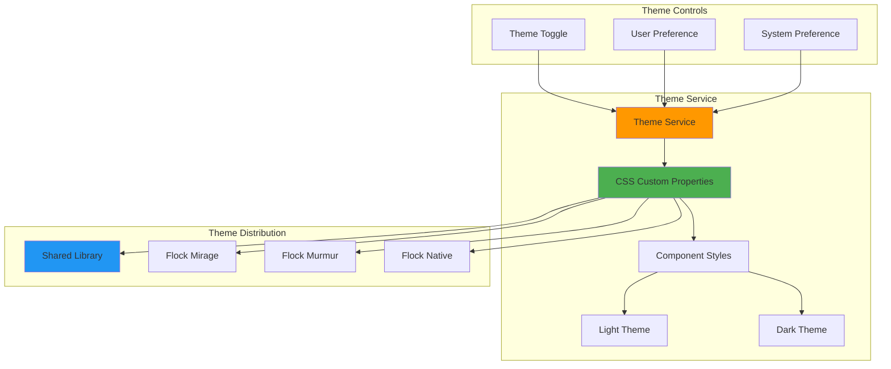
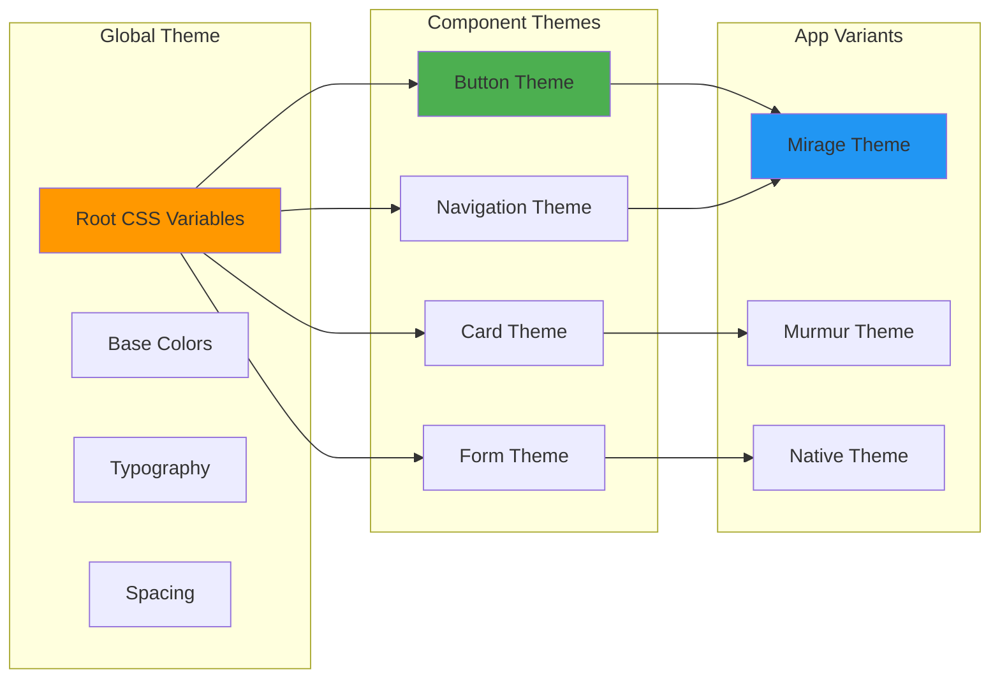
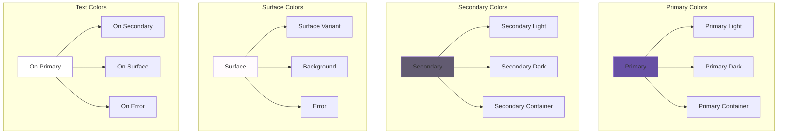
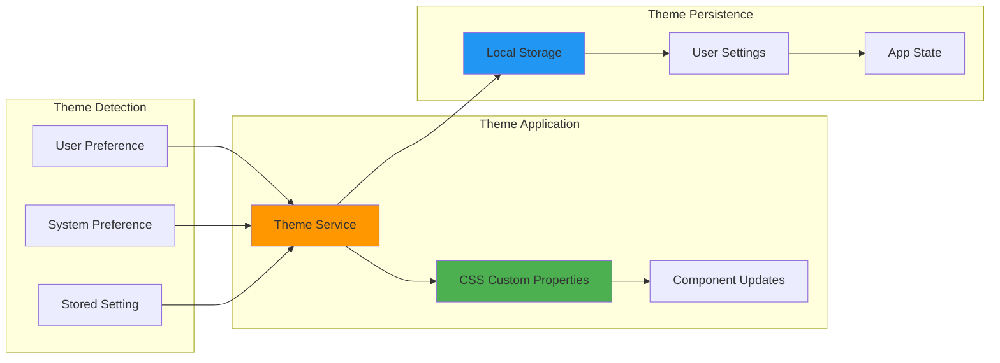
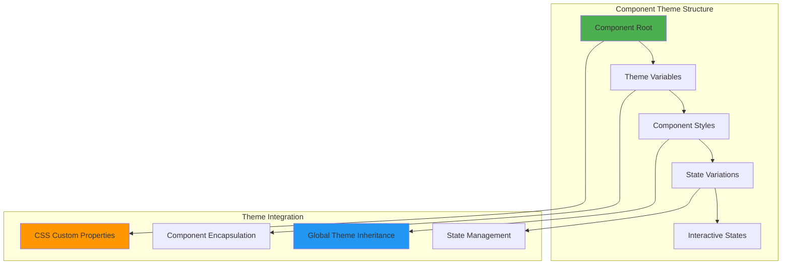
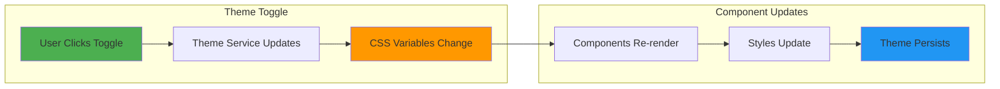
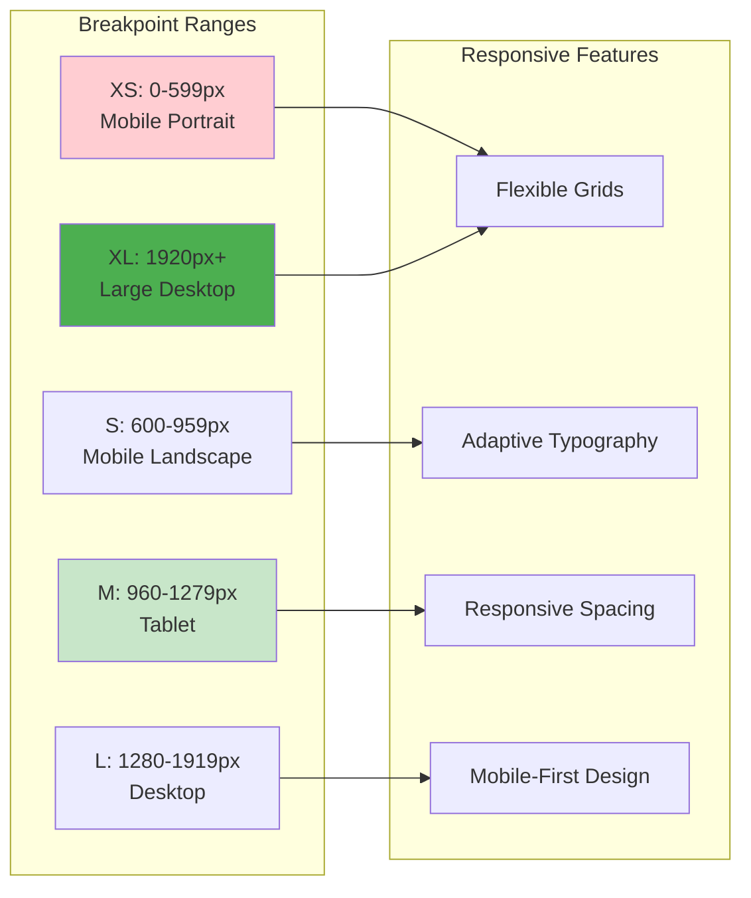
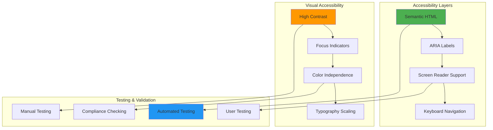
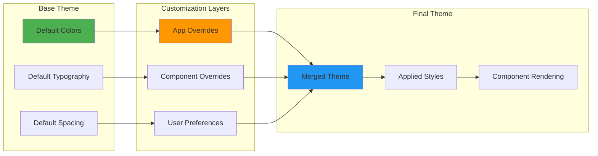
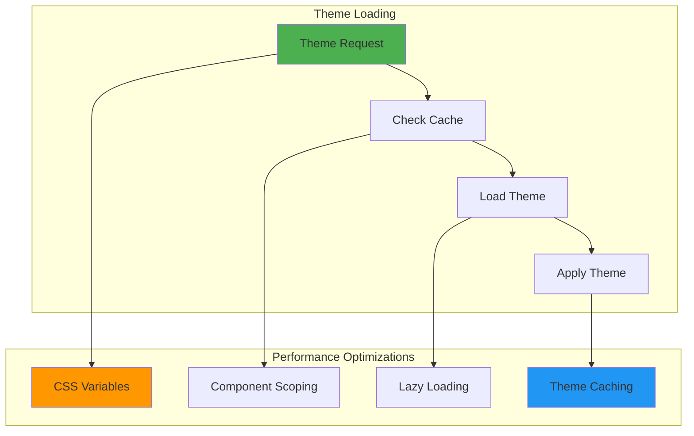

# 🎨 Flock Styling - The Flock's Beautiful Plumage

> *"Every bird in our flock shares the same beautiful plumage. Our Material Design system ensures that whether you're soaring with the eagle or dancing with the murmuration bird, you'll always look your best."*

## 🎨 **Styling Philosophy**

Our flock shares a beautiful, consistent **Material Design 3** theme that ensures all birds look and feel the same. Like a flock of birds with identical plumage, our components maintain visual consistency while adapting to each bird's environment.

### **Why Material Design 3?**
- **🎨 Unified Visual Language** - All birds look and feel the same
- **🔄 Seamless Component Swapping** - Services and nested components adapt per environment
- **📱 Responsive Nesting** - Components nest perfectly in each bird's habitat
- **🌙 Theme Consistency** - Light/dark modes that work across all variants

## 🏗️ **Theme Architecture**

### **Centralized Theming System**

### **Theme Inheritance Structure**

## 🎨 **Material Design Foundation**

### **Color System Architecture**
Our theme system is built on Material Design 3 principles with a comprehensive color palette:

### **Theme Switching Mechanism**

## 🧩 **Component Theming**

### **Component Theme Pattern**
Every component in our flock follows the same theming pattern:

### **Theme-Aware Components**
Our components automatically adapt to theme changes:

- **File Upload** - Adapts colors and shadows to current theme
- **Step Navigation** - Changes highlight colors and indicators
- **Progress Tracking** - Adjusts progress bar colors and backgrounds
- **Theme Toggle** - Provides visual feedback for theme switching

## 🌙 **Light & Dark Themes**

### **Theme Characteristics**

#### **Light Theme (Default)**
- **Surface Colors** - Clean white and light gray backgrounds
- **Text Colors** - High contrast dark text for readability
- **Accent Colors** - Vibrant primary and secondary colors
- **Shadows** - Subtle shadows for depth and elevation

#### **Dark Theme**
- **Surface Colors** - Deep grays and dark backgrounds
- **Text Colors** - Light text with proper contrast ratios
- **Accent Colors** - Muted but accessible accent colors
- **Shadows** - Enhanced shadows for better depth perception

### **Theme Switching Flow**

## 📱 **Responsive Design**

### **Breakpoint System**
Our theme system includes a comprehensive responsive design framework:

### **Responsive Theming**
- **Mobile-First** - Design starts with mobile and scales up
- **Adaptive Components** - Components adjust to screen size
- **Touch-Friendly** - Optimized for touch interactions
- **Performance** - Efficient rendering on all devices

## 🎯 **Accessibility Features**

### **WCAG Compliance**
Our theme system ensures accessibility compliance:

- **Color Contrast** - Meets WCAG AA standards for all color combinations
- **Typography** - Readable font sizes and line heights
- **Focus Indicators** - Clear focus states for keyboard navigation
- **Screen Reader Support** - Proper semantic markup and ARIA labels

### **Accessibility Architecture**

## 🔧 **Theme Customization**

### **Customization Points**
Developers can customize themes at multiple levels:

- **Global Theme** - Override default color schemes
- **Component Level** - Customize individual component themes
- **App Variant** - Create app-specific theme variations
- **User Preferences** - Allow users to customize their experience

### **Theme Extension Pattern**

## 🚀 **Performance Optimization**

### **Theme Performance Features**
- **CSS Custom Properties** - Efficient theme switching without reloads
- **Component Encapsulation** - Scoped styles for better performance
- **Lazy Loading** - Load theme resources on demand
- **Caching** - Cache theme data for faster switching

### **Performance Architecture**

## 🎨 **Future Enhancements**

### **Advanced Theming Features**
- **Dynamic Themes** - Real-time theme generation based on user preferences
- **Seasonal Themes** - Automatic theme switching based on time of year
- **Brand Customization** - Allow organizations to customize themes
- **Theme Marketplace** - Community-created theme collections

### **Enhanced Accessibility**
- **High Contrast Modes** - Additional high contrast theme options
- **Reduced Motion** - Respect user motion preferences
- **Color Blind Support** - Optimized themes for color vision deficiencies
- **Cognitive Accessibility** - Simplified themes for cognitive accessibility

---

*"Every bird in our flock shares the same beautiful plumage. Our Material Design system ensures that whether you're soaring with the eagle or dancing with the murmuration bird, you'll always look your best. Beauty and functionality fly together in perfect harmony."*
