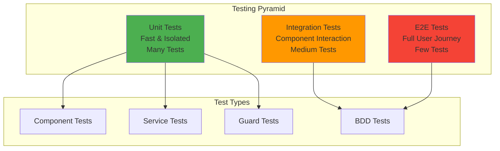
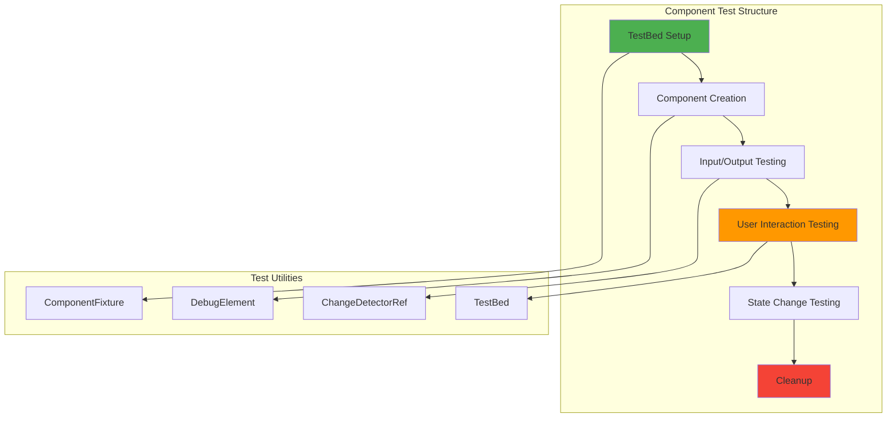
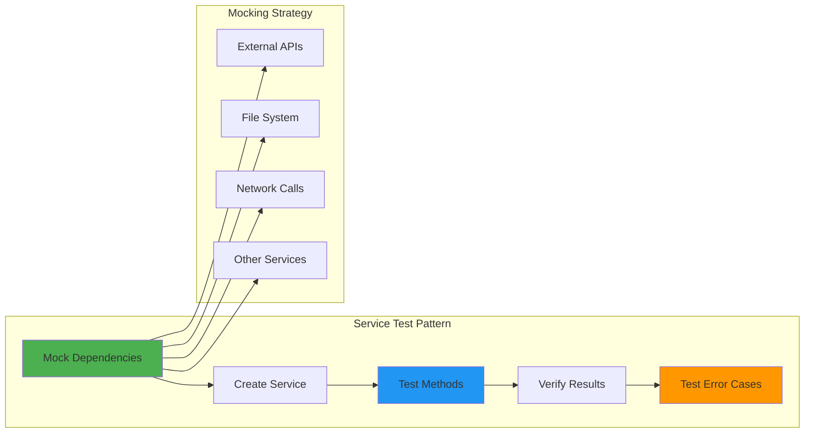
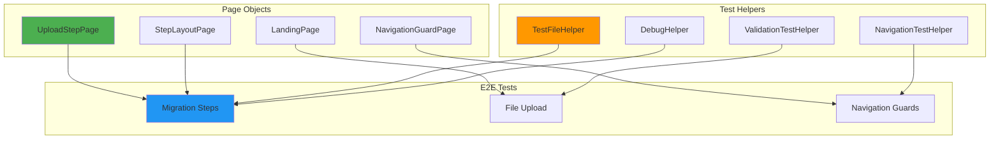
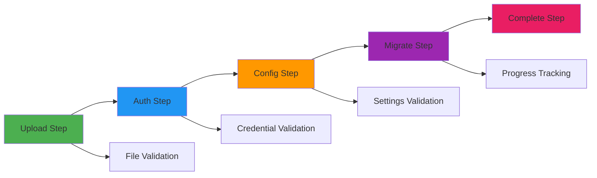
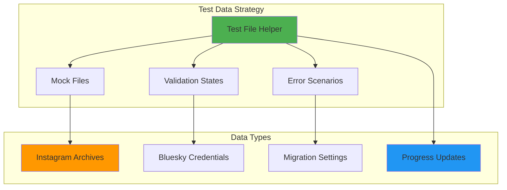
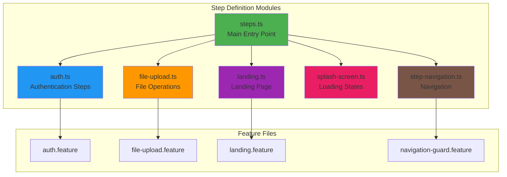
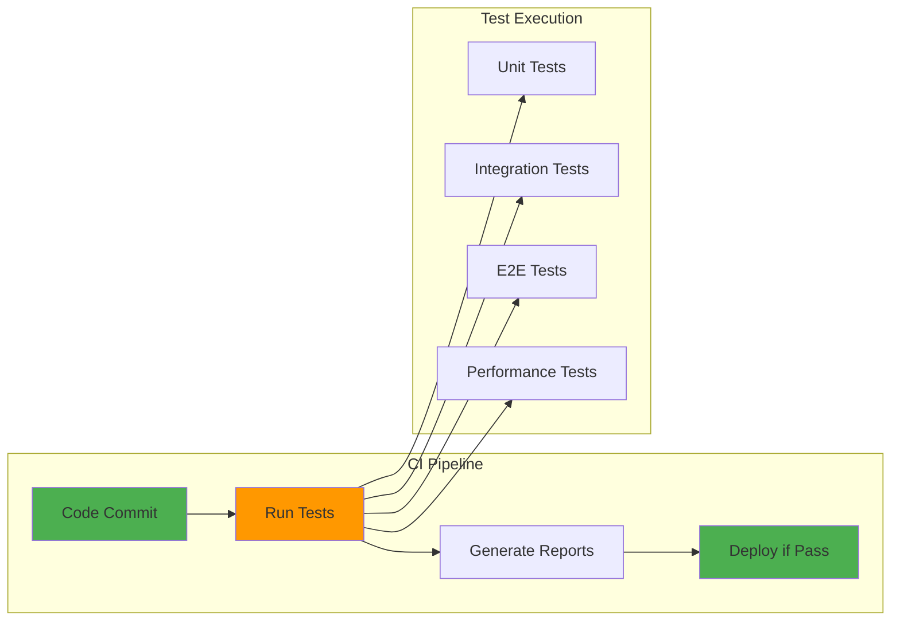

# 🧪 Flock Testing - How Our Flock Stays Healthy and Strong

> *"We count every duckling in our flock—each feature gets a test, so no one gets left behind! Our testing keeps the whole migration waddling along safely and happily."*

## 🧪 **Testing Philosophy**

We follow **BDD (Behavior-Driven Development)** methodology using Angular's native testing framework with Jasmine. Why not Cucumber? Because we want real Angular components, not mocks! Our testing approach ensures that every bird in our flock can fly safely and reliably.

### **Why BDD?**
- **🔄 User-Focused** - Tests describe real user behavior and scenarios
- **🎯 Business Value** - Tests validate business requirements, not just code
- **🧪 Real Components** - Test actual Angular components, not mocked behavior
- **📚 Living Documentation** - Tests serve as executable specifications

## 📚 **Testing Documentation Structure**

Our testing documentation is organized into focused modules for better navigation and maintenance:

### **🧪 Core Testing Guides**
- **[BDD Methodology](testing/BDD_METHODOLOGY.md)** - Behavior-Driven Development approach and patterns
- **[Unit Testing](testing/UNIT_TESTING.md)** - Component and service testing with Angular/Jasmine
- **[E2E Testing](testing/E2E_TESTING.md)** - Full user journey testing with WebdriverIO
- **[Modular Feature Structure](testing/MODULAR_FEATURE_STRUCTURE.md)** - Organized BDD testing with modular feature files
- **[Coverage](testing/COVERAGE.md)** - Test coverage collection, reporting, and Codecov integration
- **[Allure Reporting](testing/ALLURE_REPORTING.md)** - Beautiful test reports and analysis
- **[CI Integration](testing/CI_INTEGRATION.md)** - Automated testing pipeline and deployment

### **🎯 Quick Navigation**
- **Getting Started**: Start with [BDD Methodology](testing/BDD_METHODOLOGY.md) to understand our approach
- **Writing Tests**: Use [Unit Testing](testing/UNIT_TESTING.md) for component tests, [E2E Testing](testing/E2E_TESTING.md) for user workflows
- **Coverage**: Check [Coverage](testing/COVERAGE.md) for coverage collection and reporting
- **Reports**: See [Allure Reporting](testing/ALLURE_REPORTING.md) for beautiful test reports and analysis
- **CI/CD**: See [CI Integration](testing/CI_INTEGRATION.md) for automated testing pipeline

## 🧪 **Testing Strategy Overview**

### **Testing Pyramid**


### **BDD Structure Pattern**
```typescript
describe('Feature: User Authentication', () => {
  describe('Scenario: Valid login attempt', () => {
    it('Given valid credentials, When user submits, Then login succeeds', () => {
      // 🔧 BDD: Set up the context/preconditions
      console.log(`🔧 BDD: Setting up valid user credentials`);
      
      // ⚙️ BDD: Perform the action
      console.log(`⚙️ BDD: User submits login form`);
      
      // ✅ BDD: Verify the outcome
      console.log(`✅ BDD: Login succeeds and user is authenticated`);
      expect(result).toBe(expected);
    });
  });
});
```

## 🧪 **Unit Testing (Individual Bird Health)**

### **Test File Naming**
- **`component.spec.ts`** - Standard unit tests for components
- **`component-bdd.spec.ts`** - BDD-style behavior tests
- **`service.spec.ts`** - Service unit tests
- **`guard.spec.ts`** - Route guard tests

### **Component Testing**


### **Service Testing**


### **Running Unit Tests**
```bash
# Test all birds
ng test

# Test specific birds:
ng test flock-mirage      # Test the mirage
ng test flock-murmur      # Test the murmuration  
ng test flock-native      # Test the native

# Test with coverage
ng test --code-coverage

# Test in watch mode
ng test --watch
```

## 🧪 **E2E Testing (Full Migration Journey)**

### **Modular Feature Structure**
```
features/
├── auth/                           # Authentication feature group
│   ├── auth.feature               # Core authentication (6 scenarios)
│   ├── auth-username-validation.feature  # Username validation (1 scenario)
│   ├── auth-password-validation.feature  # Password validation (1 scenario)
│   ├── auth-navigation-guards.feature    # Navigation guards (7 scenarios)
│   └── auth-help-dialog.feature          # Help dialog (2 scenarios)
├── config/                        # Configuration feature group
│   ├── config.feature             # Core configuration (6 scenarios)
│   ├── config-date-range.feature  # Date range settings (4 scenarios)
│   ├── config-testing.feature     # Testing options (3 scenarios)
│   ├── config-validation.feature  # Validation logic (15 scenarios)
│   ├── config-user-interface.feature    # UI/UX (20 scenarios)
│   └── config-overview.feature    # Integration overview (6 scenarios)
├── upload/                        # File upload feature group
│   ├── upload.feature             # Core upload (4 scenarios)
│   ├── upload-file-validation.feature    # File validation (1 scenario)
│   ├── upload-file-management.feature    # File management (2 scenarios)
│   └── upload-form-validation.feature    # Form validation (1 scenario)
├── landing.feature                # Landing page and navigation
└── navigation-guard.feature       # Route protection and validation
```

**📚 See [Modular Feature Structure](testing/MODULAR_FEATURE_STRUCTURE.md) for detailed organization guidelines.**

### **Modular Step Definitions**
Our step definitions are organized into focused modules for better maintainability:

```
features/step-definitions/
├── steps.ts              # Main file with imports and common steps
├── auth.ts               # Authentication-related steps
├── file-upload.ts        # File upload and validation steps
├── landing.ts            # Landing page interaction steps
├── splash-screen.ts      # Splash screen and loading states
└── step-navigation.ts    # Step navigation and routing
```

**Benefits of Modular Approach:**
- **🎯 Focused Responsibility** - Each file handles specific functionality
- **🔧 Easier Maintenance** - Changes to one feature don't affect others
- **📚 Better Organization** - Related steps are grouped together
- **🚀 Faster Development** - Developers can work on specific modules independently

### **Feature File Examples**

#### **Authentication Feature**
```gherkin
Feature: Bluesky Authentication
  As a user migrating from Instagram to Bluesky
  I want to authenticate with my Bluesky credentials
  So that I can proceed with the migration process

  Scenario: Valid credentials allow progression
    Given the application is running
    And I navigate to the auth step
    And I have entered valid credentials
    When I click the "Next" button
    Then the authentication script should run in the background
    And I should be navigated to the config step
```

#### **File Upload Feature**
```gherkin
Feature: File Upload and Validation
  As a user starting the migration process
  I want to upload my Instagram archive file
  So that the system can validate and process it

  Scenario: Valid file upload succeeds
    Given I am on the upload step
    When I select a valid Instagram archive file "valid-archive.zip"
    Then the file should be selected in the file input
    And I should see validation success indicators
```

### **Page Object Pattern**


### **Running E2E Tests**
```bash
# Full test suite (all features)
npm run test:e2e:headless

# Test specific feature groups:
export TEST_SPEC="./features/auth/*.feature" && npm run test:e2e:headless
export TEST_SPEC="./features/config/*.feature" && npm run test:e2e:headless
export TEST_SPEC="./features/upload/*.feature" && npm run test:e2e:headless

# Test specific feature files:
export TEST_SPEC="./features/auth/auth.feature" && npm run test:e2e:headless
export TEST_SPEC="./features/upload/upload.feature" && npm run test:e2e:headless
export TEST_SPEC="./features/config/config-validation.feature" && npm run test:e2e:headless
export TEST_SPEC="./features/landing.feature" && npm run test:e2e:headless

# Test with specific tags
export TEST_TAGS="@bluesky-auth" && npm run test:e2e:headless
export TEST_TAGS="@file-upload" && npm run test:e2e:headless

# Test in debug mode
npm run e2e:debug

# Test with verbose output
export DEBUG_TESTS=true && npm run test:e2e:headless
```

## 🧪 **BDD Testing Methodology**

### **BDD vs Unit Testing**
- **BDD Tests** - Focus on user scenarios and business behavior
- **Unit Tests** - Focus on individual methods and edge cases
- **Both** - Complement each other for comprehensive coverage

### **BDD Test Organization**
```typescript
// Group by business feature first
describe('Feature: User Authentication', () => {
  // Then by user scenario
  describe('Scenario: Valid login attempt', () => {
    // Then by specific test cases
    it('Given valid credentials, When user submits, Then login succeeds', () => {
      // BDD implementation
    });
  });
  
  describe('Scenario: Invalid credentials', () => {
    it('Given invalid credentials, When user submits, Then error is shown', () => {
      // BDD implementation  
    });
  });
});
```

### **Console Logging Convention**
- **🔧 BDD:** Setup/Given statements (blue tools)
- **⚙️ BDD:** Actions/When statements (yellow gear)
- **✅ BDD:** Success/Then verifications (green check)
- **❌ BDD:** Expected errors/failures (red X)
- **📝 BDD:** Form submissions/data operations (memo)
- **🧭 BDD:** Navigation operations (compass)

## 🧪 **Test Categories**

### **Feature Categories**
1. **Component Behavior** - Form validation, user interactions, state changes
2. **Service Integration** - Data flow, configuration management, API calls
3. **User Workflows** - End-to-end scenarios across multiple components
4. **Error Handling** - Validation failures, network errors, edge cases

### **Test Scenarios Covered**

#### **Migration Steps Testing**


#### **File Upload Testing**
- **Interface Elements** - Upload section, file input, validation feedback
- **File Operations** - File selection, validation, removal
- **Validation Feedback** - Success indicators, error messages, form states

#### **Navigation Guard Testing**
- **Guard Protection** - Navigation blocking without valid data
- **Guard Bypass** - Navigation allowed with valid data
- **Edge Cases** - Multiple attempts, service state integration

## 🧪 **Real Component Integration**

### **Angular Integration**
- **Real Components** - Always use actual Angular components via TestBed
- **Mock External** - Mock only external dependencies (services, APIs)
- **Real Forms** - Test real form behavior and validation
- **Real Navigation** - Verify actual navigation and state changes
- **Lifecycle** - Use `fixture.detectChanges()` to trigger Angular lifecycle

### **Test Data Management**


## 🧪 **Modular Step Definitions Architecture**

### **Step Definition Organization**
Our step definitions follow a modular architecture that separates concerns and improves maintainability:



### **Module Responsibilities**

#### **`steps.ts` - Main Entry Point**
- Imports all step definition modules
- Contains common/shared step definitions
- Handles URL checks and application setup

#### **`auth.ts` - Authentication Steps**
- User credential validation
- Form field interactions
- Authentication flow testing
- Help dialog interactions

#### **`file-upload.ts` - File Operations**
- File selection and validation
- Upload interface testing
- File removal operations
- Navigation guard integration

#### **`landing.ts` - Landing Page**
- Landing page content verification
- Navigation button interactions
- Process step display testing

#### **`splash-screen.ts` - Loading States**
- Splash screen visibility
- Loading message verification
- Authentication process states

#### **`step-navigation.ts` - Navigation**
- Step-to-step navigation
- URL routing verification
- Step layout testing

### **Import Strategy**
```typescript
// steps.ts - Main file imports all modules
import './landing';
import './auth';
import './splash-screen';
import './step-navigation';
import './file-upload';
```

### **Benefits of Modular Approach**
- **🎯 Single Responsibility** - Each module handles one aspect of functionality
- **🔧 Easier Debugging** - Issues are isolated to specific modules
- **📚 Better Documentation** - Clear separation makes code self-documenting
- **🚀 Parallel Development** - Multiple developers can work on different modules
- **🔄 Reusability** - Common patterns can be extracted and shared

## 🧪 **Test Implementation Details**

### **File Mocking Strategy**
- **DataTransfer API** - Use `DataTransfer` and `File` APIs to simulate real file selection
- **Mock Archives** - Create mock Instagram archive files with proper structure
- **Validation Scenarios** - Simulate both valid and invalid file scenarios

### **Guard Testing Approach**
- **Real Guards** - Test actual Angular router guards, not mocked behavior
- **Snackbar Capture** - Capture real snackbar messages from Material Design components
- **URL Validation** - Verify URL changes and navigation state

### **Angular Integration**
- **Zone Stability** - Wait for Angular zone stability before assertions
- **Reactive Forms** - Test real Angular reactive forms validation
- **Material Components** - Integrate with Angular Material components

## 🧪 **Test Debugging & Targeted Execution**

### **Running Specific Test Suites**
Instead of waiting for all tests to complete, you can target specific test files or scenarios:

#### **E2E Test Targeting**
```bash
# Run only auth flow tests
export TEST_SPEC="./features/auth/*.feature" && npm run test:e2e:headless

# Run only file upload tests  
export TEST_SPEC="./features/upload/*.feature" && npm run test:e2e:headless

# Run only configuration tests
export TEST_SPEC="./features/config/*.feature" && npm run test:e2e:headless

# Run only landing page tests
export TEST_SPEC="./features/landing.feature" && npm run test:e2e:headless

# Run only navigation guard tests
export TEST_SPEC="./features/navigation-guard.feature" && npm run test:e2e:headless
```

#### **Using Test Tags for Filtering**
```bash
# Run tests with specific tags
npm run e2e:validation  # Runs @bluesky-auth and @validation tagged tests

# Run tests excluding certain tags
npm run test:e2e:skip-failing  # Excludes @skip tagged tests

# Run only passing tests
npm run test:e2e:only-passing  # Excludes @skip tagged tests
```

#### **Debug Mode for E2E Tests**
```bash
# Run with debug output and headless mode
npm run e2e:debug

# Run specific validation tests in debug mode
npm run e2e:debug-validation
```

### **Unit Test Targeting**
```bash
# Test specific project
ng test flock-mirage
ng test flock-murmur  
ng test flock-native

# Test with watch mode for faster iteration
ng test --watch

# Test specific file pattern
ng test --include="**/*auth*.spec.ts"
```

### **Common Debugging Scenarios**

#### **When Tests Fail with Missing Step Definitions**
```bash
# Check which steps are missing
export TEST_SPEC="./features/auth/auth.feature" && npm run test:e2e:headless

# Look for "Step is not defined" errors in output
# Add missing step definitions to the appropriate module:
# - features/step-definitions/auth.ts (for auth-related steps)
# - features/step-definitions/file-upload.ts (for file upload steps)
# - features/step-definitions/landing.ts (for landing page steps)
# - features/step-definitions/step-navigation.ts (for navigation steps)
# - features/step-definitions/splash-screen.ts (for splash screen steps)
```

#### **When Snackbar Tests Fail**
```bash
# Test snackbar functionality in isolation
export TEST_SPEC="./features/auth.feature" && npm run e2e:headless

# Look for "element still not displayed after 5000ms" errors
# Check snackbar selectors in page objects
```

#### **When Navigation Tests Fail**
```bash
# Test navigation guards specifically
export TEST_SPEC="./features/navigation-guard.feature" && npm run test:e2e:headless

# Verify guard implementation and URL routing
```

### **Quick Test Iteration Workflow**
```bash
# 1. Run specific failing test suite
export TEST_SPEC="./features/auth/auth.feature" && npm run test:e2e:headless

# 2. Fix issues in code

# 3. Re-run just that suite to verify fix
export TEST_SPEC="./features/auth/auth.feature" && npm run test:e2e:headless

# 4. Once fixed, run full test suite
npm run test:e2e:headless
```

### **Environment Variables for Test Control**
```bash
# Control test execution
export TEST_SPEC="./features/auth/auth.feature"    # Target specific feature file
export TEST_SPEC="./features/auth/*.feature"      # Target feature group
export HEADLESS=true                              # Run in headless mode
export DEBUG_TESTS=true                           # Enable debug output
export TEST_TAGS="@auth and @validation"          # Filter by tags
```

## 🧪 **Test Maintenance**

### **Maintenance Tasks**
- **Selectors** - Update CSS selectors when Angular Material components change
- **Timing** - Adjust wait times if application performance changes  
- **Validation** - Update validation logic when form requirements change
- **Navigation** - Maintain step routing consistency with application changes

### **Common Issues & Solutions**

#### **Tests Timeout**
- **Increase Timeouts** - Adjust timeout values in page objects
- **Check Startup** - Verify Angular application startup time
- **Service Mocking** - Ensure all required services are properly mocked

#### **File Upload Failures**
- **API Support** - Ensure `DataTransfer` API support in test browser
- **Element Selection** - Check file input element selectors
- **Form Binding** - Verify Angular form control binding

#### **Navigation Guard Issues**
- **Guard Implementation** - Confirm guard implementation matches test expectations
- **Selector Accuracy** - Check snackbar selector accuracy
- **Service State** - Verify file service state simulation

## 🧪 **Testing Tools & Infrastructure**

### **Testing Framework Stack**
- **Jasmine** - Primary testing framework with Angular
- **Angular Testing Utilities** - TestBed, ComponentFixture, etc.
- **WebDriverIO** - E2E testing with Cucumber integration
- **Allure Reporting** - Comprehensive test reporting and CI integration

### **CI/CD Integration**


## 🚀 **Future Testing Enhancements**

### **Advanced Testing Features**
- **Visual Regression** - Screenshot comparison for UI consistency
- **Performance Testing** - Load time and memory usage testing
- **Accessibility Testing** - Automated accessibility compliance testing
- **Cross-Browser Testing** - Test across multiple browser versions

### **Testing Infrastructure**
- **Parallel Execution** - Run tests in parallel for faster execution
- **Test Data Management** - Centralized test data and environment management
- **Reporting Dashboard** - Real-time test results and trend analysis
- **Test Analytics** - Insights into test coverage and quality metrics

## 🎯 **Testing Summary**

Our testing approach combines the best of both worlds:

### **Comprehensive Coverage**
- **Unit Tests** - Fast, isolated component and service testing with coverage
- **E2E Tests** - Full user journey and integration testing
- **Coverage Tracking** - Unit test coverage reporting with Codecov
- **CI Integration** - Automated testing pipeline with quality gates

### **BDD Methodology**
- **User-Focused** - Tests describe real user behavior and scenarios
- **Business Value** - Tests validate business requirements, not just code
- **Real Components** - Test actual Angular components, not mocked behavior
- **Living Documentation** - Tests serve as executable specifications

### **Quality Assurance**
- **Automated Testing** - All tests run automatically on every commit
- **Quality Gates** - Tests must pass before code can be merged
- **Coverage Tracking** - Unit test coverage reports are generated and tracked
- **Multi-Environment** - Tests run in consistent, isolated environments

## 📚 **Next Steps**

1. **Start with BDD**: Read [BDD Methodology](testing/BDD_METHODOLOGY.md) to understand our approach
2. **Write Unit Tests**: Use [Unit Testing](testing/UNIT_TESTING.md) for component and service tests
3. **Add E2E Tests**: Use [E2E Testing](testing/E2E_TESTING.md) for user workflow tests
4. **Check Coverage**: Use [Coverage](testing/COVERAGE.md) to ensure comprehensive test coverage
5. **Generate Reports**: Use [Allure Reporting](testing/ALLURE_REPORTING.md) for beautiful test reports
6. **CI Integration**: See [CI Integration](testing/CI_INTEGRATION.md) for automated testing pipeline

---

*"Testing is like preening your feathers - it takes time, but it ensures you're always ready to fly. A well-tested flock is a confident flock that can soar through any storm."*
