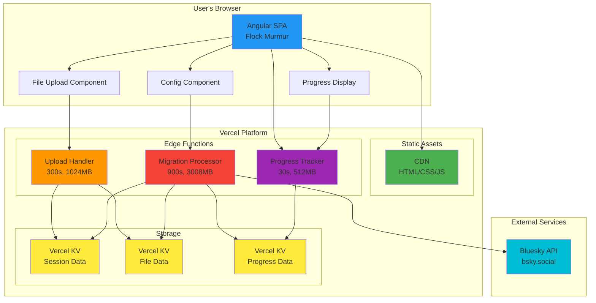
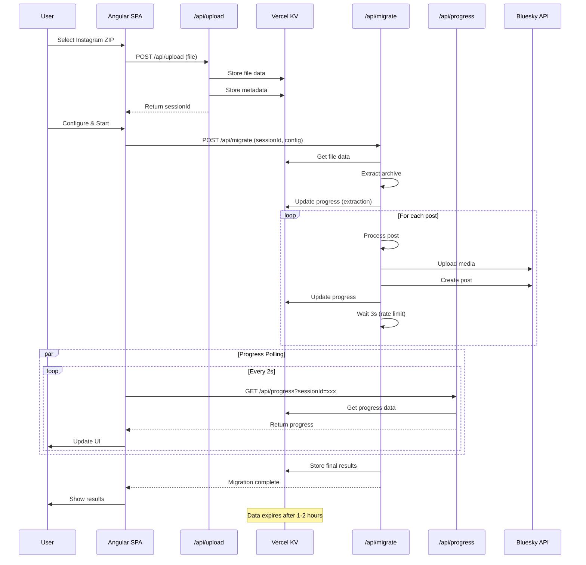
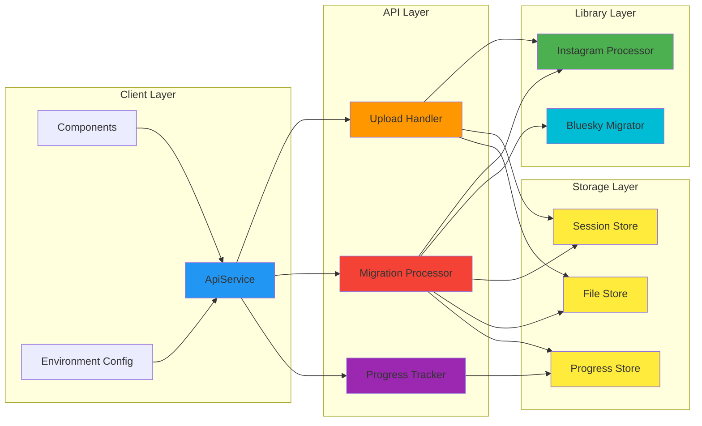
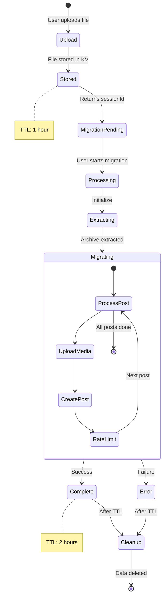
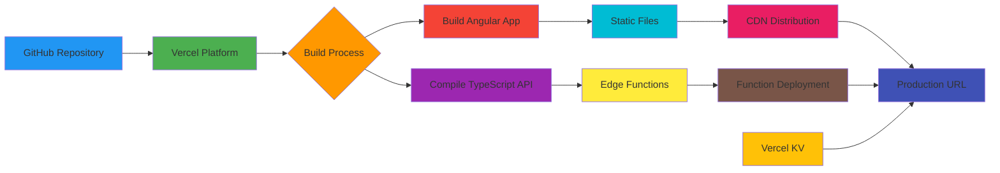
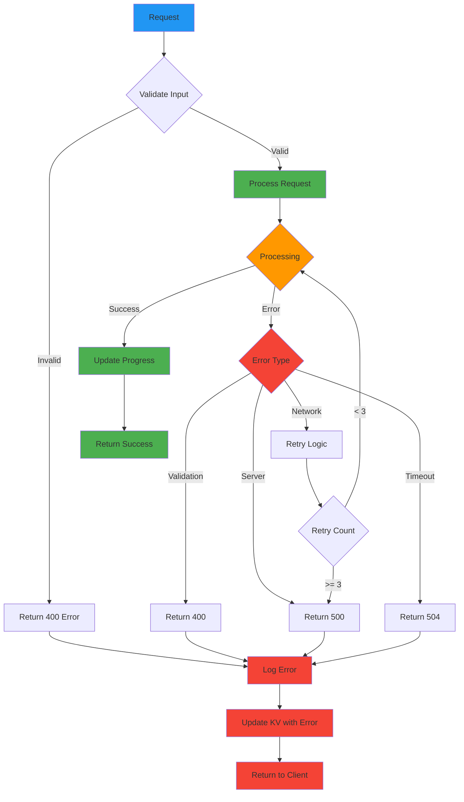
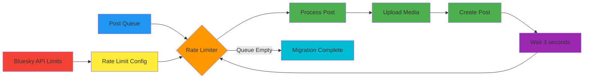
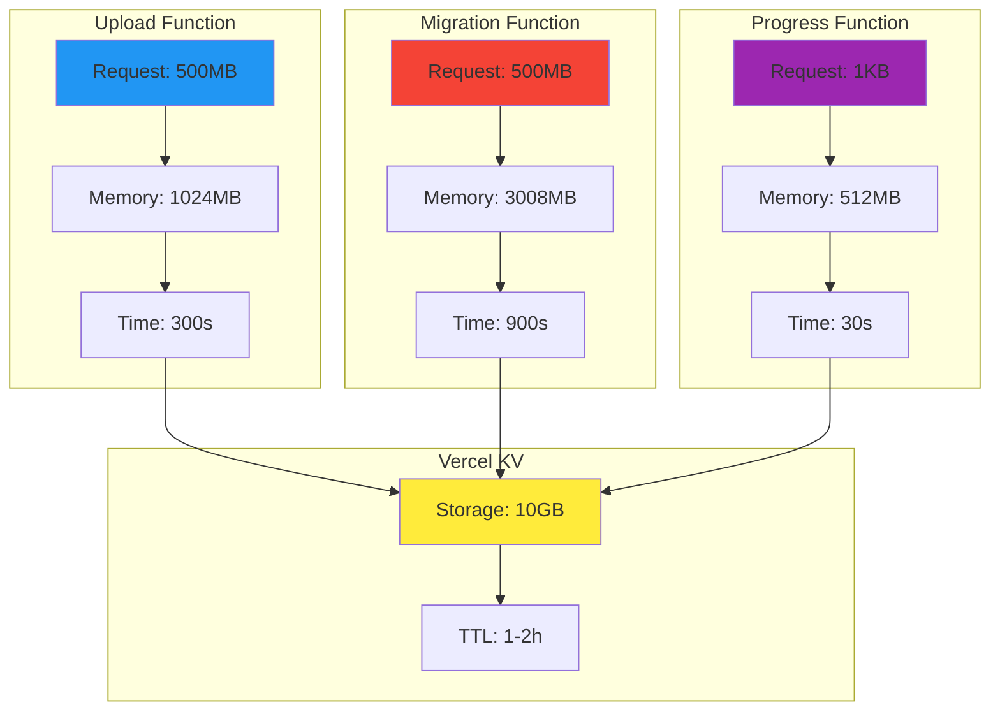

# Flock Murmur - Vercel Architecture Diagram

## System Architecture Overview

## Data Flow Diagram

## Component Architecture

## Session Lifecycle

## Deployment Flow

## Error Handling Flow

## Rate Limiting Strategy

## Resource Management

---

## Legend

- **Blue** - Client/User Layer
- **Green** - Static/Build Layer
- **Orange** - API/Processing Layer
- **Red** - Migration/Heavy Processing
- **Purple** - Tracking/Monitoring
- **Yellow** - Storage/State
- **Cyan** - External Services

## Key Metrics

| Component | Metric | Value |
|-----------|--------|-------|
| Upload Function | Max Duration | 300s |
| Upload Function | Max Memory | 1024MB |
| Upload Function | Max File Size | 500MB |
| Migration Function | Max Duration | 900s |
| Migration Function | Max Memory | 3008MB |
| Migration Function | Posts/Batch | 1 post per 3s |
| Progress Function | Max Duration | 30s |
| Progress Function | Max Memory | 512MB |
| Progress Function | Poll Interval | 2s |
| Vercel KV | Session TTL | 1 hour |
| Vercel KV | Progress TTL | 2 hours |
| Vercel KV | Max Storage | 10GB |

---

*Diagrams generated for Flock Murmur Vercel Implementation* 🌊✨
