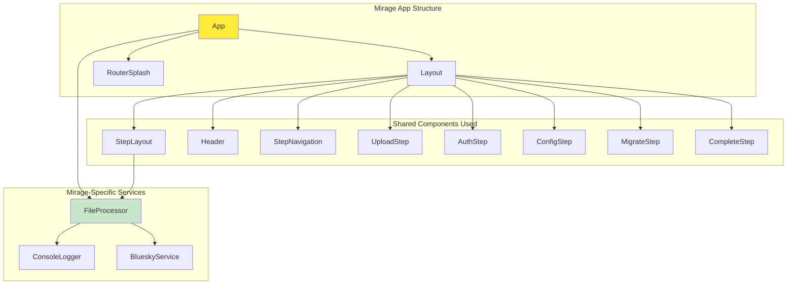
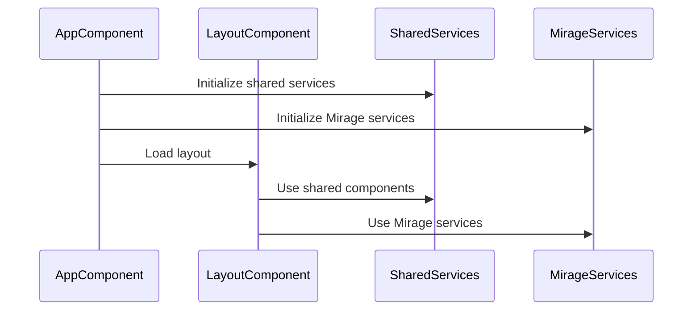
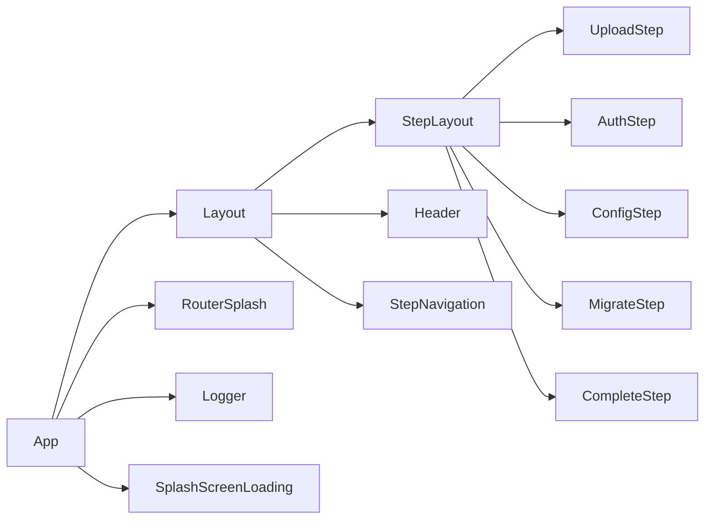

# 🦤 Flock Mirage Components

> *"The dodo bird's wisdom lives on in our Mirage components - simple, focused, and perfect for testing the migration journey."*

## 🏗️ **Mirage Component Architecture**

Flock Mirage uses a minimal component structure that leverages the shared library components while providing a clean, testable environment for development and testing.



## 🎯 **Component Overview**

### **App**
The root component of the Mirage application:

- **Purpose**: Application shell and service initialization
- **Dependencies**: Layout, RouterSplash
- **Services**: Logger, SplashScreenLoading
- **Features**: Loading state management, service instrumentation

### **Shared Component Integration**
Mirage leverages all shared library components:

- **Layout Components**: Complete UI structure from shared library
- **Step Components**: Full migration workflow from shared library
- **UI Components**: Theming and navigation from shared library

## 🔧 **Service Integration**

### **Mirage-Specific Services**
Services tailored for the browser environment:

- **[FileProcessor](services/file-processor.md)** - Browser-based file processing
- **[ConsoleLogger](services/console-logger.md)** - Console-based logging
- **[BlueskyService](services/bluesky.md)** - Bluesky API integration

### **Service Override Pattern**
Mirage overrides shared services with browser-specific implementations:

```typescript
// app.config.ts
providers: [
  { provide: FILE_PROCESSOR, useClass: FileProcessor },
  { provide: LOGGER, useClass: ConsoleLogger },
  { provide: BLUESKY, useClass: BlueskyService }
]
```

## 🧪 **Testing-Focused Design**

### **Mock Data Integration**
Mirage components are designed for testing scenarios:

```typescript
export class FileProcessor implements FileService {
  validateArchive(archivedFile: File): Promise<ValidationResult> {
    // Always returns valid for testing
    return Promise.resolve({
      isValid: true,
      errors: [],
      warnings: [],
      timestamp: new Date()
    });
  }
}
```

### **Demo Mode Support**
Components support demo modes for testing:

```typescript
extractArchive(): Promise<boolean> {
  const isDemo = this.route.snapshot.queryParams['extractionFailed'] === 'true';
  const isSuccess = !isDemo;
  return Promise.resolve(isSuccess);
}
```

## 🎨 **Theming and Styling**

### **Material Design Integration**
Mirage uses the shared library's theming system:

- **Color Schemes**: Full Material Design color palette
- **Typography**: Consistent font system
- **Components**: Material Design component library
- **Responsive**: Mobile-first responsive design

### **Theme Customization**
Mirage can customize themes for testing scenarios:

```scss
// app.scss
@use 'shared/theme' as theme;

.mirage-theme {
  @include theme.component-theme();
  
  // Mirage-specific overrides
  .test-mode {
    border: 2px dashed theme.$warning-color;
  }
}
```

## 🔄 **Component Lifecycle**

### **Initialization Flow**


### **Service Resolution**
Services are resolved in the following order:

1. **Mirage-specific services** (FileProcessor, ConsoleLogger)
2. **Shared service implementations** (ConfigService, BlueskyService)
3. **Interface fallbacks** (Logger, FileService)

## 🧪 **Testing Integration**

### **Component Testing**
Mirage components are designed for comprehensive testing:

```typescript
describe('AppComponent', () => {
  it('should initialize services on startup', () => {
    const logger = TestBed.inject<Logger>(LOGGER);
    expect(logger).toBeDefined();
    expect(logger.instrument).toHaveBeenCalledWith('Dodo bird ready to flap!');
  });
});
```

### **E2E Testing Support**
Components support end-to-end testing scenarios:

- **Demo modes** for different test scenarios
- **Mock data** for consistent testing
- **Error simulation** for edge case testing
- **Loading states** for async operation testing

## 🚀 **Development Workflow**

### **Hot Reload Support**
Mirage supports Angular's hot reload for rapid development:

```bash
ng serve --configuration=development
```

### **Testing Commands**
```bash
# Unit tests
ng test

# E2E tests
npm run e2e

# Headless E2E tests
npm run "headless full"
```

## 📱 **Responsive Design**

Mirage components are fully responsive:

- **Mobile**: 320px - 768px
- **Tablet**: 768px - 1024px
- **Desktop**: 1024px+

## 🔗 **Component Dependencies**



## 🎯 **Key Features**

1. **Minimal Overhead** - Only essential Mirage-specific components
2. **Shared Integration** - Full use of shared library components
3. **Testing Focus** - Designed for comprehensive testing
4. **Demo Support** - Built-in demo modes for testing
5. **Service Override** - Browser-specific service implementations

## 📚 **Component Documentation**

Each component has detailed documentation:

- **Purpose and Use Cases**
- **Service Dependencies**
- **Testing Scenarios**
- **Demo Mode Support**
- **Error Handling**

---

*"Like the dodo bird's simple wisdom, our Mirage components are straightforward and focused - perfect for testing the migration journey before the real flight."*
