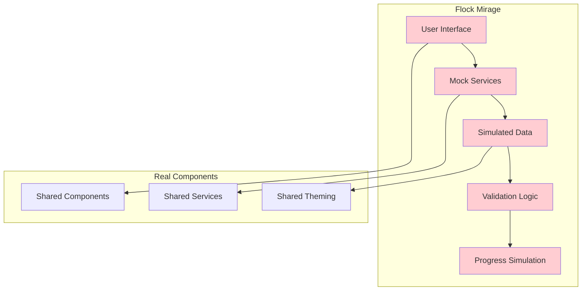
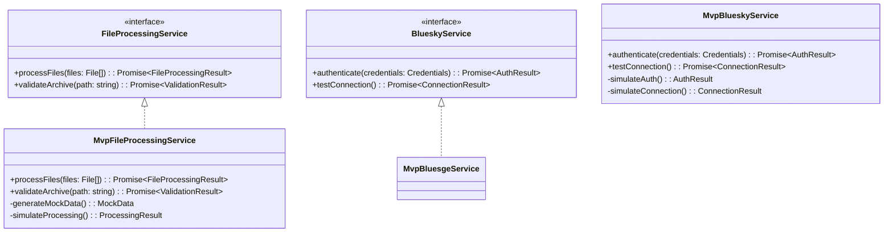

# 🦤 Flock Mirage - The Dodo Bird's Wisdom

> *"Though extinct, the dodo bird left us with wisdom: build your nest strong, for it must support many different birds. Flock Mirage creates beautiful illusions for development and testing."*

## 🎭 **Purpose & Philosophy**

Flock Mirage is our **development and testing bird** - it creates beautiful illusions that simulate real migration without leaving the nest. Like the dodo bird's wisdom that lives on, Mirage provides the foundation for testing our architecture and components.

### **Why the Dodo Bird?**
- **🦤 Extinct but Wise** - Represents the foundation that supports future generations
- **🏗️ Strong Foundation** - Creates the architectural patterns others follow
- **🧪 Testing Focus** - Perfect environment for validating our design
- **🎭 Beautiful Illusions** - Simulates real behavior without external dependencies

## 🎯 **Use Cases**

### **Primary Purposes**
1. **🧪 Development Testing** - Test components and services in isolation
2. **🎭 Demo & Presentation** - Show migration workflow without real data
3. **🔧 Architecture Validation** - Verify design patterns work correctly
4. **📚 Learning & Onboarding** - New developers can explore safely
5. **🚀 CI/CD Integration** - Automated testing in build pipelines

### **What Mirage Simulates**
- **File Upload** - Mock Instagram export archives
- **Authentication** - Simulated Bluesky API responses
- **Migration Process** - Mock progress and results
- **Error Scenarios** - Controlled failure testing

## 🏗️ **Architecture Overview**

### **Simulation-First Design**

### **Mock Service Architecture**

## 🔧 **Key Features**

### **Mock Data Generation**
- **Instagram Archives** - Simulated export structures with realistic data
- **User Credentials** - Test authentication flows safely
- **Migration Progress** - Controlled progress simulation for testing
- **Error Scenarios** - Predictable failures for validation testing

### **Simulation Controls**
- **Processing Delays** - Simulate real-world timing
- **Success Rates** - Control success/failure ratios
- **Data Volumes** - Test with different archive sizes
- **Network Conditions** - Simulate slow connections

### **Development Tools**
- **Mock Data Editor** - Customize simulation parameters
- **Scenario Builder** - Create specific test scenarios
- **Performance Profiling** - Measure component performance
- **Memory Monitoring** - Track resource usage

## 🧪 **Testing Integration**

### **Unit Testing**
Mirage provides perfect isolation for unit tests:
- **No External Dependencies** - Test components in isolation
- **Predictable Behavior** - Consistent test results
- **Fast Execution** - No network or file system delays
- **Easy Mocking** - Simple to override specific behaviors

### **Integration Testing**
Test how components work together:
- **Component Communication** - Verify data flow between components
- **Service Integration** - Test service interactions
- **State Management** - Validate state transitions
- **Error Handling** - Test error scenarios and recovery

### **BDD Testing**
Perfect environment for behavior-driven development:
- **User Scenarios** - Test complete user workflows
- **Business Logic** - Validate business requirements
- **Edge Cases** - Test unusual but valid scenarios
- **Accessibility** - Test with different user abilities

## 🎨 **User Experience**

### **Visual Design**
- **Material Design 3** - Consistent with the entire flock
- **Light/Dark Themes** - Full theme support for testing
- **Responsive Layout** - Test on different screen sizes
- **Accessibility** - Test with screen readers and keyboard navigation

### **Interactive Elements**
- **File Selection** - Click to generate mock data
- **Progress Indicators** - Visual feedback for all operations
- **Error Messages** - Clear feedback for validation failures
- **Success States** - Positive reinforcement for completed steps

## 🚀 **Development Workflow**

### **Getting Started**
1. **Clone Repository** - Get the latest code
2. **Install Dependencies** - `npm install`
3. **Start Development Server** - `ng serve flock-mirage`
4. **Open Browser** - Navigate to the development URL
5. **Generate Mock Data** - Click to create test scenarios

### **Adding New Features**
1. **Create Component** - Use Angular CLI for new components
2. **Add Mock Service** - Implement interface with mock data
3. **Update Tests** - Add unit and integration tests
4. **Validate Behavior** - Test in Mirage environment
5. **Document Changes** - Update architecture documentation

## 🔄 **Integration with Other Birds**

### **Shared Components**
Mirage uses the same components as other birds:
- **File Upload** - Same interface, mock implementation
- **Step Navigation** - Same navigation patterns
- **Progress Tracking** - Same progress indicators
- **Theme Toggle** - Same theming system

### **Service Interfaces**
Mirage implements the same service interfaces:
- **FileProcessingService** - Mock file operations
- **BlueskyService** - Simulated API responses
- **InstagramService** - Mock data processing
- **ProgressService** - Simulated progress updates

## 🎯 **Best Practices**

### **Mock Data Design**
- **Realistic Structure** - Match real data formats exactly
- **Varied Scenarios** - Include edge cases and error conditions
- **Consistent Behavior** - Same input should produce same output
- **Documentation** - Clearly document what each mock simulates

### **Testing Strategy**
- **Isolation** - Test components independently
- **Coverage** - Test all code paths and edge cases
- **Performance** - Monitor for performance regressions
- **Accessibility** - Test with accessibility tools

## 🚀 **Future Enhancements**

### **Advanced Simulation**
- **Network Latency** - Simulate real-world network conditions
- **File Corruption** - Test error handling with corrupted data
- **Large Archives** - Test performance with massive datasets
- **Concurrent Users** - Simulate multiple simultaneous migrations

### **Developer Experience**
- **Visual Scenario Builder** - Drag-and-drop test scenario creation
- **Performance Dashboard** - Real-time performance metrics
- **Debug Tools** - Enhanced debugging and inspection
- **Plugin System** - Extensible mock data generators

---

*"The dodo bird may be extinct, but its wisdom lives on in Flock Mirage. We build strong foundations here, so our other birds can soar to new heights."*
