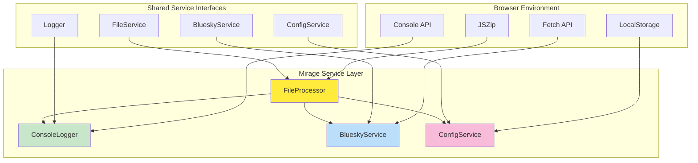
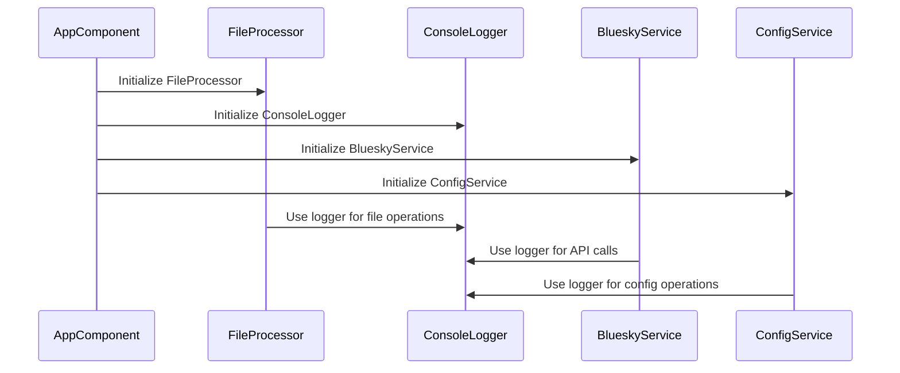
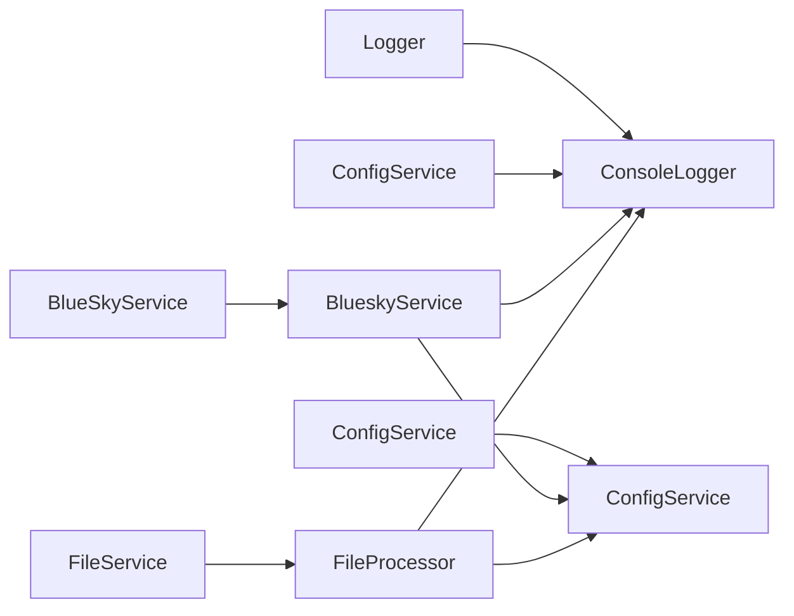

# 🔧 Flock Mirage Services

> *"The dodo bird's tools were simple but effective - our Mirage services follow the same principle, providing exactly what's needed for testing and development."*

## 🏗️ **Mirage Service Architecture**

Flock Mirage implements a focused set of services optimized for browser-based testing and development. These services override shared library interfaces with browser-specific implementations.



## 🎯 **Service Overview**

### **Core Services**
Essential services for Mirage functionality:

- **[FileProcessor](../../../projects/flock-mirage/src/app/service/file-processor.ts)** - Browser-based file processing with JSZip
- **[ConsoleLogger](../../../projects/flock-mirage/src/app/service/console-logger.ts)** - Console-based logging implementation
- **[BlueskyService](../../../projects/flock-mirage/src/app/service/bluesky.ts)** - Bluesky API integration with mock support

### **Service Override Pattern**
Mirage overrides shared services with browser-specific implementations:

```typescript
// app.config.ts
providers: [
  { provide: FILE_PROCESSOR, useClass: FileProcessor },
  { provide: LOGGER, useClass: ConsoleLogger },
  { provide: BLUESKY, useClass: BlueskyService }
]
```

## 🔧 **Service Implementations**

### **FileProcessor Service**
Browser-based file processing with JSZip integration:

```typescript
@Injectable({ providedIn: 'root' })
export class FileProcessor implements FileService {
  validateArchive(archivedFile: File): Promise<ValidationResult> {
    // Browser-specific validation logic
    return Promise.resolve({
      isValid: true,
      errors: [],
      warnings: [],
      timestamp: new Date()
    });
  }
  
  extractArchive(): Promise<boolean> {
    // JSZip-based extraction with demo mode support
    const isDemo = this.route.snapshot.queryParams['extractionFailed'] === 'true';
    return Promise.resolve(!isDemo);
  }
}
```

### **ConsoleLogger Service**
Console-based logging for browser environment:

```typescript
@Injectable({ providedIn: 'root' })
export class ConsoleLogger implements Logger {
  log(message: string, level: LogLevel = 'info'): void {
    console.log(`[${level.toUpperCase()}] ${message}`);
  }
  
  error(message: string, error?: Error): void {
    console.error(`[ERROR] ${message}`, error);
  }
  
  instrument(message: string): void {
    console.log(`🔧 BDD: ${message}`);
  }
}
```

### **BlueskyService Integration**
Bluesky API integration with testing support:

```typescript
@Injectable({ providedIn: 'root' })
export class BlueskyService implements BlueSkyService {
  async authenticate(credentials: Credentials): Promise<AuthResult> {
    // Mock authentication for testing
    if (credentials.username === 'test' && credentials.password === 'test') {
      return { success: true, message: 'Authentication successful' };
    }
    return { success: false, message: 'Invalid credentials' };
  }
  
  async createPost(post: PostRecordImpl): Promise<PostRecordImpl> {
    // Mock post creation for testing
    return Promise.resolve(post);
  }
}
```

## 🧪 **Testing-Focused Design**

### **Mock Data Support**
Services provide consistent mock data for testing:

```typescript
export class FileProcessor {
  private mockValidationResult: ValidationResult = {
    isValid: true,
    errors: [],
    warnings: [],
    timestamp: new Date(),
    field: undefined,
    value: undefined
  };
  
  validateArchive(archivedFile: File): Promise<ValidationResult> {
    // Always returns valid for testing scenarios
    return Promise.resolve(this.mockValidationResult);
  }
}
```

### **Demo Mode Integration**
Services support demo modes for different testing scenarios:

```typescript
export class FileProcessor {
  extractArchive(): Promise<boolean> {
    const isDemo = this.route.snapshot.queryParams['extractionFailed'] === 'true';
    const isSuccess = !isDemo;
    
    if (isSuccess) {
      return Promise.resolve(true);
    } else {
      return Promise.reject(new Error('Extraction failed'));
    }
  }
}
```

## 🔄 **Service Lifecycle**

### **Initialization Flow**


### **Service Dependencies**
Services are injected in the following order:

1. **Logger** - First to be available for other services
2. **ConfigService** - Configuration management
3. **FileProcessor** - File operations
4. **BlueskyService** - API integration

## 🎨 **Browser Environment Integration**

### **JSZip Integration**
File processing uses JSZip for browser-based archive handling:

```typescript
import JSZip from 'jszip';

export class FileProcessor {
  private zip = new JSZip();
  
  async extractArchive(): Promise<boolean> {
    try {
      const zipData = await this.zip.loadAsync(this.archivedFile);
      // Process extracted files
      return true;
    } catch (error) {
      this.logger.error('Archive extraction failed', error);
      return false;
    }
  }
}
```

### **LocalStorage Integration**
Configuration persistence using browser storage:

```typescript
export class ConfigService {
  private storageKey = 'flock-mirage-config';
  
  saveConfig(config: ConfigState): void {
    localStorage.setItem(this.storageKey, JSON.stringify(config));
  }
  
  loadConfig(): ConfigState | null {
    const stored = localStorage.getItem(this.storageKey);
    return stored ? JSON.parse(stored) : null;
  }
}
```

## 🧪 **Testing Integration**

### **Unit Testing**
Services are tested with mocked dependencies:

```typescript
describe('FileProcessor', () => {
  let service: FileProcessor;
  let mockLogger: jasmine.SpyObj<Logger>;
  
  beforeEach(() => {
    mockLogger = jasmine.createSpyObj('Logger', ['log', 'error']);
    service = new FileProcessor(mockLogger);
  });
  
  it('should validate archive successfully', async () => {
    const file = new File(['test'], 'test.zip');
    const result = await service.validateArchive(file);
    expect(result.isValid).toBe(true);
  });
});
```

### **E2E Testing Support**
Services support end-to-end testing scenarios:

- **Demo modes** for different test scenarios
- **Mock responses** for API calls
- **Error simulation** for edge cases
- **Loading states** for async operations

## 🚀 **Development Workflow**

### **Service Configuration**
Services are configured in `app.config.ts`:

```typescript
export const appConfig: ApplicationConfig = {
  providers: [
    { provide: FILE_PROCESSOR, useClass: FileProcessor },
    { provide: LOGGER, useClass: ConsoleLogger },
    { provide: BLUESKY, useClass: BlueskyService },
    { provide: CONFIG, useClass: ConfigService }
  ]
};
```

### **Service Testing**
```bash
# Unit tests
ng test

# E2E tests
npm run e2e

# Headless E2E tests
npm run "headless full"
```

## 📊 **Service State Management**

### **Reactive State**
Services use reactive patterns for state management:

```typescript
export class ConfigService {
  private configSubject = new BehaviorSubject<ConfigState>(initialState);
  public config$ = this.configSubject.asObservable();
  
  updateConfig(updates: Partial<ConfigState>): void {
    const current = this.configSubject.value;
    this.configSubject.next({ ...current, ...updates });
  }
}
```

### **Error Handling**
Consistent error handling across all services:

```typescript
export class FileProcessor {
  async extractArchive(): Promise<boolean> {
    try {
      // Extraction logic
      return true;
    } catch (error) {
      this.logger.error('Archive extraction failed', error);
      throw new FileProcessingError('Failed to extract archive');
    }
  }
}
```

## 🔗 **Service Relationships**



## 🎯 **Key Features**

1. **Browser Optimized** - Designed for browser environment
2. **Testing Focused** - Built for comprehensive testing
3. **Mock Support** - Built-in mock data and responses
4. **Demo Modes** - Support for different testing scenarios
5. **Service Override** - Clean override of shared services

## 📚 **Service Documentation**

Each service has detailed documentation:

- **Purpose and Responsibilities**
- **Browser-Specific Features**
- **Testing Support**
- **Demo Mode Integration**
- **Error Handling**

---

*"Like the dodo bird's simple tools, our Mirage services are straightforward and effective - perfect for testing the migration journey before the real flight."*
