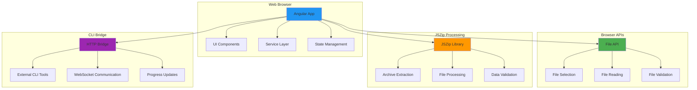
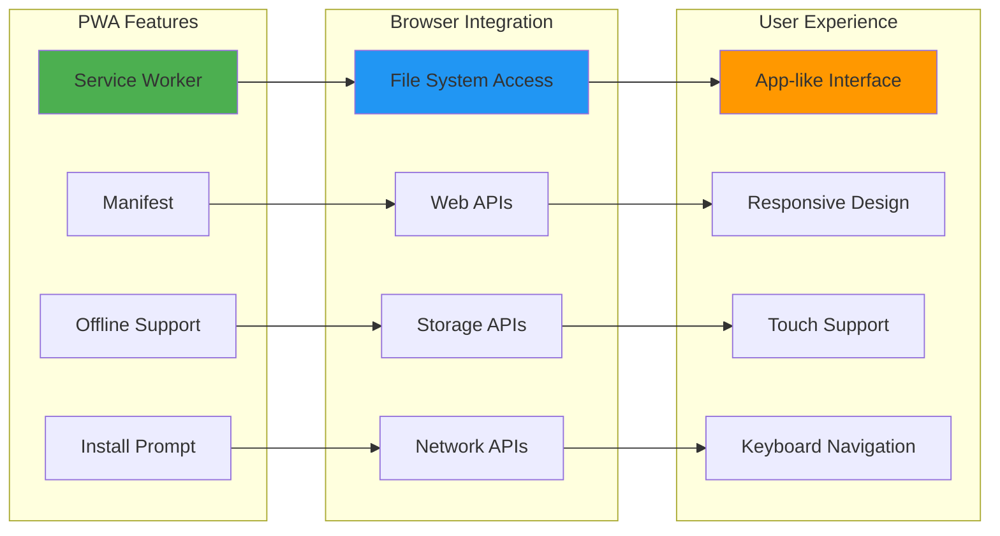
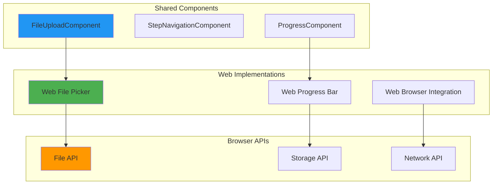
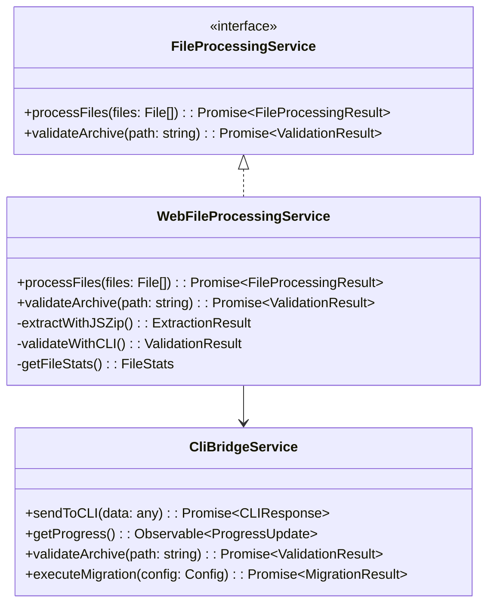

# 🌊 Flock Murmur - The Murmuration Bird's Dance

> *"Like the murmuration of starlings creating beautiful patterns in the sky, Flock Murmur dances gracefully through web browsers, creating seamless migration experiences accessible from anywhere in the world."*

## 🌊 **Purpose & Philosophy**

Flock Murmur is our **web deployment bird** - it dances gracefully through browsers, providing cloud-ready migration experiences accessible from any device with a web browser. Like the murmuration bird's synchronized flight patterns, Murmur creates beautiful, coordinated user experiences that work seamlessly across different browsers and devices.

### **Why the Murmuration Bird?**
- **🌊 Graceful Movement** - Represents the fluid, responsive web experience
- **🔄 Synchronized Patterns** - Multiple users working in harmony
- **🌍 Global Reach** - Accessible from anywhere in the world
- **🎨 Beautiful Displays** - Creates stunning visual experiences

## 🎯 **Use Cases**

### **Primary Purposes**
1. **🌐 Web Deployment** - Accessible from any web browser
2. **☁️ Cloud Processing** - Server-side migration capabilities
3. **📱 Cross-Platform** - Works on desktop, tablet, and mobile
4. **🔗 Easy Sharing** - Simple URL sharing and collaboration
5. **🚀 Quick Start** - No installation required

### **What Murmur Excels At**
- **Browser Compatibility** - Works in all modern browsers
- **Responsive Design** - Adapts to any screen size
- **Progressive Web App** - App-like experience in the browser
- **Offline Capabilities** - Basic functionality without internet

## 🏗️ **Architecture Overview**

### **Browser-Based Architecture**

### **Progressive Web App Features**

## 🔧 **Key Features**

### **Browser File Processing**
- **File API Integration** - Native browser file handling
- **JSZip Processing** - Client-side archive extraction
- **Drag & Drop** - Intuitive file selection
- **File Validation** - Real-time validation feedback

### **CLI Bridge Integration**
- **HTTP Communication** - Bridge to external CLI tools
- **WebSocket Updates** - Real-time progress communication
- **RESTful API** - Standard web service integration
- **Error Handling** - Graceful fallback for failures

### **Progressive Web App**
- **Service Worker** - Offline functionality and caching
- **App Manifest** - Installable web application
- **Responsive Design** - Works on all screen sizes
- **Touch Support** - Mobile-optimized interactions

### **Cross-Browser Compatibility**
- **Modern Browsers** - Chrome, Firefox, Safari, Edge
- **Mobile Browsers** - iOS Safari, Chrome Mobile
- **Feature Detection** - Graceful degradation for older browsers
- **Polyfills** - Support for missing browser features

## 🧩 **Component Architecture**

### **Web Component Pattern**

### **Service Integration**

## 🚀 **Development Workflow**

### **Getting Started**
1. **Clone Repository** - Get the latest code
2. **Install Dependencies** - `npm install`
3. **Start Development** - `ng serve flock-murmur`
4. **Open Browser** - Navigate to the development URL
5. **Test Features** - Test file upload and processing

### **Adding Web Features**
1. **Browser APIs** - Integrate new browser capabilities
2. **Service Workers** - Add offline functionality
3. **PWA Features** - Enhance progressive web app capabilities
4. **Testing** - Test across different browsers and devices
5. **Documentation** - Update architecture documentation

## 🔄 **Integration with Other Birds**

### **Shared Components**
Murmur uses the same components as other birds:
- **File Upload** - Same interface, web implementation
- **Step Navigation** - Same navigation patterns
- **Progress Tracking** - Same progress indicators
- **Theme Toggle** - Same theming system

### **Service Interfaces**
Murmur implements the same service interfaces:
- **FileProcessingService** - Web file operations
- **BlueskyService** - Web API integration
- **InstagramService** - Web data processing
- **ProgressService** - Real-time progress updates

## 🎯 **Best Practices**

### **Web Development**
- **Progressive Enhancement** - Start with basic functionality, enhance progressively
- **Feature Detection** - Check for browser capabilities before using them
- **Performance** - Optimize for mobile devices and slow connections
- **Accessibility** - Ensure WCAG compliance across all browsers

### **PWA Development**
- **Service Worker** - Implement robust offline functionality
- **Caching Strategy** - Cache resources for offline use
- **Install Experience** - Make installation seamless and intuitive
- **Update Management** - Handle app updates gracefully

## 🚀 **Future Enhancements**

### **Advanced Web Features**
- **WebAssembly** - Use WASM for compute-intensive operations
- **Web Workers** - Background processing for better performance
- **IndexedDB** - Advanced client-side storage
- **WebRTC** - Peer-to-peer communication capabilities

### **Enhanced PWA Features**
- **Push Notifications** - Keep users informed of migration progress
- **Background Sync** - Sync data when connection is restored
- **App Shortcuts** - Quick access to common actions
- **Share API** - Easy sharing of migration results

---

*"Like the murmuration of starlings creating beautiful patterns in the sky, Flock Murmur dances gracefully through web browsers, creating seamless migration experiences accessible from anywhere in the world."*
