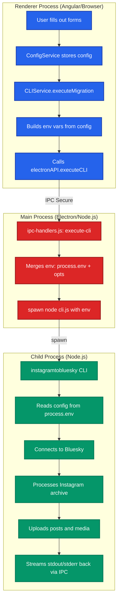

# 🦅 Flock Native - CLI Integration Guide

## Overview

Flock Native uses a **hybrid architecture** where the Angular UI collects configuration and the real `@straiforos/instagramtobluesky` CLI handles the actual migration via Electron IPC.

## Architecture

## Configuration Flow

### 1. User Configures via UI

Configuration is collected through the Angular UI forms and stored in the ConfigService:
- **Auth Step**: [`src/app/steps/auth/auth.ts`](../../../projects/shared/src/lib/steps/auth/auth.ts)
- **Config Step**: [`src/app/steps/config/config.ts`](../../../projects/shared/src/lib/steps/config/config.ts)
- **Config Service**: [`projects/shared/src/lib/services/config.service.ts`](../../../projects/shared/src/lib/services/config.service.ts)

The configuration includes:
- Bluesky credentials (username with @ prefix for UX)
- Date range filters
- Simulation mode settings

### 2. CLIService Builds Environment Variables

The CLIService transforms the UI configuration into environment variables for the CLI:
- **CLI Service**: [`src/app/service/cli/cli.service.ts`](../../../projects/flock-native/src/app/service/cli/cli.service.ts)
- **Environment Building**: The service strips the @ prefix from usernames for AT Protocol authentication
- **Variable Mapping**: Converts Angular config to CLI environment variables

Key transformations:
- `@user.bsky.social` → `user.bsky.social` (removes @ prefix)
- Date objects → ISO string format
- Boolean flags → string values for environment variables

### 3. Electron Spawns CLI Process

The main process handles CLI execution through IPC handlers:
- **IPC Handlers**: [`electron/ipc-handlers.js`](../../../projects/flock-native/electron/ipc-handlers.js)
- **CLI Handlers**: [`electron/handlers/cli-handlers.js`](../../../projects/flock-native/electron/handlers/cli-handlers.js)
- **Process Spawning**: Uses Node.js spawn to execute the CLI with merged environment variables

The process:
1. Receives environment variables from renderer process
2. Merges with system environment variables
3. Spawns the CLI process with the combined environment
4. Sets up stdout/stderr streaming for progress monitoring

### 4. CLI Reads Configuration

The external CLI package reads configuration from environment variables:
- **CLI Package**: `@straiforos/instagramtobluesky` (external dependency)
- **Config Loading**: The CLI reads from `process.env` variables
- **Environment Variables**: Uses standard environment variable names for configuration

The CLI processes:
- Bluesky authentication credentials
- Archive folder path
- Date range filters
- Simulation mode flags
- All other migration settings

## Progress Monitoring

### CLI Output Streaming

The CLI outputs progress information via stdout that gets streamed back to the UI:
- **Output Format**: Structured logging with timestamps and progress indicators
- **Streaming**: Real-time output forwarding through IPC
- **Progress Parsing**: Angular service parses output for progress updates

### IPC Streaming

The main process forwards CLI output to the renderer process:
- **IPC Handlers**: [`electron/ipc-handlers.js`](../../../projects/flock-native/electron/ipc-handlers.js)
- **Output Forwarding**: Main process listens to child process stdout/stderr
- **Message Format**: Structured data with process ID, type, and content

### Angular Subscribes

The Angular application receives and processes CLI output:
- **CLI Service**: [`src/app/service/cli/cli.service.ts`](../../../projects/flock-native/src/app/service/cli/cli.service.ts)
- **Output Subscription**: Service subscribes to IPC output stream
- **Progress Parsing**: Extracts progress percentages and status updates
- **UI Updates**: Updates splash screen and progress indicators

## Implementation Details

### Files Modified/Created

#### **Angular Services** ([`src/app/service/`](../../../projects/flock-native/src/app/service/))
- [`bluesky/bluesky.ts`](../../../projects/flock-native/src/app/service/bluesky/bluesky.ts) - Validates credentials (real auth happens in CLI)
- [`cli/cli.service.ts`](../../../projects/flock-native/src/app/service/cli/cli.service.ts) - Builds config, executes CLI via IPC
- [`native-file-processor/native-file-processor.ts`](../../../projects/flock-native/src/app/service/native-file-processor/native-file-processor.ts) - Extracts archive, provides path

#### **Electron IPC** ([`electron/`](../../../projects/flock-native/electron/))
- [`ipc-handlers.js`](../../../projects/flock-native/electron/ipc-handlers.js) - Spawns CLI with merged environment
- [`preload.js`](../../../projects/flock-native/electron/preload.js) - Exposes `executeCLI()` to renderer

#### **Resolvers** ([`src/app/resolvers/`](../../../projects/flock-native/src/app/resolvers/))
- [`migrate-run.resolver.ts`](../../../projects/flock-native/src/app/resolvers/migrate-run.resolver.ts) - Orchestrates migration execution

### Environment Variable Mapping

| UI Config | Environment Variable | CLI Config Method | Notes |
|-----------|---------------------|-------------------|-------|
| `blueskyCredentials.username` | `BLUESKY_USERNAME` | `getBlueskyUsername()` | **@ prefix stripped** |
| `blueskyCredentials.password` | `BLUESKY_PASSWORD` | `getBlueskyPassword()` | |
| Extracted archive path | `ARCHIVE_FOLDER` | `getArchiveFolder()` | Ignored if test mode enabled |
| `startDate` | `MIN_DATE` | `getMinDate()` | |
| `endDate` | `MAX_DATE` | `getMaxDate()` | |
| `simulationMode` | `SIMULATE` | `isSimulateEnabled()` | |
| `testVideoMode` | `TEST_VIDEO_MODE` | `isTestModeEnabled()` | Uses test data instead of archive |

## CLI Package Details

### Package: `@straiforos/instagramtobluesky`

**Entry Point:** `dist/main.js`

**Key Features:**
- Instagram archive parsing
- Media processing (images/videos)
- Bluesky authentication
- Post creation with media
- Date range filtering
- Simulation mode (dry-run)
- Progress logging

**Logging:**
Uses `pino` logger with structured JSON output for progress tracking and debugging.

## Testing

### Test Video Mode (Fastest Testing)

Test with a single video without uploading your real archive:
- **Configuration**: Enable "Test Video Mode" in the config step
- **Test Data**: Uses [`transfer/test_video/`](../../../projects/flock-native/transfer/test_video/) directory
- **CLI Service**: [`src/app/service/cli/cli.service.ts`](../../../projects/flock-native/src/app/service/cli/cli.service.ts) handles test mode

### Dry-Run Mode (Full Archive, No Posting)

Test with your real archive without actually posting:
- **Configuration**: Enable "Simulation Mode" in the config step
- **Archive Processing**: Uses real Instagram archive data
- **No Posting**: CLI runs in dry-run mode without creating posts

### Real Migration

Same flow but **disable** simulation mode:
- CLI authenticates with Bluesky
- Uploads media
- Creates posts
- Full migration with real data
- Rate-limited (3 seconds per post)

## Error Handling

### CLI Errors

The main process handles CLI exit codes and errors:
- **Exit Code Handling**: [`electron/ipc-handlers.js`](../../../projects/flock-native/electron/ipc-handlers.js) monitors child process exit codes
- **Error Forwarding**: Errors are forwarded to the renderer process via IPC
- **Logging**: CLI errors are logged and displayed to the user

### Common Issues

| Issue | Cause | Solution |
|-------|-------|----------|
| `ARCHIVE_FOLDER not found` | Wrong extraction path | Check extracted archive location |
| `BLUESKY_USERNAME required` | Missing credentials | Ensure auth step completed |
| `Authentication failed` | Wrong password | Verify app password (not account password) |
| `Rate limit exceeded` | Too many requests | CLI handles automatically (3s delay) |

## Progress Parsing

The CLI outputs structured logs that can be parsed for progress:
- **Progress Parsing**: [`src/app/service/cli/cli.service.ts`](../../../projects/flock-native/src/app/service/cli/cli.service.ts) contains parsing logic
- **Output Format**: CLI outputs "Imported X posts with Y media" format
- **Progress Updates**: Parsed progress updates the UI splash screen
