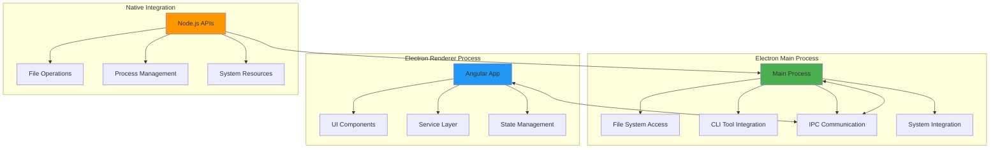
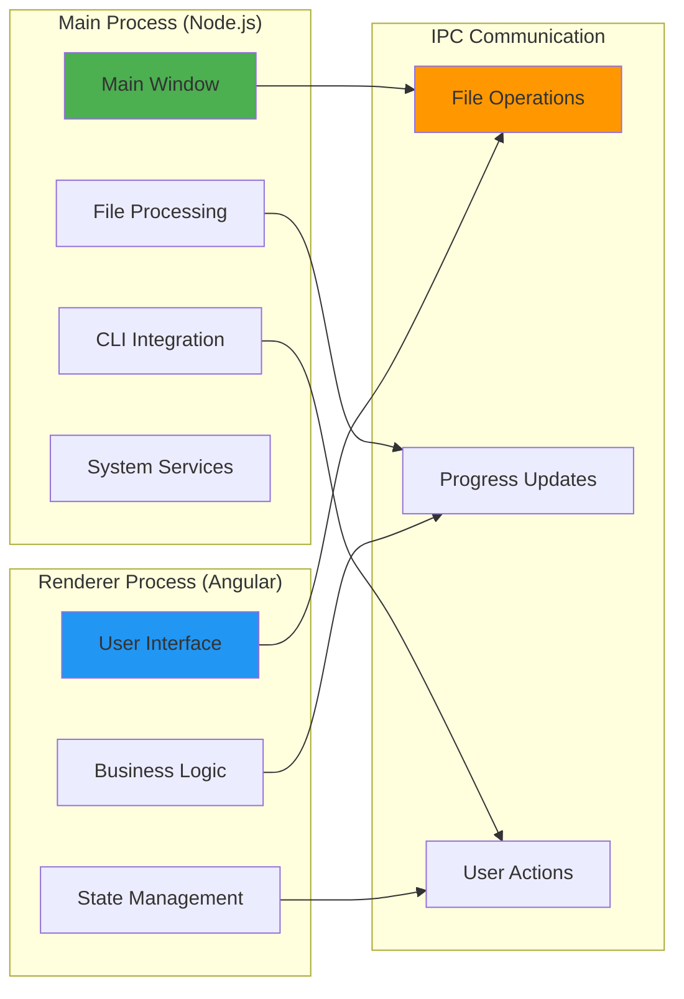
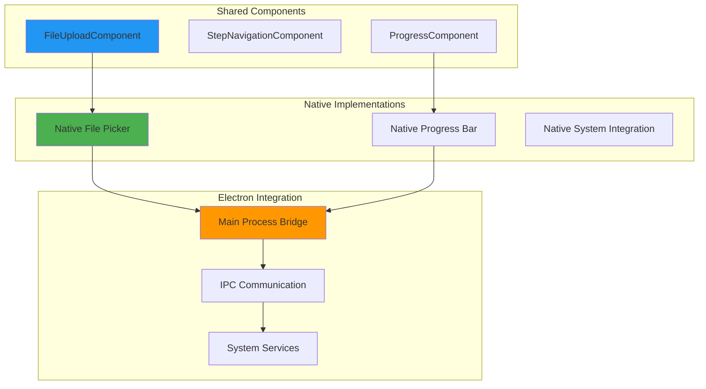
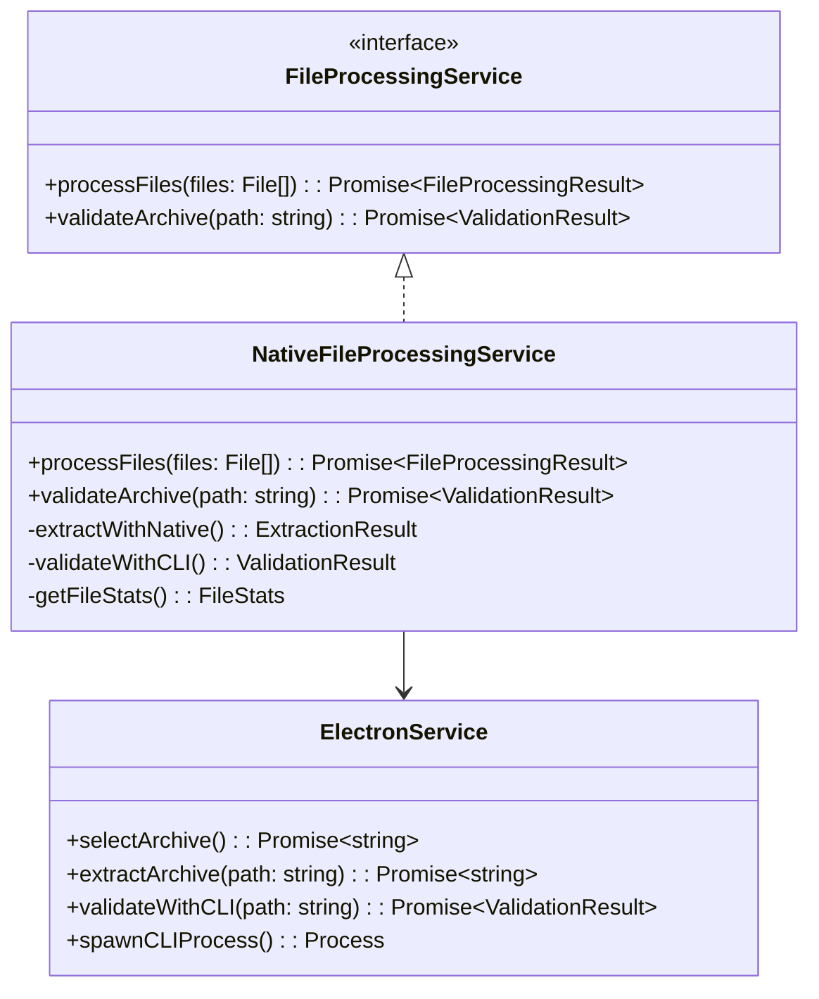

# 🦅 Flock Native - The Eagle's Vision

> *"Like the eagle soaring high above the mountains, Flock Native provides the highest vantage point with full desktop power. Built on Electron, it soars with native performance and offline capabilities."*

## 🦅 **Purpose & Philosophy**

Flock Native is our **desktop power bird** - it soars with full system access, offline processing capabilities, and native performance. Like the eagle's keen vision that sees far and wide, Native provides the most comprehensive migration experience with direct access to the file system and CLI tools.

### **Why the Eagle?**
- **🦅 Soaring High** - Represents the highest level of capability and performance
- **🔍 Keen Vision** - Sees and processes everything with clarity
- **💪 Powerful Flight** - Handles the heaviest workloads with ease
- **🏔️ Mountain Home** - Thrives in the most challenging environments

## 🎯 **Use Cases**

### **Primary Purposes**
1. **💻 Desktop Users** - Native desktop application experience
2. **🔒 Offline Processing** - Work without internet connectivity
3. **📁 Large Archives** - Handle massive Instagram export files
4. **⚡ Performance** - Maximum speed with native file operations
5. **🔧 Advanced Users** - Full control over migration process

### **What Native Excels At**
- **File Processing** - Direct access to file system and archives
- **CLI Integration** - Direct execution of migration tools
- **Performance** - Native Node.js operations without browser overhead
- **Offline Work** - Complete migration without internet dependency

## 🏗️ **Architecture Overview**

### **Electron-Based Architecture**

### **Process Architecture**

## 🔧 **Key Features**

### **Native File Operations**
- **Direct File Access** - Bypass browser security restrictions
- **Archive Extraction** - Native ZIP processing with maximum performance
- **Large File Support** - Handle archives of any size
- **File System Integration** - Native file picker and save dialogs

### **CLI Tool Integration**
- **Direct Execution** - Spawn CLI processes directly
- **Real-time Communication** - IPC with running migration tools
- **Progress Monitoring** - Live updates from CLI operations
- **Error Handling** - Direct access to CLI error output

### **Performance Features**
- **Native Speed** - No browser overhead or sandboxing
- **Multi-threading** - Utilize all CPU cores for processing
- **Memory Management** - Direct control over resource usage
- **Optimized I/O** - Native file system operations

## 🧩 **Component Architecture**

### **Native Component Pattern**

### **Service Integration**

## 🚀 **Development Workflow**

### **Getting Started**
1. **Clone Repository** - Get the latest code
2. **Install Dependencies** - `npm install`
3. **Start Development** - `ng serve flock-native`
4. **Build Electron** - `ng build flock-native && electron .`
5. **Debug Mode** - Use Electron DevTools for debugging

### **Adding Native Features**
1. **Main Process** - Add Node.js functionality in main process
2. **IPC Communication** - Define communication protocol between processes
3. **Renderer Integration** - Update Angular services to use IPC
4. **Testing** - Test both main and renderer processes
5. **Documentation** - Update architecture documentation

## 🔄 **Integration with Other Birds**

### **Shared Components**
Native uses specialized components for native functionality:
- **Native File Upload** - [`src/app/components/native-file-upload/native-file-upload.ts`](../../../projects/flock-native/src/app/components/native-file-upload/native-file-upload.ts)
- **Step Navigation** - Same navigation patterns as shared components
- **Progress Tracking** - Same progress indicators
- **Theme Toggle** - Same theming system

### **Service Interfaces**
Native implements the same service interfaces:
- **FileProcessingService** - Native file operations
- **BlueskyService** - Direct API integration
- **InstagramService** - Native data processing
- **ProgressService** - Real-time progress updates

## 🎯 **Best Practices**

### **Electron Development**
- **Process Separation** - Keep main and renderer processes separate
- **IPC Design** - Design clear communication protocols
- **Error Handling** - Handle process crashes gracefully
- **Security** - Follow Electron security best practices

### **Performance Optimization**
- **Lazy Loading** - Load components and services on demand
- **Memory Management** - Monitor and optimize memory usage
- **Background Processing** - Use web workers for heavy operations
- **Caching** - Cache frequently accessed data

---

*"Like the eagle soaring high above the mountains, Flock Native provides the highest vantage point with full desktop power. We soar where others cannot reach."*
