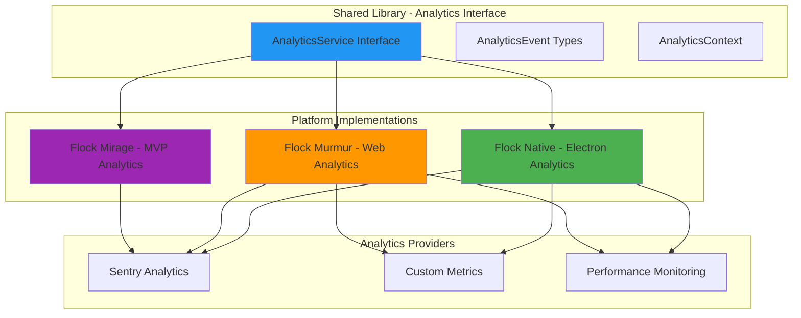

# 📊 Analytics Architecture - Understanding the Flock's Flight Patterns

> *"Like ornithologists studying migration patterns, we track our users' journeys to better understand and improve their experience. Analytics help us see where our flock soars and where they need support."*

## 🎯 **Purpose & Philosophy**

Analytics in the Flock ecosystem serves multiple purposes beyond error tracking:

- **📊 Usage Insights** - Understand how users interact with each migration step
- **🚀 Performance Monitoring** - Track performance across different platforms
- **🔍 User Behavior** - Identify friction points in the migration workflow
- **📈 Feature Adoption** - Measure which features users engage with
- **🎯 Conversion Tracking** - Monitor successful migration completion rates

### **Analytics vs Error Tracking**

We use Sentry for both error tracking AND analytics:

| Purpose | Sentry Feature | Use Case |
|---------|---------------|----------|
| **Error Tracking** | `captureException()` | Track crashes and errors |
| **Performance** | Transactions & Spans | Monitor step timing and performance |
| **User Analytics** | Custom Events | Track user actions and workflows |
| **Breadcrumbs** | `addBreadcrumb()` | Understand user context before errors |
| **Custom Metrics** | Metrics API | Track business KPIs |

## 🏗️ **Architecture Overview**

### **Multi-Platform Analytics Strategy**



### **Analytics Service Interface Design**

The shared library provides a platform-agnostic analytics interface:

```typescript
// projects/shared/src/lib/services/interfaces/analytics.ts

export interface AnalyticsService {
  /**
   * Initialize analytics for the application
   * @param appName The name of the application (flock-native, flock-murmur, etc.)
   * @param config Analytics configuration from environment
   */
  instrument(appName: string, config?: AnalyticsConfig): Promise<void>;
  
  /**
   * Track a custom event (user action, workflow step, etc.)
   * @param eventName The name of the event
   * @param properties Additional event properties
   */
  trackEvent(eventName: string, properties?: Record<string, any>): void;
  
  /**
   * Start a performance transaction (for timing workflows)
   * @param name Transaction name
   * @param context Additional context
   * @returns Transaction handle
   */
  startTransaction(name: string, context?: TransactionContext): Transaction | null;
  
  /**
   * Set user context for analytics
   * @param userId Anonymous user ID
   * @param properties Additional user properties
   */
  setUser(userId: string, properties?: Record<string, any>): void;
  
  /**
   * Set custom context (app state, migration config, etc.)
   * @param contextName Context category
   * @param data Context data
   */
  setContext(contextName: string, data: Record<string, any>): void;
  
  /**
   * Track a page view or route change
   * @param routeName Route/page name
   * @param properties Additional properties
   */
  trackPageView(routeName: string, properties?: Record<string, any>): void;
}

export interface AnalyticsConfig {
  dsn?: string;
  environment?: string;
  enablePerformance?: boolean;
  enableAnalytics?: boolean;
  sampleRate?: number;
}

export interface TransactionContext {
  op?: string;
  tags?: Record<string, string>;
  data?: Record<string, any>;
}

export interface Transaction {
  finish(): void;
  setTag(key: string, value: string): void;
  setData(key: string, value: any): void;
  startChild(context: TransactionContext): Transaction;
}
```

## 📊 **Event Taxonomy**

### **Standard Event Categories**

Following Sentry's analytics best practices, we categorize events:

#### **1. User Workflow Events**
Track user progress through migration steps:

```typescript
// Step navigation events
analytics.trackEvent('step_started', {
  step_name: 'upload',
  step_index: 1,
  total_steps: 5
});

analytics.trackEvent('step_completed', {
  step_name: 'upload',
  duration_ms: 1234,
  files_selected: 1
});

analytics.trackEvent('step_skipped', {
  step_name: 'config',
  reason: 'user_back_navigation'
});
```

#### **2. Feature Usage Events**
Track feature adoption and usage:

```typescript
// Feature interactions
analytics.trackEvent('feature_used', {
  feature_name: 'dark_mode_toggle',
  feature_value: 'dark'
});

analytics.trackEvent('archive_validated', {
  archive_size_mb: 250,
  validation_duration_ms: 450,
  validation_result: 'success'
});

analytics.trackEvent('migration_configured', {
  media_mode: 'all',
  post_limit: 100,
  include_archived: true
});
```

#### **3. Conversion Events**
Track successful completions:

```typescript
// Migration milestones
analytics.trackEvent('migration_started', {
  total_posts: 500,
  total_media: 1200,
  estimated_duration_min: 30
});

analytics.trackEvent('migration_completed', {
  total_posts_migrated: 500,
  total_media_uploaded: 1200,
  duration_min: 28,
  success_rate: 0.98
});
```

#### **4. Error Events**
Track user-facing errors (separate from exceptions):

```typescript
analytics.trackEvent('validation_failed', {
  validation_type: 'archive_structure',
  error_message: 'Missing posts directory',
  user_action: 'file_selection'
});
```

### **Performance Transactions**

Track timing for key workflows:

```typescript
// Track entire migration workflow
const migrationTx = analytics.startTransaction('migration_workflow', {
  op: 'workflow',
  tags: { platform: 'electron' }
});

// Track individual steps
const uploadSpan = migrationTx.startChild({
  op: 'step',
  data: { step_name: 'upload' }
});
uploadSpan.finish();

const authSpan = migrationTx.startChild({
  op: 'step',
  data: { step_name: 'auth' }
});
authSpan.finish();

migrationTx.finish();
```

## 🔧 **Implementation Strategy**

### **Phase 1: Shared Analytics Interface** ✅

**Goal**: Create platform-agnostic analytics service

**Deliverables**:
1. `AnalyticsService` interface in shared library
2. `SentryAnalytics` implementation extending `SentryLogger`
3. Event type definitions and constants
4. Transaction helpers and utilities

**Files to Create/Modify**:
- `projects/shared/src/lib/services/interfaces/analytics.ts` (new)
- `projects/shared/src/lib/services/sentry-analytics.ts` (new)
- `projects/shared/src/lib/services/sentry-logger.ts` (extend)
- `projects/shared/src/lib/services/index.ts` (export)

### **Phase 2: Flock Native Analytics** 🦅

**Goal**: Implement analytics for Electron desktop app

**Platform-Specific Considerations**:
- **Main Process Analytics**: Track IPC operations, file processing
- **Renderer Process Analytics**: Track UI interactions, user workflows
- **Offline Support**: Queue analytics events when offline
- **Privacy**: Respect user privacy settings, no PII collection

**Implementation**:

```typescript
// projects/flock-native/src/app/service/native-analytics.ts

import { Injectable } from '@angular/core';
import { SentryAnalytics } from 'shared';

@Injectable({
  providedIn: 'root'
})
export class NativeAnalytics extends SentryAnalytics {
  override async instrument(appName: string, config?: AnalyticsConfig): Promise<void> {
    await super.instrument(appName, config);
    
    // Electron-specific setup
    this.setupElectronContext();
    this.trackAppStartup();
  }
  
  private setupElectronContext(): void {
    // Get Electron-specific information
    const platform = window.electronAPI?.platform;
    const version = window.electronAPI?.version;
    
    this.setContext('electron', {
      platform,
      version,
      is_packaged: window.electronAPI?.isPackaged
    });
  }
  
  private trackAppStartup(): void {
    this.trackEvent('app_launched', {
      launch_type: window.electronAPI?.isPackaged ? 'production' : 'development',
      platform: window.electronAPI?.platform
    });
  }
}
```

**Main Process Analytics**:

```javascript
// projects/flock-native/electron/analytics-manager.js

class AnalyticsManager {
  constructor(sentryManager) {
    this.sentry = sentryManager;
  }
  
  trackFileOperation(operation, details) {
    if (!this.sentry.isAvailable()) return;
    
    this.sentry.addBreadcrumb({
      category: 'file_operation',
      message: operation,
      level: 'info',
      data: details
    });
  }
  
  trackIPCCall(channel, duration) {
    if (!this.sentry.isAvailable()) return;
    
    this.sentry.addBreadcrumb({
      category: 'ipc',
      message: `IPC: ${channel}`,
      level: 'info',
      data: { channel, duration_ms: duration }
    });
  }
}

module.exports = AnalyticsManager;
```

**Deliverables**:
1. `NativeAnalytics` service extending `SentryAnalytics`
2. Main process `AnalyticsManager`
3. IPC analytics helpers
4. Electron-specific event tracking

### **Phase 3: Flock Murmur Analytics** 🌊

**Goal**: Implement analytics for web deployment (Vercel)

**Platform-Specific Considerations**:
- **Browser Environment**: Web-specific APIs and limitations
- **Vercel Integration**: Edge function analytics, serverless metrics
- **Session Tracking**: Track user sessions across page reloads
- **Performance**: Web Vitals integration (LCP, FID, CLS)

**Implementation**:

```typescript
// projects/flock-murmur/src/app/service/web-analytics.ts

import { Injectable } from '@angular/core';
import { SentryAnalytics } from 'shared';
import { Router, NavigationEnd } from '@angular/router';

@Injectable({
  providedIn: 'root'
})
export class WebAnalytics extends SentryAnalytics {
  constructor(private router: Router) {
    super();
  }
  
  override async instrument(appName: string, config?: AnalyticsConfig): Promise<void> {
    await super.instrument(appName, config);
    
    // Web-specific setup
    this.setupWebContext();
    this.trackWebVitals();
    this.setupRouteTracking();
  }
  
  private setupWebContext(): void {
    this.setContext('browser', {
      user_agent: navigator.userAgent,
      language: navigator.language,
      viewport: `${window.innerWidth}x${window.innerHeight}`,
      connection_type: (navigator as any).connection?.effectiveType
    });
  }
  
  private trackWebVitals(): void {
    // Track Core Web Vitals
    if ('web-vital' in window) {
      // Integration with web-vitals library
      import('web-vitals').then(({ getCLS, getFID, getLCP }) => {
        getCLS((metric) => this.trackEvent('web_vital', { name: 'CLS', value: metric.value }));
        getFID((metric) => this.trackEvent('web_vital', { name: 'FID', value: metric.value }));
        getLCP((metric) => this.trackEvent('web_vital', { name: 'LCP', value: metric.value }));
      });
    }
  }
  
  private setupRouteTracking(): void {
    this.router.events.subscribe(event => {
      if (event instanceof NavigationEnd) {
        this.trackPageView(event.urlAfterRedirects, {
          previous_url: event.url
        });
      }
    });
  }
}
```

**Vercel-Specific Analytics**:

For Vercel deployments, we can also integrate with Vercel Analytics:

```typescript
// Optional: Vercel Analytics integration
import { inject } from '@vercel/analytics';

export class WebAnalytics extends SentryAnalytics {
  override async instrument(appName: string, config?: AnalyticsConfig): Promise<void> {
    await super.instrument(appName, config);
    
    // Enable Vercel Analytics if available
    if (typeof window !== 'undefined' && config?.enableVercelAnalytics) {
      inject();
    }
  }
}
```

**Deliverables**:
1. `WebAnalytics` service extending `SentryAnalytics`
2. Router integration for page tracking
3. Web Vitals integration
4. Optional Vercel Analytics integration

### **Phase 4: Integration Points** 🔗

**Goal**: Integrate analytics throughout the application

**Key Integration Points**:

#### **1. Component-Level Tracking**

```typescript
// Shared step components
export class ConfigComponent implements OnInit {
  constructor(@Inject(ANALYTICS) private analytics: AnalyticsService) {}
  
  ngOnInit() {
    this.analytics.trackEvent('step_started', {
      step_name: 'config',
      step_index: 3
    });
  }
  
  onSubmit() {
    const tx = this.analytics.startTransaction('config_submission', {
      op: 'user_action'
    });
    
    // Process config...
    
    this.analytics.trackEvent('migration_configured', {
      media_mode: this.configForm.value.mediaMode,
      post_limit: this.configForm.value.postLimit
    });
    
    tx?.finish();
  }
}
```

#### **2. Service-Level Tracking**

```typescript
// File processing service
export class NativeFileProcessor implements FileProcessor {
  constructor(@Inject(ANALYTICS) private analytics: AnalyticsService) {}
  
  async processArchive(file: File): Promise<ProcessResult> {
    const tx = this.analytics.startTransaction('archive_processing', {
      op: 'file_processing',
      data: { file_size: file.size }
    });
    
    try {
      const result = await this.extractArchive(file);
      
      this.analytics.trackEvent('archive_processed', {
        file_size_mb: file.size / 1024 / 1024,
        duration_ms: tx?.duration,
        status: 'success'
      });
      
      return result;
    } catch (error) {
      this.analytics.trackEvent('archive_processing_failed', {
        error_message: error.message
      });
      throw error;
    } finally {
      tx?.finish();
    }
  }
}
```

#### **3. Router Guard Tracking**

```typescript
// Navigation guards
export class StepGuard implements CanActivate {
  constructor(@Inject(ANALYTICS) private analytics: AnalyticsService) {}
  
  canActivate(route: ActivatedRouteSnapshot): boolean {
    const canActivate = this.validateStep(route);
    
    if (!canActivate) {
      this.analytics.trackEvent('navigation_blocked', {
        target_step: route.data['stepName'],
        reason: 'missing_prerequisites'
      });
    }
    
    return canActivate;
  }
}
```

## 🎨 **UI Considerations**

### **Analytics Consent & Privacy**

We should respect user privacy and provide transparency:

#### **1. Privacy Settings Component**

```typescript
// Shared privacy settings component
@Component({
  selector: 'app-privacy-settings',
  template: `
    <mat-slide-toggle [(ngModel)]="analyticsEnabled" (change)="onAnalyticsToggle()">
      Share anonymous usage analytics
    </mat-slide-toggle>
    <p class="privacy-note">
      Help us improve by sharing anonymous usage data. No personal information is collected.
    </p>
  `
})
export class PrivacySettingsComponent {
  analyticsEnabled = true;
  
  constructor(@Inject(ANALYTICS) private analytics: AnalyticsService) {}
  
  onAnalyticsToggle() {
    if (this.analyticsEnabled) {
      this.analytics.enable();
    } else {
      this.analytics.disable();
    }
  }
}
```

#### **2. Analytics Status Indicator**

For development/debugging, show analytics status:

```typescript
@Component({
  selector: 'app-analytics-status',
  template: `
    <div class="analytics-status" *ngIf="!production">
      <mat-icon>analytics</mat-icon>
      <span>Analytics: {{ status }}</span>
    </div>
  `
})
export class AnalyticsStatusComponent implements OnInit {
  status = 'initializing';
  production = environment.production;
  
  constructor(@Inject(ANALYTICS) private analytics: AnalyticsService) {}
  
  async ngOnInit() {
    this.status = await this.analytics.getStatus();
  }
}
```

## 📈 **Key Metrics to Track**

### **Migration Success Metrics**

| Metric | Event | Purpose |
|--------|-------|---------|
| **Migration Start Rate** | `migration_started` | % of users who begin migration |
| **Migration Completion Rate** | `migration_completed` | % of users who finish migration |
| **Step Abandonment Rate** | `step_abandoned` | Where users drop off |
| **Average Migration Time** | Transaction duration | Performance benchmark |
| **Error Rate by Step** | `step_error` | Identify problematic steps |

### **Feature Adoption Metrics**

| Metric | Event | Purpose |
|--------|-------|---------|
| **Dark Mode Usage** | `feature_used: dark_mode_toggle` | Theme preference |
| **Media Mode Distribution** | `migration_configured: media_mode` | Feature usage |
| **Archive Size Distribution** | `archive_validated: archive_size_mb` | Resource planning |
| **Platform Distribution** | Context: `platform` | Platform optimization |

### **Performance Metrics**

| Metric | Transaction | Purpose |
|--------|-------------|---------|
| **Archive Extraction Time** | `archive_extraction` | Performance optimization |
| **Auth Flow Duration** | `auth_workflow` | UX improvement |
| **Config Step Duration** | `config_submission` | Form optimization |
| **Overall Migration Duration** | `migration_workflow` | End-to-end performance |

## 🔒 **Privacy & Compliance**

### **Data Collection Guidelines**

**DO Collect**:
- ✅ Anonymous usage patterns
- ✅ Feature adoption rates
- ✅ Performance metrics
- ✅ Error types and frequencies
- ✅ Platform/browser information

**DO NOT Collect**:
- ❌ Bluesky usernames or handles
- ❌ Instagram post content
- ❌ Personal information (emails, names)
- ❌ File paths or directory structures
- ❌ Authentication tokens or credentials

### **Implementation Safeguards**

```typescript
// Sanitize event properties before sending
export class SentryAnalytics implements AnalyticsService {
  trackEvent(eventName: string, properties?: Record<string, any>): void {
    const sanitized = this.sanitizeProperties(properties);
    
    Sentry.captureEvent({
      message: eventName,
      level: 'info',
      contexts: {
        analytics: sanitized
      }
    });
  }
  
  private sanitizeProperties(props?: Record<string, any>): Record<string, any> {
    if (!props) return {};
    
    const sanitized = { ...props };
    
    // Remove sensitive keys
    const sensitiveKeys = ['username', 'password', 'token', 'email', 'filepath'];
    sensitiveKeys.forEach(key => {
      delete sanitized[key];
      // Also check nested objects
      Object.keys(sanitized).forEach(k => {
        if (typeof sanitized[k] === 'object' && sanitized[k] !== null) {
          delete sanitized[k][key];
        }
      });
    });
    
    return sanitized;
  }
}
```

## 🚀 **Rollout Plan**

### **Phase 1: Foundation (Week 1-2)**
- [ ] Create `AnalyticsService` interface in shared library
- [ ] Implement `SentryAnalytics` base class
- [ ] Add analytics injection token and provider
- [ ] Create event type definitions
- [ ] Write unit tests for analytics service

### **Phase 2: Flock Native Integration (Week 2-3)**
- [ ] Create `NativeAnalytics` implementation
- [ ] Add main process `AnalyticsManager`
- [ ] Integrate analytics in key components
- [ ] Add IPC operation tracking
- [ ] Test analytics in development mode

### **Phase 3: Flock Murmur Integration (Week 3-4)**
- [ ] Create `WebAnalytics` implementation
- [ ] Add router tracking integration
- [ ] Integrate Web Vitals
- [ ] Add optional Vercel Analytics
- [ ] Test analytics in Vercel preview deployments

### **Phase 4: Refinement & Documentation (Week 4-5)**
- [ ] Add privacy settings component
- [ ] Create analytics documentation
- [ ] Set up Sentry dashboards
- [ ] Create analytics playbook for developers
- [ ] Review and sanitize all tracked events

## 📚 **Developer Resources**

### **Analytics Best Practices**

1. **Event Naming Convention**: Use `snake_case` for event names
2. **Property Naming**: Use `snake_case` for property keys
3. **Transaction Naming**: Use `entity_action` format (e.g., `archive_extraction`)
4. **Context Setting**: Set context early in app lifecycle
5. **Error Handling**: Always finish transactions, even on errors

### **Testing Analytics**

```typescript
// Mock analytics service for testing
export class MockAnalyticsService implements AnalyticsService {
  events: Array<{ name: string; properties?: any }> = [];
  transactions: Array<{ name: string; context?: any }> = [];
  
  async instrument(appName: string): Promise<void> {}
  
  trackEvent(name: string, properties?: any): void {
    this.events.push({ name, properties });
  }
  
  startTransaction(name: string, context?: any): Transaction | null {
    this.transactions.push({ name, context });
    return {
      finish: () => {},
      setTag: () => {},
      setData: () => {},
      startChild: () => this.startTransaction('child', context)
    } as Transaction;
  }
  
  // ... other methods
}
```

### **Debugging Analytics**

Enable debug mode in development:

```typescript
// environment.ts
export const environment = {
  analytics: {
    debug: true, // Logs all analytics events to console
    enableInDevelopment: true
  }
};
```

## 🎯 **Success Criteria**

### **Technical Metrics**
- ✅ Analytics service available in all applications
- ✅ <100ms overhead for event tracking
- ✅ <1% analytics error rate
- ✅ 100% event sanitization coverage
- ✅ Graceful degradation when analytics unavailable

### **Business Metrics**
- ✅ Track 100% of user workflow steps
- ✅ Capture all critical conversion events
- ✅ Monitor all performance transactions
- ✅ 90%+ event delivery rate
- ✅ Privacy compliance for all tracked data

---

*"Analytics are like the migration patterns we track - they help us understand where our flock is going, where they struggle, and how we can make their journey better."*
