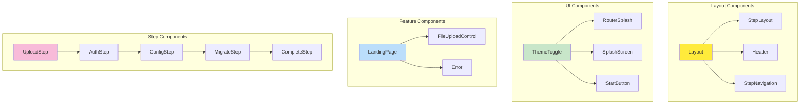
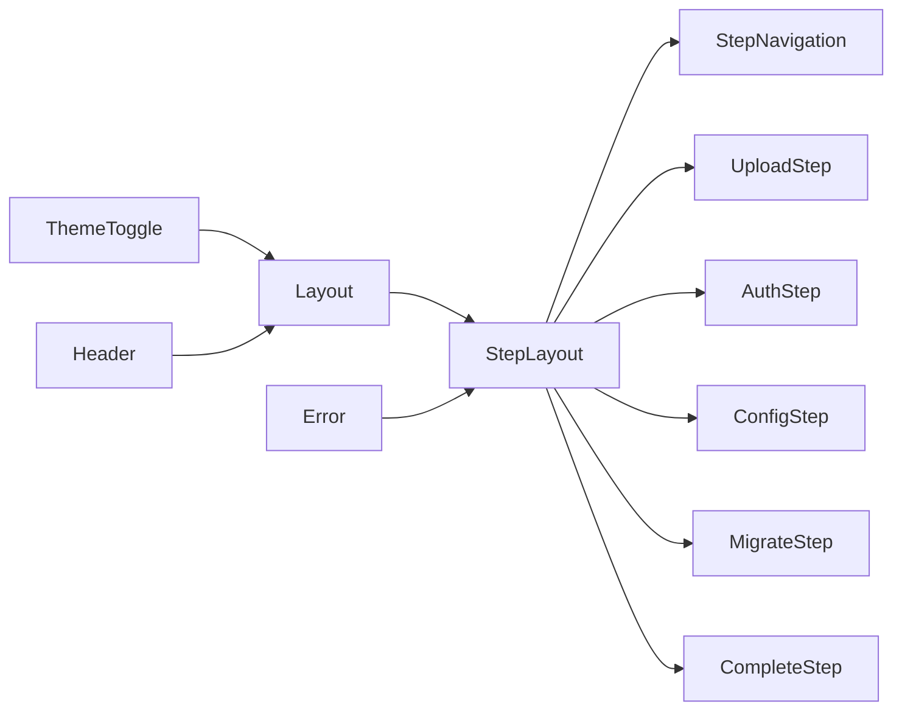

# 🧩 Shared Library Components

> *"Like a well-built nest, our shared components provide the foundation for all birds in the flock to build upon."*

## 🏗️ **Component Architecture Overview**

Our shared library provides a comprehensive set of reusable components that work across all three Flock applications. Each component follows Angular's modern standalone pattern and integrates seamlessly with our Config-First Architecture.



## 🎯 **Component Categories**

### **Layout Components**
The structural foundation of our applications:

- **[Layout](../../../projects/shared/src/lib/layout/layout.ts)** - Main application shell with navigation
- **[StepLayout](../../../projects/shared/src/lib/step-layout/step-layout.ts)** - Step-specific layout with progress tracking
- **[Header](../../../projects/shared/src/lib/header/header.ts)** - Application header with branding
- **[StepNavigation](../../../projects/shared/src/lib/step-navigation/step-navigation.ts)** - Step progression navigation

### **UI Components**
Reusable interface elements:

- **[ThemeToggle](../../../projects/shared/src/lib/theme-toggle/theme-toggle.ts)** - Dark/light mode switching
- **[RouterSplash](../../../projects/shared/src/lib/router-splash/router-splash.ts)** - Loading state during navigation
- **[SplashScreen](../../../projects/shared/src/lib/splash-screen/splash-screen.ts)** - Application startup screen
- **[StartButton](../../../projects/shared/src/lib/start-button/start-button.ts)** - Call-to-action button component

### **Feature Components**
Domain-specific functionality:

- **[LandingPage](../../../projects/shared/src/lib/landing-page/landing-page.ts)** - Welcome and introduction page
- **[FileUploadControl](../../../projects/shared/src/lib/controls/file-upload-control/file-upload-control.ts)** - File selection and validation
- **[Error](../../../projects/shared/src/lib/error/error.ts)** - Error display and handling

### **Step Components**
Migration workflow steps:

- **[UploadStep](../../../projects/shared/src/lib/steps/upload/upload.ts)** - File upload and validation
- **[AuthStep](../../../projects/shared/src/lib/steps/auth/auth.ts)** - Bluesky authentication
- **[ConfigStep](../../../projects/shared/src/lib/steps/config/config.ts)** - Migration configuration
- **[MigrateStep](../../../projects/shared/src/lib/steps/migrate/migrate.ts)** - Migration execution
- **[CompleteStep](../../../projects/shared/src/lib/steps/complete/complete.ts)** - Results and completion

## 🔧 **Component Design Patterns**

### **Standalone Components**
All components use Angular's standalone pattern for better tree-shaking and modularity:

```typescript
@Component({
  selector: 'app-example',
  standalone: true,
  imports: [CommonModule, ReactiveFormsModule],
  templateUrl: './example.html',
  styleUrl: './example.css'
})
export class ExampleComponent {
  // Component implementation
}
```

### **Reactive Forms Integration**
Components use Angular's reactive forms for consistent validation:

```typescript
export class ExampleComponent {
  form = this.fb.group({
    field: ['', [Validators.required, customValidator]]
  });
  
  constructor(private fb: FormBuilder) {}
}
```

### **Service Integration**
Components integrate with shared services through dependency injection:

```typescript
export class ExampleComponent {
  private configService = inject(ConfigService);
  private logger = inject<Logger>(LOGGER);
}
```

## 🎨 **Theming Integration**

All components support our Material Design theming system:

- **Color Schemes**: Primary, secondary, accent, and warning colors
- **Typography**: Consistent font families and sizing
- **Elevation**: Material Design shadow system
- **Responsive Design**: Mobile-first responsive breakpoints

## 🧪 **Testing Strategy**

Components follow our BDD testing methodology:

- **Unit Tests**: Individual component behavior
- **BDD Tests**: User scenario testing
- **Integration Tests**: Service interaction testing
- **Visual Tests**: Theme and responsive testing

## 📱 **Responsive Design**

All components are built mobile-first with responsive breakpoints:

- **Mobile**: 320px - 768px
- **Tablet**: 768px - 1024px
- **Desktop**: 1024px+

## 🔗 **Component Relationships**



## 🚀 **Usage Guidelines**

### **Importing Components**
```typescript
import { Layout, StepLayout } from 'shared';
```

### **Service Dependencies**
```typescript
import { ConfigService, LOGGER } from 'shared';
```

### **Theme Integration**
```scss
@use 'shared/theme' as theme;

.my-component {
  @include theme.component-theme();
}
```

## 📚 **Component Documentation**

Each component has detailed documentation covering:

- **Purpose and Use Cases**
- **Input/Output Properties**
- **Service Dependencies**
- **Styling Guidelines**
- **Testing Examples**
- **Accessibility Features**

## 🎯 **Key Principles**

1. **Reusability** - Components work across all Flock applications
2. **Consistency** - Unified design language and behavior
3. **Accessibility** - WCAG 2.1 AA compliance
4. **Performance** - Optimized for tree-shaking and lazy loading
5. **Maintainability** - Clear interfaces and documentation

---

*"Like the dodo bird's careful nest construction, our components are built to last and provide a safe home for all our applications."*
