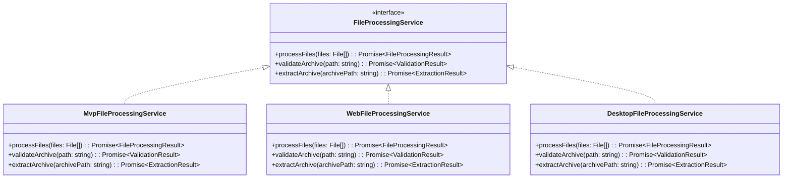
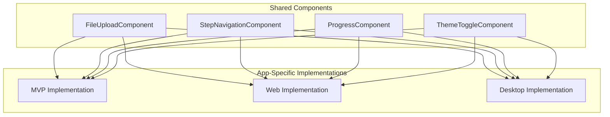
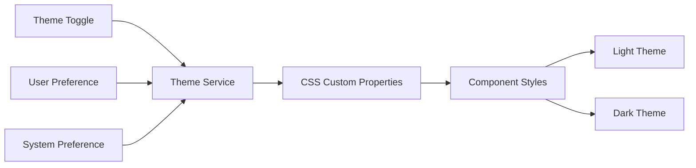
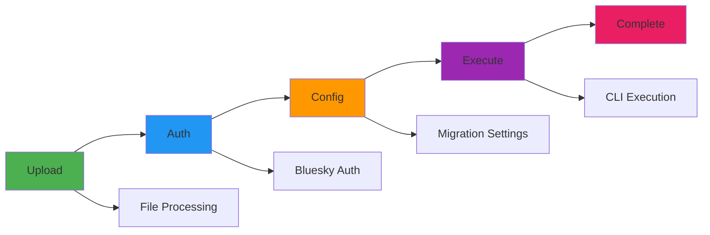
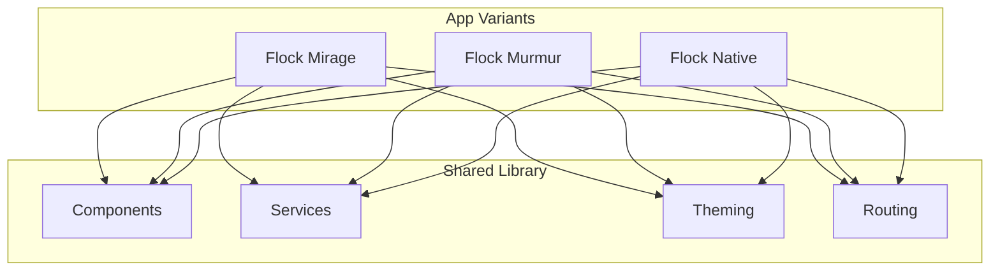

# 🧩 Shared Library - The Flock's Common Nest

> *"Though each bird has its own flight pattern, we all share the same nest. This shared library provides the foundation that keeps our flock flying in perfect formation."*

## 🏗️ **Shared Library Architecture**

The shared library is the heart of our flock - it contains all the components, services, and patterns that every bird uses. Like a well-built nest, it provides shelter and structure for all our applications.

## 🎯 **Purpose & Philosophy**

### **Why Share?**
- **🔄 Consistency** - All birds look and behave the same
- **🔧 Maintainability** - Fix once, fix everywhere
- **📱 Reusability** - Components work in any environment
- **🎨 Unified Experience** - Users get the same interface regardless of platform

### **What We Share**
- **Components** - UI elements like file upload, navigation, progress tracking
- **Services** - Business logic interfaces and common implementations
- **Theming** - Material Design system and visual consistency
- **Routing** - Navigation patterns and step management
- **Utilities** - Common helper functions and types

## 🏠 **Library Structure**

```
shared/
├── src/lib/
│   ├── components/           # Reusable UI components
│   │   ├── file-upload/      # File selection and validation
│   │   ├── step-navigation/  # Step-by-step navigation
│   │   ├── progress/         # Progress tracking and status
│   │   └── theme-toggle/     # Light/dark mode switching
│   ├── services/             # Service interfaces and implementations
│   │   ├── config/           # Configuration management
│   │   ├── file-processing/  # File handling interfaces
│   │   ├── bluesky/          # Bluesky API integration
│   │   ├── instagram/        # Instagram data processing
│   │   └── progress/         # Migration progress tracking
│   ├── theme/                # Material Design theming system
│   ├── route/                # Routing and navigation patterns
│   └── interfaces/           # TypeScript interfaces and types
```

## 🔧 **Service Architecture Pattern**

Our shared services follow a **Strategy Pattern** that allows each bird to implement its own version while maintaining the same interface:



## 🧩 **Component Architecture**

### **Shared Component Pattern**
All shared components follow the same pattern:

1. **Abstract Interface** - Define what the component does
2. **Common Layout** - Shared visual structure and validation
3. **Swappable Implementation** - Each bird provides its own version
4. **Unified Behavior** - Same user experience across all platforms

### **Component Hierarchy**


## 🎨 **Theming System**

Our shared library provides a comprehensive Material Design theming system:

### **Theme Architecture**


### **Theme Features**
- **Light/Dark Modes** - Automatic switching based on user preference
- **CSS Custom Properties** - Dynamic theme switching without reload
- **Component Encapsulation** - Scoped styles with global theme inheritance
- **Accessibility** - WCAG AA compliance with proper contrast ratios

## 🛤️ **Routing & Navigation**

### **Step-Based Navigation**
Our shared library provides a consistent step-by-step navigation pattern:



### **Navigation Features**
- **Route Guards** - Prevent skipping steps without proper data
- **Progress Tracking** - Visual indication of current step
- **Validation** - Ensure each step is complete before proceeding
- **History** - Allow users to go back and modify previous steps

## 🔄 **Integration Pattern**

### **How Apps Use the Shared Library**


## 🎯 **Key Benefits**

### **For Developers**
- **🔄 Consistent Patterns** - Same approach across all apps
- **🔧 Easy Maintenance** - Fix bugs in one place
- **📱 Platform Agnostic** - Components work anywhere
- **🎨 Unified Design** - Consistent user experience

### **For Users**
- **🔄 Familiar Interface** - Same UI regardless of platform
- **🔧 Reliable Behavior** - Consistent functionality everywhere
- **📱 Cross-Platform** - Work seamlessly across devices
- **🎨 Beautiful Design** - Material Design excellence

## 🚀 **Future Extensibility**

The shared library is designed to grow with our flock:

- **New Components** - Easy to add new shared UI elements
- **New Services** - Simple to extend service interfaces
- **New Themes** - Flexible theming system for new visual styles
- **New Apps** - Any new bird can easily join the flock

---

*"The shared library is like the foundation of our nest - strong, reliable, and built to support many birds. Each bird adds its own personality, but we all share the same solid foundation."*
