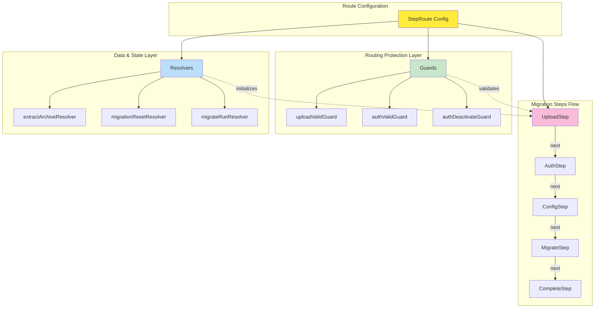
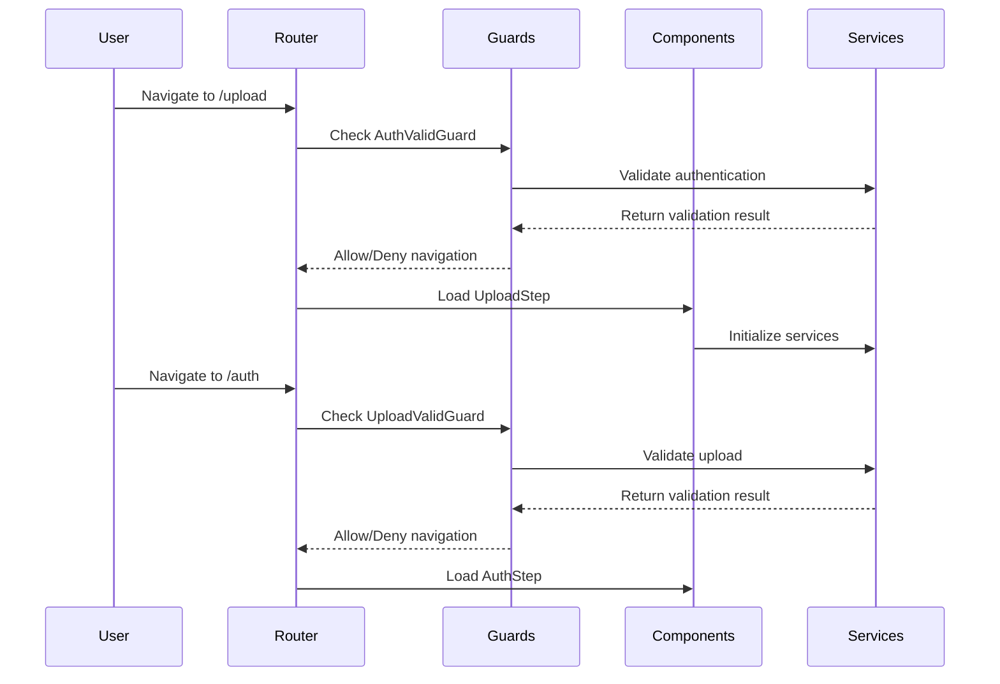
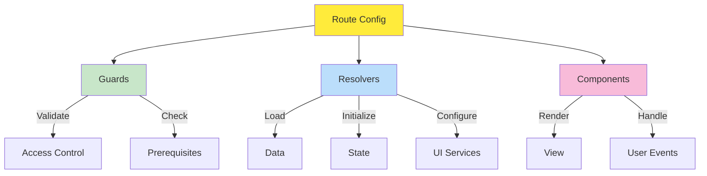

# 🛤️ Shared Library Routing

> *"Like the dodo bird's migration path, our routing system guides users through their journey with precision and care."*

## 🏗️ **Routing Architecture Overview**

Our shared library implements a comprehensive routing system that manages navigation through the migration workflow. The routing system uses Angular's modern routing features with guards, resolvers, and step-based navigation.

**Core Architecture Layers:**
- 🛤️ **Route Configuration** - Declarative routing setup
- 🛡️ **Guards** - Access control and prerequisite validation
- 🔄 **Resolvers** - Data loading and state initialization
- 🎨 **Components** - Pure presentation and user interaction



> 💡 **Key Insight**: Each layer has a specific responsibility. Guards never modify state, resolvers never render UI, and components never inspect routes. See [Architectural Best Practices](#architectural-best-practices) for details.

## 🎯 **Routing Components**

### **Core Routing Files**
- **[StepRoute](../../../projects/shared/src/lib/route/step-route.ts)** - Step-based routing configuration
- **[RouteReuse](../../../projects/shared/src/lib/route/route-reuse.ts)** - Route reuse strategy
- **[Guards Index](../../../projects/shared/src/lib/route/guards/index.ts)** - Guard exports

### **Guards**
- **[AuthValidGuard](../../../projects/shared/src/lib/route/guards/auth-valid-guard.ts)** - Authentication validation
- **[UploadValidGuard](../../../projects/shared/src/lib/route/guards/upload-valid-guard.ts)** - Upload validation
- **[AuthDeactivateGuard](../../../projects/shared/src/lib/route/guards/auth-deactivate-guard.ts)** - Authentication deactivation

### **Resolvers**
- **[ExtractArchiveResolver](../../../projects/shared/src/lib/route/resolver/extract-archive/extract-archive-resolver.ts)** - Archive extraction
- **[LoggerInstrumentationResolver](../../../projects/shared/src/lib/route/resolver/logger-instrumentation-resolver.ts)** - Logger instrumentation
- **[MigrateRunResolver](../../../projects/shared/src/lib/route/resolver/migrate-run-resolver.ts)** - Executes migration and displays progress
- **[MigrationResetResolver](../../../projects/shared/src/lib/route/resolver/migration-reset-resolver.ts)** - Resets migration state for clean navigation

## 🔧 **Step-Based Routing**

### **Step Route Configuration**
```typescript
export const stepRoutes: Routes = [
  {
    path: 'upload',
    component: UploadStep,
    canDeactivate: [UploadValidGuard]
  },
  {
    path: 'auth',
    component: AuthStep,
    canDeactivate: [AuthDeactivateGuard],
    resolve: { 
      extractedArchive: ExtractArchiveResolver,
      migrationReset: MigrationResetResolver
    }
  },
  {
    path: 'config',
    component: ConfigStep,
    resolve: { 
      migrationReset: MigrationResetResolver 
    }
  },
  {
    path: 'migrate',
    component: MigrateStep,
    resolve: { 
      migrationReset: MigrationResetResolver 
    }
  },
  {
    path: 'complete',
    component: CompleteStep,
    resolve: { 
      migrate: MigrateRunResolver 
    }
  }
];
```

### **Step Navigation Flow**


## 🛡️ **Guard System**

### **Authentication Guard**
```typescript
@Injectable({ providedIn: 'root' })
export class AuthValidGuard implements CanActivate {
  constructor(
    private config: ConfigService,
    private router: Router,
    private logger: Logger
  ) {}
  
  canActivate(): boolean {
    const isValid = this.config.blueskyCredentials !== null;
    
    if (!isValid) {
      this.logger.warn('Authentication required for this step');
      this.router.navigate(['/auth']);
      return false;
    }
    
    return true;
  }
}
```

### **Upload Validation Guard**
```typescript
@Injectable({ providedIn: 'root' })
export class UploadValidGuard implements CanActivate {
  constructor(
    private config: ConfigService,
    private router: Router,
    private logger: Logger
  ) {}
  
  canActivate(): boolean {
    const hasUpload = this.config.archivePath !== '';
    
    if (!hasUpload) {
      this.logger.warn('Upload required for this step');
      this.router.navigate(['/upload']);
      return false;
    }
    
    return true;
  }
}
```

### **Deactivation Guard**
```typescript
@Injectable({ providedIn: 'root' })
export class AuthDeactivateGuard implements CanDeactivate<any> {
  constructor(private logger: Logger) {}
  
  canDeactivate(component: any): boolean {
    // Check if user has unsaved changes
    if (component.hasUnsavedChanges) {
      this.logger.warn('Unsaved changes detected');
      return confirm('You have unsaved changes. Are you sure you want to leave?');
    }
    
    return true;
  }
}
```

## 🔄 **Resolver System**

### **Archive Extraction Resolver**
```typescript
@Injectable({ providedIn: 'root' })
export class ExtractArchiveResolver implements Resolve<boolean> {
  constructor(
    private fileProcessor: FileService,
    private logger: Logger
  ) {}
  
  resolve(): Observable<boolean> {
    this.logger.info('Extracting archive...');
    
    return this.fileProcessor.extractArchive().pipe(
      tap(success => {
        if (success) {
          this.logger.info('Archive extracted successfully');
        } else {
          this.logger.error('Archive extraction failed');
        }
      }),
      catchError(error => {
        this.logger.error('Archive extraction error', error);
        return of(false);
      })
    );
  }
}
```

### **Logger Instrumentation Resolver**
```typescript
@Injectable({ providedIn: 'root' })
export class LoggerInstrumentationResolver implements Resolve<void> {
  constructor(private logger: Logger) {}
  
  resolve(): Observable<void> {
    this.logger.instrument('Step navigation initiated');
    return of(undefined);
  }
}
```

### **Migration Run Resolver**
```typescript
/**
 * Resolver that runs the migration process and displays progress.
 * Applied to the 'complete' route to trigger migration when navigating to completion screen.
 */
export const migrateRunResolver: ResolveFn<Promise<void>> = async () => {
  const loading = inject(SplashScreenLoading);
  const migration = inject<MigrationService>(MIGRATION);
  const logger = inject<Logger>(LOGGER);
  const snackBar = inject(MatSnackBar);
  
  // Set up progress panel component for migration feedback
  loading.setComponent(ProgressPanel);
  
  // Show splash message with progress overlay
  loading.show('Migrating…');
  
  try {
    await migration.run(false);
    logger.workflow('Migration completed');
  } catch (error: any) {
    logger.error('Migration error', error);
    snackBar.open(error?.message || 'Migration failed', 'Close', { duration: 4000 });
  } finally {
    loading.hide();
  }
};
```

### **Migration Reset Resolver**
```typescript
/**
 * Resolver that resets migration state and clears the progress panel component.
 * Should be applied to routes that need a clean migration state (e.g., config, auth, migrate steps).
 */
export const migrationResetResolver: ResolveFn<void> = () => {
  const migration = inject<MigrationService>(MIGRATION);
  const loading = inject(SplashScreenLoading);
  const logger = inject<Logger>(LOGGER);
  
  logger.log('Resetting migration state via resolver');
  
  // Reset migration state
  migration.reset();
  
  // Clear any progress panel component
  loading.setComponent(null);
  
  return undefined;
};
```

## 🔄 **Route Reuse Strategy**

### **Custom Route Reuse Strategy**
```typescript
@Injectable({ providedIn: 'root' })
export class CustomRouteReuseStrategy implements RouteReuseStrategy {
  private storedRoutes = new Map<string, DetachedRouteHandle>();
  
  shouldDetach(route: ActivatedRouteSnapshot): boolean {
    return route.data['reuseRoute'] === true;
  }
  
  store(route: ActivatedRouteSnapshot, handle: DetachedRouteHandle): void {
    this.storedRoutes.set(this.getRouteKey(route), handle);
  }
  
  shouldAttach(route: ActivatedRouteSnapshot): boolean {
    return this.storedRoutes.has(this.getRouteKey(route));
  }
  
  retrieve(route: ActivatedRouteSnapshot): DetachedRouteHandle | null {
    return this.storedRoutes.get(this.getRouteKey(route)) || null;
  }
  
  shouldReuseRoute(future: ActivatedRouteSnapshot, curr: ActivatedRouteSnapshot): boolean {
    return future.routeConfig === curr.routeConfig;
  }
  
  private getRouteKey(route: ActivatedRouteSnapshot): string {
    return route.routeConfig?.path || '';
  }
}
```

## 🧭 **Step Navigation**

### **Step Navigation Component**
```typescript
@Component({
  selector: 'shared-step-navigation',
  standalone: true,
  template: `
    <nav class="step-navigation">
      <div class="step-indicator" 
           *ngFor="let step of steps; let i = index"
           [class.active]="i === currentStep"
           [class.completed]="i < currentStep"
           (click)="navigateToStep(i)">
        <span class="step-number">{{ i + 1 }}</span>
        <span class="step-label">{{ step.label }}</span>
      </div>
    </nav>
  `
})
export class StepNavigation {
  @Input() currentStep = 0;
  @Input() steps: Step[] = [];
  
  constructor(private router: Router) {}
  
  navigateToStep(stepIndex: number): void {
    const step = this.steps[stepIndex];
    if (step && step.enabled) {
      this.router.navigate([step.path]);
    }
  }
}
```

## 🔗 **Route Configuration**

### **App Routing Setup**
```typescript
export const appRoutes: Routes = [
  {
    path: '',
    redirectTo: '/upload',
    pathMatch: 'full'
  },
  {
    path: 'upload',
    loadChildren: () => import('./steps/upload/upload.routes').then(m => m.uploadRoutes)
  },
  {
    path: 'auth',
    loadChildren: () => import('./steps/auth/auth.routes').then(m => m.authRoutes)
  },
  {
    path: 'config',
    loadChildren: () => import('./steps/config/config.routes').then(m => m.configRoutes)
  },
  {
    path: 'migrate',
    loadChildren: () => import('./steps/migrate/migrate.routes').then(m => m.migrateRoutes)
  },
  {
    path: 'complete',
    loadChildren: () => import('./steps/complete/complete.routes').then(m => m.completeRoutes)
  },
  {
    path: '**',
    redirectTo: '/upload'
  }
];
```

## 🧪 **Testing Routing**

### **Guard Testing**
```typescript
describe('AuthValidGuard', () => {
  let guard: AuthValidGuard;
  let mockConfig: jasmine.SpyObj<ConfigService>;
  let mockRouter: jasmine.SpyObj<Router>;
  
  beforeEach(() => {
    mockConfig = jasmine.createSpyObj('ConfigService', ['blueskyCredentials']);
    mockRouter = jasmine.createSpyObj('Router', ['navigate']);
    guard = new AuthValidGuard(mockConfig, mockRouter, mockLogger);
  });
  
  it('should allow navigation when authenticated', () => {
    mockConfig.blueskyCredentials = { username: 'test', password: 'test' };
    
    const result = guard.canActivate();
    
    expect(result).toBe(true);
    expect(mockRouter.navigate).not.toHaveBeenCalled();
  });
  
  it('should redirect to auth when not authenticated', () => {
    mockConfig.blueskyCredentials = null;
    
    const result = guard.canActivate();
    
    expect(result).toBe(false);
    expect(mockRouter.navigate).toHaveBeenCalledWith(['/auth']);
  });
});
```

### **Resolver Testing**
```typescript
describe('ExtractArchiveResolver', () => {
  let resolver: ExtractArchiveResolver;
  let mockFileProcessor: jasmine.SpyObj<FileService>;
  
  beforeEach(() => {
    mockFileProcessor = jasmine.createSpyObj('FileService', ['extractArchive']);
    resolver = new ExtractArchiveResolver(mockFileProcessor, mockLogger);
  });
  
  it('should resolve to true when extraction succeeds', (done) => {
    mockFileProcessor.extractArchive.and.returnValue(of(true));
    
    resolver.resolve().subscribe(result => {
      expect(result).toBe(true);
      done();
    });
  });
});
```

## 🚀 **Usage Guidelines**

### **Route Configuration**
```typescript
// In app.config.ts
providers: [
  { provide: RouteReuseStrategy, useClass: CustomRouteReuseStrategy },
  AuthValidGuard,
  UploadValidGuard,
  AuthDeactivateGuard,
  ExtractArchiveResolver,
  LoggerInstrumentationResolver
]
```

### **Step Navigation**
```typescript
// In component
export class MyStep {
  steps = [
    { label: 'Upload', path: '/upload', enabled: true },
    { label: 'Auth', path: '/auth', enabled: false },
    { label: 'Config', path: '/config', enabled: false },
    { label: 'Migrate', path: '/migrate', enabled: false },
    { label: 'Complete', path: '/complete', enabled: false }
  ];
  
  currentStep = 0;
}
```

## 🎯 **Key Principles**

1. **Step-Based Navigation** - Clear progression through migration workflow
2. **Guard Protection** - Ensure proper validation at each step
3. **Resolver Preloading** - Prepare data before component loads
4. **Route Reuse** - Optimize performance with smart caching
5. **Error Handling** - Graceful fallbacks and user feedback
6. **Separation of Concerns** - Resolvers handle state management, not UI components

## 🏗️ **Architectural Best Practices**

### **Routing-Based Business Logic**

Our architecture uses the routing layer to orchestrate business logic in a declarative, chainable manner. This provides flexibility at the cost of some abstraction overhead, but enables powerful composition patterns.

**Benefits:**
- 🔗 **Chainable** - Compose multiple guards and resolvers in sequence
- 📋 **Declarative** - Route configuration documents the entire flow
- 🔄 **Flexible** - Easy to reorder, add, or remove steps
- 🧪 **Testable** - Each piece can be tested in isolation

**Trade-offs:**
- ⚖️ **Abstraction Overhead** - Adds a layer of indirection
- 🔍 **Discoverability** - Logic is distributed across multiple files
- 📚 **Learning Curve** - Requires understanding Angular routing lifecycle

### **Routing Responsibility Separation**

Each layer in the routing system has a specific responsibility:



### **Design Principles**

| Layer | ✅ Should | ❌ Should NOT |
|-------|-----------|---------------|
| **Route Config** | Declare guards, resolvers, and data | Contain business logic |
| **Guards** | Validate access, check prerequisites | Modify application state |
| **Resolvers** | Load data, initialize state, configure services | Render UI directly |
| **Components** | Render UI, handle user events | Inspect URLs or routes |
| **Services** | Manage state, business logic | Know about routing |

### **Common Anti-Patterns to Avoid**

#### **❌ Components Inspecting Routes**
```typescript
// BAD: Component subscribing to router events
export class MyComponent {
  ngOnInit() {
    this.router.events.subscribe(event => {
      if (event.url.includes('/special-route')) {
        this.doSomething();
      }
    });
  }
}
```

#### **✅ Resolver Handling Route-Specific Logic**
```typescript
// GOOD: Resolver handles route-specific setup
export const setupResolver: ResolveFn<void> = () => {
  const service = inject(MyService);
  service.doSomething();
  return undefined;
};

// Route config
{ path: 'special-route', resolve: { setup: setupResolver } }
```

#### **❌ Guards Modifying State**
```typescript
// BAD: Guard modifying application state
export const badGuard: CanActivateFn = () => {
  const service = inject(MyService);
  service.resetData(); // Don't do this!
  return true;
};
```

#### **✅ Resolvers Managing State**
```typescript
// GOOD: Resolver manages state initialization
export const stateResetResolver: ResolveFn<void> = () => {
  const service = inject(MyService);
  service.resetData(); // Perfect place for this
  return undefined;
};
```

### **Real-World Example: Migration Flow**

Here's how we apply these principles to our migration workflow:

```typescript
// Guards: Control Access
export const authValidGuard: CanActivateFn = () => {
  const config = inject(ConfigServiceImpl);
  return config.hasCredentials() || inject(Router).createUrlTree(['/step/auth']);
};

// Resolvers: Initialize State & Load Data
export const extractArchiveResolver: ResolveFn<void> = async () => {
  const fileService = inject<FileService>(FILE_PROCESSOR);
  const loading = inject(SplashScreenLoading);
  loading.show('Extracting Archive...');
  try {
    await fileService.extractArchive();
  } finally {
    loading.hide();
  }
};

export const migrationResetResolver: ResolveFn<void> = () => {
  const migration = inject<MigrationService>(MIGRATION);
  const loading = inject(SplashScreenLoading);
  migration.reset();
  loading.setComponent(null);
  return undefined;
};

export const migrateRunResolver: ResolveFn<void> = async () => {
  const migration = inject<MigrationService>(MIGRATION);
  const loading = inject(SplashScreenLoading);
  loading.setComponent(ProgressPanel);
  loading.show('Migrating...');
  try {
    await migration.run(false);
  } finally {
    loading.hide();
  }
};

// Components: Pure Presentation
@Component({
  selector: 'shared-migrate',
  template: `
    <h2>Migration</h2>
    <shared-preflight-summary></shared-preflight-summary>
  `
})
export class Migrate {
  // No routing logic, no URL inspection, just render UI
}
```

### **Benefits of Routing-Based Business Logic**

1. **Declarative Configuration** - Route config documents the entire workflow
2. **Chainable Composition** - Stack guards and resolvers like middleware
3. **Separation of Concerns** - Each layer has a clear, single purpose
4. **Testability** - Easy to unit test each piece in isolation
5. **Maintainability** - Changes are localized to the appropriate layer
6. **Reusability** - Guards and resolvers can be composed and reused across routes

### **When to Use This Pattern**

✅ **Good For:**
- Multi-step workflows with dependencies (e.g., upload → auth → migrate)
- State initialization that depends on route context
- Access control based on application state
- Data preloading before component renders

❌ **Consider Alternatives For:**
- Simple state management (use services directly)
- Component-specific logic (keep in components)
- Frequently changing business rules (may cause resolver churn)
- Complex conditional flows (consider state machines)

---

*"Like the dodo bird's careful navigation through its environment, our routing system ensures users always know where they are and where they're going."*
