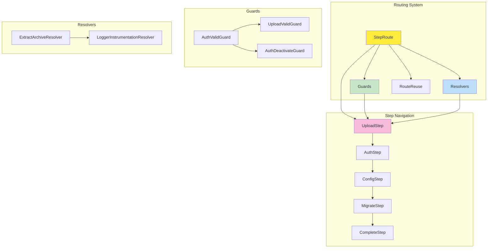
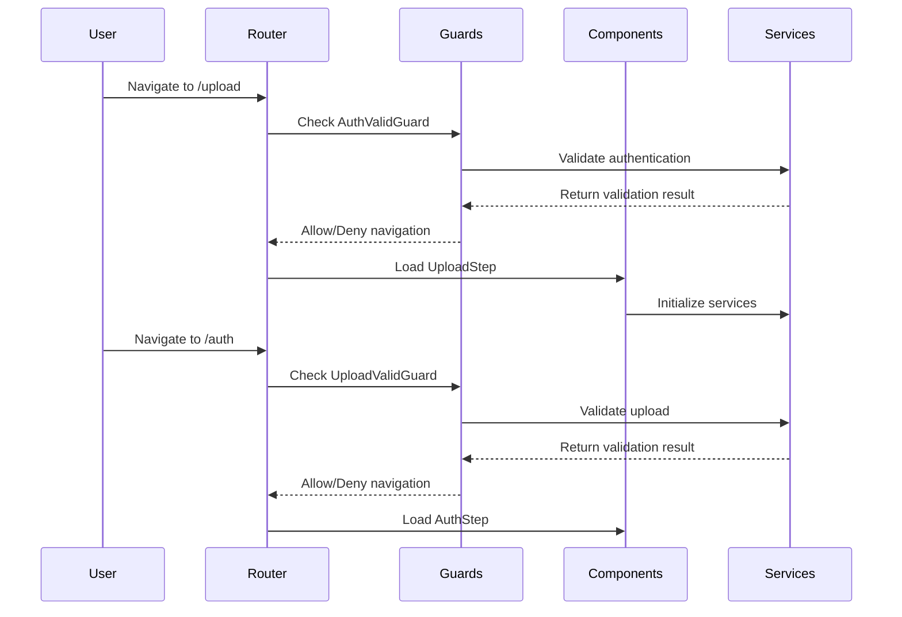

# 🛤️ Shared Library Routing

> *"Like the dodo bird's migration path, our routing system guides users through their journey with precision and care."*

## 🏗️ **Routing Architecture Overview**

Our shared library implements a comprehensive routing system that manages navigation through the migration workflow. The routing system uses Angular's modern routing features with guards, resolvers, and step-based navigation.



## 🎯 **Routing Components**

### **Core Routing Files**
- **[StepRoute](../../../projects/shared/src/lib/route/step-route.ts)** - Step-based routing configuration
- **[RouteReuse](../../../projects/shared/src/lib/route/route-reuse.ts)** - Route reuse strategy
- **[Guards Index](../../../projects/shared/src/lib/route/guards/index.ts)** - Guard exports

### **Guards**
- **[AuthValidGuard](../../../projects/shared/src/lib/route/guards/auth-valid-guard.ts)** - Authentication validation
- **[UploadValidGuard](../../../projects/shared/src/lib/route/guards/upload-valid-guard.ts)** - Upload validation
- **[AuthDeactivateGuard](../../../projects/shared/src/lib/route/guards/auth-deactivate-guard.ts)** - Authentication deactivation

### **Resolvers**
- **[ExtractArchiveResolver](../../../projects/shared/src/lib/route/resolver/extract-archive/extract-archive-resolver.ts)** - Archive extraction
- **[LoggerInstrumentationResolver](../../../projects/shared/src/lib/route/resolver/logger-instrumentation-resolver.ts)** - Logger instrumentation

## 🔧 **Step-Based Routing**

### **Step Route Configuration**
```typescript
export const stepRoutes: Routes = [
  {
    path: 'upload',
    component: UploadStep,
    canActivate: [AuthValidGuard],
    canDeactivate: [AuthDeactivateGuard],
    resolve: { logger: LoggerInstrumentationResolver }
  },
  {
    path: 'auth',
    component: AuthStep,
    canActivate: [UploadValidGuard],
    canDeactivate: [AuthDeactivateGuard],
    resolve: { logger: LoggerInstrumentationResolver }
  },
  {
    path: 'config',
    component: ConfigStep,
    canActivate: [AuthValidGuard],
    canDeactivate: [AuthDeactivateGuard],
    resolve: { logger: LoggerInstrumentationResolver }
  },
  {
    path: 'migrate',
    component: MigrateStep,
    canActivate: [AuthValidGuard],
    canDeactivate: [AuthDeactivateGuard],
    resolve: { 
      archive: ExtractArchiveResolver,
      logger: LoggerInstrumentationResolver 
    }
  },
  {
    path: 'complete',
    component: CompleteStep,
    canActivate: [AuthValidGuard],
    resolve: { logger: LoggerInstrumentationResolver }
  }
];
```

### **Step Navigation Flow**


## 🛡️ **Guard System**

### **Authentication Guard**
```typescript
@Injectable({ providedIn: 'root' })
export class AuthValidGuard implements CanActivate {
  constructor(
    private config: ConfigService,
    private router: Router,
    private logger: Logger
  ) {}
  
  canActivate(): boolean {
    const isValid = this.config.blueskyCredentials !== null;
    
    if (!isValid) {
      this.logger.warn('Authentication required for this step');
      this.router.navigate(['/auth']);
      return false;
    }
    
    return true;
  }
}
```

### **Upload Validation Guard**
```typescript
@Injectable({ providedIn: 'root' })
export class UploadValidGuard implements CanActivate {
  constructor(
    private config: ConfigService,
    private router: Router,
    private logger: Logger
  ) {}
  
  canActivate(): boolean {
    const hasUpload = this.config.archivePath !== '';
    
    if (!hasUpload) {
      this.logger.warn('Upload required for this step');
      this.router.navigate(['/upload']);
      return false;
    }
    
    return true;
  }
}
```

### **Deactivation Guard**
```typescript
@Injectable({ providedIn: 'root' })
export class AuthDeactivateGuard implements CanDeactivate<any> {
  constructor(private logger: Logger) {}
  
  canDeactivate(component: any): boolean {
    // Check if user has unsaved changes
    if (component.hasUnsavedChanges) {
      this.logger.warn('Unsaved changes detected');
      return confirm('You have unsaved changes. Are you sure you want to leave?');
    }
    
    return true;
  }
}
```

## 🔄 **Resolver System**

### **Archive Extraction Resolver**
```typescript
@Injectable({ providedIn: 'root' })
export class ExtractArchiveResolver implements Resolve<boolean> {
  constructor(
    private fileProcessor: FileService,
    private logger: Logger
  ) {}
  
  resolve(): Observable<boolean> {
    this.logger.info('Extracting archive...');
    
    return this.fileProcessor.extractArchive().pipe(
      tap(success => {
        if (success) {
          this.logger.info('Archive extracted successfully');
        } else {
          this.logger.error('Archive extraction failed');
        }
      }),
      catchError(error => {
        this.logger.error('Archive extraction error', error);
        return of(false);
      })
    );
  }
}
```

### **Logger Instrumentation Resolver**
```typescript
@Injectable({ providedIn: 'root' })
export class LoggerInstrumentationResolver implements Resolve<void> {
  constructor(private logger: Logger) {}
  
  resolve(): Observable<void> {
    this.logger.instrument('Step navigation initiated');
    return of(undefined);
  }
}
```

## 🔄 **Route Reuse Strategy**

### **Custom Route Reuse Strategy**
```typescript
@Injectable({ providedIn: 'root' })
export class CustomRouteReuseStrategy implements RouteReuseStrategy {
  private storedRoutes = new Map<string, DetachedRouteHandle>();
  
  shouldDetach(route: ActivatedRouteSnapshot): boolean {
    return route.data['reuseRoute'] === true;
  }
  
  store(route: ActivatedRouteSnapshot, handle: DetachedRouteHandle): void {
    this.storedRoutes.set(this.getRouteKey(route), handle);
  }
  
  shouldAttach(route: ActivatedRouteSnapshot): boolean {
    return this.storedRoutes.has(this.getRouteKey(route));
  }
  
  retrieve(route: ActivatedRouteSnapshot): DetachedRouteHandle | null {
    return this.storedRoutes.get(this.getRouteKey(route)) || null;
  }
  
  shouldReuseRoute(future: ActivatedRouteSnapshot, curr: ActivatedRouteSnapshot): boolean {
    return future.routeConfig === curr.routeConfig;
  }
  
  private getRouteKey(route: ActivatedRouteSnapshot): string {
    return route.routeConfig?.path || '';
  }
}
```

## 🧭 **Step Navigation**

### **Step Navigation Component**
```typescript
@Component({
  selector: 'shared-step-navigation',
  standalone: true,
  template: `
    <nav class="step-navigation">
      <div class="step-indicator" 
           *ngFor="let step of steps; let i = index"
           [class.active]="i === currentStep"
           [class.completed]="i < currentStep"
           (click)="navigateToStep(i)">
        <span class="step-number">{{ i + 1 }}</span>
        <span class="step-label">{{ step.label }}</span>
      </div>
    </nav>
  `
})
export class StepNavigation {
  @Input() currentStep = 0;
  @Input() steps: Step[] = [];
  
  constructor(private router: Router) {}
  
  navigateToStep(stepIndex: number): void {
    const step = this.steps[stepIndex];
    if (step && step.enabled) {
      this.router.navigate([step.path]);
    }
  }
}
```

## 🔗 **Route Configuration**

### **App Routing Setup**
```typescript
export const appRoutes: Routes = [
  {
    path: '',
    redirectTo: '/upload',
    pathMatch: 'full'
  },
  {
    path: 'upload',
    loadChildren: () => import('./steps/upload/upload.routes').then(m => m.uploadRoutes)
  },
  {
    path: 'auth',
    loadChildren: () => import('./steps/auth/auth.routes').then(m => m.authRoutes)
  },
  {
    path: 'config',
    loadChildren: () => import('./steps/config/config.routes').then(m => m.configRoutes)
  },
  {
    path: 'migrate',
    loadChildren: () => import('./steps/migrate/migrate.routes').then(m => m.migrateRoutes)
  },
  {
    path: 'complete',
    loadChildren: () => import('./steps/complete/complete.routes').then(m => m.completeRoutes)
  },
  {
    path: '**',
    redirectTo: '/upload'
  }
];
```

## 🧪 **Testing Routing**

### **Guard Testing**
```typescript
describe('AuthValidGuard', () => {
  let guard: AuthValidGuard;
  let mockConfig: jasmine.SpyObj<ConfigService>;
  let mockRouter: jasmine.SpyObj<Router>;
  
  beforeEach(() => {
    mockConfig = jasmine.createSpyObj('ConfigService', ['blueskyCredentials']);
    mockRouter = jasmine.createSpyObj('Router', ['navigate']);
    guard = new AuthValidGuard(mockConfig, mockRouter, mockLogger);
  });
  
  it('should allow navigation when authenticated', () => {
    mockConfig.blueskyCredentials = { username: 'test', password: 'test' };
    
    const result = guard.canActivate();
    
    expect(result).toBe(true);
    expect(mockRouter.navigate).not.toHaveBeenCalled();
  });
  
  it('should redirect to auth when not authenticated', () => {
    mockConfig.blueskyCredentials = null;
    
    const result = guard.canActivate();
    
    expect(result).toBe(false);
    expect(mockRouter.navigate).toHaveBeenCalledWith(['/auth']);
  });
});
```

### **Resolver Testing**
```typescript
describe('ExtractArchiveResolver', () => {
  let resolver: ExtractArchiveResolver;
  let mockFileProcessor: jasmine.SpyObj<FileService>;
  
  beforeEach(() => {
    mockFileProcessor = jasmine.createSpyObj('FileService', ['extractArchive']);
    resolver = new ExtractArchiveResolver(mockFileProcessor, mockLogger);
  });
  
  it('should resolve to true when extraction succeeds', (done) => {
    mockFileProcessor.extractArchive.and.returnValue(of(true));
    
    resolver.resolve().subscribe(result => {
      expect(result).toBe(true);
      done();
    });
  });
});
```

## 🚀 **Usage Guidelines**

### **Route Configuration**
```typescript
// In app.config.ts
providers: [
  { provide: RouteReuseStrategy, useClass: CustomRouteReuseStrategy },
  AuthValidGuard,
  UploadValidGuard,
  AuthDeactivateGuard,
  ExtractArchiveResolver,
  LoggerInstrumentationResolver
]
```

### **Step Navigation**
```typescript
// In component
export class MyStep {
  steps = [
    { label: 'Upload', path: '/upload', enabled: true },
    { label: 'Auth', path: '/auth', enabled: false },
    { label: 'Config', path: '/config', enabled: false },
    { label: 'Migrate', path: '/migrate', enabled: false },
    { label: 'Complete', path: '/complete', enabled: false }
  ];
  
  currentStep = 0;
}
```

## 🎯 **Key Principles**

1. **Step-Based Navigation** - Clear progression through migration workflow
2. **Guard Protection** - Ensure proper validation at each step
3. **Resolver Preloading** - Prepare data before component loads
4. **Route Reuse** - Optimize performance with smart caching
5. **Error Handling** - Graceful fallbacks and user feedback

---

*"Like the dodo bird's careful navigation through its environment, our routing system ensures users always know where they are and where they're going."*
