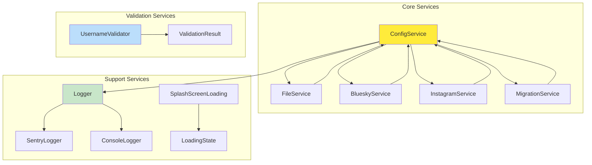
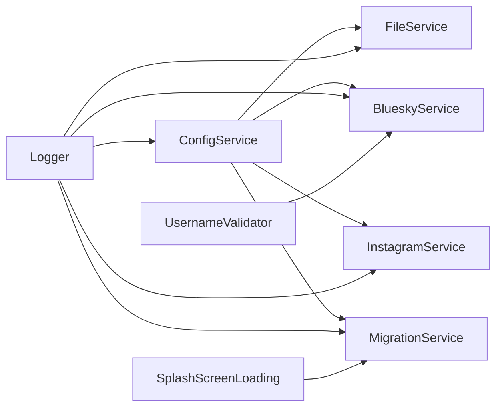

# 🔧 Shared Library Services

> *"Like the dodo bird's specialized tools, our services provide the essential functionality that powers our entire flock."*

## 🏗️ **Service Architecture Overview**

Our shared library provides a comprehensive set of services that implement the core business logic for the Flock migration system. Services follow a clean interface-based architecture with environment-specific implementations.



## 🎯 **Service Categories**

### **Core Business Services**
Essential functionality for migration operations:

- **[ConfigService](../../../projects/shared/src/lib/services/config.ts)** - Central configuration management
- **[FileService](../../../projects/shared/src/lib/services/interfaces/file.ts)** - File processing and validation interface
- **[BlueskyService](../../../projects/shared/src/lib/services/bluesky.ts)** - Bluesky API integration
- **[InstagramService](../../../projects/shared/src/lib/services/instagram.ts)** - Instagram data processing
- **[MigrationService](../../../projects/shared/src/lib/services/migration.ts)** - Migration orchestration

### **Support Services**
Cross-cutting concerns and utilities:

- **[Logger](../../../projects/shared/src/lib/services/interfaces/logger.ts)** - Logging interface and implementations
- **[SplashScreenLoading](../../../projects/shared/src/lib/services/splash-screen-loading.ts)** - Loading state management

### **Validation Services**
Data validation and business rules:

- **[UsernameValidator](../../../projects/shared/src/lib/services/validators/username.validator.ts)** - Username validation logic

## 🔧 **Service Design Patterns**

### **Interface-Based Architecture**
All services implement well-defined interfaces for testability and flexibility:

```typescript
export interface ConfigService {
  archivePath: string;
  blueskyCredentials: Credentials | null;
  simulate: boolean;
  validateConfig(): Promise<boolean>;
  resetConfig(): Promise<void>;
}
```

### **Dependency Injection**
Services use Angular's DI system with injection tokens:

```typescript
export const CONFIG = new InjectionToken<ConfigService>('Config');
export const BLUESKY = new InjectionToken<BlueskyService>('Bluesky');
export const FILE_PROCESSOR = new InjectionToken<FileService>('FileProcessor');
```

### **Environment-Specific Implementations**
Services adapt to different environments:

```typescript
// Shared interface
export interface FileService {
  validateArchive(file: File): Promise<ValidationResult>;
  extractArchive(): Promise<boolean>;
}

// Mirage implementation (browser)
export class FileProcessor implements FileService {
  // Browser-specific implementation
}

// Native implementation (Electron)
export class NativeFileProcessor implements FileService {
  // Node.js-specific implementation
}
```

## 🏗️ **Service Relationships**



## 🔄 **Service Lifecycle**

### **Initialization**
Services are initialized through Angular's DI system:

```typescript
@Component({
  providers: [
    { provide: CONFIG, useClass: ConfigServiceImpl },
    { provide: BLUESKY, useClass: BlueskyServiceImpl },
    { provide: FILE_PROCESSOR, useClass: FileProcessor }
  ]
})
```

### **Configuration Flow**
Services follow a configuration-driven initialization:

1. **ConfigService** loads initial configuration
2. **FileService** validates uploaded archive
3. **BlueskyService** authenticates with credentials
4. **MigrationService** orchestrates the migration process

## 🧪 **Testing Strategy**

### **Unit Testing**
Services are tested in isolation with mocked dependencies:

```typescript
describe('ConfigService', () => {
  let service: ConfigService;
  let mockLogger: jasmine.SpyObj<Logger>;
  
  beforeEach(() => {
    mockLogger = jasmine.createSpyObj('Logger', ['log']);
    service = new ConfigServiceImpl(mockLogger);
  });
});
```

### **BDD Testing**
Business scenarios are tested with real service interactions:

```typescript
describe('Feature: Migration Configuration', () => {
  describe('Scenario: Valid configuration setup', () => {
    it('Given valid credentials, When config is validated, Then migration can proceed', () => {
      // BDD test implementation
    });
  });
});
```

## 🔒 **Error Handling**

Services implement consistent error handling patterns:

```typescript
export class ConfigService {
  async validateConfig(): Promise<boolean> {
    try {
      // Validation logic
      return true;
    } catch (error) {
      this.logger.error('Config validation failed', error);
      throw new ConfigValidationError('Invalid configuration');
    }
  }
}
```

## 📊 **Service State Management**

Services use reactive patterns for state management:

```typescript
export class ConfigService {
  private configSubject = new BehaviorSubject<ConfigState>(initialState);
  public config$ = this.configSubject.asObservable();
  
  updateConfig(updates: Partial<ConfigState>): void {
    const current = this.configSubject.value;
    this.configSubject.next({ ...current, ...updates });
  }
}
```

## 🔗 **Service Integration**

### **Cross-Service Communication**
Services communicate through shared state and events:

```typescript
export class MigrationService {
  constructor(
    private config: ConfigService,
    private bluesky: BlueskyService,
    private instagram: InstagramService
  ) {}
  
  async executeMigration(): Promise<void> {
    const config = await this.config.getConfig();
    const posts = await this.instagram.processPosts(config);
    await this.bluesky.publishPosts(posts);
  }
}
```

## 🚀 **Usage Guidelines**

### **Service Injection**
```typescript
export class MyComponent {
  private config = inject<ConfigService>(CONFIG);
  private logger = inject<Logger>(LOGGER);
}
```

### **Service Configuration**
```typescript
// In app.config.ts
providers: [
  { provide: CONFIG, useClass: ConfigServiceImpl },
  { provide: BLUESKY, useClass: BlueskyServiceImpl },
  { provide: FILE_PROCESSOR, useClass: FileProcessor }
]
```

## 📚 **Service Documentation**

Each service has detailed documentation covering:

- **Purpose and Responsibilities**
- **Interface Definition**
- **Dependencies and Requirements**
- **Configuration Options**
- **Error Handling**
- **Testing Examples**

## 🎯 **Key Principles**

1. **Single Responsibility** - Each service has one clear purpose
2. **Interface Segregation** - Clean, focused interfaces
3. **Dependency Inversion** - Depend on abstractions, not concretions
4. **Environment Agnostic** - Work across all Flock applications
5. **Testable** - Easy to mock and test in isolation

---

*"Like the dodo bird's specialized tools, our services are crafted with care and purpose, each one essential to the flock's success."*
