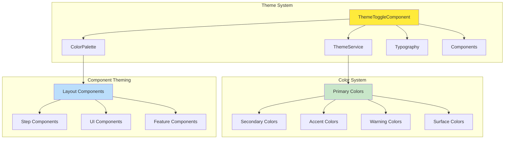

# 🎨 Shared Library Theming

> *"Like the dodo bird's colorful plumage, our theming system brings beauty and consistency to our entire flock."*

## 🏗️ **Theme Architecture Overview**

Our shared library implements a comprehensive Material Design theming system that provides consistent visual design across all Flock applications. The theming system is built on Angular Material with custom extensions for our specific needs.



## 🎯 **Theme Components**

### **Core Theme Files**
- **[ThemeToggle](../../../projects/shared/src/lib/theme-toggle/theme-toggle.ts)** - Theme switching functionality
- **[Theme Styles](../../../projects/shared/src/lib/theme/styles.scss)** - Main theme definitions
- **[Theme Colors](../../../projects/shared/src/lib/theme/theme_theme-colors.scss)** - Color palette definitions

### **Utility Files**
- **[Colors](../../../projects/shared/src/lib/theme/utilities/_colors.scss)** - Color system utilities
- **[Components](../../../projects/shared/src/lib/theme/utilities/_components.scss)** - Component-specific theming
- **[Layout](../../../projects/shared/src/lib/theme/utilities/_layout.scss)** - Layout theming utilities
- **[Responsive](../../../projects/shared/src/lib/theme/utilities/_responsive.scss)** - Responsive design utilities

## 🎨 **Color System**

### **Primary Colors**
```scss
$primary-palette: (
  50: #e3f2fd,
  100: #bbdefb,
  200: #90caf9,
  300: #64b5f6,
  400: #42a5f5,
  500: #2196f3, // Main primary color
  600: #1e88e5,
  700: #1976d2,
  800: #1565c0,
  900: #0d47a1,
  contrast: (
    50: rgba(black, 0.87),
    100: rgba(black, 0.87),
    200: rgba(black, 0.87),
    300: rgba(black, 0.87),
    400: rgba(black, 0.87),
    500: white,
    600: white,
    700: white,
    800: white,
    900: white,
  )
);
```

### **Secondary Colors**
```scss
$secondary-palette: (
  50: #f3e5f5,
  100: #e1bee7,
  200: #ce93d8,
  300: #ba68c8,
  400: #ab47bc,
  500: #9c27b0, // Main secondary color
  600: #8e24aa,
  700: #7b1fa2,
  800: #6a1b9a,
  900: #4a148c,
  contrast: (
    50: rgba(black, 0.87),
    100: rgba(black, 0.87),
    200: rgba(black, 0.87),
    300: white,
    400: white,
    500: white,
    600: white,
    700: white,
    800: white,
    900: white,
  )
);
```

### **Accent Colors**
```scss
$accent-palette: (
  50: #fff3e0,
  100: #ffe0b2,
  200: #ffcc80,
  300: #ffb74d,
  400: #ffa726,
  500: #ff9800, // Main accent color
  600: #fb8c00,
  700: #f57c00,
  800: #ef6c00,
  900: #e65100,
  contrast: (
    50: rgba(black, 0.87),
    100: rgba(black, 0.87),
    200: rgba(black, 0.87),
    300: rgba(black, 0.87),
    400: rgba(black, 0.87),
    500: rgba(black, 0.87),
    600: white,
    700: white,
    800: white,
    900: white,
  )
);
```

## 🔤 **Typography System**

### **Font Families**
```scss
$font-family-primary: 'Roboto', 'Helvetica Neue', sans-serif;
$font-family-secondary: 'Roboto Mono', 'Courier New', monospace;
$font-family-display: 'Roboto Slab', 'Times New Roman', serif;
```

### **Font Sizes**
```scss
$font-sizes: (
  'xs': 0.75rem,    // 12px
  'sm': 0.875rem,   // 14px
  'base': 1rem,     // 16px
  'lg': 1.125rem,   // 18px
  'xl': 1.25rem,    // 20px
  '2xl': 1.5rem,    // 24px
  '3xl': 1.875rem,  // 30px
  '4xl': 2.25rem,   // 36px
  '5xl': 3rem,      // 48px
);
```

### **Font Weights**
```scss
$font-weights: (
  'light': 300,
  'normal': 400,
  'medium': 500,
  'semibold': 600,
  'bold': 700,
  'extrabold': 800,
);
```

## 🎭 **Component Theming**

### **Layout Components**
```scss
@mixin layout-theme($theme) {
  .layout {
    @include mat-elevation(2);
    background-color: mat.get-color-from-palette($theme, background, card);
    color: mat.get-color-from-palette($theme, foreground, text);
  }
  
  .layout-header {
    background-color: mat.get-color-from-palette($theme, primary);
    color: mat.get-color-from-palette($theme, primary, default-contrast);
  }
}
```

### **Step Components**
```scss
@mixin step-theme($theme) {
  .step-layout {
    background-color: mat.get-color-from-palette($theme, background, background);
  }
  
  .step-navigation {
    background-color: mat.get-color-from-palette($theme, surface);
    border-bottom: 1px solid mat.get-color-from-palette($theme, foreground, divider);
  }
  
  .step-content {
    padding: mat.get-color-from-palette($theme, spacing, 2);
  }
}
```

### **UI Components**
```scss
@mixin ui-theme($theme) {
  .theme-toggle {
    color: mat.get-color-from-palette($theme, foreground, text);
    
    &:hover {
      background-color: mat.get-color-from-palette($theme, foreground, hover);
    }
  }
  
  .splash-screen {
    background-color: mat.get-color-from-palette($theme, primary);
    color: mat.get-color-from-palette($theme, primary, default-contrast);
  }
}
```

## 🌙 **Dark/Light Mode Support**

### **Theme Toggle Implementation**
```typescript
@Component({
  selector: 'shared-theme-toggle',
  standalone: true,
  template: `
    <button mat-icon-button (click)="toggleTheme()">
      <mat-icon>{{ isDark ? 'light_mode' : 'dark_mode' }}</mat-icon>
    </button>
  `
})
export class ThemeToggle {
  isDark = false;
  
  toggleTheme(): void {
    this.isDark = !this.isDark;
    // Theme switching logic
  }
}
```

### **CSS Custom Properties**
```scss
:root {
  --color-primary: #2196f3;
  --color-secondary: #9c27b0;
  --color-accent: #ff9800;
  --color-surface: #ffffff;
  --color-background: #fafafa;
  --color-text: #212121;
}

[data-theme="dark"] {
  --color-primary: #64b5f6;
  --color-secondary: #ba68c8;
  --color-accent: #ffb74d;
  --color-surface: #121212;
  --color-background: #000000;
  --color-text: #ffffff;
}
```

## 📱 **Responsive Design**

### **Breakpoints**
```scss
$breakpoints: (
  'xs': 0,
  'sm': 576px,
  'md': 768px,
  'lg': 992px,
  'xl': 1200px,
  'xxl': 1400px
);
```

### **Responsive Mixins**
```scss
@mixin respond-to($breakpoint) {
  @if map-has-key($breakpoints, $breakpoint) {
    @media (min-width: map-get($breakpoints, $breakpoint)) {
      @content;
    }
  }
}

// Usage
.component {
  padding: 1rem;
  
  @include respond-to('md') {
    padding: 2rem;
  }
  
  @include respond-to('lg') {
    padding: 3rem;
  }
}
```

## 🎨 **Animation System**

### **Animation Utilities**
```scss
@mixin fade-in($duration: 0.3s) {
  animation: fadeIn $duration ease-in-out;
}

@mixin slide-up($duration: 0.3s) {
  animation: slideUp $duration ease-out;
}

@mixin scale-in($duration: 0.2s) {
  animation: scaleIn $duration ease-out;
}

@keyframes fadeIn {
  from { opacity: 0; }
  to { opacity: 1; }
}

@keyframes slideUp {
  from { transform: translateY(20px); opacity: 0; }
  to { transform: translateY(0); opacity: 1; }
}

@keyframes scaleIn {
  from { transform: scale(0.9); opacity: 0; }
  to { transform: scale(1); opacity: 1; }
}
```

## 🔧 **Usage Guidelines**

### **Importing Theme Styles**
```scss
// In your component styles
@use 'shared/theme' as theme;

.my-component {
  @include theme.component-theme();
  @include theme.fade-in();
}
```

### **Using Theme Colors**
```scss
.my-component {
  background-color: theme.$primary-color;
  color: theme.$primary-contrast;
  border: 1px solid theme.$divider-color;
}
```

### **Responsive Design**
```scss
.my-component {
  padding: 1rem;
  
  @include theme.respond-to('md') {
    padding: 2rem;
  }
}
```

## 🧪 **Testing Theme Components**

### **Theme Testing Utilities**
```typescript
describe('ThemeToggle', () => {
  it('should toggle between light and dark themes', () => {
    const component = TestBed.createComponent(ThemeToggle);
    const button = component.debugElement.query(By.css('button'));
    
    expect(component.componentInstance.isDark).toBe(false);
    
    button.triggerEventHandler('click', null);
    
    expect(component.componentInstance.isDark).toBe(true);
  });
});
```

## 🎯 **Key Principles**

1. **Consistency** - Unified design language across all components
2. **Accessibility** - WCAG 2.1 AA compliant color contrast
3. **Responsive** - Mobile-first responsive design
4. **Customizable** - Easy to override and extend
5. **Performance** - Optimized CSS with minimal bundle impact

---

*"Like the dodo bird's beautiful plumage, our theming system brings color and life to our entire flock, making each application a work of art."*
