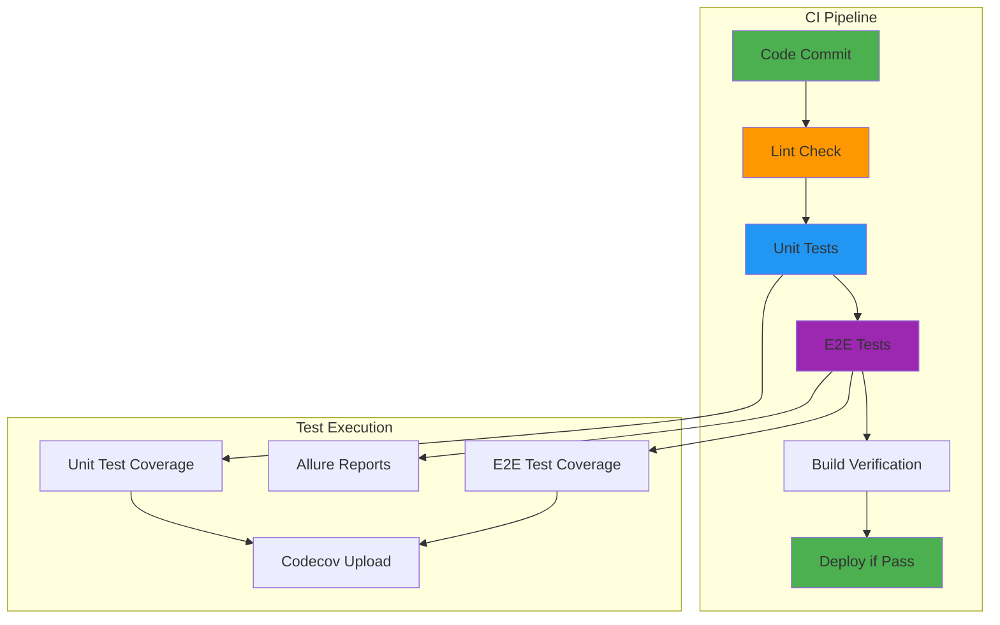

# 🚀 CI/CD Integration - Automated Testing Pipeline

> *"Just like a flock needs a clear flight path to reach its destination, our CI/CD pipeline ensures every change is tested and validated before it joins the main flock."*

## 🎯 **CI/CD Testing Philosophy**

Our CI/CD pipeline ensures that every change is thoroughly tested before deployment:

- **Automated Testing** - All tests run automatically on every commit
- **Quality Gates** - Tests must pass before code can be merged
- **Coverage Tracking** - Coverage reports are generated and tracked
- **Multi-Environment** - Tests run in consistent, isolated environments

## 🏗️ **CI Pipeline Structure**

### **Pipeline Overview**


### **Pipeline Jobs**
1. **Lint** - Code quality and style checking
2. **Unit Tests** - Component and service testing with coverage
3. **E2E Tests** - Full user journey testing with coverage
4. **Build** - Application build verification

## 🔧 **CI Configuration**

### **GitHub Actions Workflow** (`.github/workflows/ci.yml`)
```yaml
name: Feathering the Nest

on:
  push:
    branches: [ "*" ]
  pull_request:
    branches: [ "*" ]

jobs:
  lint:
    name: Waterproof feathers (Lint)
    runs-on: ubuntu-latest
    steps:
      - name: Checkout code
        uses: actions/checkout@v4
      - name: Setup Node.js
        uses: actions/setup-node@v4
        with:
          node-version: '24.5.0'
          cache: 'npm'
      - name: Install dependencies
        run: npm ci
      - name: Lint all projects
        run: npm run lint:all

  test:
    name: Count the flock (Unit Test)
    runs-on: ubuntu-latest
    steps:
      - name: Checkout code
        uses: actions/checkout@v4
      - name: Setup Node.js
        uses: actions/setup-node@v4
        with:
          node-version: '24.5.0'
          cache: 'npm'
      - name: Install dependencies
        run: npm ci
      - name: Build shared library
        run: npx ng build --project=shared
      - name: Run tests with coverage
        run: npm run test:coverage
      - name: Upload unit test coverage to Codecov
        uses: codecov/codecov-action@v5
        with:
          files: ./coverage/lcov.info
          flags: unittests
          name: codecov-umbrella
          fail_ci_if_error: false

  e2e:
    name: Practice the murmuration (E2E Test)
    runs-on: ubuntu-latest
    env:
      HEADLESS: true
      CI: true
    steps:
      - name: Checkout code
        uses: actions/checkout@v4
      - name: Setup Node.js
        uses: actions/setup-node@v4
        with:
          node-version: '24.5.0'
          cache: 'npm'
      - name: Install dependencies
        run: npm ci
      - name: Install Angular CLI globally
        run: npm install -g @angular/cli
      - name: Install Allure command line
        run: npm install -g allure-commandline
      - name: Build shared library
        run: npx ng build --project=shared
      - name: Build flock-mirage app
        run: npx ng build --project=flock-mirage --configuration=development
      - name: Run e2e tests with coverage
        run: npm run test:e2e:coverage
        env:
          CI: true
          NODE_ENV: production
          COLLECT_COVERAGE: true
      - name: Generate Allure report
        run: npm run allure:generate
      - name: Upload Allure report as artifact
        uses: actions/upload-artifact@v4
        with:
          name: allure-report
          path: allure-report/
          retention-days: 30
      - name: Upload E2E coverage to Codecov
        uses: codecov/codecov-action@v5
        with:
          files: ./coverage/lcov.info
          flags: e2etests
          name: codecov-umbrella
          fail_ci_if_error: false
```

## 📊 **Coverage Integration**

### **Coverage Collection**
- **Unit Tests**: Karma with Istanbul coverage
- **E2E Tests**: WebdriverIO with NYC coverage collection
- **Combined Reports**: Merged coverage reports for comprehensive view

### **Codecov Integration**
```yaml
# Unit test coverage upload
- name: Upload unit test coverage to Codecov
  uses: codecov/codecov-action@v5
  with:
    files: ./coverage/lcov.info
    flags: unittests
    name: codecov-umbrella
    fail_ci_if_error: false

# E2E test coverage upload
- name: Upload E2E coverage to Codecov
  uses: codecov/codecov-action@v5
  with:
    files: ./coverage/lcov.info
    flags: e2etests
    name: codecov-umbrella
    fail_ci_if_error: false
```

### **Coverage Configuration** (`codecov.yml`)
```yaml
coverage:
  status:
    project:
      default:
        target: auto
        threshold: 0%
        base: auto
    patch:
      default:
        target: auto
        threshold: 0%
        base: auto

flags:
  unittests:
    paths:
      - projects/shared/src/
    carryforward: true
  e2etests:
    paths:
      - projects/flock-mirage/src/
      - projects/shared/src/
    carryforward: true
```

## 📈 **Test Reporting**

### **Allure Reports**
- **Comprehensive Reporting**: Detailed test execution reports
- **CI Integration**: Reports generated automatically in CI
- **Artifact Storage**: Reports stored as CI artifacts for 30 days
- **Visual Analysis**: Screenshots and detailed test results

### **Allure Configuration**
```yaml
- name: Generate Allure report
  run: npm run allure:generate

- name: Upload Allure report as artifact
  uses: actions/upload-artifact@v4
  with:
    name: allure-report
    path: allure-report/
    retention-days: 30
```

### **Report Access**
- **CI Artifacts**: Download reports from GitHub Actions
- **Allure Serve**: Run `npm run allure:serve` locally
- **Allure Open**: Run `npm run allure:open` to view reports

## 🔄 **CI/CD Best Practices**

### **Pipeline Optimization**
- **Parallel Execution**: Run jobs in parallel when possible
- **Caching**: Cache dependencies and build artifacts
- **Fast Feedback**: Optimize for quick feedback on failures
- **Resource Management**: Use appropriate runner sizes

### **Test Reliability**
- **Deterministic Tests**: Ensure tests are stable and repeatable
- **Environment Isolation**: Use consistent test environments
- **Dependency Management**: Lock dependency versions
- **Error Handling**: Handle expected errors gracefully

### **Quality Gates**
- **Test Coverage**: Maintain minimum coverage thresholds
- **Test Pass Rate**: Require all tests to pass
- **Lint Checks**: Enforce code quality standards
- **Build Verification**: Ensure application builds successfully

## 🛠️ **CI/CD Tools**

### **Primary Tools**
- **GitHub Actions**: CI/CD pipeline execution
- **Node.js**: Runtime environment for tests
- **Angular CLI**: Build and test execution
- **WebdriverIO**: E2E test execution
- **Allure**: Test reporting and analysis
- **Codecov**: Coverage tracking and reporting

### **Supporting Tools**
- **npm**: Package management and script execution
- **Karma**: Unit test execution and coverage
- **NYC**: Coverage collection and merging
- **ESLint**: Code quality and style checking

## 🚨 **CI/CD Troubleshooting**

### **Common Issues**

#### **Test Failures**
- **Check Logs**: Review CI logs for specific error messages
- **Local Reproduction**: Reproduce failures locally
- **Environment Differences**: Check for environment-specific issues
- **Dependency Issues**: Verify dependency versions and compatibility

#### **Coverage Issues**
- **Coverage Collection**: Ensure coverage is being collected
- **File Paths**: Check coverage file paths and configuration
- **Upload Failures**: Verify Codecov upload configuration
- **Report Generation**: Check coverage report generation

#### **Build Failures**
- **Dependency Issues**: Check for missing or incompatible dependencies
- **Configuration Issues**: Verify build configuration
- **Environment Issues**: Check Node.js version and environment setup
- **Resource Issues**: Check for memory or disk space issues

### **Debugging Strategies**
```bash
# Run CI commands locally
npm run lint:all
npm run test:coverage
npm run test:e2e:coverage

# Check coverage reports
ls -la ./coverage/
cat ./coverage/lcov.info

# Verify Allure reports
npm run allure:generate
npm run allure:serve
```

## 📋 **CI/CD Maintenance**

### **Regular Maintenance**
- **Dependency Updates**: Keep dependencies up to date
- **Tool Updates**: Update CI tools and actions
- **Configuration Review**: Review and update CI configuration
- **Performance Optimization**: Optimize pipeline performance

### **Monitoring and Alerts**
- **Pipeline Status**: Monitor pipeline success rates
- **Test Trends**: Track test execution trends
- **Coverage Trends**: Monitor coverage changes over time
- **Performance Metrics**: Track pipeline execution times

### **Documentation**
- **Pipeline Documentation**: Keep CI documentation up to date
- **Troubleshooting Guides**: Maintain troubleshooting documentation
- **Best Practices**: Document CI/CD best practices
- **Tool Configuration**: Document tool configurations and settings

## 🎯 **CI/CD Benefits**

### **Quality Assurance**
- **Automated Testing**: All tests run automatically
- **Quality Gates**: Prevent low-quality code from being merged
- **Coverage Tracking**: Monitor test coverage trends
- **Regression Prevention**: Catch regressions early

### **Developer Experience**
- **Fast Feedback**: Quick feedback on code changes
- **Consistent Environment**: Tests run in consistent environments
- **Automated Reports**: Automatic generation of test reports
- **Easy Debugging**: Clear error messages and logs

### **Business Value**
- **Risk Reduction**: Reduce risk of production issues
- **Faster Delivery**: Enable faster, safer deployments
- **Quality Metrics**: Track quality metrics over time
- **Compliance**: Meet quality and testing requirements

---

*"CI/CD is like having a flock of guardian birds that check every new bird before it joins the migration - ensuring only healthy, tested code makes it to production."*
