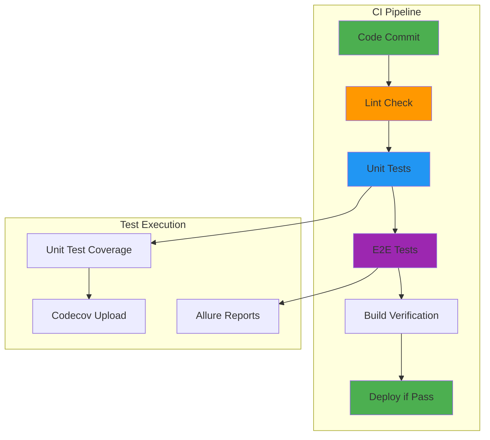

# 🚀 CI/CD Integration - Automated Testing Pipeline

> *"Just like a flock needs a clear flight path to reach its destination, our CI/CD pipeline ensures every change is tested and validated before it joins the main flock."*

## 🎯 **CI/CD Testing Philosophy**

Our CI/CD pipeline ensures that every change is thoroughly tested before deployment:

- **Automated Testing** - All tests run automatically on every commit
- **Quality Gates** - Tests must pass before code can be merged
- **Coverage Tracking** - Unit test coverage reports are generated and tracked
- **Multi-Environment** - Tests run in consistent, isolated environments

## 🏗️ **CI Pipeline Structure**

### **Pipeline Overview**

### **Pipeline Jobs**
1. **Lint** - Code quality and style checking
2. **Unit Tests** - Component and service testing with coverage
3. **E2E Tests** - Full user journey testing
4. **Build** - Application build verification

## 🔧 **CI Configuration**

### **GitHub Actions Workflow**
The complete CI pipeline is defined in [`.github/workflows/ci.yml`](../../.github/workflows/ci.yml).

**Pipeline Structure:**
- **Lint Job** ([lines 10-30](../../.github/workflows/ci.yml#L10-L30)): Code quality and style checking
- **Test Job** ([lines 32-58](../../.github/workflows/ci.yml#L32-L58)): Unit tests with coverage collection  
- **E2E Job** ([lines 60-100](../../.github/workflows/ci.yml#L60-L100)): End-to-end testing with Allure reporting

**Key Configuration:**
- **Node.js Version**: 24.5.0 ([line 24](../../.github/workflows/ci.yml#L24))
- **Cache Strategy**: npm cache with package-lock.json ([lines 25-26](../../.github/workflows/ci.yml#L25-L26))
- **Environment Variables**: PACKAGE_TOKEN and CODECOV_TOKEN ([lines 14, 35](../../.github/workflows/ci.yml#L14-L35))

## 📊 **Coverage Integration**

### **Coverage Collection**
- **Unit Tests**: Karma with Istanbul coverage
- **Coverage Reports**: LCOV format for Codecov integration

### **Codecov Integration**
**Coverage Upload Configuration:**
- Unit test coverage upload: [lines 50-55](../../.github/workflows/ci.yml#L50-L55)
- Codecov action configuration: [codecov/codecov-action@v5](https://github.com/codecov/codecov-action)

**Coverage File Paths:**
- Coverage reports: `./coverage/lcov.info`
- Coverage flags: `unittests` for unit test coverage

### **Coverage Configuration**
**Codecov Settings:**
- Configuration file: [codecov.yml](../../codecov.yml)
- Coverage targets: 80% for project and patch coverage ([lines 4-5, 9-10](../../codecov.yml#L4-L5))
- Unit test paths: `projects/shared/src/` ([lines 15-17](../../codecov.yml#L15-L17))
- PR comments: Enabled with diff and files layout ([lines 20-25](../../codecov.yml#L20-L25))

## 📈 **Test Reporting**

### **Allure Reports**
- **Comprehensive Reporting**: Detailed test execution reports with step-by-step analysis
- **CI Integration**: Reports generated automatically in CI pipeline
- **Artifact Storage**: Reports stored as CI artifacts for 30 days
- **Visual Analysis**: Screenshots, error details, and performance metrics
- **BDD Integration**: Seamless integration with our BDD methodology
- **Historical Tracking**: Track test performance and trends over time

### **Allure Configuration**
**CI Integration:**
- Allure report generation: [lines 85-86](../../.github/workflows/ci.yml#L85-L86)
- Report upload as artifact: [lines 87-92](../../.github/workflows/ci.yml#L87-L92)
- Retention period: 30 days for historical tracking

**Local Development:**
- Allure serve command: [package.json line 42](../../package.json#L42)
- Allure open command: [package.json line 41](../../package.json#L41)

### **Report Access**
- **CI Artifacts**: Download reports from GitHub Actions (30-day retention)
- **Local Development**: Run `npm run allure:serve` for live updates
- **Static Reports**: Run `npm run allure:open` to view generated reports
- **Report Analysis**: Comprehensive test execution analysis and trends
- **Screenshot Gallery**: Visual evidence of test execution and failures

## 🔄 **CI/CD Best Practices**

### **Pipeline Optimization**
- **Parallel Execution**: Run jobs in parallel when possible
- **Caching**: Cache dependencies and build artifacts
- **Fast Feedback**: Optimize for quick feedback on failures
- **Resource Management**: Use appropriate runner sizes

### **Test Reliability**
- **Deterministic Tests**: Ensure tests are stable and repeatable
- **Environment Isolation**: Use consistent test environments
- **Dependency Management**: Lock dependency versions
- **Error Handling**: Handle expected errors gracefully

### **Quality Gates**
- **Test Coverage**: Maintain minimum coverage thresholds
- **Test Pass Rate**: Require all tests to pass
- **Lint Checks**: Enforce code quality standards
- **Build Verification**: Ensure application builds successfully

## 🛠️ **CI/CD Tools**

### **Primary Tools**
- **GitHub Actions**: CI/CD pipeline execution
- **Node.js**: Runtime environment for tests
- **Angular CLI**: Build and test execution
- **WebdriverIO**: E2E test execution
- **Allure**: Test reporting and analysis
- **Codecov**: Coverage tracking and reporting

### **Supporting Tools**
- **npm**: Package management and script execution
- **Karma**: Unit test execution and coverage
- **ESLint**: Code quality and style checking

## 🚨 **CI/CD Troubleshooting**

### **Common Issues**

#### **Test Failures**
- **Check Logs**: Review CI logs for specific error messages
- **Local Reproduction**: Reproduce failures locally
- **Environment Differences**: Check for environment-specific issues
- **Dependency Issues**: Verify dependency versions and compatibility

#### **Coverage Issues**
- **Coverage Collection**: Ensure coverage is being collected
- **File Paths**: Check coverage file paths and configuration
- **Upload Failures**: Verify Codecov upload configuration
- **Report Generation**: Check coverage report generation

#### **Build Failures**
- **Dependency Issues**: Check for missing or incompatible dependencies
- **Configuration Issues**: Verify build configuration
- **Environment Issues**: Check Node.js version and environment setup
- **Resource Issues**: Check for memory or disk space issues

### **Debugging Strategies**
**Local CI Simulation:**
- Lint all projects: [package.json line 58](../../package.json#L58)
- Unit tests with coverage: [package.json line 23](../../package.json#L23)
- E2E tests in CI mode: [package.json line 25](../../package.json#L25)

**Coverage Debugging:**
- Coverage directory: `./coverage/`
- LCOV report: `./coverage/lcov.info`
- Karma configuration: [karma.conf.js](../../karma.conf.js)

**Allure Debugging:**
- Allure generate: [package.json line 41](../../package.json#L41)
- Allure serve: [package.json line 42](../../package.json#L42)

## 📋 **CI/CD Maintenance**

### **Regular Maintenance**
- **Dependency Updates**: Keep dependencies up to date
- **Tool Updates**: Update CI tools and actions
- **Configuration Review**: Review and update CI configuration
- **Performance Optimization**: Optimize pipeline performance

### **Monitoring and Alerts**
- **Pipeline Status**: Monitor pipeline success rates
- **Test Trends**: Track test execution trends
- **Coverage Trends**: Monitor coverage changes over time
- **Performance Metrics**: Track pipeline execution times

### **Documentation**
- **Pipeline Documentation**: Keep CI documentation up to date
- **Troubleshooting Guides**: Maintain troubleshooting documentation
- **Best Practices**: Document CI/CD best practices
- **Tool Configuration**: Document tool configurations and settings

## 🎯 **CI/CD Benefits**

### **Quality Assurance**
- **Automated Testing**: All tests run automatically
- **Quality Gates**: Prevent low-quality code from being merged
- **Coverage Tracking**: Monitor test coverage trends
- **Regression Prevention**: Catch regressions early

### **Developer Experience**
- **Fast Feedback**: Quick feedback on code changes
- **Consistent Environment**: Tests run in consistent environments
- **Automated Reports**: Automatic generation of test reports
- **Easy Debugging**: Clear error messages and logs

### **Business Value**
- **Risk Reduction**: Reduce risk of production issues
- **Faster Delivery**: Enable faster, safer deployments
- **Quality Metrics**: Track quality metrics over time
- **Compliance**: Meet quality and testing requirements

---

*"CI/CD is like having a flock of guardian birds that check every new bird before it joins the migration - ensuring only healthy, tested code makes it to production."*
