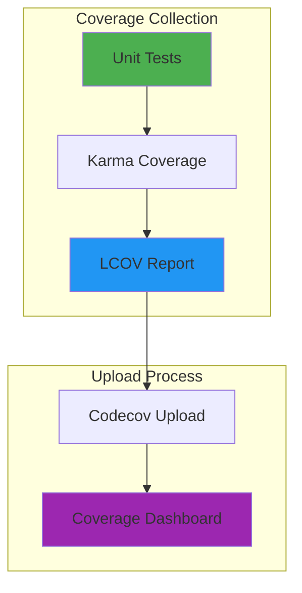

# 📊 Test Coverage - Measuring Our Flock's Health

> *"Just like a bird needs to know every feather is in place before taking flight, we need to know every line of code is tested before deployment. Our coverage reports show us exactly which parts of our flock are ready to soar."*

## 🎯 **Coverage Philosophy**

We believe in **focused, high-quality coverage** that provides meaningful insights into our code quality:

- **Unit Test Coverage** - Individual component and service testing
- **Coverage Trends** - Tracking coverage improvements over time
- **Quality Focus** - Coverage as a tool for identifying untested code paths
- **Maintainable Tests** - Tests that are easy to understand and maintain

## 📈 **Coverage Strategy**

### **Unit Test Coverage**
- **Target**: Individual components, services, and utilities
- **Tool**: Karma with Istanbul coverage
- **Format**: LCOV reports
- **Scope**: Shared library and application components

### **Coverage Goals**
- **Unit Test Coverage**: 80%+ for shared library
- **Line Coverage**: Every line of code executed
- **Branch Coverage**: All conditional paths tested
- **Function Coverage**: All functions called
- **Statement Coverage**: All statements executed

## 🔧 **Coverage Configuration**

### **Karma Coverage Configuration**
```javascript
coverageReporter: {
  dir: './coverage',
  subdir: '.',
  reporters: [
    { type: 'html' },
    { type: 'text-summary' },
    { type: 'lcov' }
  ]
}
```

## 🚀 **Running Coverage Reports**

### **Unit Test Coverage**
```bash
# Run unit tests with coverage
npm run test:coverage

# Coverage report will be generated in ./coverage/
```

### **View Coverage Reports**
```bash
# Open HTML coverage report
open ./coverage/index.html

# View coverage summary in terminal
npm run test:coverage
```

## 📊 **Codecov Integration**

### **Coverage Upload Configuration**
Our CI pipeline automatically uploads coverage to Codecov:

**Unit Test Coverage:**
```yaml
- name: Upload unit test coverage to Codecov
  uses: codecov/codecov-action@v5
  with:
    files: ./coverage/lcov.info
    flags: unittests
    name: codecov-umbrella
```

### **Codecov Configuration** (`codecov.yml`)
```yaml
coverage:
  status:
    project:
      default:
        target: 80%
        threshold: 1%
        base: auto
    patch:
      default:
        target: 80%
        threshold: 1%
        base: auto

flags:
  unittests:
    paths:
      - projects/shared/src/
    carryforward: true

comment:
  layout: "header,diff,files,footer"
  behavior: default
  require_changes: true
  require_base: no
  require_head: yes
  hide_comment: false
  hide_project_coverage: false
  hide_patch_coverage: false

github_checks:
  annotations: true
```

## 📈 **Coverage Reports**

### **Local Coverage Reports**
After running coverage tests, you can view reports locally:

```bash
# Open HTML coverage report
open ./coverage/index.html

# View coverage summary in terminal
npm run test:coverage
```

### **Codecov Dashboard**
- **Repository**: [https://app.codecov.io/github/CommunityStream-io/flock](https://app.codecov.io/github/CommunityStream-io/flock)
- **Unit Tests**: Flagged as `unittests`
- **Coverage Trends**: Historical coverage data and trends

## 🔍 **Coverage Analysis**

### **What Gets Covered**
- **Components**: User interface and interaction logic
- **Services**: Business logic and data processing
- **Guards**: Route protection and validation
- **Utilities**: Helper functions and shared logic

### **What's Excluded**
- **Test Files**: `.spec.ts` and `.test.ts` files
- **Environment Files**: Configuration and environment setup
- **Entry Points**: `main.ts` and `polyfills.ts`
- **Build Artifacts**: Generated and compiled code

## 🛠️ **Coverage Tools**

### **Primary Tools**
- **Istanbul**: Coverage collection and reporting
- **Karma**: Unit test coverage integration
- **Codecov**: Coverage reporting and trends

### **Coverage Collection Process**


## 📋 **Coverage Best Practices**

### **Writing Testable Code**
- **Pure Functions**: Easy to test with predictable inputs/outputs
- **Dependency Injection**: Mock external dependencies
- **Single Responsibility**: Each function has one clear purpose
- **Clear Interfaces**: Well-defined component and service contracts

### **Coverage-Driven Development**
- **Write Tests First**: TDD approach for new features
- **Coverage Gaps**: Identify untested code paths
- **Edge Cases**: Test boundary conditions and error scenarios
- **Integration Points**: Ensure service interactions are covered

### **Maintaining Coverage**
- **Regular Reviews**: Check coverage reports after each feature
- **Coverage Gates**: Prevent deployment if coverage drops
- **Trend Monitoring**: Track coverage improvements over time
- **Quality Metrics**: Use coverage as one indicator of code quality

## 🚨 **Coverage Troubleshooting**

### **Common Issues**

#### **Low Coverage Scores**
- **Missing Tests**: Add tests for uncovered code paths
- **Dead Code**: Remove unused code or add tests
- **Complex Logic**: Break down complex functions into smaller, testable units
- **External Dependencies**: Mock external services and APIs

#### **Coverage Collection Failures**
- **Build Issues**: Ensure application builds successfully
- **Test Failures**: Fix failing tests before collecting coverage
- **Configuration**: Verify Karma configuration
- **File Paths**: Check include/exclude patterns in configuration

### **Debugging Coverage**
```bash
# Check karma configuration
cat karma.conf.js

# Verify coverage files are generated
ls -la ./coverage/

# Check coverage report content
head -20 ./coverage/lcov.info

# Run coverage with verbose output
npm run test:coverage -- --verbose
```

## 🎯 **Coverage Metrics**

### **Key Metrics to Track**
- **Overall Coverage**: Percentage of code covered by tests
- **Coverage Trends**: Coverage changes over time
- **Coverage by Module**: Which parts of the codebase are well-tested
- **Coverage Quality**: Meaningful tests vs. just hitting lines

### **Coverage Reports**
- **HTML Reports**: Visual coverage reports with line-by-line details
- **LCOV Reports**: Machine-readable coverage data for CI/CD
- **Text Summaries**: Quick coverage overview in terminal
- **Codecov Dashboard**: Historical coverage trends and comparisons

---

*"Coverage is like checking every feather before flight - it's not just about having feathers, but knowing each one is strong and ready to help you soar."*