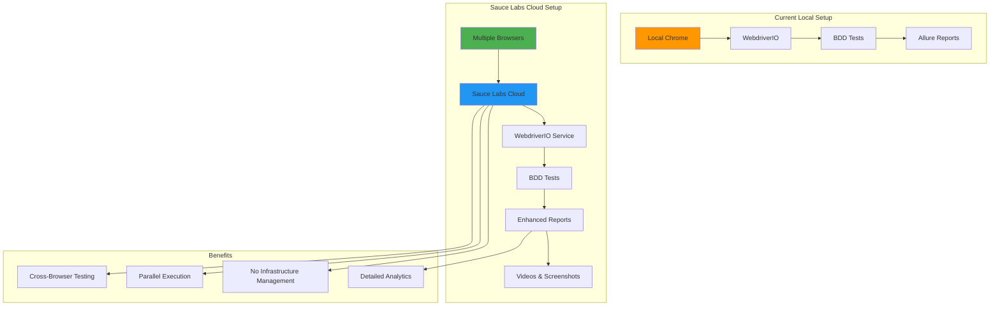

# 🌐 Sauce Labs Integration - Cloud-Based Cross-Browser Testing

> *"Just like a flock needs to test different migration routes across various terrains, our Sauce Labs integration ensures our application works perfectly across all browsers and platforms in the cloud."*

## 🎯 **Sauce Labs Integration Philosophy**

Our Sauce Labs integration extends our existing BDD e2e testing to provide comprehensive cross-browser and cross-platform testing:

- **Cloud Testing** - Run tests on Sauce Labs' cloud infrastructure
- **Cross-Browser Coverage** - Test on multiple browsers and operating systems
- **Parallel Execution** - Run tests in parallel across different environments
- **Scalable Testing** - No need to maintain local test infrastructure
- **Enhanced Reporting** - Video recordings, screenshots, and detailed analytics

## 🏗️ **Integration Architecture**

### **Current vs. Sauce Labs Setup**


### **Configuration Structure**
```
├── wdio.conf.ts              # Local configuration
├── wdio-sauce.conf.ts        # Sauce Labs configuration
├── wdio-sauce-mobile.conf.ts # Mobile testing configuration
└── scripts/
    └── sauce-tunnel.js       # Tunnel setup for localhost testing
```

## 🔧 **Installation and Setup**

### **1. Install Sauce Labs Dependencies**
```bash
# Install Sauce Labs WebdriverIO service
npm install --save-dev @wdio/sauce-service

# Install Sauce Connect for localhost testing (optional)
npm install --save-dev sauce-connect-launcher
```

### **2. Environment Configuration**
Create `.env.example` for Sauce Labs credentials:
```env
# Sauce Labs Configuration
SAUCE_USERNAME=your_sauce_username
SAUCE_ACCESS_KEY=your_sauce_access_key
SAUCE_REGION=us
BUILD_NAME=flock-e2e-tests
TUNNEL_IDENTIFIER=your_tunnel_id

# Test Configuration
TEST_SPEC=./features/**/**.feature
TEST_TAGS=
DEBUG_TESTS=false
CI=false
```

### **3. Sauce Labs Configuration File**
Create `wdio-sauce.conf.ts`:
```typescript
import type { Options } from '@wdio/types'

export const config: Options.Testrunner & { capabilities: any[] } = {
    // Use Sauce Labs as the test runner
    runner: 'sauce',
    
    // Sauce Labs configuration
    user: process.env.SAUCE_USERNAME,
    key: process.env.SAUCE_ACCESS_KEY,
    region: process.env.SAUCE_REGION || 'us',
    
    // Test specifications
    specs: [
        process.env.TEST_SPEC || './features/**/**.feature'
    ],
    
    exclude: [],
    
    // Capabilities for Sauce Labs
    maxInstances: 10,
    capabilities: [
        // Chrome on Windows
        {
            browserName: 'chrome',
            platformName: 'Windows 10',
            browserVersion: 'latest',
            'sauce:options': {
                name: 'Flock E2E Tests - Chrome',
                build: process.env.BUILD_NAME || `build-${Date.now()}`,
                tags: ['e2e', 'chrome', 'flock'],
                tunnelIdentifier: process.env.TUNNEL_IDENTIFIER,
                extendedDebugging: true,
                capturePerformance: true,
                videoUploadOnPass: false,
                seleniumVersion: '4.15.0'
            }
        },
        // Firefox on Windows
        {
            browserName: 'firefox',
            platformName: 'Windows 10',
            browserVersion: 'latest',
            'sauce:options': {
                name: 'Flock E2E Tests - Firefox',
                build: process.env.BUILD_NAME || `build-${Date.now()}`,
                tags: ['e2e', 'firefox', 'flock'],
                tunnelIdentifier: process.env.TUNNEL_IDENTIFIER,
                extendedDebugging: true,
                videoUploadOnPass: false,
                seleniumVersion: '4.15.0'
            }
        },
        // Safari on macOS
        {
            browserName: 'safari',
            platformName: 'macOS 13',
            browserVersion: 'latest',
            'sauce:options': {
                name: 'Flock E2E Tests - Safari',
                build: process.env.BUILD_NAME || `build-${Date.now()}`,
                tags: ['e2e', 'safari', 'flock'],
                tunnelIdentifier: process.env.TUNNEL_IDENTIFIER,
                extendedDebugging: true,
                videoUploadOnPass: false,
                seleniumVersion: '4.15.0'
            }
        }
    ] as any,

    // Test configurations
    logLevel: process.env.DEBUG_TESTS === 'true' ? 'info' : 'error',
    
    logLevels: {
        webdriver: process.env.DEBUG_TESTS === 'true' ? 'info' : 'error',
        webdriverio: process.env.DEBUG_TESTS === 'true' ? 'info' : 'error',
        '@wdio/sauce-service': process.env.DEBUG_TESTS === 'true' ? 'info' : 'error',
        '@wdio/cucumber-framework': process.env.DEBUG_TESTS === 'true' ? 'info' : 'error'
    },

    bail: 0,
    baseUrl: 'http://localhost:4200',
    waitforTimeout: process.env.CI === 'true' ? 20000 : 10000,
    connectionRetryTimeout: process.env.CI === 'true' ? 300000 : 120000,
    connectionRetryCount: process.env.CI === 'true' ? 5 : 3,

    // Services
    services: ['sauce'],
    
    // Framework
    framework: 'cucumber',

    // Reporters
    reporters: [
        ['spec', {
            showTestNames: true,
            showTestStatus: true
        }],
        ['allure', {
            outputDir: './allure-results',
            disableWebdriverStepsReporting: true,
            disableWebdriverScreenshotsReporting: false
        }]
    ],

    // Cucumber options (same as local config)
    cucumberOpts: {
        require: ['./features/step-definitions/steps.ts'],
        backtrace: true,
        requireModule: ['expect-webdriverio'],
        dryRun: false,
        failFast: false,
        snippets: true,
        source: true,
        strict: false,
        tags: process.env.TEST_TAGS || "",
        timeout: process.env.CI === 'true' ? 90000 : 60000,
        ignoreUndefinedDefinitions: true,
        format: ['pretty'],
        publishQuiet: process.env.DEBUG_TESTS !== 'true',
        retry: process.env.CI === 'true' ? 3 : 1
    }
}
```

## 📱 **Mobile Testing Configuration**

### **Mobile Configuration File**
Create `wdio-sauce-mobile.conf.ts` for mobile testing:
```typescript
import type { Options } from '@wdio/types'

export const config: Options.Testrunner & { capabilities: any[] } = {
    // ... base configuration from wdio-sauce.conf.ts ...
    
    capabilities: [
        // iOS Safari
        {
            browserName: 'safari',
            platformName: 'iOS',
            platformVersion: '16.0',
            deviceName: 'iPhone 14',
            'sauce:options': {
                name: 'Flock E2E Tests - iOS Safari',
                build: process.env.BUILD_NAME || `build-${Date.now()}`,
                tags: ['e2e', 'ios', 'safari', 'flock'],
                tunnelIdentifier: process.env.TUNNEL_IDENTIFIER,
                extendedDebugging: true,
                videoUploadOnPass: false
            }
        },
        // Android Chrome
        {
            browserName: 'chrome',
            platformName: 'Android',
            platformVersion: '12.0',
            deviceName: 'Android GoogleAPI Emulator',
            'sauce:options': {
                name: 'Flock E2E Tests - Android Chrome',
                build: process.env.BUILD_NAME || `build-${Date.now()}`,
                tags: ['e2e', 'android', 'chrome', 'flock'],
                tunnelIdentifier: process.env.TUNNEL_IDENTIFIER,
                extendedDebugging: true,
                videoUploadOnPass: false
            }
        }
    ] as any
}
```

## 🚀 **Running Tests on Sauce Labs**

### **Package.json Scripts**
Add these scripts to your `package.json`:
```json
{
  "scripts": {
    "test:e2e:sauce": "concurrently --kill-others --success first \"ng serve flock-mirage --configuration=test-coverage --port=4200\" \"wait-on http://localhost:4200 && wdio run wdio-sauce.conf.ts\"",
    "test:e2e:sauce:ci": "concurrently --kill-others --success first \"ng serve flock-mirage --configuration=test-coverage --port=4200 --host=0.0.0.0\" \"node scripts/health-check.js && cross-env CI=true wdio run wdio-sauce.conf.ts\"",
    "test:e2e:sauce:debug": "cross-env DEBUG_TESTS=true wdio run wdio-sauce.conf.ts",
    "test:e2e:sauce:validation": "cross-env TEST_TAGS=\"@bluesky-auth and @validation\" wdio run wdio-sauce.conf.ts",
    "test:e2e:sauce:mobile": "concurrently --kill-others --success first \"ng serve flock-mirage --configuration=test-coverage --port=4200\" \"wait-on http://localhost:4200 && wdio run wdio-sauce-mobile.conf.ts\""
  }
}
```

### **Basic Test Execution**
```bash
# Run tests on Sauce Labs (requires tunnel for localhost)
npm run test:e2e:sauce

# Run tests in CI mode
npm run test:e2e:sauce:ci

# Run specific validation tests
npm run test:e2e:sauce:validation

# Run mobile tests
npm run test:e2e:sauce:mobile
```

## 🌐 **Sauce Connect Tunnel Setup**

### **Tunnel Script**
Create `scripts/sauce-tunnel.js` for localhost testing:
```javascript
const sauceConnectLauncher = require('sauce-connect-launcher');

const options = {
    username: process.env.SAUCE_USERNAME,
    accessKey: process.env.SAUCE_ACCESS_KEY,
    tunnelIdentifier: process.env.TUNNEL_IDENTIFIER || `tunnel-${Date.now()}`,
    verbose: process.env.DEBUG_TESTS === 'true',
    verboseDebugging: process.env.DEBUG_TESTS === 'true'
};

sauceConnectLauncher(options, (err, sauceConnectProcess) => {
    if (err) {
        console.error('Failed to start Sauce Connect:', err);
        process.exit(1);
    }
    
    console.log('Sauce Connect tunnel started');
    console.log('Tunnel ID:', options.tunnelIdentifier);
    
    // Keep the process alive
    process.on('SIGINT', () => {
        console.log('Shutting down Sauce Connect tunnel...');
        sauceConnectProcess.close();
        process.exit(0);
    });
});
```

### **Tunnel Usage**
```bash
# Start tunnel manually
node scripts/sauce-tunnel.js

# Run tests with tunnel
TUNNEL_IDENTIFIER=my-tunnel npm run test:e2e:sauce
```

## 🔄 **CI/CD Integration**

### **GitHub Actions Workflow**
Create `.github/workflows/sauce-labs-e2e.yml`:
```yaml
name: Sauce Labs E2E Tests

on:
  push:
    branches: [ main, develop ]
  pull_request:
    branches: [ main ]

jobs:
  sauce-labs-e2e:
    runs-on: ubuntu-latest
    
    steps:
    - name: Checkout code
      uses: actions/checkout@v4
      
    - name: Setup Node.js
      uses: actions/setup-node@v4
      with:
        node-version: '20'
        cache: 'npm'
        
    - name: Install dependencies
      run: npm ci
      
    - name: Build application
      run: npm run build
      
    - name: Start Sauce Connect tunnel
      run: |
        npm install --save-dev sauce-connect-launcher
        node scripts/sauce-tunnel.js &
        sleep 10
      env:
        SAUCE_USERNAME: ${{ secrets.SAUCE_USERNAME }}
        SAUCE_ACCESS_KEY: ${{ secrets.SAUCE_ACCESS_KEY }}
        TUNNEL_IDENTIFIER: ${{ github.run_id }}
        
    - name: Run E2E tests on Sauce Labs
      run: npm run test:e2e:sauce:ci
      env:
        SAUCE_USERNAME: ${{ secrets.SAUCE_USERNAME }}
        SAUCE_ACCESS_KEY: ${{ secrets.SAUCE_ACCESS_KEY }}
        SAUCE_REGION: us
        BUILD_NAME: ${{ github.ref_name }}-${{ github.run_number }}
        TUNNEL_IDENTIFIER: ${{ github.run_id }}
        CI: true
        
    - name: Upload test results
      uses: actions/upload-artifact@v4
      if: always()
      with:
        name: allure-results
        path: allure-results/
```

## 📊 **Enhanced Reporting and Analytics**

### **Sauce Labs Dashboard Features**
- **Test Results Dashboard** - Comprehensive test execution overview
- **Video Recordings** - Automatic video recording of test runs
- **Screenshots** - Screenshots on failures and key steps
- **Performance Metrics** - Detailed performance analytics
- **Cross-Browser Comparison** - Side-by-side test results across browsers

### **Integration with Existing Reports**
- **Allure Integration** - Sauce Labs results integrated with Allure reports
- **CI Artifacts** - Test results stored as CI artifacts
- **Coverage Tracking** - Maintain existing coverage tracking with Codecov

## 🎯 **Browser and Platform Coverage**

### **Desktop Browsers**
- **Chrome** - Latest version on Windows 10/11
- **Firefox** - Latest version on Windows 10/11
- **Safari** - Latest version on macOS 13/14
- **Edge** - Latest version on Windows 10/11

### **Mobile Browsers**
- **iOS Safari** - iPhone 14, iPhone 13, iPad
- **Android Chrome** - Various Android versions and devices
- **Responsive Testing** - Different screen sizes and orientations

### **Operating Systems**
- **Windows** - Windows 10, Windows 11
- **macOS** - macOS 13, macOS 14
- **iOS** - iOS 16, iOS 17
- **Android** - Android 11, Android 12, Android 13

## 💰 **Cost Management**

### **Sauce Labs Pricing**
- **Free Tier** - Available for open source projects
- **Pay-per-use** - Based on test minutes consumed
- **Parallel Testing** - Run multiple tests simultaneously

### **Cost Optimization Strategies**
```typescript
// Optimize costs by disabling video for passing tests
'sauce:options': {
    videoUploadOnPass: false,  // Only record videos for failures
    extendedDebugging: true,   // Enable debugging only when needed
    capturePerformance: false  // Disable performance capture for cost savings
}
```

### **Test Organization for Cost Control**
- **Tag-based Execution** - Use tags to run specific test suites
- **Selective Testing** - Run only critical tests on Sauce Labs
- **Local + Cloud Hybrid** - Use local tests for development, cloud for CI

## 🔧 **Configuration Management**

### **Environment-Specific Configurations**
```typescript
// Development configuration
const devConfig = {
    capabilities: [/* limited set for development */],
    maxInstances: 2
};

// CI configuration
const ciConfig = {
    capabilities: [/* full browser matrix */],
    maxInstances: 10
};

// Production configuration
const prodConfig = {
    capabilities: [/* production browser set */],
    maxInstances: 5
};
```

### **Dynamic Configuration**
```typescript
// Select configuration based on environment
const config = process.env.NODE_ENV === 'ci' ? ciConfig : devConfig;
```

## 🛠️ **Troubleshooting and Debugging**

### **Common Issues**

#### **Authentication Issues**
```bash
# Verify credentials
echo $SAUCE_USERNAME
echo $SAUCE_ACCESS_KEY

# Test connection
curl -u $SAUCE_USERNAME:$SAUCE_ACCESS_KEY https://api.us-west-1.saucelabs.com/rest/v1/info
```

#### **Tunnel Issues**
```bash
# Check tunnel status
curl -u $SAUCE_USERNAME:$SAUCE_ACCESS_KEY \
  https://api.us-west-1.saucelabs.com/rest/v1/$SAUCE_USERNAME/tunnels
```

#### **Test Execution Issues**
```bash
# Run with debug output
DEBUG_TESTS=true npm run test:e2e:sauce:debug

# Check Sauce Labs logs
# Visit: https://app.saucelabs.com/tests
```

### **Debug Strategies**
- **Sauce Labs Dashboard** - Monitor test execution in real-time
- **Video Recordings** - Review test execution videos for failures
- **Console Logs** - Check browser console logs for errors
- **Network Logs** - Analyze network requests and responses

## 📈 **Performance and Scalability**

### **Parallel Execution**
- **Multi-browser Testing** - Run tests across multiple browsers simultaneously
- **Concurrent Sessions** - Execute multiple test sessions in parallel
- **Resource Optimization** - Efficient use of Sauce Labs resources

### **Test Optimization**
- **Selective Testing** - Run only necessary tests on Sauce Labs
- **Smart Retries** - Implement intelligent retry logic
- **Fast Feedback** - Optimize for quick test feedback

## 🎯 **Best Practices**

### **Test Organization**
- **Feature-based Testing** - Organize tests by business features
- **Tag-based Execution** - Use tags for selective test execution
- **Environment-specific Configs** - Different configs for different environments

### **Cost Management**
- **Video Recording Control** - Only record videos for failures
- **Selective Testing** - Run critical tests on Sauce Labs
- **Resource Optimization** - Use appropriate instance counts

### **Maintenance**
- **Regular Updates** - Keep Sauce Labs service updated
- **Configuration Review** - Regularly review and update configurations
- **Performance Monitoring** - Monitor test execution performance

## 🚀 **Getting Started Checklist**

### **Setup Steps**
- [ ] Install Sauce Labs dependencies
- [ ] Create Sauce Labs account and get credentials
- [ ] Set up environment variables
- [ ] Create Sauce Labs configuration files
- [ ] Test basic connectivity
- [ ] Set up tunnel for localhost testing
- [ ] Configure CI/CD integration
- [ ] Run first test suite

### **Verification Steps**
- [ ] Verify test execution on Sauce Labs
- [ ] Check video recordings and screenshots
- [ ] Validate cross-browser compatibility
- [ ] Confirm CI/CD integration
- [ ] Review cost and usage metrics

---

*"Sauce Labs integration is like having a flock of test birds that can fly across any terrain and weather condition - ensuring our application works perfectly no matter where users are or what device they're using."*
