# 🦅 Flock - Bluesky Social Migrator

[](https://github.com/CommunityStream-io/flock/actions/workflows/ci.yml) 
[](https://codecov.io/github/CommunityStream-io/flock)
[](https://communitystream-io.github.io/flock/)

> *A **flock** of Angular applications soaring through the social media migration skies! Each variant has its own personality while sharing the same nest of components and services. Built with a unified M3 Material design that keeps our flock flying in perfect formation.*

## 🦜 **Meet the Flock**

<div class="flock-grid">
  <div class="flock-card mirage">
    <div class="flock-icon">🎭</div>
    <h3>Mirage Bird</h3>
    <p>Creates beautiful illusions for development and testing. Simulates real migration without leaving the nest.</p>
    <div class="flock-links">
      <a href="/architecture/flock-mirage/" class="btn btn-primary">Learn More</a>
      <a href="https://github.com/CommunityStream-io/flock/tree/main/projects/flock-mirage" target="_blank" class="btn btn-secondary">View Code</a>
    </div>
  </div>

  <div class="flock-card murmur">
    <div class="flock-icon">🌊</div>
    <h3>Murmuration Bird</h3>
    <p>Dances gracefully through web browsers. Elegant browser-based migration with JSZip integration.</p>
    <div class="flock-links">
      <a href="/architecture/flock-murmur/" class="btn btn-primary">Learn More</a>
      <a href="https://github.com/CommunityStream-io/flock/tree/main/projects/flock-murmur" target="_blank" class="btn btn-secondary">View Code</a>
    </div>
  </div>

  <div class="flock-card native">
    <div class="flock-icon">🦅</div>
    <h3>Native Bird</h3>
    <p>Soars with full desktop power. Native desktop migration using Electron with complete file system access.</p>
    <div class="flock-links">
      <a href="/architecture/flock-native/" class="btn btn-primary">Learn More</a>
      <a href="https://github.com/CommunityStream-io/flock/tree/main/projects/flock-native" target="_blank" class="btn btn-secondary">View Code</a>
    </div>
  </div>
</div>

## 🏗️ **Architecture Overview**

Our flock follows a carefully designed architecture that ensures consistency while allowing each bird to adapt to its environment:

```mermaid
graph TB
    subgraph "🧩 Shared Nest"
        A[Components] --> B[Services]
        B --> C[Theme System]
        C --> D[Material Design 3]
    end
    
    subgraph "🦜 Individual Birds"
        E[🎭 Mirage]
        F[🌊 Murmur] 
        G[🦅 Native]
    end
    
    A --> E
    A --> F
    A --> G
    
    B --> E
    B --> F
    B --> G
    
    style A fill:#4caf50
    style B fill:#2196f3
    style C fill:#ff9800
    style D fill:#9c27b0
```



### **Key Features**

- **🎨 Unified Visual Language** - All birds share beautiful M3 Material design
- **🔄 Environment-Aware Services** - Smart service adaptation per platform
- **📱 Responsive Components** - Perfect nesting in any environment
- **🌙 Consistent Theming** - Light/dark modes across all variants
- **⚡ Optimized Performance** - Each bird flies at maximum efficiency

## 🚀 **Quick Start**

### **Prerequisites**
- Node.js 18+ and npm
- Angular CLI 20.1.5+
- Modern browser for development

### **Installation**
```bash
# Clone the repository
git clone <repository-url>
cd flock

# Install dependencies
npm install

# Choose your bird and start flying
ng serve flock-mirage    # 🎭 For development & testing
ng serve flock-murmur    # 🌊 For web development  
ng serve flock-native    # 🦅 For desktop development
```

## 📚 **Documentation Hub**

<div class="docs-grid">
  <a href="/architecture/" class="doc-card">
    <div class="doc-icon">🏗️</div>
    <h3>Architecture</h3>
    <p>Explore the flock's nest structure, component relationships, and design patterns that keep our birds flying in formation.</p>
  </a>

  <a href="/development/" class="doc-card">
    <div class="doc-icon">🚀</div>
    <h3>Development</h3>
    <p>Get your wings and learn to fly with our comprehensive development guide, from setup to deployment.</p>
  </a>

  <a href="/testing/" class="doc-card">
    <div class="doc-icon">🧪</div>
    <h3>Testing</h3>
    <p>Discover our BDD methodology, unit testing practices, E2E strategies, and comprehensive quality assurance.</p>
  </a>

  <a href="/styling/" class="doc-card">
    <div class="doc-icon">🎨</div>
    <h3>Styling</h3>
    <p>Learn about our beautiful Material Design 3 theming system and how each bird maintains consistent plumage.</p>
  </a>
</div>

## 🛠️ **Tools & Reports**

Stay informed about the health of our flock with real-time monitoring and reporting:

<div class="tools-status">
  <div class="status-item">
    <div class="status-icon">📊</div>
    <div class="status-content">
      <h4>E2E Test Reports</h4>
      <p>Comprehensive Allure reports with historical trends and detailed failure analysis.</p>
      <a href="https://communitystream-io.github.io/flock/" target="_blank" class="status-link">
        View Latest Report <i class="fas fa-external-link-alt"></i>
      </a>
    </div>
  </div>

  <div class="status-item">
    <div class="status-icon">📈</div>
    <div class="status-content">
      <h4>Code Coverage</h4>
      <p>Real-time code coverage tracking with detailed breakdowns by component and service.</p>
      <a href="https://codecov.io/github/CommunityStream-io/flock" target="_blank" class="status-link">
        View Coverage Report <i class="fas fa-external-link-alt"></i>
      </a>
    </div>
  </div>

  <div class="status-item">
    <div class="status-icon">🏗️</div>
    <div class="status-content">
      <h4>Build Status</h4>
      <p>Continuous integration status with detailed build logs and deployment information.</p>
      <a href="https://github.com/CommunityStream-io/flock/actions" target="_blank" class="status-link">
        View Build History <i class="fas fa-external-link-alt"></i>
      </a>
    </div>
  </div>

  <div class="status-item">
    <div class="status-icon">🏆</div>
    <div class="status-content">
      <h4>Quality Badges</h4>
      <p>Real-time quality metrics and status badges for immediate project health visibility.</p>
      <a href="/tools/badges/" class="status-link">
        Learn More <i class="fas fa-arrow-right"></i>
      </a>
    </div>
  </div>
</div>

## 🌟 **What Makes Our Flock Special**

### **🎯 Multi-Target Strategy**
Each bird serves a specific purpose while sharing core DNA:
- **Mirage**: Perfect for development, testing, and demonstrations
- **Murmur**: Optimized for web deployment and browser compatibility  
- **Native**: Full desktop power with file system access

### **🧬 Shared Component Library**
All birds inherit from a common component library ensuring:
- Consistent user experience across platforms
- Reduced development time and maintenance
- Seamless component swapping and reuse

### **⚡ Performance Optimized**
- Lazy loading for optimal bundle sizes
- Tree shaking to eliminate unused code
- Smart caching strategies
- Progressive enhancement techniques

### **🔧 Developer Experience**
- Hot module replacement for instant feedback
- Comprehensive TypeScript support
- Automated testing and quality checks
- Rich debugging and development tools

## 🤝 **Contributing to the Flock**

Join our migration and help improve the flock! Here's how to get started:

1. **📋 Follow Flight Patterns** - Use our established architecture and conventions
2. **🛠️ Use Angular CLI** - Generate all code using Angular CLI commands
3. **🧪 Implement BDD Testing** - Write behavior-driven tests for new features
4. **📚 Update Documentation** - Keep our migration maps current
5. **✅ Quality First** - Ensure all tests pass and coverage remains high

### **Development Workflow**
```bash
# Create a feature branch
git checkout -b feature/new-migration-feature

# Generate components using CLI
ng generate component feature-name --project=flock-mirage

# Run tests to ensure quality
npm run test
npm run test:e2e

# Build and verify
npm run build:all
```

## 📞 **Get Support**

Need help with your migration journey? Here are the best ways to get assistance:

- **📖 Documentation** - Start with our comprehensive docs
- **🐛 Issues** - [Report bugs or request features](https://github.com/CommunityStream-io/flock/issues)
- **💬 Discussions** - [Join community discussions](https://github.com/CommunityStream-io/flock/discussions)
- **📊 Status Page** - [Check system health and reports](https://communitystream-io.github.io/flock/)

---

<div class="footer-cta">
  <h2>🚀 Ready to Join the Migration?</h2>
  <p>Whether you're building for web, desktop, or just testing the waters, our flock has the perfect bird for your journey.</p>
  <div class="cta-buttons">
    <a href="/development/" class="btn btn-primary btn-lg">
      🚀 Start Developing
    </a>
    <a href="https://github.com/CommunityStream-io/flock" target="_blank" class="btn btn-secondary btn-lg">
      📂 View Repository
    </a>
  </div>
</div>

<style>
.flock-grid {
  display: grid;
  grid-template-columns: repeat(auto-fit, minmax(300px, 1fr));
  gap: 2rem;
  margin: 2rem 0;
}

.flock-card {
  background: var(--bg-secondary);
  border: 1px solid var(--border-light);
  border-radius: var(--radius-lg);
  padding: 2rem;
  text-align: center;
  transition: all var(--transition-base);
  position: relative;
  overflow: hidden;
}

.flock-card:hover {
  transform: translateY(-4px);
  box-shadow: var(--shadow-xl);
  border-color: var(--color-primary);
}

.flock-card::before {
  content: '';
  position: absolute;
  top: 0;
  left: 0;
  right: 0;
  height: 4px;
  border-radius: var(--radius-lg) var(--radius-lg) 0 0;
}

.flock-card.mirage::before { background: linear-gradient(90deg, #FF6B6B, #4ECDC4); }
.flock-card.murmur::before { background: linear-gradient(90deg, #4ECDC4, #45B7D1); }
.flock-card.native::before { background: linear-gradient(90deg, #45B7D1, #96CEB4); }

.flock-icon {
  font-size: 3rem;
  margin-bottom: 1rem;
}

.flock-card h3 {
  color: var(--text-primary);
  margin-bottom: 1rem;
}

.flock-card p {
  color: var(--text-secondary);
  margin-bottom: 1.5rem;
}

.flock-links {
  display: flex;
  gap: 1rem;
  justify-content: center;
}

.docs-grid {
  display: grid;
  grid-template-columns: repeat(auto-fit, minmax(280px, 1fr));
  gap: 1.5rem;
  margin: 2rem 0;
}

.doc-card {
  display: block;
  background: var(--bg-secondary);
  border: 1px solid var(--border-light);
  border-radius: var(--radius-lg);
  padding: 1.5rem;
  text-decoration: none;
  color: var(--text-primary);
  transition: all var(--transition-base);
}

.doc-card:hover {
  transform: translateY(-2px);
  box-shadow: var(--shadow-lg);
  border-color: var(--color-primary);
  text-decoration: none;
  color: var(--text-primary);
}

.doc-card .doc-icon {
  font-size: 2.5rem;
  margin-bottom: 1rem;
  display: block;
}

.doc-card h3 {
  margin-bottom: 1rem;
  color: var(--text-primary);
}

.doc-card p {
  color: var(--text-secondary);
  margin: 0;
  font-size: 0.9rem;
}

.tools-status {
  display: grid;
  grid-template-columns: repeat(auto-fit, minmax(300px, 1fr));
  gap: 1.5rem;
  margin: 2rem 0;
}

.status-item {
  display: flex;
  gap: 1rem;
  background: var(--bg-secondary);
  border: 1px solid var(--border-light);
  border-radius: var(--radius-lg);
  padding: 1.5rem;
  transition: all var(--transition-base);
}

.status-item:hover {
  transform: translateY(-2px);
  box-shadow: var(--shadow-md);
}

.status-icon {
  font-size: 2rem;
  color: var(--color-primary);
  flex-shrink: 0;
}

.status-content h4 {
  margin: 0 0 0.5rem 0;
  color: var(--text-primary);
}

.status-content p {
  margin: 0 0 1rem 0;
  color: var(--text-secondary);
  font-size: 0.9rem;
}

.status-link {
  color: var(--color-primary);
  font-weight: 500;
  font-size: 0.9rem;
  text-decoration: none;
}

.status-link:hover {
  text-decoration: underline;
}

.footer-cta {
  text-align: center;
  background: var(--bg-secondary);
  border: 1px solid var(--border-light);
  border-radius: var(--radius-lg);
  padding: 3rem 2rem;
  margin: 3rem 0;
}

.footer-cta h2 {
  margin-bottom: 1rem;
  color: var(--text-primary);
}

.footer-cta p {
  color: var(--text-secondary);
  margin-bottom: 2rem;
  font-size: 1.1rem;
}

.cta-buttons {
  display: flex;
  gap: 1rem;
  justify-content: center;
  flex-wrap: wrap;
}

.btn-lg {
  padding: 1rem 2rem;
  font-size: 1.1rem;
}

@media (max-width: 768px) {
  .flock-links {
    flex-direction: column;
  }
  
  .cta-buttons {
    flex-direction: column;
    align-items: center;
  }
  
  .cta-buttons .btn {
    width: 100%;
    max-width: 300px;
  }
}
</style>