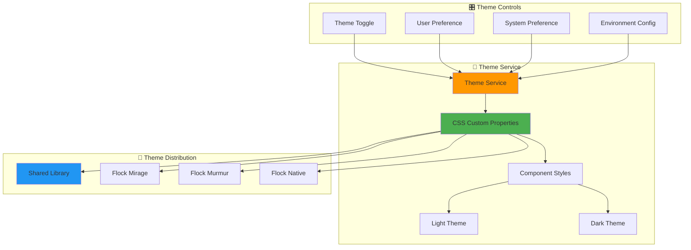

# 🎨 Flock Styling - The Flock's Beautiful Plumage

> *"Every bird in our flock shares the same beautiful plumage. Our Material Design system ensures that whether you're soaring with the eagle or dancing with the murmuration bird, you'll always look your best."*

## 🎨 **Styling Philosophy**

Our flock shares a beautiful, consistent **Material Design 3** theme that ensures all birds look and feel the same. Like a flock of birds with identical plumage, our components maintain visual consistency while adapting to each bird's environment.

### **Why Material Design 3?**
- **🎨 Unified Visual Language** - All birds look and feel the same
- **🔄 Seamless Component Swapping** - Services and nested components adapt per environment
- **📱 Responsive Nesting** - Components nest perfectly in each bird's habitat
- **🌙 Theme Consistency** - Light/dark modes that work across all variants
- **♿ Accessibility First** - Built-in accessibility features and WCAG compliance
- **⚡ Performance Optimized** - Efficient CSS with minimal overhead

## 🏗️ **Theme Architecture**

### **Centralized Theming System**



### **Theme Inheritance Structure**

```scss
// Base theme foundation
@use '@angular/material' as mat;
@use 'sass:map';

// Flock design tokens
$flock-primary: mat.define-palette(mat.$blue-palette, 500);
$flock-accent: mat.define-palette(mat.$green-palette, A200);  
$flock-warn: mat.define-palette(mat.$red-palette, 500);

// Light theme
$flock-light-theme: mat.define-light-theme((
  color: (
    primary: $flock-primary,
    accent: $flock-accent,
    warn: $flock-warn,
  ),
  typography: mat.define-typography-config(),
  density: 0,
));

// Dark theme
$flock-dark-theme: mat.define-dark-theme((
  color: (
    primary: $flock-primary,
    accent: $flock-accent,
    warn: $flock-warn,
  ),
  typography: mat.define-typography-config(),
  density: 0,
));
```

## 🌈 **Color System**

### **Primary Color Palette**

<div class="color-palette">
  <div class="color-swatch primary">
    <div class="color-block" style="background: #2196F3;"></div>
    <div class="color-info">
      <strong>Primary Blue</strong><br>
      <code>#2196F3</code><br>
      <small>Sky & Flight Theme</small>
    </div>
  </div>
  
  <div class="color-swatch secondary">
    <div class="color-block" style="background: #4CAF50;"></div>
    <div class="color-info">
      <strong>Secondary Green</strong><br>
      <code>#4CAF50</code><br>
      <small>Nature & Growth</small>
    </div>
  </div>
  
  <div class="color-swatch accent">
    <div class="color-block" style="background: #FF9800;"></div>
    <div class="color-info">
      <strong>Accent Orange</strong><br>
      <code>#FF9800</code><br>
      <small>Sunrise & Energy</small>
    </div>
  </div>
</div>

### **Semantic Color Usage**

```scss
:root {
  // Primary colors (Sky/Flight theme)
  --flock-primary: #2196F3;
  --flock-primary-light: #64B5F6;
  --flock-primary-dark: #1565C0;
  
  // Secondary colors (Nature/Nest theme)  
  --flock-secondary: #4CAF50;
  --flock-secondary-light: #81C784;
  --flock-secondary-dark: #2E7D32;
  
  // Accent colors (Sunrise/Migration theme)
  --flock-accent: #FF9800;
  --flock-accent-light: #FFB74D;
  --flock-accent-dark: #F57C00;
  
  // Status colors
  --flock-success: #4CAF50;
  --flock-warning: #FF9800;
  --flock-error: #F44336;
  --flock-info: #2196F3;
}
```

### **Neutral Color Scale**

```scss
:root {
  // Surface colors
  --flock-surface: #FFFFFF;
  --flock-surface-variant: #F5F5F5;
  --flock-background: #FAFAFA;
  
  // Text colors
  --flock-on-surface: #212121;
  --flock-on-surface-variant: #424242;
  --flock-on-background: #212121;
  
  // Border and divider colors
  --flock-outline: #E0E0E0;
  --flock-outline-variant: #EEEEEE;
  --flock-shadow: rgba(0, 0, 0, 0.12);
}

// Dark theme overrides
[data-theme="dark"] {
  --flock-surface: #121212;
  --flock-surface-variant: #1E1E1E;
  --flock-background: #0D1117;
  
  --flock-on-surface: #E1E1E1;
  --flock-on-surface-variant: #BDBDBD;
  --flock-on-background: #E1E1E1;
  
  --flock-outline: #333333;
  --flock-outline-variant: #2A2A2A;
  --flock-shadow: rgba(0, 0, 0, 0.24);
}
```

## 📝 **Typography System**

### **Font Stack**

```scss
:root {
  // Primary font family
  --flock-font-family: 'Inter', -apple-system, BlinkMacSystemFont, 'Segoe UI', 
                       Roboto, Oxygen, Ubuntu, Cantarell, sans-serif;
  
  // Monospace font family  
  --flock-font-family-mono: 'SF Mono', 'Monaco', 'Inconsolata', 'Roboto Mono', 
                            'Source Code Pro', monospace;
}
```

### **Type Scale**

<div class="type-scale">
  <div class="type-sample" style="font-size: 2.5rem; font-weight: 300;">
    <strong>Display Large</strong> - 40px/48px
    <div class="type-usage">Hero headings and major titles</div>
  </div>
  
  <div class="type-sample" style="font-size: 2rem; font-weight: 400;">
    <strong>Headline Large</strong> - 32px/40px
    <div class="type-usage">Section headings and page titles</div>
  </div>
  
  <div class="type-sample" style="font-size: 1.5rem; font-weight: 500;">
    <strong>Title Large</strong> - 24px/32px
    <div class="type-usage">Card titles and component headers</div>
  </div>
  
  <div class="type-sample" style="font-size: 1rem; font-weight: 400;">
    <strong>Body Large</strong> - 16px/24px
    <div class="type-usage">Main body text and descriptions</div>
  </div>
  
  <div class="type-sample" style="font-size: 0.875rem; font-weight: 500;">
    <strong>Label Large</strong> - 14px/20px  
    <div class="type-usage">Button labels and form labels</div>
  </div>
</div>

### **Typography Classes**

```scss
// Heading styles
.flock-display-large {
  font-size: 2.5rem;
  font-weight: 300;
  line-height: 1.2;
  letter-spacing: -0.01em;
}

.flock-headline-large {
  font-size: 2rem;
  font-weight: 400;
  line-height: 1.25;
}

.flock-title-large {
  font-size: 1.5rem;
  font-weight: 500;
  line-height: 1.33;
}

// Body text styles
.flock-body-large {
  font-size: 1rem;
  font-weight: 400;
  line-height: 1.5;
}

.flock-body-medium {
  font-size: 0.875rem;
  font-weight: 400;
  line-height: 1.43;
}

// Label styles
.flock-label-large {
  font-size: 0.875rem;
  font-weight: 500;
  line-height: 1.43;
  letter-spacing: 0.01em;
}
```

## 🧩 **Component Styling System**

### **Button Components**

```scss
// Primary button
.flock-button {
  padding: 8px 24px;
  border-radius: 20px;
  font-weight: 500;
  letter-spacing: 0.01em;
  transition: all 0.2s ease-in-out;
  
  &.primary {
    background-color: var(--flock-primary);
    color: var(--flock-on-primary);
    
    &:hover {
      background-color: var(--flock-primary-dark);
      transform: translateY(-1px);
      box-shadow: var(--flock-elevation-2);
    }
  }
  
  &.secondary {
    background-color: transparent;
    color: var(--flock-primary);
    border: 1px solid var(--flock-outline);
    
    &:hover {
      background-color: var(--flock-primary-light-alpha);
    }
  }
}
```

### **Card Components**

```scss
.flock-card {
  background-color: var(--flock-surface);
  border-radius: 12px;
  box-shadow: var(--flock-elevation-1);
  padding: 16px;
  transition: box-shadow 0.2s ease-in-out;
  
  &:hover {
    box-shadow: var(--flock-elevation-2);
  }
  
  .flock-card-header {
    display: flex;
    align-items: center;
    margin-bottom: 12px;
    
    .flock-card-title {
      font-size: 1.25rem;
      font-weight: 500;
      color: var(--flock-on-surface);
    }
  }
  
  .flock-card-content {
    color: var(--flock-on-surface-variant);
    line-height: 1.5;
  }
}
```

## 📐 **Layout and Spacing System**

### **Spacing Scale**

```scss
:root {
  // Base spacing unit (8px)
  --flock-space-1: 0.25rem;  // 4px
  --flock-space-2: 0.5rem;   // 8px
  --flock-space-3: 0.75rem;  // 12px
  --flock-space-4: 1rem;     // 16px
  --flock-space-5: 1.25rem;  // 20px
  --flock-space-6: 1.5rem;   // 24px
  --flock-space-8: 2rem;     // 32px
  --flock-space-10: 2.5rem;  // 40px
  --flock-space-12: 3rem;    // 48px
  --flock-space-16: 4rem;    // 64px
}
```

### **Grid System**

```scss
.flock-container {
  max-width: 1200px;
  margin: 0 auto;
  padding: 0 var(--flock-space-4);
  
  @media (min-width: 768px) {
    padding: 0 var(--flock-space-6);
  }
}

.flock-grid {
  display: grid;
  gap: var(--flock-space-4);
  
  &.cols-2 {
    grid-template-columns: repeat(auto-fit, minmax(300px, 1fr));
  }
  
  &.cols-3 {
    grid-template-columns: repeat(auto-fit, minmax(250px, 1fr));
  }
  
  &.cols-4 {
    grid-template-columns: repeat(auto-fit, minmax(200px, 1fr));
  }
}
```

## 🎭 **Theme Switching System**

### **Theme Service Implementation**

```typescript
@Injectable({ providedIn: 'root' })
export class ThemeService {
  private readonly THEME_KEY = 'flock-theme';
  private themeSignal = signal<'light' | 'dark'>('light');
  
  readonly theme = this.themeSignal.asReadonly();
  
  constructor() {
    this.initializeTheme();
  }
  
  toggleTheme(): void {
    const newTheme = this.theme() === 'light' ? 'dark' : 'light';
    this.setTheme(newTheme);
  }
  
  setTheme(theme: 'light' | 'dark'): void {
    this.themeSignal.set(theme);
    document.documentElement.setAttribute('data-theme', theme);
    localStorage.setItem(this.THEME_KEY, theme);
  }
  
  private initializeTheme(): void {
    const savedTheme = localStorage.getItem(this.THEME_KEY) as 'light' | 'dark';
    const systemTheme = window.matchMedia('(prefers-color-scheme: dark)').matches 
      ? 'dark' : 'light';
    
    const theme = savedTheme || systemTheme;
    this.setTheme(theme);
  }
}
```

### **Theme Toggle Component**

```typescript
@Component({
  selector: 'flock-theme-toggle',
  template: `
    <button 
      class="flock-theme-toggle"
      (click)="toggleTheme()"
      [attr.aria-label]="'Switch to ' + (isDark() ? 'light' : 'dark') + ' mode'"
    >
      <mat-icon>{{ isDark() ? 'light_mode' : 'dark_mode' }}</mat-icon>
    </button>
  `,
  styles: [`
    .flock-theme-toggle {
      width: 40px;
      height: 40px;
      border-radius: 50%;
      border: none;
      background-color: var(--flock-surface-variant);
      color: var(--flock-on-surface);
      cursor: pointer;
      transition: all 0.2s ease-in-out;
      
      &:hover {
        background-color: var(--flock-primary-light-alpha);
        transform: scale(1.1);
      }
    }
  `]
})
export class ThemeToggleComponent {
  constructor(private themeService: ThemeService) {}
  
  isDark = computed(() => this.themeService.theme() === 'dark');
  
  toggleTheme(): void {
    this.themeService.toggleTheme();
  }
}
```

## 🎨 **Animation and Motion**

### **Transition System**

```scss
:root {
  // Duration tokens
  --flock-duration-short: 150ms;
  --flock-duration-medium: 250ms;
  --flock-duration-long: 400ms;
  
  // Easing curves
  --flock-easing-standard: cubic-bezier(0.2, 0, 0, 1);
  --flock-easing-decelerate: cubic-bezier(0, 0, 0, 1);
  --flock-easing-accelerate: cubic-bezier(0.3, 0, 1, 1);
}

// Standard transitions
.flock-transition {
  transition: all var(--flock-duration-medium) var(--flock-easing-standard);
}

.flock-transition-fast {
  transition: all var(--flock-duration-short) var(--flock-easing-standard);
}

.flock-transition-slow {
  transition: all var(--flock-duration-long) var(--flock-easing-decelerate);
}
```

### **Hover and Focus States**

```scss
.flock-interactive {
  cursor: pointer;
  transition: all var(--flock-duration-short) var(--flock-easing-standard);
  
  &:hover {
    transform: translateY(-1px);
    box-shadow: var(--flock-elevation-2);
  }
  
  &:focus-visible {
    outline: 2px solid var(--flock-primary);
    outline-offset: 2px;
  }
  
  &:active {
    transform: translateY(0);
    transition-duration: var(--flock-duration-short);
  }
}
```

## 📱 **Responsive Design System**

### **Breakpoint System**

```scss
:root {
  --breakpoint-xs: 0px;
  --breakpoint-sm: 576px;
  --breakpoint-md: 768px;
  --breakpoint-lg: 992px;
  --breakpoint-xl: 1200px;
  --breakpoint-xxl: 1400px;
}

// Responsive mixins
@mixin respond-to($breakpoint) {
  @media (min-width: #{$breakpoint}) {
    @content;
  }
}

// Usage example
.flock-hero {
  padding: var(--flock-space-8) 0;
  
  @include respond-to(768px) {
    padding: var(--flock-space-16) 0;
  }
}
```

### **Responsive Typography**

```scss
.flock-responsive-text {
  font-size: clamp(1rem, 2vw + 1rem, 2rem);
  line-height: 1.4;
}

.flock-display-responsive {
  font-size: clamp(1.5rem, 4vw + 1rem, 3rem);
  font-weight: 300;
  line-height: 1.2;
}
```

## ♿ **Accessibility Features**

### **High Contrast Mode**

```scss
@media (prefers-contrast: high) {
  :root {
    --flock-primary: #0000FF;
    --flock-outline: #000000;
    --flock-surface: #FFFFFF;
    --flock-on-surface: #000000;
  }
}
```

### **Reduced Motion Support**

```scss
@media (prefers-reduced-motion: reduce) {
  * {
    animation-duration: 0.01ms !important;
    animation-iteration-count: 1 !important;
    transition-duration: 0.01ms !important;
  }
}
```

### **Focus Management**

```scss
.flock-focus-trap {
  &:focus-visible {
    outline: 2px solid var(--flock-primary);
    outline-offset: 2px;
    border-radius: 4px;
  }
}

// Skip link for keyboard navigation
.flock-skip-link {
  position: absolute;
  top: -40px;
  left: 6px;
  background: var(--flock-primary);
  color: var(--flock-on-primary);
  padding: 8px;
  text-decoration: none;
  transition: top 0.3s;
  
  &:focus {
    top: 6px;
  }
}
```

## 🎯 **Component Style Guidelines**

### **Naming Conventions**

```scss
// Block Element Modifier (BEM) inspired
.flock-component {}                    // Component block
.flock-component__element {}           // Component element
.flock-component--modifier {}          // Component modifier
.flock-component__element--modifier {} // Element modifier

// Examples
.flock-button {}
.flock-button__icon {}
.flock-button--primary {}
.flock-button__icon--leading {}
```

### **Theming Integration**

```scss
// Component with theme support
.flock-custom-component {
  background-color: var(--flock-surface);
  color: var(--flock-on-surface);
  border: 1px solid var(--flock-outline);
  
  // State styles
  &:hover {
    background-color: var(--flock-surface-variant);
  }
  
  &.active {
    background-color: var(--flock-primary-container);
    color: var(--flock-on-primary-container);
  }
  
  &:disabled {
    opacity: 0.38;
    cursor: not-allowed;
  }
}
```

## 🚀 **Performance Optimization**

### **CSS Custom Properties Strategy**

```scss
// Efficient custom property usage
:root {
  // Only define properties that change
  --flock-surface-rgb: 255, 255, 255;
  --flock-primary-rgb: 33, 150, 243;
}

[data-theme="dark"] {
  // Override only necessary properties
  --flock-surface-rgb: 18, 18, 18;
}

// Use RGB values for alpha variations
.flock-overlay {
  background-color: rgba(var(--flock-surface-rgb), 0.8);
}
```

### **Critical CSS Strategy**

```scss
// Above-the-fold critical styles
.flock-critical {
  // Essential layout and theme styles
  // Inlined in HTML head
}

// Non-critical styles loaded asynchronously
.flock-enhanced {
  // Progressive enhancement styles
  // Loaded via separate stylesheet
}
```

---

## 🎨 **Styling Best Practices**

### **Do's ✅**

1. **Use CSS Custom Properties** for theme-aware styling
2. **Follow BEM-inspired naming** for consistency
3. **Leverage Material Design tokens** for spacing and typography
4. **Test in both light and dark themes** during development
5. **Use semantic color names** instead of hex values
6. **Implement progressive enhancement** for advanced features

### **Don'ts ❌**

1. **Don't hardcode color values** in component styles
2. **Avoid deep nesting** (max 3 levels) in SCSS
3. **Don't use !important** unless absolutely necessary  
4. **Avoid fixed pixel values** for responsive properties
5. **Don't ignore accessibility** requirements
6. **Avoid theme-specific styles** outside of theme files

> 🎨 **Styling Philosophy**: *"Like a flock in perfect formation, our styles should be harmonious, purposeful, and beautiful - each element complementing the whole while serving its individual purpose."*

---

**Next Steps**: Explore our component implementations:
- [🧩 Shared Components](/architecture/shared/)
- [🚀 Development Workflow](/development/)
- [🧪 Component Testing](/testing/)

<style>
.color-palette {
  display: grid;
  grid-template-columns: repeat(auto-fit, minmax(200px, 1fr));
  gap: 1rem;
  margin: 2rem 0;
}

.color-swatch {
  display: flex;
  align-items: center;
  gap: 1rem;
  background: var(--bg-secondary);
  padding: 1rem;
  border-radius: 8px;
  border: 1px solid var(--border-light);
}

.color-block {
  width: 60px;
  height: 60px;
  border-radius: 8px;
  box-shadow: 0 2px 8px rgba(0,0,0,0.1);
}

.color-info strong {
  color: var(--text-primary);
  font-size: 0.9rem;
}

.color-info code {
  font-family: var(--font-family-mono);
  font-size: 0.8rem;
  color: var(--text-secondary);
}

.color-info small {
  color: var(--text-muted);
  font-size: 0.75rem;
}

.type-scale {
  margin: 2rem 0;
}

.type-sample {
  margin-bottom: 1.5rem;
  color: var(--text-primary);
}

.type-usage {
  font-size: 0.875rem;
  color: var(--text-muted);
  margin-top: 0.25rem;
  font-weight: 400;
}
</style>