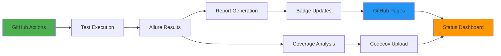

# 🛠️ Tools & Reports

Welcome to the Flock tooling ecosystem! Our comprehensive suite of tools provides real-time monitoring, detailed reporting, and actionable insights to keep our flock flying in perfect formation.

## 📊 Live Status Dashboard

<div class="status-dashboard">
  <div class="status-grid">
    <div class="status-card primary">
      <div class="status-header">
        <span class="status-icon">🏗️</span>
        <h3>Build Status</h3>
      </div>
      <div class="status-content">
        
        <p>Continuous integration and build health</p>
        <a href="https://github.com/CommunityStream-io/flock/actions" target="_blank" class="status-link">View Build History</a>
      </div>
    </div>

    <div class="status-card success">
      <div class="status-header">
        <span class="status-icon">📊</span>
        <h3>E2E Tests</h3>
      </div>
      <div class="status-content">
        
        <p>End-to-end test results and historical trends</p>
        <a href="https://communitystream-io.github.io/flock/" target="_blank" class="status-link">View Allure Report</a>
      </div>
    </div>

    <div class="status-card info">
      <div class="status-header">
        <span class="status-icon">📈</span>
        <h3>Code Coverage</h3>
      </div>
      <div class="status-content">
        
        <p>Unit and integration test coverage analysis</p>
        <a href="https://codecov.io/github/CommunityStream-io/flock" target="_blank" class="status-link">View Coverage Report</a>
      </div>
    </div>

    <div class="status-card warning">
      <div class="status-header">
        <span class="status-icon">🏆</span>
        <h3>Quality Badges</h3>
      </div>
      <div class="status-content">
        <div class="badge-preview">
          
        </div>
        <p>Real-time quality metrics and status indicators</p>
        <a href="/tools/badges/" class="status-link">Learn About Badges</a>
      </div>
    </div>
  </div>
</div>

## 🛠️ Available Tools

<div class="tools-grid">
  <a href="/tools/allure/" class="tool-card allure">
    <div class="tool-header">
      <span class="tool-icon">📊</span>
      <div class="tool-info">
        <h3>Allure Reports</h3>
        <span class="tool-type">Testing & Reporting</span>
      </div>
    </div>
    <div class="tool-content">
      <p>Comprehensive E2E test reporting with historical trends, failure analysis, and performance tracking across multiple branches.</p>
      <div class="tool-features">
        <span class="feature">📈 Historical Trends</span>
        <span class="feature">🔍 Failure Analysis</span>
        <span class="feature">⚡ Performance Tracking</span>
        <span class="feature">🌿 Multi-Branch Support</span>
      </div>
    </div>
    <div class="tool-footer">
      <div class="tool-stats">
        <span class="stat">🎯 Sharded Execution</span>
        <span class="stat">🔄 Auto-Deploy</span>
      </div>
    </div>
  </a>

  <a href="/tools/badges/" class="tool-card badges">
    <div class="tool-header">
      <span class="tool-icon">🏆</span>
      <div class="tool-info">
        <h3>Test Badges</h3>
        <span class="tool-type">Status & Monitoring</span>
      </div>
    </div>
    <div class="tool-content">
      <p>Real-time status badges displaying test success rates, coverage metrics, and quality indicators with automatic CI updates.</p>
      <div class="tool-features">
        <span class="feature">📊 Real-time Updates</span>
        <span class="feature">🎨 Color Coding</span>
        <span class="feature">🔗 Direct Links</span>
        <span class="feature">📝 Test Counts</span>
      </div>
    </div>
    <div class="tool-footer">
      <div class="tool-stats">
        <span class="stat">🚀 Auto-Generated</span>
        <span class="stat">🌐 Multi-Format</span>
      </div>
    </div>
  </a>

  <div class="tool-card coverage">
    <div class="tool-header">
      <span class="tool-icon">📈</span>
      <div class="tool-info">
        <h3>Coverage Reports</h3>
        <span class="tool-type">Code Quality</span>
      </div>
    </div>
    <div class="tool-content">
      <p>Detailed code coverage analysis with line-by-line breakdowns, branch coverage, and integration with Codecov for trend tracking.</p>
      <div class="tool-features">
        <span class="feature">📝 Line Coverage</span>
        <span class="feature">🌿 Branch Coverage</span>
        <span class="feature">📊 Trend Analysis</span>
        <span class="feature">🎯 Threshold Alerts</span>
      </div>
    </div>
    <div class="tool-footer">
      <div class="tool-stats">
        <span class="stat">☁️ Codecov Integration</span>
        <span class="stat">🔄 PR Comments</span>
      </div>
      <a href="https://codecov.io/github/CommunityStream-io/flock" target="_blank" class="external-link">View Coverage</a>
    </div>
  </div>

  <div class="tool-card ci">
    <div class="tool-header">
      <span class="tool-icon">⚙️</span>
      <div class="tool-info">
        <h3>CI/CD Pipeline</h3>
        <span class="tool-type">Automation</span>
      </div>
    </div>
    <div class="tool-content">
      <p>Advanced GitHub Actions workflow with parallelized testing, artifact management, and multi-environment deployments.</p>
      <div class="tool-features">
        <span class="feature">🔄 Auto-Deploy</span>
        <span class="feature">⚡ Parallel Execution</span>
        <span class="feature">📦 Artifact Management</span>
        <span class="feature">🌿 Multi-Environment</span>
      </div>
    </div>
    <div class="tool-footer">
      <div class="tool-stats">
        <span class="stat">🚀 19 Test Shards</span>
        <span class="stat">⏱️ ~23 Min Runtime</span>
      </div>
      <a href="https://github.com/CommunityStream-io/flock/actions" target="_blank" class="external-link">View Workflows</a>
    </div>
  </div>
</div>

## 🌿 Multi-Branch Support

Our tooling ecosystem supports multiple environments with branch-specific reporting:

<div class="branch-support">
  <div class="branch-environment">
    <h4>🎯 Production (main)</h4>
    <div class="branch-tools">
      <a href="https://communitystream-io.github.io/flock/" target="_blank" class="branch-link">📊 Allure Reports</a>
      <a href="/tools/badges/" class="branch-link">🏆 Status Badges</a>
      <a href="https://codecov.io/github/CommunityStream-io/flock" target="_blank" class="branch-link">📈 Coverage</a>
    </div>
    <p>Stable production reports with historical data and trend analysis.</p>
  </div>

  <div class="branch-environment">
    <h4>🚧 Development (develop)</h4>
    <div class="branch-tools">
      <span class="branch-link disabled">📊 Dev Reports</span>
      <span class="branch-link disabled">🏆 Dev Badges</span>
      <a href="https://codecov.io/github/CommunityStream-io/flock/branch/develop" target="_blank" class="branch-link">📈 Dev Coverage</a>
    </div>
    <p>Development environment reports for feature testing and validation.</p>
  </div>

  <div class="branch-environment">
    <h4>🔬 Staging (staging)</h4>
    <div class="branch-tools">
      <span class="branch-link disabled">📊 Staging Reports</span>
      <span class="branch-link disabled">🏆 Staging Badges</span>
      <span class="branch-link disabled">📈 Staging Coverage</span>
    </div>
    <p>Pre-production testing environment with full integration testing.</p>
  </div>
</div>

## 📊 Performance Metrics

<div class="metrics-dashboard">
  <div class="metric-card">
    <h4>⚡ Test Execution</h4>
    <div class="metric-value">~23 min</div>
    <div class="metric-details">
      <p>Full E2E suite across 19 parallel shards</p>
      <small>🔄 With Allure reporting enabled</small>
    </div>
  </div>

  <div class="metric-card">
    <h4>🚀 Build Speed</h4>
    <div class="metric-value">~3 min</div>
    <div class="metric-details">
      <p>Complete Angular build and deployment</p>
      <small>📦 Including artifact generation</small>
    </div>
  </div>

  <div class="metric-card">
    <h4>📈 Coverage Target</h4>
    <div class="metric-value">90%+</div>
    <div class="metric-details">
      <p>Maintained across all projects</p>
      <small>🎯 Unit + Integration tests</small>
    </div>
  </div>

  <div class="metric-card">
    <h4>🔍 Test Count</h4>
    <div class="metric-value">150+</div>
    <div class="metric-details">
      <p>E2E scenarios across all features</p>
      <small>📝 BDD-style test specifications</small>
    </div>
  </div>
</div>

## 🔧 Tool Integration

Our tools work together seamlessly to provide comprehensive project monitoring:



### Integration Flow

1. **🚀 CI Trigger**: Push or PR triggers GitHub Actions
2. **🧪 Test Execution**: Parallel test execution across 19 shards
3. **📊 Result Collection**: Allure results aggregated from all shards
4. **📈 Report Generation**: Comprehensive reports with history
5. **🏆 Badge Updates**: Real-time status badge generation
6. **🌐 Deployment**: Reports deployed to GitHub Pages
7. **📋 Status Update**: Dashboard reflects current project health

## 📚 Getting Started

### For Developers

```bash
# View all available npm scripts
npm run

# Run tests with reporting
npm run test:e2e:headless

# Generate local Allure report
npm run allure:generate
npm run allure:open

# Generate status badges
npm run allure:badge
```

### For CI/CD

Our tools are automatically integrated into the CI pipeline. Every push triggers:
- ✅ Automated testing across all environments
- 📊 Report generation and deployment
- 🏆 Badge updates with latest status
- 📈 Coverage analysis and trending

### For Monitoring

Access real-time project health through:
- **📊 Allure Dashboard**: [communitystream-io.github.io/flock](https://communitystream-io.github.io/flock/)
- **📈 Coverage Reports**: [codecov.io/github/CommunityStream-io/flock](https://codecov.io/github/CommunityStream-io/flock)
- **🏗️ Build Status**: [GitHub Actions](https://github.com/CommunityStream-io/flock/actions)
- **🏆 Status Badges**: Embedded throughout documentation

---

<div class="tools-footer">
  <h3>🔄 Continuous Improvement</h3>
  <p>Our tooling ecosystem continuously evolves to provide better insights, faster feedback, and more reliable automation. All tools are designed to work together seamlessly while remaining modular and replaceable.</p>
  
  <div class="footer-actions">
    <a href="/testing/" class="btn btn-primary">📖 Learn About Testing</a>
    <a href="https://github.com/CommunityStream-io/flock/issues" target="_blank" class="btn btn-secondary">🐛 Report Issues</a>
  </div>
</div>

<style>
.status-dashboard {
  margin: 2rem 0;
}

.status-grid {
  display: grid;
  grid-template-columns: repeat(auto-fit, minmax(280px, 1fr));
  gap: 1.5rem;
}

.status-card {
  background: var(--bg-secondary);
  border: 1px solid var(--border-light);
  border-radius: var(--radius-lg);
  padding: 1.5rem;
  position: relative;
  overflow: hidden;
}

.status-card::before {
  content: '';
  position: absolute;
  top: 0;
  left: 0;
  right: 0;
  height: 4px;
  border-radius: var(--radius-lg) var(--radius-lg) 0 0;
}

.status-card.primary::before { background: var(--color-primary); }
.status-card.success::before { background: var(--color-success); }
.status-card.info::before { background: var(--color-info); }
.status-card.warning::before { background: var(--color-warning); }

.status-header {
  display: flex;
  align-items: center;
  gap: 1rem;
  margin-bottom: 1rem;
}

.status-icon {
  font-size: 2rem;
}

.status-header h3 {
  margin: 0;
  font-size: 1.2rem;
}

.status-content img {
  margin: 0.5rem 0;
  box-shadow: none;
}

.status-content p {
  color: var(--text-secondary);
  font-size: 0.9rem;
  margin: 0.5rem 0;
}

.status-link {
  color: var(--color-primary);
  font-weight: 500;
  font-size: 0.9rem;
}

.tools-grid {
  display: grid;
  grid-template-columns: repeat(auto-fit, minmax(320px, 1fr));
  gap: 2rem;
  margin: 3rem 0;
}

.tool-card {
  background: var(--bg-secondary);
  border: 1px solid var(--border-light);
  border-radius: var(--radius-lg);
  padding: 0;
  text-decoration: none;
  color: var(--text-primary);
  transition: all var(--transition-base);
  display: block;
  position: relative;
  overflow: hidden;
}

.tool-card::before {
  content: '';
  position: absolute;
  top: 0;
  left: 0;
  right: 0;
  height: 4px;
  border-radius: var(--radius-lg) var(--radius-lg) 0 0;
}

.tool-card.allure::before { background: linear-gradient(90deg, #4CAF50, #2196F3); }
.tool-card.badges::before { background: linear-gradient(90deg, #FF9800, #F44336); }
.tool-card.coverage::before { background: linear-gradient(90deg, #2196F3, #9C27B0); }
.tool-card.ci::before { background: linear-gradient(90deg, #607D8B, #795548); }

.tool-card:hover {
  transform: translateY(-4px);
  box-shadow: var(--shadow-xl);
  border-color: var(--color-primary);
  text-decoration: none;
  color: var(--text-primary);
}

.tool-header {
  display: flex;
  align-items: center;
  gap: 1rem;
  padding: 1.5rem 1.5rem 1rem;
}

.tool-icon {
  font-size: 2.5rem;
}

.tool-info h3 {
  margin: 0 0 0.25rem 0;
  font-size: 1.3rem;
}

.tool-type {
  color: var(--text-muted);
  font-size: 0.85rem;
  text-transform: uppercase;
  letter-spacing: 0.05em;
}

.tool-content {
  padding: 0 1.5rem 1rem;
}

.tool-content p {
  color: var(--text-secondary);
  margin-bottom: 1rem;
  font-size: 0.9rem;
}

.tool-features {
  display: flex;
  flex-wrap: wrap;
  gap: 0.5rem;
  margin-bottom: 1rem;
}

.feature {
  background: var(--bg-tertiary);
  color: var(--text-secondary);
  padding: 0.25rem 0.5rem;
  border-radius: var(--radius-sm);
  font-size: 0.75rem;
  font-weight: 500;
}

.tool-footer {
  padding: 1rem 1.5rem;
  border-top: 1px solid var(--border-light);
  background: var(--bg-tertiary);
  display: flex;
  justify-content: space-between;
  align-items: center;
}

.tool-stats {
  display: flex;
  gap: 1rem;
}

.stat {
  color: var(--text-muted);
  font-size: 0.75rem;
  font-weight: 500;
}

.external-link {
  color: var(--color-primary);
  font-size: 0.85rem;
  font-weight: 500;
}

.branch-support {
  display: grid;
  grid-template-columns: repeat(auto-fit, minmax(280px, 1fr));
  gap: 1.5rem;
  margin: 2rem 0;
}

.branch-environment {
  background: var(--bg-secondary);
  border: 1px solid var(--border-light);
  border-radius: var(--radius-lg);
  padding: 1.5rem;
}

.branch-environment h4 {
  margin-bottom: 1rem;
  font-size: 1.1rem;
}

.branch-tools {
  display: flex;
  flex-direction: column;
  gap: 0.5rem;
  margin-bottom: 1rem;
}

.branch-link {
  color: var(--color-primary);
  font-size: 0.9rem;
  font-weight: 500;
  text-decoration: none;
}

.branch-link.disabled {
  color: var(--text-muted);
  cursor: not-allowed;
}

.branch-link:hover:not(.disabled) {
  text-decoration: underline;
}

.branch-environment p {
  color: var(--text-secondary);
  font-size: 0.85rem;
  margin: 0;
}

.metrics-dashboard {
  display: grid;
  grid-template-columns: repeat(auto-fit, minmax(200px, 1fr));
  gap: 1.5rem;
  margin: 2rem 0;
}

.metric-card {
  background: var(--bg-secondary);
  border: 1px solid var(--border-light);
  border-radius: var(--radius-lg);
  padding: 1.5rem;
  text-align: center;
}

.metric-card h4 {
  margin-bottom: 1rem;
  color: var(--text-secondary);
  font-size: 0.9rem;
  text-transform: uppercase;
  letter-spacing: 0.05em;
}

.metric-value {
  font-size: 2rem;
  font-weight: 700;
  color: var(--color-primary);
  margin-bottom: 0.5rem;
}

.metric-details p {
  color: var(--text-secondary);
  margin: 0 0 0.25rem 0;
  font-size: 0.85rem;
}

.metric-details small {
  color: var(--text-muted);
  font-size: 0.75rem;
}

.tools-footer {
  background: var(--bg-secondary);
  border: 1px solid var(--border-light);
  border-radius: var(--radius-lg);
  padding: 2rem;
  text-align: center;
  margin-top: 3rem;
}

.tools-footer h3 {
  margin-bottom: 1rem;
  color: var(--text-primary);
}

.tools-footer p {
  color: var(--text-secondary);
  margin-bottom: 1.5rem;
}

.footer-actions {
  display: flex;
  gap: 1rem;
  justify-content: center;
  flex-wrap: wrap;
}

@media (max-width: 768px) {
  .tool-footer {
    flex-direction: column;
    gap: 1rem;
    align-items: flex-start;
  }
  
  .footer-actions {
    flex-direction: column;
    align-items: center;
  }
  
  .footer-actions .btn {
    width: 100%;
    max-width: 250px;
  }
}
</style>